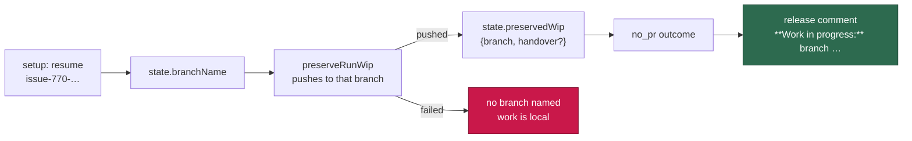

# Name the preserved branch in the claim-release comment

## Summary

The claim-release comment said work was preserved but never *where*: finding it
meant running `ls-remote` and pattern-matching `issue-<N>-*`, which is what
`git_issue_branch_resume.ts` does internally and what a human — or a non-Claude
worker — had to reinvent. Every release that preserved work now carries a
**Work in progress** line naming the branch the preservation push actually
targeted, with a link to the handover file when one is committed on that
branch. Closes #770.

- `preserveRunWip` records where the work went (`PhaseState.preservedWip`) —
  and **only** when it reached the pushed branch, so a failed preservation
  still says the work is local and names no branch.
- The branch named is `state.branchName`, which setup rewrites to the resumed
  branch on a re-claim, so a retitled issue can never send a reader to a
  title-derived ref that nothing pushed.
- The outcome carries the branch structurally (`no_pr.preservedWip`), so
  bounding the free-text detail can never trim it out of the comment.
- The scheduled-release reason folds the preservation note in rather than
  appending it, so the branch is stated exactly once and
  `WIP_PRESERVED_RELEASE_MARKER` / `SCHEDULED_RELEASE_MARKER` are untouched.



## Evidence

Backend/CLI change — no web interface to screenshot. The artefact is the
rendered release comment, produced by calling `renderHeartbeatBody` with the
outcome the phase returns:

```text
⚠️ **Vibe Coder released this claim with no PR** — host `vibe-coder-27384`, finished 22:13 UTC.
**Outcome:** no PR raised — `scheduled-release`.
**Diagnosis:** died in phase `execute` after 3 h. Scheduled release: the cycle ended or the run hard cap was reached — WIP preserved, resumes next cycle.
**Work in progress:** branch `issue-770-name-the-preserved-branch-and-its-handover-` holds the work in progress; the next claim resumes from it. Handover: [docs/archive/handover/issue-770.md](https://github.com/stSoftwareAU/VibeCoder/blob/issue-770-…/docs/archive/handover/issue-770.md).
**Detail:** Released on schedule: the supervisor's run hard cap was reached — WIP preserved: committed and pushed to 'issue-770-name-the-preserved-branch-and-its-handover-' — the next claim resumes from that bra…
```

The truncated `**Detail:**` tail is exactly why the branch is also carried
structurally rather than left to the free-text excerpt.

Two faults found by review and fixed here, each now pinned by a test:

- **the handover path #769 sketched cannot be committed.** `.vibe` is a hidden
  segment: the enforced `.gitignore` (`.*`) never stages it and
  `classifyStagedPath(".vibe/handover/issue-770.md")` returns `violation` —
  verified by calling both directly. Force-adding it would fail the pre-commit
  gate and take the WIP commit down with it. The shared constant is
  `docs/archive/handover/issue-<N>.md`: committable, and inside the
  `docs/archive` exclusion in `_config.yml` so a merged handover carrying
  literal Liquid cannot break the Pages build. Recorded on #769.
- **an over-long line truncated mid-URL.** It now drops the handover clause
  whole rather than emitting half a link, keeping the branch.

## Acceptance Criteria

<!-- vibe-spec-review inputs="diff+issue-body" -->

- **met** — A timeout release comment names the preserved branch — evidence:
  `worker/deno/tests/preserved_branch_release_comment_test.ts::release comment #770 - a timeout names the preserved branch` — reviewer: met
- **met** — A scheduled-release comment and a hard-cap wind-down comment do the
  same — evidence:
  `worker/deno/tests/preserved_branch_release_comment_test.ts::release comment #770 - a hard-cap wind-down names the preserved branch` and
  `::release comment #770 - a scheduled release at cycle end names the preserved branch` — reviewer: met
- **met** — When the run resumed an existing branch, the comment names that
  branch, not a name derived from the current title — evidence:
  `worker/deno/tests/preserved_branch_release_comment_test.ts` (retitled issue;
  `assertNamesPushedBranch` compares the named branch with the branch
  `commitAndPushPending` was actually called with, and asserts the
  title-derived `createBranchName` result never appears) — reviewer: met —
  reason: the reviewer added that the test hand-sets `state.branchName` rather
  than driving `workOnIssueSetupBranch`, so the resume lookup itself is covered
  elsewhere (`wip_resume_handoff_test.ts`); what this test pins is that the
  comment cannot be title-derived.
- **met** — The comment links or points to the handover file when one exists,
  and reads correctly when one does not — evidence:
  `worker/deno/tests/preserved_branch_release_comment_test.ts::release comment #770 - the handover file is linked when one is committed on the branch (Issue #769)`,
  `::release comment #770 - no handover file: the comment still names the branch and links nothing`,
  `worker/deno/tests/preserved_wip_branch_test.ts::preserved wip #770 - the handover path is one the commit gate will stage` —
  reviewer: partial — reason: the reviewer's `partial` was correct at the time
  — the advertised path could never be committed and a long line cut the URL in
  half. Both are fixed in this diff (path moved to `docs/archive/handover/…`,
  over-long lines drop the clause whole) and both are now asserted.
- **met** — Existing markers are unchanged and still matched by their current
  tests — evidence: `worker/deno/lib/wip_markers.ts` untouched;
  `tests/wip_markers_test.ts`, `tests/wip_resume_handoff_test.ts`,
  `tests/execute_phase_scheduled_release_424_test.ts` pass unmodified — reviewer: met
- **met** — A scheduled release still never says "ran out of time" — evidence:
  `worker/deno/tests/preserved_branch_release_comment_test.ts::release comment #770 - a scheduled release still never blames the clock` — reviewer: met
- **met** — `deno task check` / the repo's test task passes — evidence:
  `./quality.sh` — lint, type check, fmt and every other gate pass; the 67
  failing `setup_*` tests are environmental (bash-harness exit codes in this
  sandbox) and fail identically on the base commit, verified in a clean
  worktree at `HEAD~1` — reviewer: partial — reason: the reviewer saw the same
  67 failures and could not attribute them; the baseline worktree run settles
  that they are not this diff's.
- **unrequested** — `OUTCOME_BLOCK_MAX_LENGTH` raised 600 → 900 and a new
  `OUTCOME_WIP_MAX_LENGTH` — reviewer: unrequested — reason: the new line has
  to fit beside the diagnosis, and at 600 the block cap would have trimmed the
  very thing the issue asks for. Kept, with the detail excerpt still bounded at
  200.
- **unrequested** — the handover path constant and its URL builder —
  reviewer: unrequested — reason: the issue asks the comment to link the
  handover file, which needs a path both #769 and #770 agree on; it is one
  exported constant with the "#769 owns the final choice" note on it, and the
  finding that #769's sketched path is uncommittable is recorded on that issue.
- **unrequested** — `heartbeat_sweep.ts` strips the new line — reviewer:
  unrequested — reason: `isHeartbeatOnlyBody`'s contract is that everything the
  heartbeat layer itself writes is stripped; without this the sweep would treat
  every preserved-branch release as human prose and never collapse it.

## Standards Review

<!-- vibe-standards-review inputs="diff+CODING-STANDARDS.md" -->

- **violation** — a wrapped line began with `#769)`, which markdownlint reads
  as a malformed ATX heading (MD018), so the quality gate would have failed —
  evidence: `docs/TROUBLESHOOTING.md:894` — reason: fixed here by rewrapping;
  `markdownlint-cli2` now reports `0 issues in 0 files` across the 75 linted
  files.
- **violation** — a non-zero `git ls-tree` exit was collapsed into the same
  silent "no handover file" return as a genuine absence — evidence:
  `worker/deno/lib/phases/run_wip_preservation.ts:125` — reason: fixed here;
  the lookup failure is now logged with git's own words and covered by
  `tests/preserved_branch_release_comment_test.ts::release comment #770 - a failed handover lookup is logged, and the branch is still named`.
  The comment still degrades to the branch alone — a broken link is worse than
  none — but the fault is no longer passed off as a clean answer.
- **violation** — `heartbeat_storage.ts` was imported twice in the new test —
  evidence: `worker/deno/tests/preserved_wip_branch_test.ts:32` — reason: fixed
  here, merged into one import.
- **violation** — no `docs/archive/pr-summaries/pr-summary-770.md` existed —
  evidence: `docs/archive/pr-summaries/` — reason: the reviewer read the tree
  before this file was written; it is committed in this diff.
- **clean** — the reviewer's observation that a handover under `docs/` would be
  linted and published was already addressed: the constant is
  `docs/archive/handover/issue-<N>.md`, and `docs/archive/**` is in both the
  `.markdownlint-cli2.jsonc` ignores and the `_config.yml` Jekyll exclusions.
- **clean** — Australian English throughout (both new modules carry the
  standard header; no American spellings in the added lines); commit safety (no
  hidden path staged, no `git add -f`, no `--no-verify`, and the diff removed
  a `.vibe/` path before anything could be written there); commit messages
  carry `(Issue #770)` and the `Vibe-Coder-Run-Id` trailer; TDD and test
  quality (every test calls real code — `workOnIssueExecuteClaude`,
  `renderRunOutcomeClause`, `classifyStagedPath`, `isHeartbeatOnlyBody` — none
  greps source); `deno fmt`, `deno lint`, `deno check` and semgrep clean; file
  sizes small and single-purpose; docs updated in the same change; no
  `prompts/` template touched.

## Test Plan

- Added `worker/deno/tests/preserved_branch_release_comment_test.ts` — drives
  the live execute phase to a timeout, a hard-cap wind-down and a cycle-end
  release against a dirty tree on a **retitled** issue, and asserts the branch
  the comment names is the branch `commitAndPushPending` was called with, that
  the title-derived name never appears, that the handover link appears only
  when the file is in the branch's tree, that a scheduled release still never
  blames the clock, and that a run which preserved nothing names no branch.
- Added `worker/deno/tests/preserved_wip_branch_test.ts` — the handover path is
  committable (`classifyStagedPath` → `safe`), hidden-segment-free and inside
  the Jekyll-excluded archive; an over-long line drops the link whole instead of
  truncating it; a released comment naming a branch is still marker-only for
  the sweep.
- Unmodified and still passing: `tests/execute_phase_scheduled_release_424_test.ts`,
  `tests/wip_markers_test.ts`, `tests/wip_resume_handoff_test.ts`,
  `tests/heartbeat_outcome_render_test.ts`, `tests/heartbeat_release_collapse_test.ts`,
  `tests/execute_phase_superseded_wip_test.ts`, `tests/completion_phase_superseded_wip_test.ts`.
