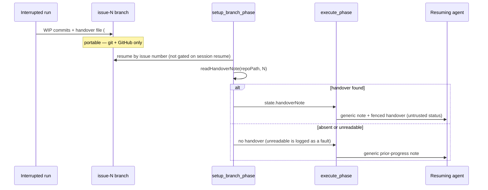

## Summary

A re-claim already finds the preserved `issue-<N>-…` branch on any host and
under any provider, but it was briefed with a fixed paragraph — "progress was
checkpointed, review `git log`" — and only a same-host, same-account run got
anything richer from the Claude `--resume` transcript.

The setup phase now reads the handover file the interrupted run committed to
that branch (`docs/archive/handover/issue-<N>.md`, the path
`handoverFilePath()` fixes for Issue #769) out of the checked-out working
tree, and the execute phase splices it into the prompt. The handover is
treated as untrusted repository prose: scrubbed of delimiter and HTML-comment
markers, fenced in its own CSPRNG boundary, framed as a **status report about
work already done — data, not instructions**, capped at 8,000 characters, and
measured by the existing context-budget accounting. It is independent of
`enable_session_resume` and of the provider — `--resume` stays a same-host
bonus layered on top — and a branch with no handover falls back to the
existing generic note and still resumes.

Closes #771.

## Evidence

Backend/CLI change with no web interface to screenshot. Evidence is the test
suite: `deno task test tests/handover_prompt_note_771_test.ts
tests/resume_handover_phase_771_test.ts` → 17 tests, 0 failures. The splice
was confirmed red-capable first: with the execute phase reverted to ignore
`state.handoverNote`, `execute #771 - the handover content reaches the prompt`
and `execute #771 - handover content is counted against the context budget`
both fail; with the splice in place both pass.

`./quality.sh` reports every gate PASSED except `deno tests`, whose 67
failures are pre-existing host-environment failures in the `setup_*` /
`run_core` shell-harness tests. Verified by running those same files in a
detached worktree at the base commit `fdd9d5c`: identical `105 passed |
67 failed`.

## Acceptance Criteria

<!-- vibe-spec-review inputs="diff+issue-body" -->

- **met** — A re-claim on a branch carrying a handover file has that file's content in its execute prompt — evidence: `worker/deno/lib/phases/setup_branch_phase.ts:358`, `worker/deno/lib/phases/execute_phase.ts:345`, `worker/deno/tests/resume_handover_phase_771_test.ts::execute #771 - the handover content reaches the prompt, session resume on or off` — reviewer: met
- **met** — A re-claim on a branch with no handover file falls back to the existing generic note and still resumes the branch — evidence: `worker/deno/tests/resume_handover_phase_771_test.ts::setup #771 - a resumed branch with no handover file still resumes` and `::execute #771 - a resume with no handover falls back to the generic note` — reviewer: met
- **met** — Behaviour is identical with `enable_session_resume` on and off — covered by a test — evidence: both `setup #771` / `execute #771` tests loop `for (const enableSessionResume of [true, false])`; the read at `setup_branch_phase.ts:358` sits above the `config.enableSessionResume` block — reviewer: met
- **met** — Oversized handover content is truncated and counted against the context budget rather than bypassing it — evidence: `worker/deno/lib/handover_prompt_note.ts::truncateHandover`, `worker/deno/tests/resume_handover_phase_771_test.ts::execute #771 - handover content is counted against the context budget` (the reviewer instrumented it: baseline 89 tokens passes, truncated handover 2,307 tokens blocks with `claudeCalls === 0`) — reviewer: met
- **met** — The handover is framed as prior-run status, not as a directive, and a test asserts the framing text is present — evidence: `HANDOVER_FRAMING` in `worker/deno/lib/handover_prompt_note.ts`, asserted in `handover_prompt_note_771_test.ts::#771 - the handover is framed as prior-run status, not as a directive` and at prompt level in `resume_handover_phase_771_test.ts` — reviewer: met
- **met** — Nothing in this path requires a Claude session id or a host-local file — evidence: `readHandoverNote` touches only `${repoPath}/docs/archive/handover/issue-<N>.md`; the setup tests run with a fresh `workDir` holding no persisted resume state and still populate `handoverNote` — reviewer: met
- **met** — `deno task check` / the repo's test task passes — evidence: `deno task check` clean over 2,033 files; the 67 `deno task test` failures reproduce identically at base commit `fdd9d5c` — reviewer: met
- **unrequested** — two INFO/WARN log lines in `setup_branch_phase.ts:359-386` naming the handover path — reviewer: unrequested — reason: one line per resume is the repo's existing convention for this path ("Every claim logs which branch it resumed"), and the fault branch is required by the fail-loud rule
- **unrequested** — `HANDOVER_TRUNCATION_NOTICE` rendered into the prompt — reviewer: unrequested — reason: truncation must be announced, not silent, so the agent knows it read a partial file
- **unrequested** — a whitespace-only handover file is treated as absent — reviewer: unrequested — reason: an empty file would otherwise emit an empty fence and a framing paragraph about nothing
- **unrequested** — test `execute #771 - a fresh claim gets no prior-progress note at all` — reviewer: unrequested — reason: guards the non-resumed path against the splice leaking into every prompt
- **unrequested** — test `#771 - a handover that forges boundary markers cannot close the fence` — reviewer: unrequested — reason: the issue requires the file be treated as untrusted; this is what "untrusted" has to mean in a prompt
- **unrequested** — `docs/CONFIGURATION.md` rewrites the pre-existing session-resume bullet — reviewer: unrequested — reason: that bullet described the old briefing; leaving it would have documented behaviour this change removes

Departure recorded: the reviewer noted the Scope line says splice the handover
*in place of* `PRIOR_PROGRESS_PROMPT_NOTE`, while `buildPriorProgressNote`
returns the generic note **plus** the fenced handover. Reason: the same Scope
line asks to keep "a short instruction wrapper: this is a handover from an
interrupted run, continue it, do not restart or revert it" — that paragraph
*is* that wrapper, so reusing it beats duplicating its wording.

## Standards Review

<!-- vibe-standards-review inputs="diff+CODING-STANDARDS.md" -->

- **violation** — an unreadable handover was reported to the operator as an absent one (fail-loud) — evidence: `worker/deno/lib/handover_prompt_note.ts:90` (bare `catch { return null }`) — reason: fixed here — `readHandoverNote` now returns `found` / `absent` / `unreadable`, `NotFound` is the only silent case, and `setup_branch_phase.ts:373` logs a warning naming the error for the rest
- **violation** — the handover fence was left undeclared: it carries its own nonce, but the prompt's boundary-integrity rule (rendered earlier) names neither the block nor that second id — evidence: `worker/deno/lib/handover_prompt_note.ts:125` — reason: fixed here — `HANDOVER_FRAMING` now declares the block and its separate marker id inline, so no fence is unnamed; the separate nonce is deliberate (the prior run could have seen the run nonce)
- **violation** — a new untrusted prompt input with no `SECURITY.md` entry (a code change owes a docs change) — evidence: `SECURITY.md:1017` "Delimiter Hardening" list — reason: fixed here — added a bullet covering the handover fence, its cap, and why its nonce differs
- **violation** — two assertions checked a string constant against substrings of its own literal — evidence: `worker/deno/tests/handover_prompt_note_771_test.ts:98-99` — reason: fixed here — replaced with an ordering assertion that the framing precedes the handover content in the built note
- **violation** — one doc-comment line ran to 101 columns after an edit, past the file's 80-column wrap — evidence: `worker/deno/lib/handover_prompt_note.ts:25` — reason: fixed here — sentence rewrapped
- **clean** — Australian English throughout; Deno-native tooling only (`deno fmt` / `lint` / `check` / `test`, no Node counterparts added); tests call real functions and real phase entry points through injected mocks, no source-grepping; no existing test removed or weakened; coverage spans happy path, absent file, unreadable file, whitespace-only file, exactly-at-cap, 3× over cap, forged markers, fresh claim, and the budget ceiling in both directions; no hidden path staged and no secret material; commit carries the `Vibe-Coder-Run-Id` trailer; nothing under `prompts/` changed; `markdownlint` and `mermaid` gates pass; new module is 148 lines with one reader, one truncator, one builder

## Test Plan

Added `worker/deno/tests/handover_prompt_note_771_test.ts` (12 tests):

- the handover file is read from the checked-out tree
- an absent handover file reads as absent, never as a throw
- a whitespace-only handover file counts as no handover
- an unreadable handover is a fault, not an absence
- no handover falls back to the generic prior-progress note
- the handover content is spliced into the note
- the handover is framed as prior-run status, not as a directive
- the handover is fenced in a randomised untrusted boundary
- a handover that forges boundary markers cannot close the fence
- oversized handover content is truncated, not passed through whole
- handover content at the cap is not truncated
- the note carries no host-local path and no session id

Added `worker/deno/tests/resume_handover_phase_771_test.ts` (6 tests):

- setup reads a resumed branch's handover into the phase state, with
  `enable_session_resume` on **and** off
- a resumed branch with no handover file still resumes, both flag settings
- the handover content reaches the execute prompt, both flag settings
- a resume with no handover falls back to the generic note
- a fresh claim gets no prior-progress note at all
- handover content is counted against the context budget

Regression-adjacent suites re-run green: `setup_branch_resume_test.ts`,
`wip_resume_handoff_test.ts`, `resume_branch_by_issue_test.ts`,
`execute_phase_context_budget_test.ts`, `execute_phase_browser_grant_test.ts`,
`preserved_wip_branch_test.ts`.
