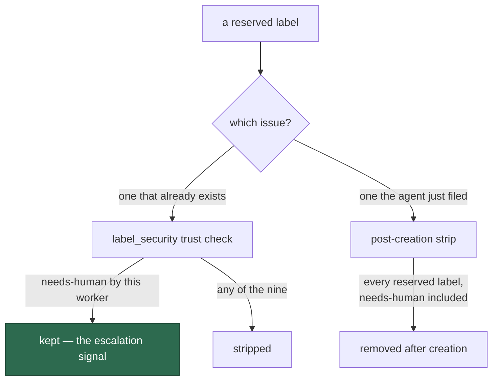

# One reserved-label list, and the true `needs-human` rule

## Summary

Seven templates published "reserved workflow labels" under the same heading in
**four different memberships**, and the shared `coding_guidelines` block lands
in the same rendered prompt as three of them. The reason they all gave was
wrong:

> The worker account is not on the trusted-author allowlist, so any reserved
> label you add is silently stripped by the `label_security` check.

…stated about a list that included `needs-human`. `label_security.ts:283-287`
trusts exactly that label from this worker — it is the worker's own escalation
signal — so the escape hatch the same guidelines prescribe was documented as
disarmed.

There are two rules, both true, and every surface now states the one that
applies:

- **On an issue that already exists** — the nine reserved labels are never
  self-applied. `needs-human` is the exception and **survives**.
- **On an issue the agent just filed** — every reserved label, `needs-human`
  included, is removed after creation, so it is mentioned in the hand-off
  message rather than applied.

The canonical list is `top-priority`, `work-on`, `low-priority`, `failed`,
`failed-once`, `refine-issue`, `planning`, `question`, `best-model` — nine
labels, byte-identical membership everywhere, `needs-human` handled by its own
sentence beside it.

New versions: `coding_guidelines/v43`, `issue/v40`, `ci_fix/v17`,
`pr_feedback/v15`, `grill-me/v16`, `planning/v25`, `planning_critique/v8`.
`planning_processor.ts`'s `RESERVED_LABEL_PROHIBITION` — an **eighth** surface,
prompt text that happens to live in code — carried the same divergent list and
the same false reason, and is corrected with them.

No behaviour changed, as the issue requires: `label_security.ts`,
`escape_hatch_label_strip.ts`, `reserved_label_strip.ts` and `RESERVED_LABELS`
are untouched.

Closes #780.

## Evidence

Prompt-content change with no runtime surface to screenshot. The evidence is
the drift test, and the carve-out exercised against the real code.

The two rules, and where each applies:



Red before, green after — the six cases run against the pre-change tree, then
after:

```
# before
reserved labels - the in-code prohibition publishes the same membership ... FAILED
reserved labels - every template publishes the same membership ... FAILED
reserved labels - no template lists needs-human among them ... FAILED
reserved labels - no template claims a worker's needs-human is stripped ... FAILED
FAILED | 2 passed | 4 failed

# after
ok | 6 passed | 0 failed
```

```
ok | 172 passed | 0 failed   # the drift suite plus the narration, output
                             # contract, label_security, planning_processor
                             # and grill-me suites
```

`deno fmt --check` (2021 files), `deno lint` (2015 files), `deno check` over
every file in `worker/deno/tests` (0 errors), markdownlint and the
`docs prompt versions` quality check all pass.

## Reproduction

- **symptom** — one rendered prompt tells the agent both that `needs-human` is
  the escalation to use and that any reserved label it applies — `needs-human`
  among them — is silently stripped; and the same heading publishes four
  different lists across seven templates
- **status** — `verified` — the carve-out is exercised, not quoted:
  `verifyOperationalLabels` is called with a timeline in which this worker
  applied both `needs-human` and `planning`, and returns `needs-human` trusted
  and `planning` untrusted. The list drift is asserted across all eight
  surfaces and was watched failing on four of them before the change
- **regression test** —
  `worker/deno/tests/reserved_label_prompt_drift_test.ts::reserved labels - the code trusts a needs-human this worker applied (Issue #780)`
  and `::reserved labels - every template publishes the same membership (Issue #780)`

## Acceptance Criteria

The issue states its scope in the grill-me understanding block; each accepted
item is closed out here. Judged in an operator review of the whole diff, not by
reviewer sub-agents.

- **met** — prompt text only; no change to `label_security.ts`,
  `escape_hatch_label_strip.ts`, `reserved_label_strip.ts` or
  `RESERVED_LABELS` — evidence: the diff touches none of them
- **met** — every template stating the self-apply rule says exactly what the
  code does — evidence: each new version states the trust carve-out for an
  existing issue and the post-creation strip for a filed one;
  `::no template claims a worker's needs-human is stripped by label_security (Issue #780)`
  fails on any paragraph that names both without saying which rule applies
- **met** — `coding_guidelines`'s follow-up instruction is reworded to mention
  `needs-human` rather than add it — evidence:
  `prompts/coding_guidelines/v43.md`, the `Mentions \`needs-human\` explicitly
  in the message` bullet
- **met** — no prompt claims a worker-applied `needs-human` is "silently
  stripped by the `label_security` check" — evidence: the same case, whose
  corrective test deliberately matches the exact claims rather than the word
  "trusted", because every one of these paragraphs already says
  "trusted-author allowlist" about a different set of people
- **met** — one canonical list; all seven templates carry byte-identical
  membership, each shipped as a new version — evidence: the seven new versions
  and `::every template publishes the same membership (Issue #780)`
- **met** — a drift test that fails when any prompt's list diverges — evidence:
  the six cases, which read the *latest* version of each template through
  `getLatestVersion` / `loadPrompt`, so a future version is covered without
  editing the test
- **partial** — "each shipped as a new version file whose H1 version matches
  the filename (#792)" — evidence: none of these seven templates declares a
  version in an H1 at all (each opens with `{{VERBOSITY_INSTRUCTIONS}}` and a
  mode heading) — reason: there is no H1 version to keep in step here; the
  sweep that adds or fixes those declarations stays with #792, as the issue
  says

- **unrequested** — `RESERVED_LABEL_PROHIBITION` in `planning_processor.ts` —
  reason: it is an eighth publication of the same list with the same false
  reason, injected into sub-issue instructions on the in-code fallback publish
  path. Leaving it would have meant "one canonical list" with a divergent copy
  still shipping. It is prompt *text*, not behaviour — the excluded modules
  are untouched
- **unrequested** — `grill-me/v16` — reason: its list membership was already
  canonical, so the issue's own analysis did not expect a new version. But its
  label-policy bullet names `needs-human` and `label_security` stripping in one
  breath, which is the exact ambiguity being removed — and Step 5b's whole
  hand-off depends on the carve-out. The drift test found it
- **unrequested** — two documentation references — evidence:
  `docs/SPEC-KIT-COMPARISON.md:56` (now the directory-only form the standard
  prescribes) and the #762 audit's citation of `coding_guidelines/v42.md:453`
  (now `<!-- pinned: -->`, as a record of what that version read) — reason:
  required by the `docs prompt versions` quality check, which v43 turned red

## Standards Review

- **clean** — prompt immutability honoured: seven new versions, no committed
  file edited; Australian English throughout; the canonical list is stated once
  in the test and asserted everywhere, which is the single-source mechanism the
  issue asks for
- **clean** — the code-agreement case checks the three sets that actually
  withhold a label — the worker's own guard, the operational trust check, and
  the creation filter — rather than one of them, because `best-model` is
  operational but not in `RESERVED_LABELS` and `work-on` is the reverse. Naming
  one set would have made the test lie about the other
- **violation** — the passage extractor parses markdown with regexes over a
  bounded window — evidence:
  `reserved_label_prompt_drift_test.ts` `listPassages` — reason: stands. The
  artefact under test is prose in two shapes (an inline parenthesised list and
  a bulleted one); the window is bounded, a passage only counts as a list when
  it names at least three canonical labels, and every case names the offending
  template and passage on failure
- **clean** — no behaviour changed: `verifyOperationalLabels` and the strips
  are read by the test, never modified, and the only non-prompt edit is a
  string constant that is itself prompt text

## Test Plan

Added `worker/deno/tests/reserved_label_prompt_drift_test.ts` (6 tests):

- `reserved labels - the in-code prohibition publishes the same membership (Issue #780)`
- `reserved labels - every template publishes the same membership (Issue #780)`
- `reserved labels - no template lists needs-human among them (Issue #780)`
- `reserved labels - no template claims a worker's needs-human is stripped by label_security (Issue #780)`
- `reserved labels - the code trusts a needs-human this worker applied (Issue #780)`
- `reserved labels - every canonical label is reserved in the code (Issue #780)`

No existing test was modified.
