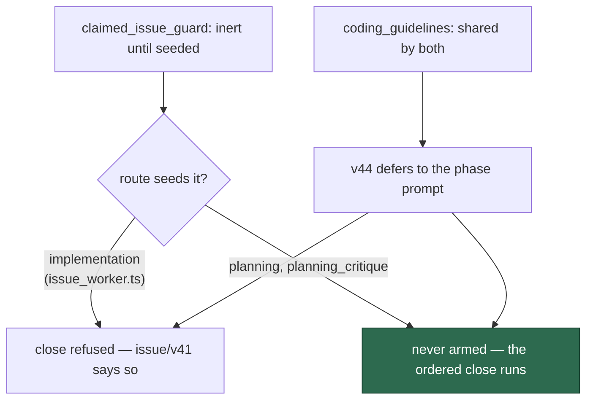

# The shared lifecycle refusal defers to a phase prompt that orders its own close

## Summary

`buildPlanningCritiquePrompt` renders the phase template **and** the shared
`coding_guidelines` block into one prompt. The template's final step orders:

> Your very last action **must** be to close this issue … your inline close is
> the source of truth and **must always run**.
> ```bash
> gh issue close {{ISSUE_NUMBER}} --repo {{REPO}} --reason completed
> ```

…and the shared block said `gh issue close` "on any issue in the repo you are
working" is refused with `[SECURITY] [ISSUE_LIFECYCLE_REFUSED]`, adding "do not
retry a refused call or look for a way around it". One rendered prompt, both
statements.

The behaviour was never wrong. `claimed_issue_guard.ts` is inert until a run
seeds it, and only the implementation route (`issue_worker.ts:201`) does — so
the planning close genuinely works. The shared block's unconditional scope was
the inaccurate half.

`prompts/coding_guidelines/v44.md` now defers: the refusal stands *unless your
phase prompt orders the close itself*, because the worker arms the guard only
on routes where the lifecycle is its call. `prompts/issue/v41.md` states the
other side of the same fact — the implementation route **does** arm it, so the
refusal there is real and nothing in that prompt asks for a close.

Prose only: `claimed_issue_guard.ts` and `prompts/planning_critique/` are
unchanged, as the accepted scope requires.

Closes #781.

## Evidence

Prompt-content change with no runtime surface to screenshot. The evidence is
the rendered prompt and the guard it describes.

Which routes arm the guard, and what each prompt may therefore say:



Red before, green after — the seven cases against the pre-change prompts, then
after:

```
# unfixed
issue lifecycle - the rendered critique prompt carries both the order and its exemption ... FAILED
issue lifecycle - the exemption is stated after the refusal it qualifies ... FAILED
issue lifecycle - the guidelines defer, and the implementation prompt says the guard is armed ... FAILED
FAILED | 4 passed | 3 failed

# fixed
ok | 7 passed | 0 failed
```

```
ok | 149 passed | 0 failed   # the new suite plus the claimed-issue lifecycle
                             # guard, the three gh-guard suites, milestone
                             # fence and the three prompt-drift suites
```

`deno fmt --check` (2022 files), `deno lint` (2016 files), `deno check` over
every file in `worker/deno/tests` (0 errors) and the `docs prompt versions`
quality check all pass.

## Reproduction

- **symptom** — a planning-critique run reads one prompt that orders
  `gh issue close … --reason completed` as a step that "must always run", and
  also states that `gh issue close` on any issue in the repo is refused and
  must not be retried
- **status** — `verified` — the contradiction and its resolution are asserted
  on the **rendered** prompt, built through the real
  `buildPlanningCritiquePrompt` (template plus injected guidelines), not on the
  template file; watched failing on three of seven cases before the change
- **regression test** —
  `worker/deno/tests/issue_lifecycle_close_exemption_test.ts::issue lifecycle - the rendered critique prompt carries both the order and its exemption (Issue #781)`

## Acceptance Criteria

The issue states its scope in the grill-me understanding block; each accepted
item is closed out here. Judged in an operator review of the whole diff, not by
reviewer sub-agents.

- **met** — publish a new `coding_guidelines` version whose lifecycle section
  defers to the phase prompt, picked up by the loader, so the rendered
  planning-critique prompt no longer contradicts its own close order —
  evidence: `prompts/coding_guidelines/v44.md`;
  `::the rendered critique prompt carries both the order and its exemption (Issue #781)`
  asserts exactly that observable on the rendered artefact
- **met** — mirror the wording in a new `issue` version, replacing the
  unconditional restatement — evidence: `prompts/issue/v41.md`;
  `::the guidelines defer, and the implementation prompt says the guard is armed (Issue #781)`
- **met** — `claimed_issue_guard.ts` and `prompts/planning_critique/` unchanged
  — evidence: the diff touches neither
- **met** — the exemption is phrased as defer-to-phase-prompt, so it survives a
  new route, rather than naming planning as the sole exemption — evidence: the
  v44 wording turns on "a phase whose own prompt instructs you to close", not
  on a route list
- **partial** — "each new version file declares its own new version number in
  its H1 (per #792)" — evidence: neither template has an H1 at all
  (`coding_guidelines` opens with prose, `issue` with
  `{{VERBOSITY_INSTRUCTIONS}}`) — reason: there is no H1 version declaration to
  keep in step here; adding one is #792's sweep, and inventing one in this
  change would pre-empt the shape that issue settles

- **unrequested** — a regression test, where the issue's Round 1 default was
  "no regression test; the #762 audit re-run is the check" — reason: the
  accepted scope names the observable ("the rendered planning-critique prompt
  no longer contradicts its own close order"), and this repository's standards
  require a change to be verifiable. The suite asserts that observable
  directly, and costs nothing to keep. If the intent was that no *new file*
  should appear, that is the one item to strike
- **unrequested** — two cases that check the prose against the behaviour it
  describes: `::the guard the prompts describe refuses close only when seeded`
  (a seeded run permits `edit` alone, so the exemption is careful not to widen
  it) and `::an implementation prompt is never told to close its issue`
  (the exemption is only safe while the armed route gives no close order) —
  reason: an exemption checked only against its own wording would pass even if
  the guard changed underneath it

## Standards Review

- **clean** — prompt immutability honoured: two new versions, no committed file
  edited, and a case asserts v43 and v40 still read as they did; Australian
  English throughout; the exemption is stated once in the shared block and
  referenced by deferral rather than copied per phase
- **clean** — the tests build through the real `buildPlanningCritiquePrompt`
  and `buildIssuePrompt`, so they exercise the rendering path the worker uses;
  the guard case calls `seedClaimedIssueGuard` and reads the real allowed-verb
  set rather than quoting a comment
- **violation** — `::the exemption is stated after the refusal it qualifies`
  asserts on document order, which a reorganisation of the guidelines would
  break — evidence: `issue_lifecycle_close_exemption_test.ts` — reason:
  stands. Order is load-bearing in prose: a qualification the reader meets
  before the rule it qualifies reads as a different rule, and this defect was
  precisely a reader meeting two rules with no ordering between them
- **violation** — the assertions match prose fragments, which rewording breaks
  — reason: stands, as in #778/#779/#780. A prompt is prose; the alternative is
  asserting nothing about the sentence that resolves the contradiction

## Test Plan

Added `worker/deno/tests/issue_lifecycle_close_exemption_test.ts` (7 tests):

- `issue lifecycle - the rendered critique prompt carries both the order and its exemption (Issue #781)`
- `issue lifecycle - the exemption is stated after the refusal it qualifies (Issue #781)`
- `issue lifecycle - the guidelines defer, and the implementation prompt says the guard is armed (Issue #781)`
- `issue lifecycle - the planning-critique template still orders the close (Issue #781)`
- `issue lifecycle - the retired versions stay immutable (Issue #781)`
- `issue lifecycle - the guard the prompts describe refuses close only when seeded (Issue #781)`
- `issue lifecycle - an implementation prompt is never told to close its issue (Issue #781)`

No existing test was modified.
