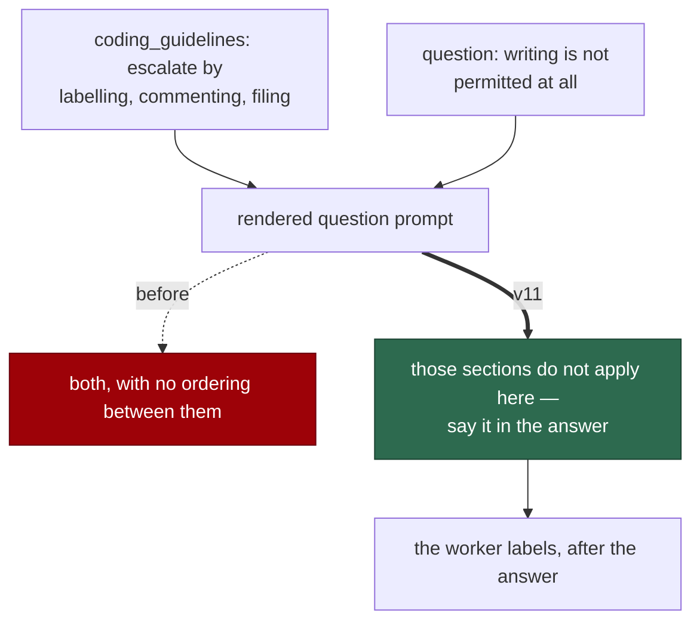

# A read-only phase is no longer told to label, comment and file

## Summary

`buildQuestionPrompt` injects the shared `coding_guidelines` block, whose Human
Escalation section opens:

> **Any time you apply the `needs-human` label — for any reason** — you must on
> the same run post a comment … 1. Add the `needs-human` label to the issue.

…and whose escape hatch requires `gh issue create` for a follow-up plus a
comment on the current issue. `question`'s own constraints forbid every write —
"writing is not permitted at all, including scratch or note files" — and twice
forbid label changes.

So a question run that hits the escalation trigger ("needs access to a system
only a human can reach, or depends on a decision only a human can make") was
told to label, comment and file, and told it may do none of those things.

The phase-level ban is the intended behaviour: the prompt already records that
the **worker** removes `question` and adds `needs-human` once the answer is
posted. The injected block was the surface that did not know it.

`prompts/question/v11.md` carves those two sections out of this phase and names
the answer text as the sole escalation channel — say in the answer that
something needs a human, and stop. It also finishes the sentence the original
left half-told: the escalation those guidelines describe is one the worker
performs, on every question run, after the answer goes up. So "say it in the
answer" does not read as "the escalation simply does not happen".

The guidelines are untouched, deliberately: escalation is correct for every
phase that can write, and a carve-out written into the shared block would have
released all of them.

Closes #782.

## Evidence

Prompt-content change with no runtime surface to screenshot. The evidence is
the rendered prompt — the template alone never carried the escalation text at
all, so that is the only place the contradiction existed.



Red before, green after — the six cases against v10, then v11:

```
# unfixed
question - the rendered prompt carries the escalation text and its carve-out ... FAILED
question - the carve-out is stated after the block it qualifies ... FAILED
question - the answer text is named as the only escalation channel ... FAILED
FAILED | 3 passed | 3 failed

# fixed
ok | 6 passed | 0 failed
```

```
ok | 66 passed | 0 failed   # the new suite plus the question-prompt suites and
                            # the three other prompt-drift suites
```

`deno fmt --check` (2023 files), `deno lint` (2017 files), `deno check` over
every file in `worker/deno/tests` (0 errors) and the `docs prompt versions`
quality check all pass.

## Reproduction

- **symptom** — a question run that cannot answer autonomously reads one prompt
  telling it to add `needs-human`, post a comment and file a follow-up issue,
  and telling it that writing is not permitted at all and labels are not its to
  touch
- **status** — `verified` — the contradiction and its resolution are asserted on
  the **rendered** prompt, built through the real `buildQuestionPrompt`
  (template plus injected guidelines); watched failing on three of six cases
  against v10
- **regression test** —
  `worker/deno/tests/question_escalation_carveout_test.ts::question - the rendered prompt carries the escalation text and its carve-out (Issue #782)`

## Acceptance Criteria

The issue states its scope in the grill-me understanding block; each accepted
item is closed out here. Judged in an operator review of the whole diff, not by
reviewer sub-agents.

- **met** — a new `question` version stating that the guidelines' Human
  Escalation and Escape Hatch sections do not apply to this read-only phase, and
  that flagging the need inside the answer is the only escalation channel —
  evidence: `prompts/question/v11.md`;
  `::the rendered prompt carries the escalation text and its carve-out (Issue #782)`
  and `::the answer text is named as the only escalation channel (Issue #782)`
- **met** — "the next free number if a concurrent `question` bump lands first"
  — evidence: v11, because #779 minted v10 for the output-contract override
  earlier in this queue
- **met** — a Deno regression test asserting the rendered question prompt
  contains the carve-out — evidence: the six cases in
  `question_escalation_carveout_test.ts`, run through `buildQuestionPrompt`
- **met** — no `coding_guidelines` change and no worker code change; the new
  file is picked up by `loadPrompt("question", undefined, …)` — evidence: the
  diff contains only the new prompt, the new test and this summary;
  `::the guidelines keep their unconditional escalation for other phases (Issue #782)`
  asserts the shared block still says "for any reason" and carries no carve-out
- **met** — `quorum/v1` and `quorum_judge/v1` untouched — evidence: not in the
  diff. They receive no guidelines block, so no contradiction exists there
- **partial** — "the H1 declares the new file's own version number (per #792)"
  — evidence: `question` has no H1 at all; it opens with
  `{{VERBOSITY_INSTRUCTIONS}}` — reason: there is no H1 version declaration to
  keep in step here, the same finding as #781. Adding one is #792's sweep, and
  inventing a shape now would pre-empt what that issue settles

- **unrequested** — the sentence naming the worker as the party that performs
  the escalation — reason: the carve-out on its own says what the run must not
  do and where to put the words, but not that anything happens afterwards. A
  run reading only "those sections do not apply" could reasonably conclude the
  escalation is lost; the prompt already knew the answer two lines below, and
  now says it in the same breath
- **unrequested** — `::the read-only constraints the carve-out relies on are
  intact (Issue #782)` — reason: the carve-out is only correct while the phase
  really writes nothing. If a later version relaxed that, the carve-out would
  become the wrong answer and this case says so

## Standards Review

- **clean** — prompt immutability honoured: one new version, nothing edited,
  and a case asserts v10 still reads as it did; Australian English throughout;
  the fix is phase-side, so no other phase's escalation behaviour is touched
- **clean** — the test renders through the real builder rather than reading the
  template, which is the only way to see this defect: the template alone never
  contained the escalation text
- **violation** — `::the carve-out is stated after the block it qualifies`
  asserts document order — evidence:
  `question_escalation_carveout_test.ts` — reason: stands, as in #781. The
  guidelines arrive in the system prompt and the carve-out in the template that
  follows; if that ever inverted, the reader would meet the exemption before
  the rule and read it as a different rule
- **violation** — the assertions match prose fragments — reason: stands. A
  prompt is prose, and the alternative is asserting nothing about the sentence
  that resolves the contradiction

## Test Plan

Added `worker/deno/tests/question_escalation_carveout_test.ts` (6 tests):

- `question - the rendered prompt carries the escalation text and its carve-out (Issue #782)`
- `question - the carve-out is stated after the block it qualifies (Issue #782)`
- `question - the answer text is named as the only escalation channel (Issue #782)`
- `question - the read-only constraints the carve-out relies on are intact (Issue #782)`
- `question - v10 stays immutable (Issue #782)`
- `question - the guidelines keep their unconditional escalation for other phases (Issue #782)`

No existing test was modified.
