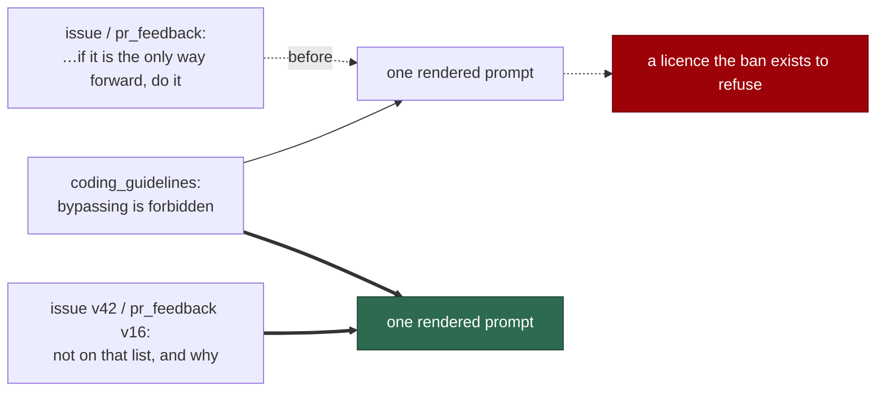

# `--no-verify` leaves the justify-then-run list

## Summary

`coding_guidelines` forbids bypassing the pre-commit gate, categorically:

> Bypassing either safeguard (e.g. `git commit --no-verify`, `git add -f`) is
> **forbidden**. If a safeguard is producing a false positive, fix the
> allowlist via PR — do not bypass.

restated in its worked example and in `CODING-STANDARDS.md`. But `issue` and
`pr_feedback` — which render that block in the same prompt — listed
`git commit --no-verify` among the *justify-then-run* actions:

> … are not routine steps. If one of them genuinely is the only way forward,
> **do it** and state the justification.

The reversibility bullet itself is sound; `--no-verify` was the wrong member of
it. Unlike `push --force`, `rm -rf` or branch deletion it has a documented
non-bypass remedy — fix the allowlist by PR — and it is the gate that stops a
staged secret, so an escape clause reopens exactly the hole the ban exists to
close.

`prompts/issue/v42.md` and `prompts/pr_feedback/v16.md` drop it from the list
and say why it is not there. The other verbs keep their conditional wording:
they genuinely can be the only way forward.

Closes #783.

## Evidence

Prompt-content change with no runtime surface to screenshot. The evidence is
the guard.



Red before, green after — the guard against v41/v15, then v42/v16:

```
# unfixed
no-verify - no latest template outside the guidelines names the flag ... FAILED
  → these templates name `--no-verify` …: issue v41, pr_feedback v15
no-verify - the two templates keep the rest of the reversibility bullet ... FAILED
FAILED | 2 passed | 2 failed

# fixed
ok | 4 passed | 0 failed
```

```
ok | 41 passed | 0 failed   # the guard plus the five other prompt-drift suites
                            # and the issue-prompt review suite
```

`deno fmt --check` (2024 files), `deno lint` (2018 files), `deno check` over
every file in `worker/deno/tests` (0 errors) and the `docs prompt versions`
quality check all pass.

## Reproduction

- **symptom** — an `issue` or `pr_feedback` run reads one prompt that forbids
  `git commit --no-verify` outright and, a few sections away, offers it as
  something to do "if it genuinely is the only way forward" with a justification
- **status** — `verified` — the guard was watched failing against v41/v15,
  naming both offenders by version, and passing against v42/v16
- **regression test** —
  `worker/deno/tests/no_verify_ban_test.ts::no-verify - no latest template outside the guidelines names the flag (Issue #783)`

## Acceptance Criteria

The issue states its scope in the grill-me understanding block; each accepted
item is closed out here. Judged in an operator review of the whole diff, not by
reviewer sub-agents.

- **met** — a new `issue` version whose reversibility bullet no longer lists
  `git commit --no-verify`; the other verbs keep their conditional wording —
  evidence: `prompts/issue/v42.md`; `--no-verify` appears zero times, and
  `::the two templates keep the rest of the reversibility bullet (Issue #783)`
  asserts `git push --force` and the "only way forward" clause survive
- **met** — the same removal in a new `pr_feedback` version — evidence:
  `prompts/pr_feedback/v16.md`, same two checks
- **met** — a Deno regression guard that resolves the latest version of every
  prompt family and fails if any besides `coding_guidelines` contains
  `--no-verify` — evidence:
  `::no-verify - no latest template outside the guidelines names the flag (Issue #783)`,
  which enumerates `prompts/` at run time, so a **new** family is covered
  without editing the test
- **met** — the guard criterion is the literal string, not a classification of
  permissive wording — evidence: the test matches `--no-verify` exactly; the
  two new versions therefore refer to "the pre-commit gate" and cite the
  guidelines rather than restating the flag, which is the escape route the
  issue anticipated
- **met** — no code change — evidence: the diff contains only prompts, the test
  and this summary
- **met** — version numbers taken at implementation time — evidence: `issue`
  v41 → v42 and `pr_feedback` v15 → v16, both later than the numbers the issue
  recorded (v39/v13), because #778, #780 and #781 minted versions in between

- **unrequested** — each new version states *why* the bypass is not on the list
  — reason: the accepted scope is a deletion, and a deletion alone leaves a
  reader who remembers the old bullet wondering whether the omission is
  deliberate. One sentence naming the reason — a bypass is what lets a staged
  secret through, and the remedy is to fix the allowlist by PR — makes the
  removal legible, and is the wording the guidelines already use
- **unrequested** — `::the guidelines still forbid it, categorically (Issue #783)`
  — reason: the guard defers to a ban stated elsewhere. If that ban were ever
  softened, every other template would be silently free of a rule nothing
  states, and the guard would still pass

## Standards Review

- **clean** — prompt immutability honoured: two new versions, nothing edited,
  and a case asserts v41 and v15 still carry the flag; Australian English
  throughout; the ban is stated once, in the family that owns it, and cited
  everywhere else
- **clean** — the guard enumerates `prompts/` at run time rather than listing
  families, so it covers a template that does not exist yet — which is the
  failure mode this class of drift keeps producing
- **violation** — a literal-string ban will reject a legitimate future mention,
  such as a template documenting the ban itself — evidence:
  `no_verify_ban_test.ts` — reason: stands, and the issue chose it knowingly
  ("exact and enforceable"). The escape is to cite the guidelines instead of
  restating the flag, which both new versions demonstrate; loosening it to
  classify wording would return exactly the ambiguity this fixes
- **clean** — no behaviour changed: the pre-commit hook, the allowlist and the
  gate are untouched; only what the agent is told about them

## Test Plan

Added `worker/deno/tests/no_verify_ban_test.ts` (4 tests):

- `no-verify - no latest template outside the guidelines names the flag (Issue #783)`
  — enumerates every family under `prompts/` and names each offender by version.
- `no-verify - the guidelines still forbid it, categorically (Issue #783)`
- `no-verify - the two templates keep the rest of the reversibility bullet (Issue #783)`
- `no-verify - the retired versions stay immutable (Issue #783)`

No existing test was modified.
