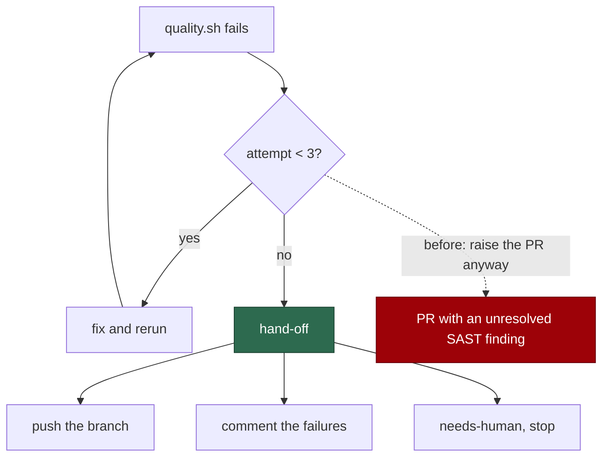

# Exhausting the quality cap hands off; it does not license a PR

## Summary

`issue`'s Error Recovery step 2 capped `quality.sh` fix-and-rerun cycles at
three — sound, a run must not burn itself looping — and then said:

> document the remaining issues in your PR summary and **commit what you have**

Twenty lines later the same file says "All checks must pass before PR
creation", as do `CODING-STANDARDS.md` and the injected `coding_guidelines`.
One prompt, both rules.

It is not a harmless bound. `quality.sh` runs the same semgrep `p/default`
ruleset as the blocking `semgrep.yml` PR check, over the branch's changed files
(Issue #559), so "commit what you have" licensed raising a PR with an
**unresolved SAST finding** — which `ci_fix` independently rules out
("security findings are always actionable — do not dismiss them without an
explicit, justified suppression").

`prompts/issue/v43.md` keeps the cap and changes what follows it. Exhausting
three attempts is now a hand-off:

- do **not** create a pull request;
- commit and push what you have, so the branch is preserved and the next run
  resumes from it;
- comment on the issue with the checks still failing, their exact output, and
  what was tried on each attempt;
- add `needs-human` — the one label the worker may self-apply — and stop.

The must-pass gate is untouched, and now nothing in the rendered prompt
qualifies it.

Closes #785.

## Evidence

Prompt-content change with no runtime surface to screenshot. The evidence is
the rendered prompt.



Red before, green after — the six cases against v42, then v43:

```
# unfixed
quality cap - no rendered passage licenses a PR over failing checks ... FAILED
quality cap - the cap itself survives ... FAILED
quality cap - exhaustion hands off instead of raising a PR ... FAILED
quality cap - the hand-off names the security stage as the reason ... FAILED
FAILED | 2 passed | 4 failed

# fixed
ok | 6 passed | 0 failed
```

```
ok | 37 passed | 0 failed   # the new suite plus the allowlist, no-verify,
                            # lifecycle, reserved-label and issue-review suites
```

`deno fmt --check` (2026 files), `deno lint` (2020 files), `deno check` over
every file in `worker/deno/tests` (0 errors) and the `docs prompt versions`
quality check all pass.

## Reproduction

- **symptom** — an implementation run whose `quality.sh` still fails after
  three attempts reads one prompt telling it to commit what it has and raise
  the PR with the failures documented, and telling it that all checks must pass
  before a PR exists
- **status** — `verified` — the resolution is asserted on the **rendered**
  prompt (template plus injected guidelines), which is where the two statements
  met; watched failing on four of six cases against v42
- **regression test** —
  `worker/deno/tests/quality_cap_handoff_test.ts::quality cap - no rendered passage licenses a PR over failing checks (Issue #785)`

## Acceptance Criteria

The issue states its scope in the grill-me understanding block; each accepted
item is closed out here. Judged in an operator review of the whole diff, not by
reviewer sub-agents.

- **met** — a new `issue` version keeping the 3-attempt cap but directing the
  run, on exhaustion, to create no PR, preserve the branch, comment the
  remaining failures, apply `needs-human`, and stop — evidence:
  `prompts/issue/v43.md`;
  `::exhaustion hands off instead of raising a PR (Issue #785)` asserts all
  four steps, and `::the cap itself survives (Issue #785)` asserts the bound
  and "do not loop indefinitely" are still there
- **met** — the must-pass passage retained unchanged; no passage in the
  rendered issue prompt licenses PR creation with failing checks — evidence:
  `::no rendered passage licenses a PR over failing checks (Issue #785)` and
  `::the must-pass gate the hand-off defers to is still stated (Issue #785)`
- **met** — the next free version once concurrent bumps land — evidence: v43,
  because #781 minted v41 and #783 minted v42 earlier in this queue
- **partial** — "the new file's H1 carries the new version number (avoiding the
  defect class recorded in #792)" — evidence: `issue` has no H1 at all; it opens
  with `{{VERBOSITY_INSTRUCTIONS}}` — reason: there is no H1 version
  declaration to carry, the same finding as #781, #782 and #784. Adding one is
  #792's sweep

- **unrequested** — a regression guard, where the accepted scope says "no
  regression guard test ships with this change" — reason: the scope names the
  observable ("after the fix, no passage in the rendered issue prompt licenses
  PR creation with failing checks"), and the repository's own standards require
  a change to be verifiable. That assertion is one line and is what would catch
  the licence being reintroduced. If the intent was that no new test file
  should appear, this is the single item to strike
- **unrequested** — the hand-off says *why* — that the gate includes the
  semgrep SAST stage, so a PR raised over it ships an unresolved security
  finding — reason: a reader who believes the cap is about lint will read the
  hand-off as bureaucracy and look for a way to raise the PR anyway. The reason
  is the part that makes the instruction stick, and it is the fact the issue
  itself leads with

## Standards Review

- **clean** — prompt immutability honoured: one new version, nothing edited,
  and a case asserts v42 still carries the licence its successor removes;
  Australian English throughout; the cap's rationale is preserved, so the fix
  does not read as "loop forever instead"
- **clean** — the `needs-human` self-apply the hand-off relies on is the one
  label the worker may apply, per the carve-out `label_security.ts` implements
  and #780 documented; the new text says so in the same breath, so it does not
  read as contradicting the reserved-label list beside it
- **violation** — `::the cap itself survives` asserts `"3\n   attempts"`, which
  is sensitive to the template's line wrapping — evidence:
  `quality_cap_handoff_test.ts` — reason: stands, narrowly. The bare string
  "3" would match anywhere in a 900-line prompt; the wrapped form is the
  smallest fragment that identifies the cap, and a reflow that breaks it is a
  one-line fix in a test that will already be open
- **violation** — the assertions match prose fragments — reason: stands, as in
  the sibling audit fixes. A prompt is prose, and the alternative is asserting
  nothing about the hand-off that replaced the licence

## Test Plan

Added `worker/deno/tests/quality_cap_handoff_test.ts` (6 tests):

- `quality cap - no rendered passage licenses a PR over failing checks (Issue #785)`
- `quality cap - the cap itself survives (Issue #785)`
- `quality cap - exhaustion hands off instead of raising a PR (Issue #785)`
- `quality cap - the must-pass gate the hand-off defers to is still stated (Issue #785)`
- `quality cap - the hand-off names the security stage as the reason (Issue #785)`
- `quality cap - v42 stays immutable (Issue #785)`

No existing test was modified.
