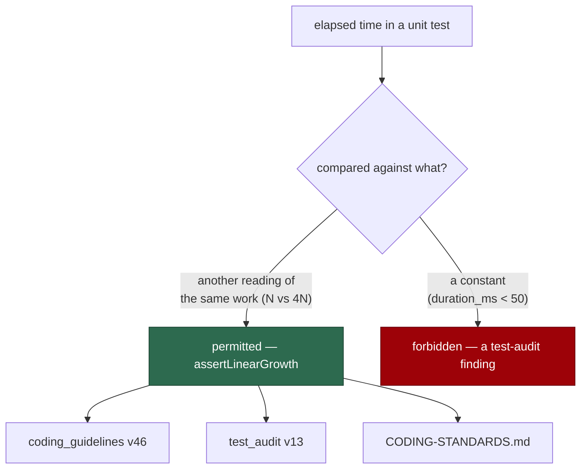

# One rule about timing assertions: compare two readings, never a constant

## Summary

Three surfaces stated three different rules about the same concrete pattern:

| Surface | Rule |
| --- | --- |
| `coding_guidelines` | "**Do not measure performance inside unit tests**" — a flat ban |
| `CODING-STANDARDS.md` | "a few tests **must** measure" — mandates `assertLinearGrowth` |
| `test_audit` check 3 | "Flag **any** wall-clock comparison inside a unit test as a finding" |

`assertLinearGrowth` times the same work at N and 4N and compares the two
readings — a wall-clock comparison inside a unit test. So a `test-audit` run
over this repository would have filed `timing-assertion` findings against
`growth_bound_test.ts` and `secret_redaction_bounds_test.ts`, the exact pattern
its own standards require, and the implementing run would read a guidelines
block telling it not to measure at all.

The rule that reconciles all three is what the elapsed time is compared
**against**: another reading of the same work is fine; a constant is the
defect. A slower host inflates both readings of a ratio and the test stays
green — which is precisely the flakiness objection check 3 exists to raise, and
which an absolute budget cannot survive (Issue #530).

All three surfaces now state it: `prompts/coding_guidelines/v46.md` replaces
the flat ban with the carve-out, `prompts/test_audit/v13.md` keeps flagging
absolute budgets and exempts ratio assertions, and `CODING-STANDARDS.md` gains
the one-line statement of the rule. `tests/support/growth.ts` and both growth
tests are unchanged.

Closes #786.

## Evidence

Documentation and prompt change with no runtime surface to screenshot. The
evidence is the consistency test.



Red before, green after — the six cases against v45/v12, then v46/v13:

```
# unfixed
timing policy - all three surfaces state the same rule ... FAILED
timing policy - the guidelines no longer ban measuring outright ... FAILED
timing policy - the auditor exempts ratio assertions ... FAILED
FAILED | 2 passed | 3 failed

# fixed
ok | 6 passed | 0 failed
```

```
ok | 57 passed | 0 failed   # the new suite plus both growth tests, the
                            # test-audit prompt suite and three sibling
                            # prompt-drift suites
```

`deno fmt --check` (2027 files), `deno lint` (2021 files), `deno check` over
every file in `worker/deno/tests` (0 errors), markdownlint and the
`docs prompt versions` quality check all pass.

## Reproduction

- **symptom** — a `test-audit` run over this repository files a
  `timing-assertion` finding against `growth_bound_test.ts` and
  `secret_redaction_bounds_test.ts`, whose pattern `CODING-STANDARDS.md`
  requires; an implementing run reads a guidelines block forbidding the
  measurement outright
- **status** — `verified` — the three-way disagreement and its resolution are
  asserted across all three surfaces; watched failing on three of six cases
  against v45/v12
- **regression test** —
  `worker/deno/tests/timing_assertion_policy_test.ts::timing policy - all three surfaces state the same rule (Issue #786)`

## Acceptance Criteria

The issue states its scope in the grill-me understanding block; each accepted
item is closed out here. Judged in an operator review of the whole diff, not by
reviewer sub-agents.

- **met** — a new `coding_guidelines` version replacing the flat ban with the
  ratio carve-out — evidence: `prompts/coding_guidelines/v46.md`;
  `::the guidelines no longer ban measuring outright (Issue #786)` asserts the
  old wording is gone and the helper is named
- **met** — a new `test_audit` version whose check 3 keeps flagging absolute
  budgets but exempts ratio-based growth assertions — evidence:
  `prompts/test_audit/v13.md`;
  `::the auditor exempts ratio assertions (Issue #786)` asserts both halves and
  that the unconditional "flag any" wording is gone
- **met** — `CODING-STANDARDS.md` edited in place with one sentence stating the
  rule explicitly — evidence: the added "compare two readings of the same work,
  never a reading against a constant" line
- **met** — a Deno consistency test resolving the latest versions of both
  prompt families and failing unless both state the carve-out — evidence:
  `::all three surfaces state the same rule (Issue #786)`, which checks the two
  latest prompt versions **and** the standards file against one regex
- **met** — `tests/support/growth.ts` and the two growth tests are unchanged —
  evidence: not in the diff;
  `::the helper the carve-out names still exists and is used (Issue #786)`
  scans the test directory and fails if no unit test calls the helper the
  carve-out was written for
- **met** — each new prompt file's H1 declares its own version number (#792) —
  evidence: `test_audit/v13.md` opens `… Coverage-Gap Audit (v13)`, corrected
  from the inherited `(v12)` a straight copy produced;
  `::the new audit version declares its own number (Issue #786)` pins it.
  `coding_guidelines` has no H1 at all, so it has nothing to declare — the same
  finding as #781, #782, #784 and #785

- **unrequested** — `worker/deno/tests/test_audit_prompt_v12_test.ts`'s exact
  `latest === "v12"` pin was relaxed to "v12 or newer" — reason: required by
  the change, and its intent is preserved. That file pins the contract v12
  introduced (check 11), which must survive every later version; the resolution
  check still compares `loadPrompt(undefined)` against the resolved latest, so
  it still proves the worker loads what it resolves. Every check-11 assertion
  is untouched
- **unrequested** — the H1-version case — reason: `test_audit` carries its
  version in its H1, so the copy that produced v13 inherited `(v12)`. That is
  the defect class #792 sweeps; this change adds one such file, so it checks
  its own rather than shipping a fresh instance of the bug for #792 to find

## Standards Review

- **clean** — prompt immutability honoured: two new versions, nothing edited,
  and a case asserts v45 and v12 still carry the wording their successors
  replace; Australian English throughout; the rule is stated once per surface
  in the same words, so the three cannot be read as three policies again
- **clean** — the rationale travels with the rule on every surface (a slower
  host inflates both readings), so a reader meeting only one of them can tell
  a ratio from a budget without consulting the other two
- **violation** — the consistency test matches a regex over prose rather than
  a structured declaration — evidence:
  `timing_assertion_policy_test.ts` `RULE` — reason: stands. The artefacts are
  a prompt, a prompt and a markdown standard; there is no structured surface
  to compare. The regex admits both phrasings the surfaces use and each failure
  names which surface is silent
- **clean** — no behaviour changed: `growth.ts`, both growth tests and the
  audit's other ten checks are untouched; only what the three documents say

## Test Plan

Added `worker/deno/tests/timing_assertion_policy_test.ts` (6 tests):

- `timing policy - all three surfaces state the same rule (Issue #786)`
- `timing policy - the guidelines no longer ban measuring outright (Issue #786)`
- `timing policy - the auditor exempts ratio assertions (Issue #786)`
- `timing policy - the helper the carve-out names still exists and is used (Issue #786)`
- `timing policy - the new audit version declares its own number (Issue #786)`
- `timing policy - the retired versions stay immutable (Issue #786)`

Modified: `test_audit_prompt_v12_test.ts`'s version-resolution assertion,
documented above. No assertion was weakened or removed.

**Unrelated flake seen once:** `secret_redaction_bounds_test.ts::redactSecrets -
a long hyphen run does not stall the secret-cli-flag rule` failed on one
parallel run and passed on five sequential ones and on the final combined run.
It is a growth test measuring under machine load, and this change touches no
runtime code — worth knowing given the subject, but not caused here.
