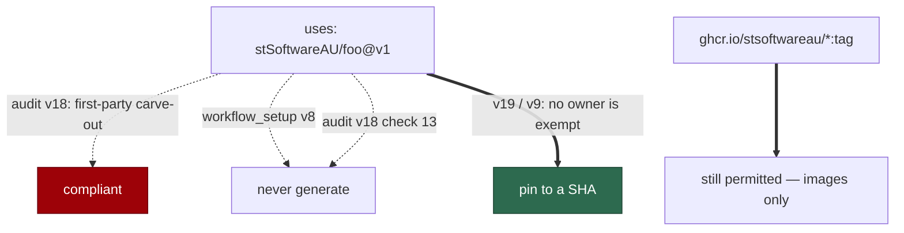

# Every `uses:` pins to a SHA, and "first-party" is gone

## Summary

Three surfaces disagreed about one concrete artefact, `uses: stSoftwareAU/foo@v1`:

| Surface | Verdict |
| --- | --- |
| `github_actions_audit` | compliant — a "first-party carve-out" let `stSoftwareAU/*` actions pin to a tag |
| `workflow_setup` | "no generated workflow may ship one" |
| `coding_guidelines` | pins every action to a SHA, with no owner exception |

And **"first-party" named two disjoint sets** — GitHub-owned `actions/*` in
`workflow_setup`, the organisation's own `stSoftwareAU/*` in the audit — over
exactly the set the rule gates. A reader carrying one file's meaning into the
other inverts the verdict.

The audit already contradicted itself: its check 13 required a cross-repo
reusable workflow to pin to a SHA with no owner named, so an `stSoftwareAU/*`
reusable workflow at a tag hit two of its own rules with opposite answers.

Settled, per the issue: **every `uses:` pins to a full 40-character commit SHA,
whoever owns it.** Only `ghcr.io/stsoftwareau/*` **container images** keep tag
pinning — the carve-out was never wrong about images, only about `uses:`
references. The term "first-party" is gone from both templates in favour of the
explicit set names.

`prompts/github_actions_audit/v19.md` rewrites all five carve-out passages and
aligns checks 10 and 13; `prompts/workflow_setup/v9.md` keeps its
SHA-everywhere rule and drops the term. `coding_guidelines` already stated the
chosen rule and is untouched.

Closes #787.

## Evidence

Prompt-content change with no runtime surface to screenshot. The evidence is
the consistency suite.



Red before, green after — the eight cases against v18/v8, then v19/v9:

```
# unfixed
action pinning - neither template says first-party any more ... FAILED
action pinning - no owner is exempt from the SHA rule ... FAILED
action pinning - the image carve-out survives, and only for images ... FAILED
action pinning - check 13 no longer contradicts the rule above it ... FAILED
action pinning - check 10 stays about authorship, not pinning ... FAILED
action pinning - the new audit version declares its own number ... FAILED
FAILED | 2 passed | 6 failed

# fixed
ok | 8 passed | 0 failed
```

```
ok | 130 passed | 0 failed   # the new suite plus the workflow-setup and
                             # github-actions prompt suites and the cross-repo
                             # body guard
```

`deno fmt --check` (2028 files), `deno lint` (2022 files), `deno check` over
every file in `worker/deno/tests` (0 errors) and the `docs prompt versions`
quality check all pass.

## Reproduction

- **symptom** — a `github-actions-audit` run rules `uses: stSoftwareAU/foo@v1`
  compliant under its first-party carve-out, while `workflow_setup` says no
  generated workflow may ship it and the audit's own check 13 flags it; and
  "first-party" means `actions/*` in one template and `stSoftwareAU/*` in the
  other
- **status** — `verified` — asserted across both templates and the guidelines;
  watched failing on six of eight cases against v18/v8
- **regression test** —
  `worker/deno/tests/action_sha_pinning_policy_test.ts::action pinning - no owner is exempt from the SHA rule (Issue #787)`
  and `::action pinning - neither template says first-party any more (Issue #787)`

## Acceptance Criteria

The issue states its scope in the grill-me understanding block; each accepted
item is closed out here. Judged in an operator review of the whole diff, not by
reviewer sub-agents.

- **met** — a new `github_actions_audit` version removing the tag carve-out for
  `stSoftwareAU/*` actions from all five passages, and aligning checks 10 and
  13 so no owner is exempt — evidence: `prompts/github_actions_audit/v19.md`;
  the five passages were rewritten individually (a blanket substitution would
  have taken the image carve-out with them), and
  `::check 13 no longer contradicts the rule above it` and
  `::check 10 stays about authorship, not pinning` assert the two checks
- **met** — tag pinning kept for `ghcr.io/stsoftwareau/*` images only —
  evidence: `::the image carve-out survives, and only for images (Issue #787)`
- **met** — a new `workflow_setup` version keeping the SHA-everywhere rule and
  replacing "first-party" with the explicit set name — evidence:
  `prompts/workflow_setup/v9.md`, which now names GitHub-owned `actions/*`,
  internal `stSoftwareAU/*` and everyone else in one sentence
- **met** — every remaining "first-party" replaced in both templates —
  evidence: `::neither template says first-party any more (Issue #787)`, a
  case-insensitive check over the whole of each latest version (5 occurrences
  in the audit, 1 in the generator)
- **met** — `coding_guidelines` untouched — evidence: not in the diff;
  `::the guidelines already stated the rule and are untouched (Issue #787)`
  asserts it still states the rule and has not acquired the term
- **met** — done means both surfaces rule `uses: stSoftwareAU/foo@v1`
  non-compliant, and `grep -ri "first-party"` over the two new files returns
  nothing — evidence: both asserted; the grep returns 0

- **unrequested** — the new audit version's H1 declares `(v19)` — reason: this
  family carries its version in its H1, and **v18 already declared `(v17)`** —
  a live instance of the defect #792 sweeps. A straight copy would have shipped
  a third file with the wrong number; `::the new audit version declares its own
  number (Issue #787)` pins mine. v18's own mismatch is left for #792
- **unrequested** — `workflow_setup_prompt_v8_test.ts`'s exact
  `latest === "v8"` pin was relaxed to "v8 or newer" — reason: required by the
  change, and its intent is preserved. That file pins the contract v8
  introduced, which every later version must keep; nothing else in it was
  touched
- **unrequested** — check 10's set is now explained rather than only listed —
  reason: leaving `actions/*` / `stSoftwareAU/*` as a bare set beside a rule
  that no longer exempts either owner reads as a surviving pinning exemption.
  It is about *who wrote the code a privileged trigger runs*; saying so is what
  stops it being read back as the carve-out this change removes

## Standards Review

- **clean** — prompt immutability honoured: two new versions, nothing edited,
  and a case asserts v18 and v8 still carry the term; Australian English
  throughout; the rule is stated once per template in the same words
- **clean** — the rationale travels with the rule ("as true of a repository we
  control as of one we do not"), so the carve-out's original argument is
  answered rather than silently dropped
- **violation** — the assertions match prose fragments, which rewording breaks
  — evidence: `action_sha_pinning_policy_test.ts` — reason: stands, as in the
  sibling audit fixes. A prompt is prose; the "first-party" case is a
  case-insensitive whole-file check and needs no wording, but the substantive
  cases must name what replaced the carve-out
- **clean** — the image carve-out is preserved deliberately and asserted, so
  this change cannot be read as tightening a rule the issue did not ask to
  tighten

## Test Plan

Added `worker/deno/tests/action_sha_pinning_policy_test.ts` (8 tests):

- `action pinning - neither template says first-party any more (Issue #787)`
- `action pinning - no owner is exempt from the SHA rule (Issue #787)`
- `action pinning - the image carve-out survives, and only for images (Issue #787)`
- `action pinning - check 13 no longer contradicts the rule above it (Issue #787)`
- `action pinning - check 10 stays about authorship, not pinning (Issue #787)`
- `action pinning - the guidelines already stated the rule and are untouched (Issue #787)`
- `action pinning - the new audit version declares its own number (Issue #787)`
- `action pinning - the retired versions stay immutable (Issue #787)`

Modified: `workflow_setup_prompt_v8_test.ts`'s version-resolution assertion,
documented above. No assertion was weakened or removed.
