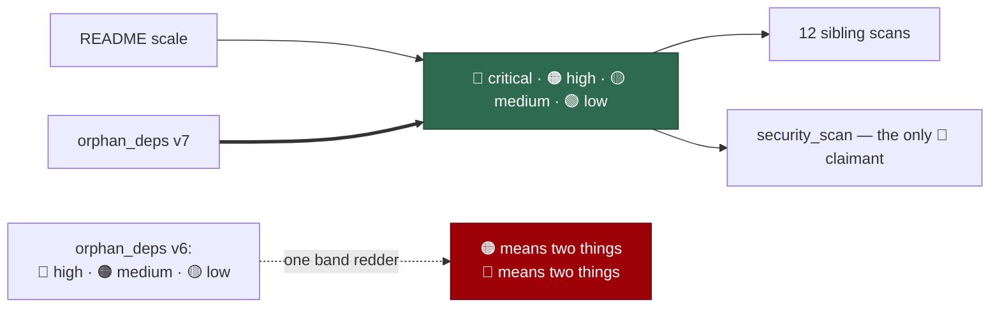

# One severity scale across every filing scan

## Summary

`orphan_deps/v6` mapped `🔴` high, `🟠` medium, `🟡` low — **one band redder**
than the twelve sibling filing scans, and its red collided with the `🔴`
`security_scan` reserves for `severity:critical`.

So a human triaging a mixed idle-task queue read:

- `🟠` as **high** on an orphan-deps issue, and **medium** on every other;
- `🔴` as **high** from orphan-deps, and **critical** from the security scan.

`orphan_deps` attaches only `severity:high|medium|low` — it says so itself,
"There is **no `severity:critical`**" — so its red was a mis-mapping rather
than a fourth band.

Three siblings already stated the map as a **cross-scan invariant** ("the same
map the sibling scan templates use, so a human triaging every queue reads one
scale"), and `README.md` records the intended scale: critical red → high orange
→ medium yellow → low green.

`prompts/orphan_deps/v7.md` uses the one scale and says why, in the siblings'
own words, adding that `🔴` belongs to the scan that has a critical band. Its
H1 also drops the stale `(v5)` suffix a v6 file was carrying.

Closes #788.

## Evidence

Prompt-content change with no runtime surface to screenshot. The evidence is
the invariant test, which reads every scan rather than the one that was wrong.



Red before, green after — and the failure names each mis-mapping:

```
# unfixed
severity scale - every scan's emoji map agrees with the one scale ... FAILED
  orphan_deps v6: 🔴 = high (the scale says 🔴 = critical)
  orphan_deps v6: 🟠 = medium (the scale says 🟠 = high)
  orphan_deps v6: 🟡 = low (the scale says 🟡 = medium)
severity scale - orphan_deps states the corrected map ... FAILED
severity scale - only the security scan claims the red band ... FAILED
FAILED | 2 passed | 3 failed

# fixed
ok | 5 passed | 0 failed
```

```
ok | 154 passed | 0 failed   # the new suite plus the orphan-deps suites, the
                             # cross-repo body guard and the SHA-pinning suite
```

`deno fmt --check` (2029 files), `deno lint` (2023 files), `deno check` over
every file in `worker/deno/tests` (0 errors) and the `docs prompt versions`
quality check all pass.

## Reproduction

- **symptom** — an orphan-deps issue titled `🟠 ORPHAN-DEPRECATED: …` carries
  `severity:medium` while a `🟠` from any sibling scan means high, and a `🔴`
  from orphan-deps means high while a `🔴` from the security scan means
  critical
- **status** — `verified` — the test extracts the pairings each latest template
  states and was watched failing against v6, naming all three mis-mappings
- **regression test** —
  `worker/deno/tests/severity_emoji_scale_test.ts::severity scale - every scan's emoji map agrees with the one scale (Issue #788)`

## Acceptance Criteria

The issue states its scope in the grill-me understanding block; each accepted
item is closed out here. Judged in an operator review of the whole diff, not by
reviewer sub-agents.

- **met** — `prompts/orphan_deps/v7.md`, identical to v6 except the
  severity-emoji instruction and the H1 — evidence: the diff is exactly those
  two hunks; `::orphan_deps states the corrected map (Issue #788)` asserts the
  three pairings
- **met** — the H1 drops the stale `(v5)` suffix; the filename carries the
  version — evidence: `# Orphan / Unmaintained-Dependency Detection`
- **met** — a test that fails whenever any filing scan's latest template
  deviates from the one scale, with `🔴` reserved for `severity:critical` —
  evidence: `::every scan's emoji map agrees with the one scale (Issue #788)`
  enumerates `prompts/` at run time, so a **new** scan is covered without
  editing the test, and `::only the security scan claims the red band
  (Issue #788)` asserts the reservation
- **met** — v6 and older remain byte-identical — evidence: not in the diff;
  `::v6 stays immutable (Issue #788)`
- **met** — v7 changes nothing else; #794's two orphan_deps drift items stay
  with #794 — evidence: the two-hunk diff

- **unrequested** — the corrected instruction states *why*, in the siblings'
  own words, and names the red reservation — reason: the accepted scope is a
  three-emoji swap, which would leave the next editor free to shift it back
  with no sign that the map is shared. Three siblings already carry that
  sentence; copying it makes orphan-deps the fourth to say the map is an
  invariant rather than a local style choice
- **unrequested** — `::orphan_deps still has no critical band to justify a red
  (Issue #788)` — reason: the mis-mapping was *unambiguous* only because this
  scan has no critical band. If it ever gained one the fix would need
  revisiting, so the premise is pinned rather than assumed

## Standards Review

- **clean** — prompt immutability honoured: one new version, nothing edited,
  and a case asserts v6 still carries the shifted map; Australian English
  throughout; the invariant is now enforced rather than asserted in prose by
  three templates that could not check each other
- **clean** — the test extracts pairings rather than matching a fixed sentence,
  which matters here: the twelve scans state the map in at least three
  different shapes, several wrapping mid-pairing. A fixed-shape match would
  have covered one scan and silently skipped the rest
- **violation** — the extraction reads a markdown convention (`` `emoji` band ``)
  rather than a structured declaration — evidence:
  `severity_emoji_scale_test.ts` `PAIRING` — reason: stands. The scale lives in
  prompt prose; there is no structured surface to read. The regex collapses
  whitespace first so wrapping cannot hide a pairing, and each failure names
  the scan, the version, the pairing and what the scale says instead
- **clean** — no behaviour changed: the labels each scan attaches are
  untouched, only the emoji a title is prefixed with

## Test Plan

Added `worker/deno/tests/severity_emoji_scale_test.ts` (5 tests):

- `severity scale - every scan's emoji map agrees with the one scale (Issue #788)`
- `severity scale - orphan_deps states the corrected map (Issue #788)`
- `severity scale - only the security scan claims the red band (Issue #788)`
- `severity scale - orphan_deps still has no critical band to justify a red (Issue #788)`
- `severity scale - v6 stays immutable (Issue #788)`

No existing test was modified.
