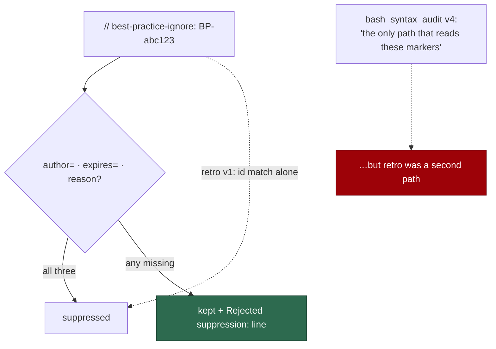

# Every reader of the suppression grammar checks the same three fields

## Summary

`retro/v1` triage rule 6 honoured a **bare** suppression marker: an id match
alone dropped the candidate. The deterministic check
(`worker/deno/lib/suppression_comments.ts`) and twelve sibling scans refuse
that — a marker suppresses only when it records:

- `author=<github-login>` — who waived the finding;
- `expires=<YYYY-MM-DD>` — until when, today or later;
- reason text — why.

…and an ungoverned marker is kept and reported as
`Rejected suppression: <file>:<line> <id> — <failed check>` rather than
silently obeyed.

So a one-line `// best-practice-ignore: BP-abc123def456` with no author, no
expiry and no reason was an **ungoverned, never-expiring waiver** on the retro
path and refused everywhere else — the exact failure the three-field rule was
written to prevent.

`bash_syntax_audit/v4` compounded it, justifying its own rule with:

> This is the rule the deterministic suppression check applies, and it is **the
> only path that reads these markers — there is no second triage path for it to
> drift from**.

Retro *was* that second path.

`prompts/retro/v2.md` carries the governed check and the reporting line, in the
siblings' own words. `prompts/bash_syntax_audit/v5.md` replaces the sole-reader
claim with what is now true: every LLM triage path applies the same check, so
the automated and LLM paths cannot drift.

Closes #789.

## Evidence

Prompt-content change with no runtime surface to screenshot. The evidence is
the guard, which reads every prompt rather than the one that was wrong.



Red before, green after — and the failure names each missing field:

```
# unfixed
suppression governance - every marker reader states all three fields ... FAILED
  retro v1: no `author=`
  retro v1: no `expires=`
  retro v1: no `Rejected suppression`
suppression governance - retro no longer drops on an id match alone ... FAILED
suppression governance - no prompt claims to be the only marker reader ... FAILED
FAILED | 2 passed | 3 failed

# fixed
ok | 5 passed | 0 failed
```

```
ok | 174 passed | 0 failed   # the new suite plus the deterministic
                             # suppression suites, the severity-scale guard and
                             # the cross-repo body guard
```

`deno fmt --check` (2030 files), `deno lint` (2024 files), `deno check` over
every file in `worker/deno/tests` (0 errors) and the `docs prompt versions`
quality check all pass.

## Reproduction

- **symptom** — a bare `// best-practice-ignore: BP-…` with no author, expiry
  or reason silences a retro candidate, while the same marker is refused (and
  reported) by the deterministic check and by twelve sibling scans
- **status** — `verified` — the guard reads every latest prompt that names the
  grammar and was watched failing against v1, naming all three missing fields
- **regression test** —
  `worker/deno/tests/suppression_governance_drift_test.ts::suppression governance - every marker reader states all three fields (Issue #789)`

## Acceptance Criteria

The issue states its scope in the grill-me understanding block; each accepted
item is closed out here. Judged in an operator review of the whole diff, not by
reviewer sub-agents.

- **met** — `prompts/retro/v2.md` replacing triage rule 6 with the three-field
  check, leaving an ungoverned candidate live and carrying the
  `Rejected suppression:` line into the filing — evidence: the new version;
  `::retro no longer drops on an id match alone (Issue #789)` asserts the old
  wording is gone and both halves of the new rule are present
- **met** — the governed rule text copied into retro/v2, matching how the
  twelve siblings carry it — evidence: the wording is `best_practices/v12`'s,
  adapted only where retro says "candidate" for "finding"
- **met** — `prompts/bash_syntax_audit/v5.md` rewording the sole-reader
  sentence — evidence: the one-hunk diff;
  `::no prompt claims to be the only marker reader (Issue #789)` asserts no
  prompt makes that claim any more
- **met** — a Deno test asserting every latest prompt that recognises the
  grammar carries the three-field check and the reporting line, failing when a
  prompt honours a bare marker — evidence:
  `::every marker reader states all three fields (Issue #789)`, which
  enumerates `prompts/` at run time, so a **new** scan is covered without
  editing the test (16 readers today)
- **met** — `retro/v1` and `bash_syntax_audit/v4` untouched — evidence: not in
  the diff; `::the retired versions stay immutable (Issue #789)` asserts both
  still carry the wording their successors replace

- **unrequested** — both new files declare their own version in their H1 —
  reason: both families carry the version there, so a straight copy ships the
  predecessor's number — the defect class #792 sweeps. Corrected in the two
  files this change adds rather than leaving two fresh instances behind
- **unrequested** — `::the deterministic check requires the same fields
  (Issue #789)` reads `suppression_comments.ts` — reason: every one of these
  prompts justifies its rule by saying it mirrors the code. Asserting only
  that the prompts agree with each other would leave all sixteen free to drift
  from the thing they claim to mirror

## Standards Review

- **clean** — prompt immutability honoured: two new versions, nothing edited,
  and a case asserts both predecessors still read as they did; Australian
  English throughout; the governed wording is the siblings' own, so the fleet
  reads one rule rather than a fourteenth paraphrase
- **clean** — the guard enumerates `prompts/` at run time and keys off "does
  this prompt name the grammar at all", so a scan that starts reading markers
  later is covered without anyone remembering to add it
- **violation** — the governance check is a substring test for `author=`,
  `expires=` and `Rejected suppression`, not a parse of the rule — evidence:
  `suppression_governance_drift_test.ts` `GOVERNANCE` — reason: stands. The
  artefacts are prose; a prompt could in principle name all three fields and
  still state a lax rule. The companion case closes the specific gap that
  existed (`retro` dropping on an id match alone), and the substring check is
  what generalises to a scan nobody has written yet
- **clean** — no behaviour changed: `suppression_comments.ts` is read by the
  test and never modified

## Test Plan

Added `worker/deno/tests/suppression_governance_drift_test.ts` (5 tests):

- `suppression governance - every marker reader states all three fields (Issue #789)`
- `suppression governance - retro no longer drops on an id match alone (Issue #789)`
- `suppression governance - no prompt claims to be the only marker reader (Issue #789)`
- `suppression governance - the deterministic check requires the same fields (Issue #789)`
- `suppression governance - the retired versions stay immutable (Issue #789)`

No existing test was modified.
