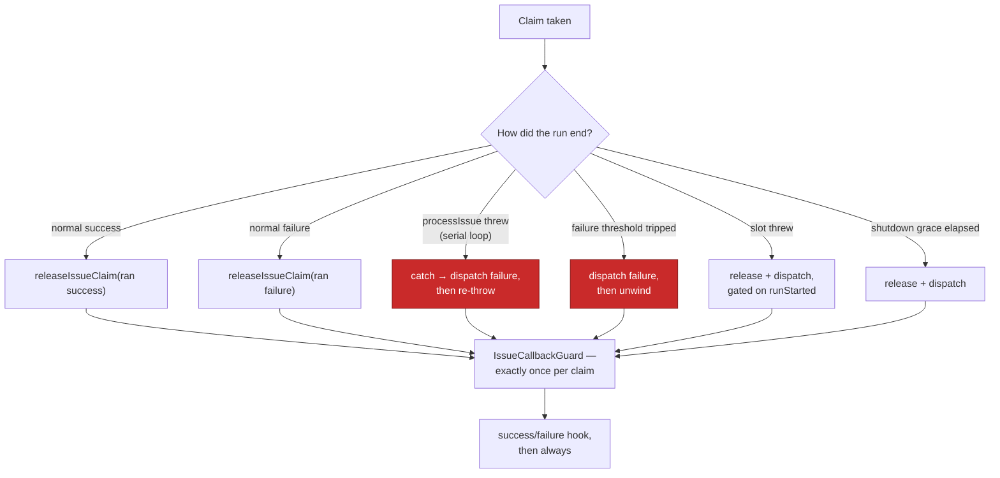

# Fleet session log: restore the callback wiring and make the branch green

## Summary

The public half of the fleet-session-log work — the generic post-run callback
extension point (#806), the removal of built-in FLEET health (#805), the
documented contract and conformance fixture (#807) and the 1.2.0 release
notes (#808) — is merged on `milestone/fleet-logs`. What was **not** true is
that the branch still worked: successive `main` → `milestone/fleet-logs` sync
merges had quietly eaten the wiring that fires the hooks, and the branch no
longer compiled.

This PR lands the restoration, the regression tests that keep it, and the three
gate failures the branch was carrying. Closes #796.

**What the merges had removed.** Counting `dispatchIssueCallbacks` call sites in
`worker/deno/lib/run_core.ts` across the branch's history:

| Commit    | What it is                                       | Dispatch sites |
| --------- | ------------------------------------------------ | -------------: |
| `43628db` | #806 lands the callbacks                          |              4 |
| `29ca912` | #928 restores them after two sync merges          |              4 |
| `165bb42` | `main` sync merge                                 |              3 |
| `987df13` | `main` sync merge                                 |              2 |
| `e5d7dab` | milestone HEAD before this PR                     |              2 |

The mechanism is visible in `git diff 29ca912 165bb42 -- worker/deno/lib/run_core.ts`:
`main` changed the `processIssue(issue, endTime)` line **inside** the `try` that
the milestone branch had wrapped in a new `catch`, and the resolution kept
`main`'s hunk and dropped the `catch` with it.

The branch was also **not compiling**: `SlotPoolState.callbackGuard` was declared
but never initialised in the pool literal, so `deno check` failed on
`milestone/fleet-logs` HEAD. Reproduced here against the untouched branch:

```
$ deno check lib/run_core.ts
TS2741 [ERROR]: Property 'callbackGuard' is missing in type '{ … }'
  but required in type 'SlotPoolState'.
    at worker/deno/lib/run_core.ts:2679:9
```

### The terminal paths that must report



The two red boxes are the paths the sync merges had removed: a thrown serial run
and a run that trips the failure threshold were the only terminal outcomes that
reported nothing.

### Defences added, so a fourth deletion cannot be silent

1. **Tests**, not comments. `run_core_callbacks_test.ts` now covers both
   restored paths, and both were observed failing with the wiring removed.
2. **A required parameter.** `runSlotIssue`'s `started` flag no longer carries a
   default. With one, dropping the argument at the sole call site compiled
   cleanly and left the slot watching a flag nobody set; without one, the same
   deletion fails `deno check`.

### Gate failures the branch was carrying

Three, all where this milestone's work meets a gate that landed on `main`:

- `mod_test` expected 148 commands. #805 removed `fleet-health` and #807 added
  `callback-conformance`, so the registry holds 147; the ledger comment now
  records the removal it was missing.
- `parallel_safety_cap_test` (Issue #880) still listed `fleet_health_test.ts`,
  which #805 deleted. That list is an exact record, so the entry goes with the
  file.
- The same gate caps process-env mutators, and two files this milestone added or
  extended had each grown one. Both now read the parent environment rather than
  writing it — see the Test Plan.

## Evidence

Backend/CLI change with no web interface, so there is no screenshot to take. The
evidence is the gate and the red-then-green checks below.

**The regression tests fail without the fix.** With the restored `catch`
removed:

```
run_core callbacks - a serial-loop throw reports the failed run before it propagates
  => ./tests/run_core_callbacks_test.ts:415:6
FAILED | 13 passed | 1 failed
```

With the exit-threshold dispatch removed:

```
run_core callbacks - the exit-threshold branch reports the failed run before unwinding
  => ./tests/run_core_callbacks_test.ts:437:6
FAILED | 13 passed | 1 failed
```

With `clearEnv` flipped off in `run_callbacks.ts`:

```
run_callbacks integration - no worker credential reaches the hook environment
  => ./tests/run_callbacks_integration_test.ts:351:6
FAILED | 9 passed | 1 failed
```

All three pass with the code as shipped.

**Full gate.** `./quality.sh` — every check passes except `deno tests`, which
reports two failures:

```
applyServiceAccountEnv - an unwritable gh config dir is restaged writable
checkContainerPrerequisites - fails when the image is not buildable
FAILED | 16825 passed (4 steps) | 2 failed | 5 ignored
```

Both are **pre-existing on `main`**, not introduced here. Reproduced in a clean
detached worktree at `origin/main` (56821d4) in this same container, with no
branch changes present — each fails identically there. Filed as
stSoftwareAU/VibeCoder#990. The branch's own contribution went from 38 failures
(and a tree that did not type-check) to 0.

## Acceptance Criteria

<!-- vibe-spec-review inputs="diff+issue-body" -->

- **met** — a generic post-run callback extension point fires on every terminal
  issue run — evidence: `worker/deno/lib/run_core.ts:2041` (serial catch),
  `:2141` (exit threshold), `:3130` (slot `runStarted` wiring) — reviewer: met
- **met** — `success` fires only after a terminal successful run — evidence:
  `worker/deno/tests/run_core_callbacks_test.ts::a successful run reports a success terminal run`
  — reviewer: met
- **met** — `failure` fires only after a terminal failed run — evidence:
  `worker/deno/tests/run_core_callbacks_test.ts::a serial-loop throw reports the failed run before it propagates`
  — reviewer: met
- **met** — `always` runs after the applicable outcome callback, including after
  an outcome-hook failure — evidence: `worker/deno/lib/run_callbacks.ts`,
  `worker/deno/tests/run_callbacks_test.ts` — reviewer: met — reason: on the
  base branch and untouched here
- **met** — a hook failure is logged and never replaces the VibeCoder result —
  evidence: `worker/deno/lib/run_core.ts:1682` — reviewer: met
- **met** — callbacks are optional executable paths invoked directly with
  versioned run context — evidence: `worker/deno/lib/run_callbacks.ts`
  (`CALLBACK_SCHEMA_VERSION`), `worker/deno/tests/run_callbacks_integration_test.ts::a non-executable path is reported, never run through a shell`
  — reviewer: met
- **met** — no private path, repository or policy is placed in public VibeCoder —
  evidence: the whole diff introduces no GRQ or private-repo reference —
  reviewer: met
- **met** — public work items #805, #806, #807, #808 — evidence: all four are
  closed and their code is on `milestone/fleet-logs`; this PR reconciles the
  bookkeeping #805/#807 left (`worker/deno/tests/mod_test.ts:194`) — reviewer: met
- **partial** — a run record carrying elapsed time, tokens and estimated cost —
  evidence: `worker/deno/lib/run_core.ts:1671` (telemetry rides `TerminalRun`) —
  reviewer: partial — reason: the two restored failure dispatches carry no
  telemetry, because a run that threw reported none; the slot catch derives its
  start from the registry hold rather than the claim clock
- **partial** — callbacks fire after the claim release — evidence:
  `worker/deno/lib/run_core.ts:2048`, `:2146` — reviewer: partial — reason: on
  the serial-throw and exit-threshold paths no release happens at all before the
  loop unwinds, so the hooks fire while the issue is still assigned; that is the
  pre-existing shape of both paths, restored as #928 had it, not new behaviour
- **missing** — the private GRQ-VibeCoder items (`stSoftwareAU/GRQ-VibeCoder#1`
  to `#5`) and the `setup.sh` configuration migration — reviewer: missing —
  reason: they live in a separate private repository, are tracked as five open
  issues there, and the issue body scopes them out of public VibeCoder
- **unrequested** — `worker/deno/tests/subprocess_timeout_test.ts` and
  `worker/deno/tests/run_callbacks_integration_test.ts` no longer mutate the
  process environment — reviewer: unrequested — reason: not a stated
  requirement, but `parallel_safety_cap_test.ts` (Issue #880) fails the branch
  without it; both were added or extended by this milestone's own work
- **unrequested** — `worker/deno/tests/mod_test.ts` command count and the
  `fleet_health_test.ts` entry in `parallel_safety_cap_test.ts` — reviewer:
  unrequested — reason: bookkeeping fallout of #805 landing, and red on the
  branch until it is reconciled
- **unrequested** — `docs/archive/handover/issue-796.md` — reviewer: unrequested
  — reason: the worker's own checkpoint note for the interrupted run that
  started this branch, committed by the worker rather than authored here

## Standards Review

<!-- vibe-standards-review inputs="diff+CODING-STANDARDS.md" -->

- **violation** — a test must be able to disagree with its implementation: the
  hook-environment leak assertion imported `INHERITED_ENV_VARS` from the module
  under test, so widening it would keep the test green — evidence:
  `worker/deno/tests/run_callbacks_integration_test.ts:374` — reason: fixed
  here; the allowlist is now spelled out literally in the test
- **violation** — token economy: merge archaeology in code comments (six lines
  at one site, a ten-line JSDoc at another, plus a tombstone comment for a
  removed allowlist entry) — evidence: `worker/deno/lib/run_core.ts:2043`,
  `worker/deno/lib/run_core.ts:3421` — reason: fixed here; each is trimmed to
  the fact that changes a reader's behaviour, and the tombstone is gone
- **violation** — commit message standards: `1061193` folds the run id into the
  subject line and cites the wrong issue (`Issue #769`) — evidence: commit
  `1061193` subject — reason: stands; it is the worker's own auto-generated
  handover checkpoint, and rewriting it means force-pushing shared history for
  a message-only change
- **violation** — scope discipline: subprocess and command-registry tests are
  edited under a fleet-session-log branch — evidence:
  `worker/deno/tests/subprocess_timeout_test.ts:183` — reason: stands, and is
  listed as `unrequested` above; without these edits the branch's gate is red,
  and every one of them is fallout from this milestone's own commits
- **clean** — Australian English throughout the added lines; fail-loud handling
  (the restored `catch` dispatches then re-throws, `dispatchIssueCallbacks`
  routes faults to `logError` rather than swallowing them, and the new
  subprocess tests assert loudly when `HOME` is unset); commit safety (no hidden
  paths, key material or credential files staged); KISS/DRY; tests call real
  code through `runCycle` and assert on results, with no source-text grepping
  and no wall-clock thresholds; the required-parameter hardening is
  compiler-enforced

## Test Plan

Added to `worker/deno/tests/run_core_callbacks_test.ts`:

- `a serial-loop throw reports the failed run before it propagates` — drives a
  `processIssue` that throws after the claim, asserts exactly one
  `o/a#1:failure` record. Observed failing with the `catch` removed.
- `the exit-threshold branch reports the failed run before unwinding` — drives a
  failed run with `shouldExitOnFailures` true, asserts the same. Observed
  failing with that dispatch removed.

Changed:

- `worker/deno/tests/run_callbacks_integration_test.ts` — the credential-leak
  case no longer plants `VIBE_CALLBACK_TEST_TOKEN` in the process environment.
  It asserts that **no** parent variable at all reaches the hook, beyond the
  documented inherited five and the `VIBECODER_*` context — a stronger claim
  than the single planted token, and it needs no mutation. Observed failing with
  `clearEnv` off.
- `worker/deno/tests/subprocess_timeout_test.ts` — the `clearEnv` and
  inheritance cases read `HOME` (which the host already exports, asserted
  present) instead of setting `VIBE_TEST_*`.
- `worker/deno/tests/mod_test.ts` — expected command count 148 → 147, with the
  `#805` removal added to the ledger comment.
- `worker/deno/tests/parallel_safety_cap_test.ts` — dropped the
  `fleet_health_test.ts` entry, whose file #805 deleted.

No test was commented out, weakened or removed.

Full suite: `./quality.sh` — 16825 passed, 2 failed, both reproduced on an
untouched `origin/main` in the same container and filed as
stSoftwareAU/VibeCoder#990.
