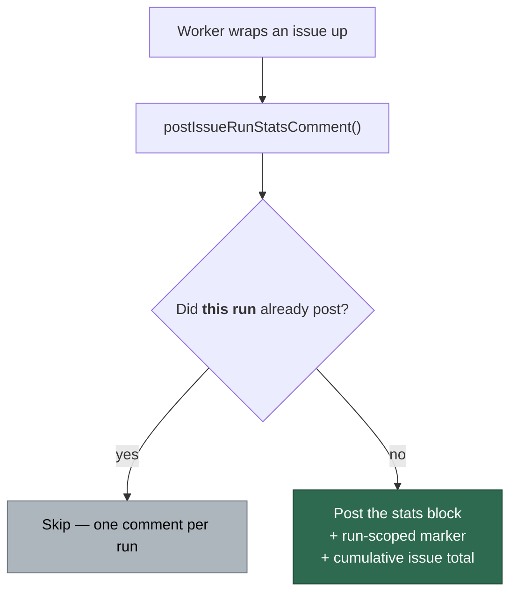

# Report cost per run, not once per issue

## Summary

Cost estimates were invisible on the issues that mattered most. The
Issue #3756 run-stats guard was **issue-scoped**: the first wrap-up to reach an
issue posted its `## <Phase> run model stats` comment, and every later run was
skipped as a duplicate. On
[#762](https://github.com/stSoftwareAU/VibeCoder/issues/762) the winner was a
$1.34 grill-me round, so the `work-on` run that actually completed the issue —
16 follow-up issues plus a PR — reported no figures at all. That is the gap this
issue reported.

The guard is now **run-scoped**: the hidden marker carries the run id
(`<!-- vibe-issue-run-stats run="vibe-…" -->`) and a post is suppressed only
when *this* run already posted. A repeat post inside one run is still
suppressed, but every completed run reports what it cost. From the second
stats comment onward the block also carries a cumulative
`**Issue total across N run-stats comments:** ~$X` line, so the cost of the
issue is readable without adding the comments up by hand — a comment with no
parseable figure marks the total `(partial)` rather than letting an
understated sum read as complete.

Closes #797.

## Evidence

Backend/CLI change — there is no web interface to screenshot. The evidence is
the test suite below plus the rendered comment body produced by
`buildIssueRunStatsComment`, captured from the test run:

```markdown
<!-- vibe-issue-run-stats run="vibe-run-two" -->
## Issue run model stats

- **Requested model:** `opus`
- **Served model(s):** `claude-opus-4-8`
- **Issue invocations:** 1
- **Tokens:** input 1,000 · output 2,000 · cache write 100 · cache read 50
- **Prompt cache:** 4.3% (read 50 · write 100 · uncached 1,000)
- **Estimated cost (USD, estimate only):** ~$0.0556
  - `claude-opus-4-8`: $0.0556 — input $0.0050 · output $0.0500 · cache write $0.0006 · cache read $0.0000
- **Degraded:** no
- **Issue total across 2 run-stats comments:** ~$0.1669

_Estimate only — this block covers the run that posted it. The issue total sums
the run-stats comments visible on this issue; runs that reported no figures are
not included._
```

What changed in the wrap-up decision:



Security note: the run id is interpolated into an HTML comment, so it is
sanitised to `[A-Za-z0-9._-]` (capped at 64 chars) before use — a malformed or
hostile `VIBE_RUN_ID` cannot close the marker early or inject markup.

## Test Plan

Added to `worker/deno/tests/issue_run_stats_comment_test.ts`:

- `buildIssueRunStatsComment - marker is run-scoped (Issue #797)`
- `buildIssueRunStatsComment - adds the cumulative issue total from the second comment on`
  (also asserts a third run does not double-count the earlier total line)
- `sanitiseStatsRunId - a run id can never break out of the marker`
- `postIssueRunStatsComment - an earlier run's comment no longer hides this run's cost (Issue #797)`
  — the regression test for the #762 shape
- `postIssueRunStatsComment - a legacy planning stats comment does not suppress this run`
- `tallyIssueCost` cases: summing, ignoring non-stats comments, partial/unpriced
  runs, thousands separators

Added elsewhere:

- `worker/deno/tests/completion_phase_run_stats_test.ts` — `completion - reports
  this run's cost even when an earlier run already posted (Issue #797)`
- `worker/deno/tests/grill_me_run_stats_test.ts` — `an earlier round's stats
  comment does not hide this round's cost (Issue #797)`
- `worker/deno/tests/phase_run_stats_test.ts` — the same case for each of
  `refinement`, `revision`, `question`, `clarification`

Modified (documented business-logic change — the guard moved from issue-scoped
to run-scoped, so the fixtures now use a same-run marker to assert suppression):

- `postIssueRunStatsComment - skips when this run already posted` (was "skips
  when a stats comment already exists")
- `completion - skips when this run already posted its stats comment`
- `reportGrillMeDegradation - healthy round posts at most one stats comment per
  run`
- `reportPhaseDegradation - <phase>: healthy round skips a second stats comment
  for the same run`

No test was removed or commented out. Documentation updated in
`docs/MODEL-AND-CACHING.md` (section renamed to "One cost/model stats comment
per run", diagram and anchors updated) and `DESIGN-PRINCIPLES.md`.
