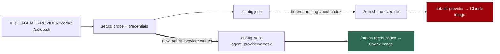

# Setup writes the coding-agent selection it was given

## Summary

On a fresh host there is no `.config.json`, so the coding-agent selection has
to come from the environment — `VIBE_AGENT_PROVIDER=codex ./setup.sh`, exactly
as `docs/SETUP.md` documents. That worked for the run: the `claude`
prerequisite stopped being host-fatal and only the Codex credential flow was
prompted (#730).

Setup never wrote it down. `agent_provider` / `agent_providers` were read
(`setup/agent_providers.ts`) and never written (`setup/config_setup.ts`), so
the file setup left behind on a Codex host said nothing about Codex. The next
command is `./run.sh`, in a shell with no override: it resolved the default,
and since #729 the launcher builds the image from that same set, so a
Codex-only deployment got a **Claude image**.

`mergeNonInteractive` now persists what the operator declared:
`VIBE_AGENT_PROVIDER` → `agent_provider`, `VIBE_AGENT_PROVIDERS` →
`agent_providers`. A host declares its agent once, on its first `./setup.sh`,
and every later command reads it from the file — which is where
`docs/CONFIGURATION.md` has always said the selection lives.

Only what was declared is written. `agent_provider` alone already resolves to
a one-provider set (`resolveEnabledAgentProviderIds`), so inventing an
`agent_providers` beside it would be setup guessing at a selection the
operator did not make. An unregistered id is refused at setup time rather than
written: a `.config.json` naming a provider nothing can run breaks every later
command, and the operator is standing right there.

Closes #799.

## Evidence

Configuration change with no web surface to screenshot. The evidence is the
round trip: what setup writes, read back by the resolver every later command
uses.

Where the selection went:



Red before, green after — the persistence block removed, then restored:

```
# unfixed
setup - VIBE_AGENT_PROVIDER is written into the configuration (Issue #799) ... FAILED
setup - VIBE_AGENT_PROVIDERS is written as the enabled set (Issue #799) ... FAILED
setup - the written file makes a Codex host Codex-only (Issue #799) ... FAILED
setup - a later declaration replaces the stored one (Issue #799) ... FAILED
setup - an unregistered provider is refused, not written (Issue #799) ... FAILED
FAILED | 2 passed | 5 failed

# fixed
ok | 7 passed | 0 failed
```

The two that pass either way are the ones that must: a host declaring nothing
writes nothing, and an existing selection survives a run that declares none —
`.config.json` is rewritten on every `./setup.sh`, so a first-run selection
must not be destroyed by the second.

```
ok | 147 passed | 0 failed   # the new suite plus setup_config_setup,
                             # setup_config_preservation, setup_config_writer,
                             # setup_agent_provider_gating, config_unknown_keys
```

`deno fmt --check` (2019 files), `deno lint` (2013 files), `deno check` over
every file in `worker/deno/tests` (0 errors) and markdownlint are clean.

## Reproduction

- **symptom** — `VIBE_AGENT_PROVIDER=codex ./setup.sh` on a fresh host writes a
  `.config.json` that says nothing about Codex; the next `./run.sh` resolves
  the default and builds a Claude image for a Codex-only deployment
- **status** — `verified` — the written file is resolved back through
  `resolveSetupAgentProviderIds` with the provider environment cleared, and
  answers `["codex"]`; watched failing (5 of 7) with the persistence block
  removed
- **regression test** —
  `worker/deno/tests/setup_agent_provider_persist_test.ts::setup - the written file makes a Codex host Codex-only (Issue #799)`

## Acceptance Criteria

This issue states no `## Acceptance Criteria` block; its "What a fix looks
like" and the two #736 criteria it names are answered here. Judged in an
operator review of the whole diff, not by reviewer sub-agents.

- **met** — *"setup.sh should write the selection it resolved into the
  configuration it writes"* — evidence:
  `worker/deno/setup/config_setup.ts` `mergeNonInteractive`;
  `::setup - VIBE_AGENT_PROVIDER is written into the configuration (Issue #799)`
  and `::setup - VIBE_AGENT_PROVIDERS is written as the enabled set (Issue #799)`
- **met** — *"A host then needs the override exactly once, on its first
  setup"* — evidence:
  `::setup - the written file makes a Codex host Codex-only (Issue #799)`
  resolves the written file with the provider environment cleared, and
  `::setup - an existing selection survives a run that declares none (Issue #799)`
  proves the second `./setup.sh` does not undo the first
- **met** — #736's *".config.json is written by setup, not by hand"* — evidence:
  the same round-trip case; nothing is hand-edited
- **partial** — #736's *"the built image reports `codex` in
  `VIBE_IMAGE_AGENT_PROVIDERS` and has the Codex CLI"* — evidence: the
  launcher builds from the resolved set (#729), and the set now resolves to
  `codex` from the file — reason: no image was built here. That criterion is
  #736's to verify on the #721 host; this change removes the defect that would
  have failed it
- **unrequested** — an unregistered provider id is refused at setup time —
  reason: setup is now a *writer* of this key, and writing an id nothing can
  run would move a loud startup failure to every later command instead of the
  moment the operator typed it. `resolveAgentProvider` already throws with the
  supported ids named; this only calls it
- **unrequested** — the `docs/SETUP.md` and `docs/CONFIGURATION.md` sentences
  — reason: the standards' "a code change owes a docs change" rule. Both
  documented the override as a per-run thing, which is precisely the belief
  this defect came from

**Not done, deliberately:** the issue offers *"or an interactive prompt asks
which agent this host runs"* as an alternative. Setup is non-interactive by
design (`config_setup.ts` header, Issue #269) and the environment declaration
is already documented; adding a prompt is a separate decision about the
onboarding flow, not part of persisting what was declared.

## Standards Review

- **clean** — Australian English throughout; the new block carries a comment
  explaining the defect it closes and why only what was declared is written;
  fail-loud on an unregistered id, asserted; no existing test weakened or
  removed; both docs surfaces updated in the same change
- **clean** — the write rides the existing passthrough in `buildOverridesOnly`
  (Issue #4033) rather than adding a second write path, and both keys were
  already in `KNOWN_CONFIG_KEYS`, so nothing else had to change
- **violation** — `config_setup.ts` now imports from `lib/agent_provider.ts`,
  which is a larger module than this file's other imports — evidence:
  `worker/deno/setup/config_setup.ts` — reason: stands. The alternative is a
  second list of valid provider ids in setup, which is the drift this
  repository keeps removing; the provider registry is the single source and
  `resolveAgentProvider` is its published check

## Test Plan

Added `worker/deno/tests/setup_agent_provider_persist_test.ts` (7 tests):

- `setup - VIBE_AGENT_PROVIDER is written into the configuration (Issue #799)`
- `setup - VIBE_AGENT_PROVIDERS is written as the enabled set (Issue #799)`
- `setup - the written file makes a Codex host Codex-only (Issue #799)` — the
  round trip, with the provider environment cleared.
- `setup - a host that declares nothing writes nothing (Issue #799)`
- `setup - an existing selection survives a run that declares none (Issue #799)`
- `setup - a later declaration replaces the stored one (Issue #799)`
- `setup - an unregistered provider is refused, not written (Issue #799)`

No existing test was modified.
