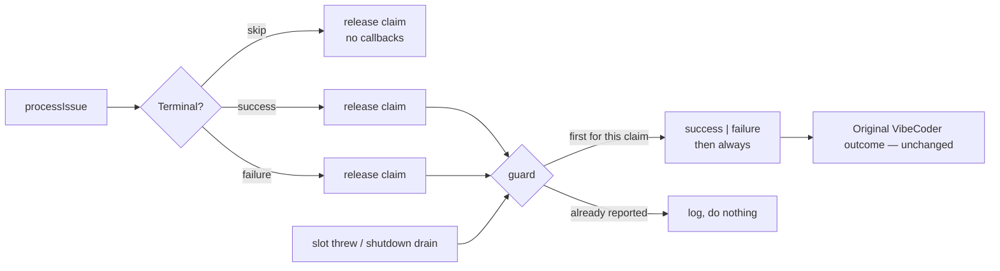

## Summary

Adds the public post-run callback contract: optional `success` / `failure` /
`always` executables the worker runs after a terminal issue run, following
Jenkins `post { … }` and Azure Pipelines `succeeded() / failed() / always()`
semantics. It is the extension point fleet-specific reporting hangs off, so no
private health or archival policy has to live in VibeCoder. Closes #806.

What landed:

- **`lib/run_callbacks_config.ts`** — the `.config.json` `callbacks` block.
  Every hook optional; absolute POSIX executable paths only; a malformed block
  fails the config load rather than leaving a hook that silently never runs.
- **`lib/run_callbacks.ts`** — the runner. Direct spawn (no shell), bounded by
  `timeout_seconds`, output captured/redacted/truncated, `always` after the
  outcome hook in every case, and never a rewrite of the run's own result.
- **`lib/run_callback_context.ts`** / **`lib/run_callback_telemetry.ts`** — the
  versioned context: run id, result, repository, issue, host/worker, provider,
  session id, verified transcript path, timestamps, duration, exit code and
  token/cost telemetry. Unknown facts are omitted, never guessed.
- **`lib/issue_callback_guard.ts`** — the exactly-once chokepoint shared by the
  claim release, the slot-level catch and the shutdown drain.
- **`lib/run_core.ts` / `lib/run_core_production_deps.ts`** — dispatch at every
  terminal issue run in both the serial loop and the slot pool; never on a skip.

A configuration without a `callbacks` block behaves exactly as before.

## Evidence

Backend/CLI change with no web interface, so no screenshot applies. The
evidence is the test suite below plus the quality gate.



Targeted runs (all green):

```text
tests/run_callbacks_test.ts               25 passed
tests/run_callbacks_config_test.ts        18 passed
tests/run_callbacks_integration_test.ts   10 passed
tests/run_callback_context_test.ts        13 passed
tests/run_callback_telemetry_test.ts       6 passed
tests/run_core_callbacks_test.ts          12 passed
tests/config_callbacks_test.ts             5 passed
tests/subprocess_timeout_test.ts          16 passed
```

`./quality.sh` reports PASSED for prompt immutability, benchmark audit,
mermaid, markdownlint, docs prompt versions, semgrep, `deno lint`,
`deno check` and `deno fmt`. The `deno tests` stage reports FAILED on this
host for **pre-existing, environmental** reasons unrelated to this change: the
`run_core_test.ts` / `run_core_rate_limit_resume_test.ts` fixtures make real
`gh` calls that hit `API rate limit already exceeded`, and the `setup_*` /
`service_account_env` / container-prerequisite suites assert host paths this
container does not have. Verified by running the same files on the untouched
base branch: **52 passed / 64 failed** and **58 passed / 3 failed** — byte-for-byte
identical counts on both branches. No new-test failure exists.

## Acceptance Criteria

<!-- vibe-spec-review inputs="diff+issue-body" -->

- **met** — Configuration parsing, validation and unknown-key handling are updated — evidence: `worker/deno/lib/run_callbacks_config.ts`, `worker/deno/lib/config_unknown_keys.ts:198`, `worker/deno/tests/config_callbacks_test.ts` — reviewer: met
- **met** — Relative-path behaviour is explicitly defined and consistent in native/container modes — evidence: `worker/deno/lib/run_callbacks_config.ts:94`, `worker/deno/tests/run_callbacks_config_test.ts::a relative path is rejected in every mode` — reviewer: partial — reason: the reviewer was right that the rule cited a `native` mode this codebase removed and said nothing about container visibility; fixed in this diff by dropping the dead Windows-path branch and restating the rule as "absolute POSIX path, resolved on the filesystem the worker process sees inside the container" in both the module and `docs/CONFIGURATION.md`
- **met** — Unit tests cover ordering, success, failure, hook failure, timeout, exception and concurrency — evidence: `worker/deno/tests/run_callbacks_test.ts`, `worker/deno/tests/run_core_callbacks_test.ts` — reviewer: met — reason: the reviewer's one gap (no shutdown/drain coverage) is now covered by `run_core_callbacks_test.ts::a throw after the run reported does not repeat the callbacks`
- **met** — Integration tests prove `always` runs exactly once and the original result is preserved — evidence: `worker/deno/tests/run_callbacks_integration_test.ts::a successful run runs success then always, exactly once`, `::always runs exactly once after a failing outcome hook` — reviewer: met
- **met** — No GRQ-specific names, repository URLs, filesystem paths or health/logging policy enter the public repository — evidence: `git diff | grep -i 'GRQ\|private-repo-6\|fleet_health'` returns nothing — reviewer: met — reason: the reviewer's one nit (external fleet policy quoted as rationale in `run_callbacks_config.ts`) is removed in this diff
- **met** — Run `success` only after a terminal successful issue run — evidence: `worker/deno/lib/run_callbacks.ts` ordering, `worker/deno/tests/run_core_callbacks_test.ts::a successful run reports a success terminal run` — reviewer: met
- **met** — Run `failure` only after a terminal failed issue run — evidence: `worker/deno/lib/run_core.ts` (`runStarted` flag set on entry to `processIssue`), `worker/deno/tests/run_core_callbacks_test.ts::a throw before the run starts reports nothing` — reviewer: partial — reason: the reviewer found the slot catch firing `failure` for throws before the claim ever ran; fixed in this diff
- **met** — Run `always` after the applicable outcome callback in both cases — evidence: `worker/deno/tests/run_callbacks_integration_test.ts:88`, `:111` — reviewer: met
- **met** — A missing hook is a no-op — evidence: `worker/deno/tests/run_callbacks_test.ts::a missing outcome hook still runs always` — reviewer: met
- **met** — Invoke the configured executable directly; no `sh -c` — evidence: `worker/deno/lib/run_callbacks.ts` (`run(path, [], …)`), `worker/deno/tests/run_callbacks_integration_test.ts::a non-executable path is reported, never run through a shell` — reviewer: met
- **partial** — Bound every callback with a configurable/default timeout — evidence: `worker/deno/lib/run_callbacks_config.ts:47`, `worker/deno/tests/run_callbacks_integration_test.ts::a hanging outcome hook is terminated` — reviewer: partial — reason: termination is `SIGTERM` with no `SIGKILL` escalation, so a hook that traps `SIGTERM` or forks a pipe-holding child can outlive it; the behaviour and the obligation on hook authors are now stated in `docs/CONFIGURATION.md`, and process-tree escalation is left out as separate work
- **met** — Capture and clearly log callback stdout, stderr, exit code and timeout — evidence: `worker/deno/lib/subprocess_timeout.ts` (`captureOutputOnTimeout`), `worker/deno/tests/run_callbacks_integration_test.ts::a hanging outcome hook is terminated and always still runs` — reviewer: partial — reason: the reviewer found a timed-out hook's output was discarded by `runWithTimeout`; fixed in this diff behind an opt-in flag so no other caller changes
- **met** — A callback failure must never rewrite the original VibeCoder outcome — evidence: `worker/deno/tests/run_core_callbacks_test.ts::a callback fault never changes the run's outcome` — reviewer: met
- **met** — `always` must still run when the outcome callback fails — evidence: `worker/deno/tests/run_callbacks_test.ts::always still runs when the outcome hook exits non-zero`, `::times out`, `::cannot be spawned` — reviewer: met
- **met** — A shutdown or exception after a claim must take the failure/always path exactly once — evidence: `worker/deno/lib/issue_callback_guard.ts`, `worker/deno/tests/run_callback_context_test.ts::the first claim wins and later ones are refused`, `worker/deno/tests/run_core_callbacks_test.ts::a throw after the run reported does not repeat the callbacks` — reviewer: partial — reason: the reviewer found two double-fire paths (a throw after the release, and the drain racing an abandoned slot); fixed in this diff with a shared per-cycle guard
- **met** — Skipped/unclaimed scan cycles do not invoke issue-run callbacks — evidence: `worker/deno/tests/run_core_callbacks_test.ts::a skipped issue reports no terminal run`, `::a throw before the run starts reports nothing` — reviewer: partial — reason: same pre-claim-throw defect as above; fixed in this diff
- **met** — Concurrent issue slots receive isolated callback contexts — evidence: `worker/deno/tests/run_core_callbacks_test.ts::concurrent slots report isolated terminal runs`, `worker/deno/tests/run_callbacks_integration_test.ts::concurrent runs give each hook its own context` — reviewer: partial — reason: the reviewer found the shared session-id map could serve a stale id to a later claim; fixed in this diff by clearing the entry on a release that has no session
- **met** — Versioned JSON context file and documented environment variables with every listed field — evidence: `worker/deno/lib/run_callback_context.ts`, `worker/deno/tests/run_callbacks_test.ts::the environment carries the documented scalars`, `docs/CONFIGURATION.md` — reviewer: met
- **met** — Never place credentials, prompts or transcript contents in environment variables — evidence: `worker/deno/tests/run_callbacks_test.ts::only the inherited allowlist crosses from the worker`, `worker/deno/tests/run_callbacks_integration_test.ts::no worker credential reaches the hook environment` — reviewer: met
- **unrequested** — `MAX_CALLBACK_TIMEOUT_SECONDS` ceiling of one hour — reviewer: unrequested — reason: the issue asks for a bounded callback; an unbounded `timeout_seconds` would let a typo park a cycle for a day, and the bound is stated in the docs
- **unrequested** — A malformed `callbacks` block hard-fails the config load — reviewer: unrequested — reason: the repo's fail-loud standard, and the exact failure the contract exists to prevent (a hook nobody notices never ran)
- **unrequested** — Whitespace trimming of hook paths — reviewer: unrequested — reason: an operator-typed path with a trailing space would otherwise be rejected as non-existent rather than run
- **unrequested** — Session-id capture inside `releaseClaim` (one extra read per release, only when hooks are configured) — reviewer: unrequested — reason: the issue asks for "session ID when available", and the resume state that holds it is deleted by the release itself
- **unrequested** — A callback timeout records a worker fault event — reviewer: unrequested — reason: inherited from `runWithTimeout`; a hook that hangs is a genuine fault worth counting

## Standards Review

<!-- vibe-standards-review inputs="diff+CODING-STANDARDS.md" -->

- **violation** — Missing `docs/archive/pr-summaries/pr-summary-806.md` — evidence: `docs/archive/pr-summaries/` — reason: fixed — this file
- **violation** — Docs owed by the code change were left uncommitted — evidence: `docs/CONFIGURATION.md`, `README.md` — reason: fixed — committed in `a1da001`
- **violation** — Catch-and-ignore on the session-id read — evidence: `worker/deno/lib/run_core_production_deps.ts:3052` — reason: fixed — now warns with the fault and names the issue whose context loses the id
- **violation** — Catch-and-ignore on the context-file cleanup, leaking a file per invocation — evidence: `worker/deno/lib/run_callbacks.ts:311` — reason: fixed — a genuine removal failure is reported; only `NotFound` (a hook that moved it) is silent
- **violation** — The `callbacks` block was parsed twice, once for validation and once for the value — evidence: `worker/deno/lib/config.ts:301` — reason: fixed — a single `assertCallbacksConfig` at the assembly site is now the only producer
- **violation** — ~50 lines of new context-building logic inlined into a 3,991-line module — evidence: `worker/deno/lib/run_core_production_deps.ts:3119` — reason: fixed — extracted to `worker/deno/lib/run_callback_context.ts` with its own tests
- **violation** — `runWithTimeout`'s new `env` / `clearEnv` options had no unit coverage — evidence: `worker/deno/lib/subprocess_timeout.ts:57` — reason: fixed — five tests added to `worker/deno/tests/subprocess_timeout_test.ts`
- **violation** — `SECURITY.md`'s "Sinks already wired" register did not list the new redaction sink — evidence: `SECURITY.md:396` — reason: fixed — the callback stdout/stderr capture is now a row
- **violation** — Duplicate import statement from the same module — evidence: `worker/deno/tests/config_callbacks_test.ts:12` — reason: fixed — merged into one
- **violation** — The claim start time and the finish time can come from different clocks, and `Math.max(0, …)` turns a disagreement into `durationSeconds: 0` — evidence: `worker/deno/lib/run_callback_context.ts:93` — reason: stands — in production both are `Date.now()`, and a clamped zero is a better contract for a hook than a negative duration; the clamp is documented at the call site and covered by `run_callback_context_test.ts::a clock disagreement never yields a negative duration`
- **clean** — Australian English throughout (zero American spellings in the added lines); no hidden path, key or credential file staged; every test calls real code (`runCoreLoop`, `loadConfig`, real spawned executables) rather than grepping source; `Result<T, E>` used for parsing with throwing confined to the deliberate fail-loud entry point; redaction applied before truncation; each new lib module has its paired test file; both commits carry the issue reference and the run-id trailer; no `prompts/` file touched; all new logic is Deno TypeScript

## Test Plan

Added:

- `worker/deno/tests/run_callbacks_config_test.ts` — 18 tests: absent/empty/partial blocks, absolute-path enforcement, NUL and non-string rejection, unknown keys inside the block, timeout bounds, throwing entry point.
- `worker/deno/tests/run_callbacks_test.ts` — 25 tests: success/failure ordering, `always` after a hook that failed, timed out or could not be spawned, missing-hook no-ops, direct spawn with no arguments, per-hook timeout, cleared child environment, redaction and truncation, the context document and every environment scalar, and concurrent isolation.
- `worker/deno/tests/run_callbacks_integration_test.ts` — 10 tests against **real** executables: `always` exactly once on both outcomes, the original result preserved through a failing hook, a hanging hook terminated with its output kept, a missing and a non-executable path, the context file readable then removed, no worker credential in the child environment, and two concurrent runs each seeing their own context.
- `worker/deno/tests/run_callback_context_test.ts` — 13 tests: required fields, exit-code mapping, the duration clamp, omission of blank optional facts, transcript-path verification, and the exactly-once guard.
- `worker/deno/tests/run_callback_telemetry_test.ts` — 6 tests: no-usage runs, summing across invocations, priced and unpriced models, served-model fallback.
- `worker/deno/tests/run_core_callbacks_test.ts` — 12 tests driving the real `runCoreLoop`: the outcome split, no dispatch on a skip, exactly one per claim, exceptions before and after the run, telemetry pass-through, wall-clock bounds, a callback fault leaving the run's bookkeeping intact, concurrent-slot isolation, and an unwired deps object.
- `worker/deno/tests/config_callbacks_test.ts` — 5 tests: default (no hooks), configured hooks reaching `WorkerConfig`, and config-load failures for a relative path and an unknown key.

Modified:

- `worker/deno/tests/subprocess_timeout_test.ts` — 5 tests added for `env`, `clearEnv`, inherited environment, and timeout output capture on and off.

No existing test was removed or commented out.
