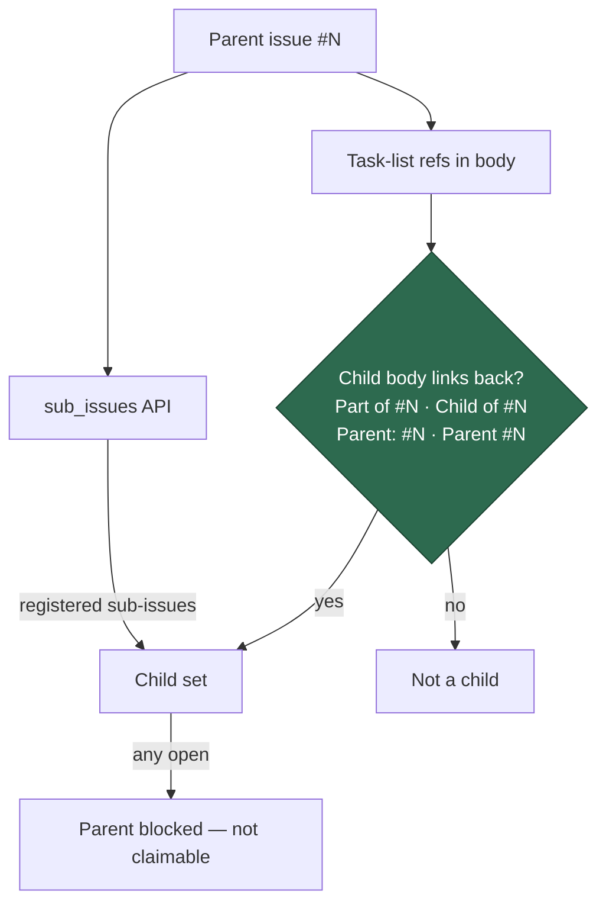

# Parent gate: accept `Parent: #N` back-references

## Summary

`hasBackReference` (`worker/deno/lib/issue_dependencies.ts`) only accepted
`part of #N` and `child of #N`, so a task-list child that writes its link as
`Parent: #796` — the form the fleet actually writes — was never confirmed as a
child. With the sub-issues API also returning `[]` (the children were linked as
markdown, never registered as native sub-issues), `checkParentBlocked` saw an
empty child set and reported the epic as "not blocked", so #796 was claimed
while all four of its children were open.

The back-reference vocabulary now also accepts `Parent: #N` and `Parent #N`,
matching the pattern `listSubIssuesViaIssueList` already applies in
`planning_processor.ts`. The match stays anchored — `parent` must be followed
directly by the reference, so a passing mention such as "the parent of #100 is
unclear" creates no child edge — and the existing code-span/fenced-block
stripping (`stripCodeSpans`) still runs first, so a `Parent: #N` quoted in a
documentation snippet is ignored. The dynamic `new RegExp` built from the
caller's parent number is gone: a static pattern captures the number and it is
compared numerically.

Closes #809.

## Evidence

Backend/CLI change with no web interface, so there is nothing to screenshot.
The evidence is the regression suite:

```text
$ cd worker/deno && deno test --allow-all tests/issue_dependencies_test.ts
ok | 85 passed | 0 failed (91ms)
```

Child-detection paths after the change:



## Reproduction

- **symptom** — parent #796 was claimed and handed to an issue-work run while
  its four children (#805–#808) were open, because each child wrote its link as
  `Parent: #796` and the parent gate matched only `part of` / `child of`
- **status** — `verified` — with `worker/deno/lib/issue_dependencies.ts`
  restored to its `origin/main` state the new tests ran red
  (`5 passed | 5 failed`, including
  `checkParentBlocked - blocked when children only say 'Parent: #N'`), and all
  85 tests pass with the fix applied
- **regression test** —
  `worker/deno/tests/issue_dependencies_test.ts::checkParentBlocked - blocked when children only say 'Parent: #N' (Issue #809)`

## Test Plan

Added to `worker/deno/tests/issue_dependencies_test.ts`:

- `hasBackReference - detects 'Parent: #N' (Issue #809)`
- `hasBackReference - detects 'Parent #N' without a colon (Issue #809)`
- `hasBackReference - 'Parent:' matching is case insensitive (Issue #809)`
- `hasBackReference - a passing 'parent of #N' mention is not a back-reference (Issue #809)`
- `hasBackReference - does not match a longer word ending in 'parent' (Issue #809)`
- `hasBackReference - 'Parent: #N' still respects the number boundary (Issue #809)`
- `hasBackReference - finds the parent link past an earlier unrelated link (Issue #809)`
- `hasBackReference - ignores a parent link inside a fenced code block (Issue #809)`
- `hasBackReference - ignores a parent link inside an inline code span (Issue #809)`
- `checkParentBlocked - blocked when children only say 'Parent: #N' (Issue #809)`
  — reproduces the #796 shape: no native sub-issues, four task-list children,
  three open and one closed

Existing tests in the file were left unchanged and all still pass.

Docs: `docs/workflows/projects-and-dependencies.md` now states the accepted
back-reference wording and that a passing mention does not count.
