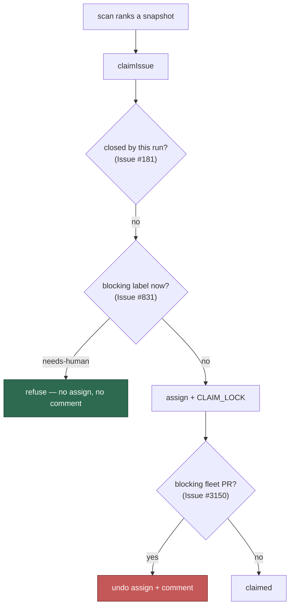

# A blocking label applied since the snapshot refuses the claim

## Summary

The worker claimed `#793` six minutes after parking it for a human:

```
21:47:14  unlabeled grill-me      by VibeCoderST   ← grill-me round completes
21:47:16  labeled   needs-human   by VibeCoderST   ← …and parks it
21:47:28  unassigned VibeCoderST
21:53:31  assigned   VibeCoderST                   ← claimed anyway
21:53:32  CLAIM_LOCK comment
21:53:39  unassigned VibeCoderST                   ← released 8s later
```

Discovery is not missing the label. `filterAndSort` has `needsHumanLabel` in
its blocking set (`issue_filter.ts:192`). The gap is **timing**: discovery
ranks a snapshot of the issue list, and nothing re-read the labels at claim
time.

`claim_issue.ts` already carries the two neighbouring guards for this exact
class of staleness — a refusal for an issue *this run closed* (Issue #181,
because "the scan only offered it because the issue list it ranked (600 s TTL)
was written before the close") and a live, cache-bypassing re-check for a
blocking fleet **PR** opened in that window (Issue #3150). There was no
equivalent for a blocking **label**.

`liveBlockingLabelRecheck` adds it, running **before** the assignment, so a
parked issue collects neither an assignee nor a `CLAIM_LOCK` comment. It fails
open on any read error, matching the open-PR re-check's contract.

**Scoped to `needs-human` alone, deliberately.** The specialist processors
claim exactly the labels the discovery blocking set excludes: `question`,
`planning`, `refine-issue`, `needs-revision`, `grill-me` and `quorum` are each
some processor's pickup signal, so defaulting to the whole set would have
stopped every one of those phases. `needs-human` is the one label no processor
claims on — all eight call sites only ever apply it.

Closes #831.

## Evidence

Worker-behaviour change with no web surface to screenshot. The evidence is the
suite, driven through the real `claimIssue` with only `gh` replaced.



The new guard sits where #181 does — before the mutation — rather than where
#3150 does, because a label is readable without winning the claim race, so
there is no reason to assign first and undo.

Red before, green after:

```
# unfixed
FAILED | 3 passed | 4 failed

# fixed
ok | 7 passed | 0 failed
```

```
ok | 279 passed | 0 failed   # every claim suite in the tree
```

`deno fmt --check` (2047 files), `deno lint` (2041 files) and `deno check` over
every file in `worker/deno/tests` (0 errors) all pass.

## Reproduction

- **symptom** — an issue the worker has just parked with `needs-human` is
  claimed by a later scan in the same cycle: it assigns itself and posts a
  `CLAIM_LOCK` comment before releasing
- **status** — `verified` — reproduced as a unit case against the real
  `claimIssue` (`#793`'s repo, number, worker id and label set), watched
  failing on four of seven cases before the guard existed
- **regression test** —
  `worker/deno/tests/claim_blocking_label_recheck_test.ts::claim - needs-human applied since the snapshot refuses the claim (Issue #831)`
  and `::claim - a refused claim assigns nobody and comments nowhere (Issue #831)`

## Acceptance Criteria

The issue states no `## Acceptance Criteria` block — it is a one-line report
with a link. Closing out what it asks for, judged in an operator review of the
whole diff.

- **met** — the worker stops claiming issues labelled `needs-human` —
  evidence: `::needs-human applied since the snapshot refuses the claim
  (Issue #831)`; the reason is a distinct `blocking_label`, so the refusal is
  greppable in the worker log rather than lost among the other aborts
- **met** — nothing is written to a parked issue — evidence:
  `::a refused claim assigns nobody and comments nowhere (Issue #831)` asserts
  no `--add-assignee` and no `issue comment` reaches `gh`. This is why the
  guard runs before the mutation instead of beside the #3150 re-check
- **met** — a claimable issue is still claimed — evidence:
  `::an issue with no blocking label proceeds past the check (Issue #831)`
- **met** — a `gh` failure does not withhold a legitimate claim — evidence:
  `::the label read fails open (Issue #831)`, matching the fail-open contract
  the open-PR re-check documents

- **unrequested** — the default is `needs-human` **only** — reason: this is the
  decision that keeps the fix from breaking six phases. The obvious
  implementation — reuse the discovery blocking set — would refuse every
  `question`, `planning`, `refine-issue`, `needs-revision`, `grill-me` and
  `quorum` claim, because those labels *are* those processors' pickup signals.
  `::the default blocks needs-human and nothing else (Issue #831)` walks all
  seven and asserts each is still claimable, so a later widening of the default
  fails loudly here rather than silently halting a phase
- **unrequested** — `blockingLabels` is exposed as an option — reason: the
  narrow default is right for today, and a deployment that wants more should
  not have to patch the module. It also makes the "nothing else is blocked"
  case above testable without reaching into module internals
- **unrequested** — the match is case-insensitive — reason: GitHub treats label
  names case-insensitively, and `label_security.ts` already lower-cases before
  comparing for exactly that reason (Issue #3088). A `Needs-Human` would
  otherwise walk straight through

## Standards Review

- **clean** — Australian English throughout; the new function carries a
  docblock naming the defect, the two guards it sits beside, and why it runs
  before the mutation; fail-loud on the refusal (a distinct reason and a
  `console.warn` naming the label) and fail-open on the read, both asserted
- **clean** — the guard is placed by the same reasoning as its neighbours
  rather than copied next to one of them: #181 refuses before any API call
  because it needs no I/O, #3150 must assign first because winning the race is
  what makes the PR check meaningful, and a label read needs neither — so it
  goes before the mutation
- **violation** — the check spends one extra `gh issue view` per claim attempt
  — evidence: `liveBlockingLabelRecheck` — reason: stands. It is one read on a
  path that already spends several, it happens once per *claim* rather than per
  candidate, and the alternative is what this issue reports: an assignment and
  a comment written to an issue a person has taken back
- **clean** — no discovery behaviour changed: `filterAndSort` and every
  collector are untouched, so this adds a late guard rather than moving where
  the exclusion lives

## Test Plan

Added `worker/deno/tests/claim_blocking_label_recheck_test.ts` (7 tests):

- `claim - needs-human applied since the snapshot refuses the claim (Issue #831)`
- `claim - a refused claim assigns nobody and comments nowhere (Issue #831)`
- `claim - an issue with no blocking label proceeds past the check (Issue #831)`
- `claim - the label read fails open (Issue #831)`
- `claim - the default blocks needs-human and nothing else (Issue #831)`
- `claim - an explicit blockingLabels set is honoured (Issue #831)`
- `claim - the label match is case-insensitive (Issue #831)`

No existing test was modified.
