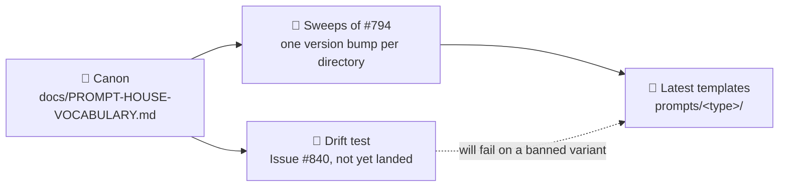

# Record the prompt house vocabulary

## Summary

Adds `docs/PROMPT-HOUSE-VOCABULARY.md` — one house form per drifted term and per
shared section heading across the 33 prompt templates, each with its banned
variants and the evidence that decided it. No file under `prompts/` is touched:
the page is the agreement the sweep sub-issues of #794 apply and the drift test
(#840) will read. Pointer rows added from `docs/PROMPTS.md`,
`docs/PROMPT-BEST-PRACTICES-CHECKLIST.md`, the README documentation table and
`_data/page_titles.yml`. Closes #834.

Every count in the page was re-derived from the latest template of each of the
33 directories at `4051c6d`. Three counts carried over from the interrupted run
were wrong and are corrected here: the finding-ID recipe is 9×H2 against 6×H3
(not 10/5), seven interactive templates open with a mode heading (not six), and
the spaced product name has 21 prose uses (not "two dozen"). The issue body's
"9 say the executor" is 10 on disk, and the page records 10.

## Evidence

Backend/docs change — no web interface to screenshot. Evidence is the test run
and the gate:

- `deno test --allow-read tests/prompt_house_vocabulary_doc_test.ts` — 16
  passed, 0 failed.
- `./quality.sh` — passes (full gate, run in the foreground).
- `git diff --name-only 4051c6d...HEAD -- prompts/` — empty, so the
  no-template-edits constraint holds.

## Acceptance Criteria

<!-- vibe-spec-review inputs="diff+issue-body" -->

- **met** — `docs/PROMPT-HOUSE-VOCABULARY.md` exists and records every row with
  house form, banned variants and rationale — evidence:
  `worker/deno/tests/prompt_house_vocabulary_doc_test.ts::terminology table
  records every drifted term`, `::scan-family headings record house form and
  banned variants`, `::interactive-family headings record house form and banned
  variants` — reviewer: met
- **met** — the deliberate-exceptions section names the checklist's `Optimize`
  and `Minimizing` rows explicitly — evidence:
  `worker/deno/tests/prompt_house_vocabulary_doc_test.ts::the deliberate
  exceptions name the checklist's American spellings` — reviewer: met
- **met** — `docs/PROMPTS.md` and `docs/PROMPT-BEST-PRACTICES-CHECKLIST.md` each
  link to it — evidence:
  `worker/deno/tests/prompt_house_vocabulary_doc_test.ts::the pointer documents
  link to the vocabulary` — reviewer: met
- **met** — every `prompts/<type>/vN` reference satisfies the docs
  prompt-version freshness check — evidence: the page cites directories only
  (`prompts/best_practices/`), so `docs_prompt_version_check.ts` has zero
  references to judge — reviewer: met
- **met** — `./quality.sh` passes — evidence: full gate run in the foreground
  after the final edit — reviewer: not assessed (run separately) — reason: the
  reviewer saw only the diff; the gate was run here and passed
- **met** — no file under `prompts/` is modified — evidence:
  `git diff --name-only 4051c6d...HEAD -- prompts/` is empty — reviewer: met
- **unrequested** — `worker/deno/tests/prompt_house_vocabulary_doc_test.ts` —
  reviewer: unrequested — reason: the issue defers the *drift* test to #840;
  this one pins the document's own completeness (every row has a rationale, the
  family lists partition the directories on disk, the recorded suppression
  keywords really parse to the families claimed), which is what the repo's TDD
  standard requires of a deliverable this branch ships.
- **unrequested** — the `## Families` taxonomy, `## Scope` and `## Changing the
  canon` sections — reviewer: unrequested (defensible) — reason: the interactive
  heading table has to say which directories it binds, and the issue defines
  only the scan family.
- **unrequested** — `README.md` documentation-table row and
  `_data/page_titles.yml` entry — reviewer: traceable, not creep — reason: both
  are the repo's index surfaces for a published `docs/` page.
- **unrequested** — `docs/archive/handover/issue-834.md` — reviewer:
  unrequested — reason: worker-authored handover note carried in by the
  preserved-WIP commit `d98ee10`; it is the documented resume mechanism
  (Issue #769/#771) and merged PRs already carry these, so it stands.

The reviewer also found one factual error, now fixed: the Worked Examples
counts were taken over all 33 templates while the row binds the interactive
twelve — `## Worked Examples` is 1 inside the family, the second being the
injected fragment `prompts/coding_guidelines/`. The Phase 4 row now says why
4 + 10 ≠ 15 (`prompts/retro/` has no filing phase at Phase 4).

## Standards Review

<!-- vibe-standards-review inputs="diff+CODING-STANDARDS.md" -->

- **violation** — the page stated present-tense that a drift test enforces the
  canon, when no such test exists yet — evidence:
  `docs/PROMPT-HOUSE-VOCABULARY.md:9` — reason: fixed here. The page, the
  Mermaid node and "Changing the canon" now say #840 has not landed and that a
  banned variant fails nothing today — a claimed gate that does not run is the
  silent-success failure the standards forbid.
- **violation** — `row.rationale.length >= 20` is the line-count style of
  assertion the TDD standard bans — evidence:
  `worker/deno/tests/prompt_house_vocabulary_doc_test.ts:167` (pre-fix) —
  reason: fixed here; replaced by `assertHasRationale()`, which fails on an
  empty or placeholder `Why` cell rather than measuring prose volume.
- **violation** — most assertions read a Markdown file rather than calling a
  `lib/` module, unlike the sanctioned `bucket_docs_check.ts` pattern —
  evidence: `worker/deno/tests/prompt_house_vocabulary_doc_test.ts:162` —
  reason: stands. The deliverable of #834 *is* a document, and the enforcement
  module belongs to #840, which owns the drift gate; adding a second `lib/`
  checker here would collide with it. The parts that can call real code do —
  `getLatestVersion()`/`loadPrompt()` resolve every template, `findSuppressions()`
  parses a marker per keyword, and the family lists are compared against the
  directories on disk.
- **violation** — the canon literals are restated in `TERMINOLOGY`,
  `SCAN_HEADINGS` and `INTERACTIVE_HEADINGS`, so a canon edit touches two files
  (DRY) — evidence:
  `worker/deno/tests/prompt_house_vocabulary_doc_test.ts:153` — reason: stands,
  deliberately. Pinning literals against a document is how this repo guards
  agreed wording (`tests/phase_prompt_narration_test.ts` does the same against
  the templates); the second edit is the point, since it forces a canon change
  to be made on purpose.
- **violation** — no PR summary file at review time — evidence:
  `docs/archive/pr-summaries/pr-summary-834.md` — reason: fixed here; this file
  is it.
- **clean** — Australian English throughout (the only American spellings are the
  quoted Anthropic page titles the page records as a deliberate exception);
  commit safety (no hidden or credential paths staged); prompt immutability (no
  `prompts/**` file touched); Markdown conventions (markdownlint clean, page
  indexed in `README.md` and `_data/page_titles.yml`, H1 emoji matches the
  `page_icon`); Deno/TypeScript conventions (`deno lint`, `deno check`,
  `deno fmt --check` clean, `@std/assert` only, no wall-clock assertions).

## Test Plan

Added `worker/deno/tests/prompt_house_vocabulary_doc_test.ts` — 16 tests:

- terminology, scan-heading and interactive-heading tables each record every
  row with its banned variants, and every row carries a rationale;
- the product-name row records the repo-slug exemption;
- `## Why this scan exists` is recorded as a prompt-level section that stays;
- the four family lists partition every `prompts/<type>/` directory on disk, and
  the recorded scan-family size equals the number of latest templates carrying
  `Stable finding ID recipe` (resolved through `getLatestVersion()` and
  `loadPrompt()`, never a hard-coded `vN`);
- the attribution-footer citation and the finding-id placeholder forms are
  recorded;
- all three suppression keywords are recorded, and each parses through
  `findSuppressions()` to the family and id prefix the page claims;
- the `Optimize`/`Minimizing` exception is recorded *and* still true of
  `docs/PROMPT-BEST-PRACTICES-CHECKLIST.md`, so the exception cannot go stale;
- both pointer documents link the page.
