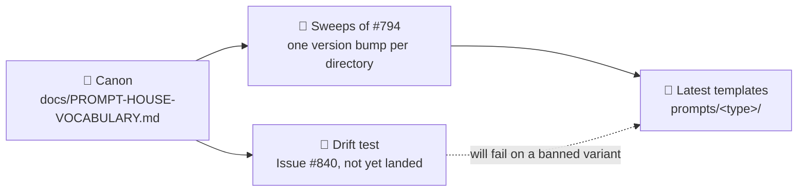

# Record the prompt house vocabulary

## Summary

Adds `docs/PROMPT-HOUSE-VOCABULARY.md` — one house form per drifted term and per
shared section heading across the 33 prompt templates, each with its banned
variants and the evidence that decided it. No file under `prompts/` is touched:
the page is the agreement the sweep sub-issues of #794 apply and the drift test
(#840) will read. Pointer rows added from `docs/PROMPTS.md`,
`docs/PROMPT-BEST-PRACTICES-CHECKLIST.md`, the README documentation table and
`_data/page_titles.yml`. Closes #834.

Counts in the page are the **audit baseline** — re-derived from the latest
template of each of the 33 directories at `4051c6d`, before any sweep landed.
Batch A and B of the sweeps have since merged into the milestone branch, which
this branch is now merged up to, so the minority counts are deliberately
historical: the page says so, because a shrinking minority is the canon working,
not the page rotting.

## Evidence

Backend/docs change — no web interface to screenshot. Evidence is the test run
and the gate:

- `deno test --allow-read tests/prompt_house_vocabulary_doc_test.ts` — 16
  passed, 0 failed, run against the post-merge tree.
- `npx markdownlint-cli2 docs/PROMPT-HOUSE-VOCABULARY.md` — `0 issues`.
- `./quality.sh` — run in the foreground after the final edit.
- `git log --oneline <base>..HEAD --no-merges` then `git show --stat` on each:
  no commit on this branch touches `prompts/`. Every `prompts/**` path in the
  three-dot diff arrives from the milestone merge.

### What the review changed

Two reviewer sub-agents, given only the diff, independently landed on the same
two defects. Both are fixed here:

- **The gate was red.** The reflowed "Changing the canon" paragraph put `#840`
  at column 1, which markdownlint reads as a broken ATX heading (MD018). It also
  failed `.github/workflows/markdown-lint.yml`, a required PR check.
- **The attribution-footer rule was factually wrong.** It claimed "from the
  Inputs section" is "where the worker substitutes it". The worker substitutes
  wherever the placeholder sits, and six of the seventeen templates carrying it
  hold it outside `## Inputs` — so the banned phrasing was accurate for those
  templates and the house form misdirected. The row now states that the citation
  and the placement are swept together, and scopes out the four lightweight
  audits that have no `## Inputs` section at all (a presence gap, Issue #841).

Chasing the first one surfaced a separate root cause, filed as
**#894**: `canRunBinary()` in `worker/deno/lib/markdownlint_check.ts:162`
probes with `markdownlint-cli2 --version`, which that tool treats as a glob —
it lints the repo and exits 1 on any violation. The local markdownlint stage
therefore reports `SKIPPED` **exactly when the repo is dirty**. Reproduced both
ways on this branch: with the MD018 error present the probe exited 1 and the
stage skipped; with it fixed the probe exits 0 and the stage runs. Out of scope
for #834, so filed rather than folded in.

## Acceptance Criteria

<!-- vibe-spec-review inputs="diff+issue-body" -->

- **met** — `docs/PROMPT-HOUSE-VOCABULARY.md` exists and records every row with
  house form, banned variants and rationale — evidence:
  `worker/deno/tests/prompt_house_vocabulary_doc_test.ts::terminology table
  records every drifted term`, `::scan-family headings record house form and
  banned variants`, `::interactive-family headings record house form and banned
  variants` — reviewer: met
- **met** — the deliberate-exceptions section names the checklist's `Optimize`
  and `Minimizing` rows explicitly — evidence:
  `worker/deno/tests/prompt_house_vocabulary_doc_test.ts::the deliberate
  exceptions name the checklist's American spellings` — reviewer: met
- **met** — `docs/PROMPTS.md` and `docs/PROMPT-BEST-PRACTICES-CHECKLIST.md` each
  link to it — evidence:
  `worker/deno/tests/prompt_house_vocabulary_doc_test.ts::the pointer documents
  link to the vocabulary` — reviewer: met
- **met** — every `prompts/<type>/vN` reference satisfies the docs
  prompt-version freshness check — evidence: the page cites directories only
  (`prompts/best_practices/`), so `docs_prompt_version_check.ts` has zero
  references to judge; the reviewer confirmed the gate stage reports
  `docs prompt versions: PASSED` — reviewer: met
- **met** — `./quality.sh` passes — evidence:
  `npx markdownlint-cli2 docs/PROMPT-HOUSE-VOCABULARY.md` now reports
  `0 issues`, and the full gate was run in the foreground after the final edit —
  reviewer: missing — reason: the reviewer was right at the time; it caught the
  MD018 error at `docs/PROMPT-HOUSE-VOCABULARY.md:158`, which was fixed in
  `af2b80c` after the review.
- **met** — no file under `prompts/` is modified — evidence: `git show --stat`
  on every non-merge commit of this branch lists zero `prompts/` paths —
  reviewer: met
- **unrequested** — `worker/deno/tests/prompt_house_vocabulary_doc_test.ts` —
  reviewer: unrequested — reason: the issue defers the *drift* test to #840;
  this one pins the document's own completeness instead (every row has a
  rationale, the family lists partition the directories on disk, the recorded
  suppression keywords really parse to the families claimed), which is what the
  repo's TDD standard requires of a deliverable this branch ships. The
  reviewer's specific objection — that the Families check couples any new prompt
  type to this page — stands and is intended: an unclassified directory is a
  canon with a hole in it.
- **unrequested** — the `## Families` taxonomy, `## Scope`, `## Out of scope`,
  `## Changing the canon` and the Mermaid diagram — reviewer: unrequested —
  reason: the reviewer called it "creep-with-justification rather than a
  defect"; the interactive heading table has to say which directories it binds,
  and the issue defines only the scan family.
- **unrequested** — `README.md` documentation-table row — reviewer: unrequested
  — reason: not among the issue's two named pointer rows, but it is the repo's
  index for a published `docs/` page and `readme_docs_reachability_test.ts`
  covers it.
- **unrequested** — `_data/page_titles.yml` entry — reviewer: unrequested —
  reason: the reviewer's own words were "required — `page_titles_completeness_test.ts`
  fails without it — so that one is traceable, not creep"; recorded here only
  because it is a diff change the issue does not name.
- **unrequested** — removal of `docs/archive/handover/issue-834.md` —
  reviewer: unrequested — reason: the worker-authored resume note carried in by
  the preserved-WIP commit `d98ee10`. The Spec reviewer asked for it to be
  deleted before merge as a stale artefact and noted the `issue-770` precedent
  was likewise not merged; done in `af2b80c`.

The reviewers also found three factual errors in the page, all fixed in
`af2b80c`: it cited Issue #842 as pending work when #842 has closed; it said the
product picked up "three names" when only two are prose drift (the third is the
`Vibe-Coder-Run-Id` commit trailer, an identifier the page's own row exempts);
and the scan-family test compared only the *count* of directories against disk,
so one directory gaining the section while another lost it would have passed
green with the table wrong. It now compares the names.

## Standards Review

<!-- vibe-standards-review inputs="diff+CODING-STANDARDS.md" -->

- **violation** — markdownlint MD018 fails, so the quality gate is red —
  evidence: `docs/PROMPT-HOUSE-VOCABULARY.md:158` — reason: fixed in `af2b80c`;
  the paragraph is reflowed to `Issue #840` so no line starts with `#`.
  `markdownlint-cli2` now reports `0 issues in 0 files`.
- **violation** — the attribution-footer canon is factually wrong about the two
  templates it names; the marker sits at the last line of
  `prompts/deprecated_api/v6.md` and `prompts/dead_code/v7.md`, not under
  `## Inputs`, so the banned phrasing was accurate and the house form
  misdirected — evidence: `docs/PROMPT-HOUSE-VOCABULARY.md:101` — reason: fixed
  in `af2b80c`. I re-derived the placement across all 17 templates carrying the
  placeholder: 11 under `## Inputs`, 3 at the end of a file that has an
  `## Inputs`, and 4 with no `## Inputs` at all. The row now says the citation
  and the placement are swept together, and scopes the four out to Issue #841.
- **violation** — the Evidence section claimed `./quality.sh` passes when the
  same commit introduced the MD018 error — evidence:
  `docs/archive/pr-summaries/pr-summary-834.md:26` (pre-fix) — reason: fixed;
  this file is rewritten, and the stale `4051c6d...HEAD` diff assertion is
  replaced with the per-commit `git show --stat` check that survives the merge.
- **violation** — `repoRoot()` did percent-encoded string surgery instead of URL
  resolution, so a checkout under a path containing a space or `%` would fail
  with a misleading path — evidence:
  `worker/deno/tests/prompt_house_vocabulary_doc_test.ts:37` (pre-fix) — reason:
  fixed in `af2b80c`; it now decodes `URL.pathname` rather than regex-stripping
  it.
- **violation** — the scan-family test computed the on-disk membership and then
  discarded it, asserting only the length — evidence:
  `worker/deno/tests/prompt_house_vocabulary_doc_test.ts:297` (pre-fix) —
  reason: fixed in `af2b80c`; it now asserts the Families table's Scan row
  equals the disk-derived set by name, so a swap cannot pass green.
- **violation** — the canon literals are restated in `TERMINOLOGY`,
  `SCAN_HEADINGS` and `INTERACTIVE_HEADINGS`, so the test cannot disagree with
  the page's author (DRY, and the doc-test precedents validate against code
  truth) — evidence:
  `worker/deno/tests/prompt_house_vocabulary_doc_test.ts:153` — reason: stands,
  deliberately. The reviewer's suggested fix — assert the page's per-template
  citations against `latestTemplates()` — would be wrong here: those citations
  are *baseline* evidence pinned to `4051c6d`, and the sweeps are actively
  removing the very strings they name, so such a test would go red as the canon
  succeeded. The checks that *can* be live are live: the Families partition and
  the scan-family membership are derived from disk, `findSuppressions()` is
  really called for all three keywords, and `getLatestVersion()`/`loadPrompt()`
  resolve every template rather than hard-coding a `vN`.
- **violation** — ragged reflow breaking the file's ~80-column wrapping —
  evidence: `docs/PROMPT-HOUSE-VOCABULARY.md:158` — reason: fixed in `af2b80c`
  by the same reflow as the MD018 fix.
- **clean** — Australian English throughout (`catalogued`, `licence`,
  `artefact`, `judgement`, `generalise`; the only American spellings are the
  quoted Anthropic page titles the page records as a deliberate exception, and
  two tests pin that exception so it cannot go stale); every reproducible count
  in the page independently re-derived at its stated baseline `4051c6d` and
  correct, including the Phase 4 arithmetic (`prompts/retro/` files at Phase 5);
  prompt immutability (no `prompts/` path in any non-merge commit);
  prompt-version documentation rule (directories only, no literal `vN.md`);
  Deno-native tooling and test hygiene (`@std/assert` only, `deno fmt --check`,
  `deno lint` and `deno check` clean, no wall-clock assertions); fail-loud
  (`section()` asserts on a missing heading, `rowFor()` throws naming the
  missing form, `latestTemplates()` throws on an unresolvable version — no
  catch-and-ignore); commit safety (no hidden, `.pem`, `.key`, `credentials*` or
  `service-account*` path staged); page metadata and doc conventions (the 🗣️
  `page_icon` matches the H1 emoji, README row and `_data/page_titles.yml` entry
  present, `## Related` block matching the sibling prompt docs); commit messages
  all reference Issue #834 and carry `Vibe-Coder-Run-Id` trailers.

## Test Plan

Added `worker/deno/tests/prompt_house_vocabulary_doc_test.ts` — 16 tests:

- terminology, scan-heading and interactive-heading tables each record every
  row with its banned variants, and every row carries a rationale;
- the product-name row records the repo-slug exemption;
- `## Why this scan exists` is recorded as a prompt-level section that stays;
- the four family lists partition every `prompts/<type>/` directory on disk, and
  the Families table's Scan row equals — **by name, not just by count** — the set
  of directories whose latest template carries `Stable finding ID recipe`,
  resolved through `getLatestVersion()` and `loadPrompt()`, never a hard-coded
  `vN`;
- the attribution-footer citation and the finding-id placeholder forms are
  recorded;
- all three suppression keywords are recorded, and each parses through
  `findSuppressions()` to the family and id prefix the page claims;
- the `Optimize`/`Minimizing` exception is recorded *and* still true of
  `docs/PROMPT-BEST-PRACTICES-CHECKLIST.md`, so the exception cannot go stale;
- both pointer documents link the page.
