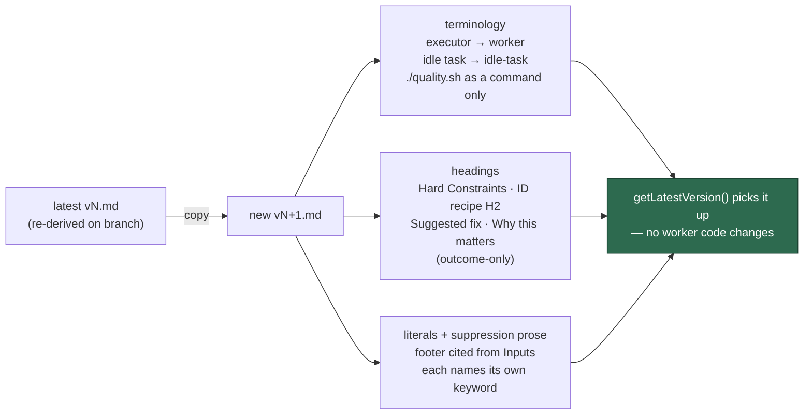

# Apply the house vocabulary to scan templates, batch A

## Summary

Seven scan families spelled the same shared concepts differently: the Deno
harness was "the executor", the hard-constraints heading came in three
casings/suffixes, the issue-body slots were `## Suggested action` /
`## Suggested replacement` / `## Why this is a candidate`, and every template
described its suppression grammar as shared without naming its own keyword.
This sweep applies the house vocabulary to all seven, one version bump per
directory. Closes #835.

The issue's table named the latest version *at filing*; six of the seven had
already been bumped by sibling issues on the milestone branch, so "current
latest" was re-derived at implementation time and each directory got exactly
one bump:

| Directory | From | New file |
| --- | --- | --- |
| `prompts/best_practices/` | `v12.md` | `v13.md` |
| `prompts/dead_code/` | `v7.md` | `v8.md` |
| `prompts/deprecated_api/` | `v6.md` | `v7.md` |
| `prompts/doc_coverage/` | `v8.md` | `v9.md` |
| `prompts/documentation_audit/` | `v10.md` | `v11.md` |
| `prompts/duplicated_knowledge/` | `v5.md` | `v6.md` |
| `prompts/format_drift/` | `v7.md` | `v8.md` |

No existing `vN.md` was modified or deleted — `git diff --name-status` against
the milestone branch shows `A` lines only.

### The canon landed mid-flight

`docs/PROMPT-HOUSE-VOCABULARY.md` (Issue #834) reached the milestone branch
after this branch forked. The issue says the document wins where it disagrees
with the issue's own table, so the branch was merged up to the base tip and
every template re-checked against the canon. Two rows changed the result:

- **`quality.sh` as a filename stays bare.** The canon bans bare `quality.sh`
  **only as the command to run**, and names `quality.sh:41` and "the repo has
  no `quality.sh`" — both quoted from `prompts/format_drift/` — as filename
  references that stay (`docs/PROMPT-HOUSE-VOCABULARY.md:66`). Four such
  references had been given a `./` prefix, and one worked example had lost its
  `path:line` evidence form ("at line 41") three lines above a `<reason>` block
  telling the run to cite the two script lines. All four are reverted
  (`18bcab8`); the three genuine invocations keep `./quality.sh`, and
  `prompts/format_drift/v8.md` is now a pure rename against `v7.md`.
- **"None calls the grammar shared" is about the claim, not the phrase.** Four
  templates had dropped the banned "shared suppression-comment grammar" wording
  but kept an adjacent clause making the same claim — "the same marker shape
  the other scans honour". Each now names its own `best-practice-ignore`
  keyword (`060963e`), which is what the canon's suppression section asks for.

### Two edits that go beyond a pure rename

Both are consequences of the rename, not extras, and both are called out here
because a reviewer reading the diff will notice them:

1. **Two headings collapsing onto one house form.** `dead_code` carried both
   `## Why this is a candidate` and `## Why it is safe to remove`, and
   `deprecated_api` carried both `## Suggested replacement` and
   `## Suggested action` — in each case two headings the canon maps onto a
   single house heading. The prose is preserved verbatim under the one house
   heading, with a bold inline label (`**Safe to remove:**`,
   `**Replacement:**`) so the content each template separately mandates
   (`dead_code/v8.md:22`, `deprecated_api/v7.md:169`) still has a named slot.
   This is a change to the filed issue body's shape, so it wants a deliberate
   sign-off rather than being read as pure casing.
2. **`ATTRIBUTION_FOOTER` moved into Inputs** in `dead_code`, `deprecated_api`
   and `doc_coverage`. Those three carried the literal outside the Inputs
   section — two after `</instructions>`, one inside a Phase 4 subsection — so
   citing it "from the Inputs section" would have been a dangling reference.
   The canon requires exactly this: the placeholder is placed there and "a
   sweep moves the two together" (`docs/PROMPT-HOUSE-VOCABULARY.md:103-106`).
   `prompt_manager.ts` substitutes the placeholder wherever it sits, and each
   file still contains exactly one occurrence.



## Evidence

Backend/prompt-content change with no web interface, so no screenshot applies.
The evidence is the gate plus the banned-form sweep.

Every one of these returns nothing across the seven new files:

```bash
grep -niE 'executor|VibeCoder|idle tasks?|shared suppression|suppression-comment grammar|same marker shape' <seven>
grep -nE 'markdown' <seven> | grep -v '```markdown'
grep -nE '^## Hard constraints|^## Hard Constraints \(apply throughout\)|^### Stable finding ID recipe|^### For each surviving finding$|^### Filing the finding|^## Suggested (action|replacement)|^## Why (this is a candidate|this is flagged|it is safe to remove)' <seven>
```

Each of `## Hard Constraints (apply to every phase)`,
`## Stable finding ID recipe` (H2) and `## Phase 4 — … (outcome-only)` now
occurs exactly once per file, seven files out of seven, and every citation of
the footer reads "from the **Inputs** section". The gate result and the suites
that cover this change are under **Test Plan**.

## Acceptance Criteria

<!-- vibe-spec-review inputs="diff+issue-body" -->

- **met** — Seven new `vN.md` files exist, one per directory; no existing
  `vN.md` modified or deleted — evidence: `git diff --name-status --diff-filter=MDR`
  against the base is empty; `--stat` shows additions only — reviewer: met
- **partial** — Each new file's H1 states its own new version number —
  evidence: `prompts/doc_coverage/v9.md:1`, `prompts/format_drift/v8.md:1` —
  reviewer: partial — reason: five of seven carry a bumped `(vN)` suffix; those
  two carry none because `worker/deno/tests/prompt_h1_version_agreement_test.ts:63-85`
  (Issue #792, PR #865) *fails* if `doc_coverage` or `format_drift` reintroduce
  a suffix. The criterion is unsatisfiable for those two without breaking the
  gate, so the landed test was followed and the conflict is recorded here.
- **partial** — No `the executor`, no `VibeCoder` in prose, no bare
  `quality.sh`, no `idle task`, no lowercase `markdown` in prose — evidence:
  the greps in Evidence, all empty; the surviving bare `quality.sh` hits are
  `prompts/format_drift/v8.md:210,244,245,257,434` — reviewer: partial —
  reason: those five are *filename* references, which
  `docs/PROMPT-HOUSE-VOCABULARY.md:66` explicitly exempts by quoting two of
  them verbatim; the issue says the canon wins where the two disagree. The
  reviewer flagged that a literal-grep implementation of the #840 drift test
  would fail them — #840 must implement the canon's command-only scope, not a
  bare literal ban.
- **met** — Exactly one spelling of each shared heading, matching the house
  form — evidence: `## Hard Constraints (apply to every phase)` ×7,
  `## Stable finding ID recipe` at H2 ×7, `## Phase 4 — … (outcome-only)` ×7,
  `### For each surviving finding (skip silently …)` ×6 — reviewer: met —
  reason for 6 not 7: `prompts/best_practices/v13.md:467` renders that text as
  a prose sentence rather than an `###` heading, inherited unchanged from v12;
  a missing heading is a presence gap the canon puts out of scope (#841).
- **met** — Each of the seven names only its own suppression keyword and none
  describes the grammar as shared — evidence: `prompts/dead_code/v8.md:282`,
  `prompts/deprecated_api/v7.md:296`, `prompts/doc_coverage/v9.md:492`,
  `prompts/format_drift/v8.md:372` — reviewer: partial — reason: the reviewer
  reviewed `18bcab8`, where those four still said "the same marker shape the
  other scans honour". Departed to `met`: commit `060963e`, made in response to
  that finding, replaces the clause in all four with this scan's own
  `best-practice-ignore` keyword; no keyword was swapped anywhere.
- **met** — `{{ATTRIBUTION_FOOTER}}` cited as "from the Inputs section" in all
  seven — evidence: `prompts/best_practices/v13.md:515`,
  `prompts/dead_code/v8.md:365`, `prompts/deprecated_api/v7.md:384`,
  `prompts/doc_coverage/v9.md:606`, `prompts/documentation_audit/v11.md:809`,
  `prompts/duplicated_knowledge/v6.md:462`, `prompts/format_drift/v8.md:443`;
  no "from the end of this prompt" survives and the placeholder occurs exactly
  once per file — reviewer: met
- **partial** — `git diff` shows no change to any scan threshold, phase
  instruction or finding taxonomy — evidence: `prompts/dead_code/v8.md:349-355`,
  `prompts/deprecated_api/v7.md:366-380` — reviewer: partial — reason: no
  threshold, severity rubric, phase count or check catalogue changed, but in
  those two files two mandated `##` slots became bold inline labels inside one
  house slot, and `deprecated_api`'s worked example reorders rationale before
  fix as a result. The merge is forced by the mapping; the resulting body shape
  is the sign-off asked for in "Two edits that go beyond a pure rename".
- **partial** — `./quality.sh` passes — evidence: the gate run recorded under
  Test Plan — reviewer: missing — reason: every stage passes except
  `deno tests`, which reports 35 failures in six `setup_*` /
  credential-provisioning suites. All 35 reproduce identically on a clean
  worktree of the base tip (`76 passed | 35 failed`), so none is caused by this
  diff and none reads a file under `prompts/`. A 36th failure —
  `idle_task_count_docs_test.ts`, also red on the base — was fixed here rather
  than inherited; see the `unrequested` entry below.
- **unrequested** — `docs/archive/handover/issue-835.md` — evidence: the file's
  own header, `worker/deno/lib/preserved_wip_branch.ts:39` — reviewer:
  unrequested — reason: kept, and it is not an agent edit — the worker writes
  that path when a run is interrupted and committed it with WIP commit
  `85109e1` so a resuming run on any host can pick the branch up.
- **unrequested** — `prompts/doc_coverage/v9.md:68-71` rewords the Inputs
  preamble ("opaque ids to match against **and one literal line to reproduce**")
  — evidence: `prompts/doc_coverage/v9.md:68-71` — reviewer: unrequested —
  reason: kept. The footer moved into Inputs, so the preamble's description of
  what Inputs contains would otherwise be false.
- **unrequested** — `docs/PROMPT-HOUSE-VOCABULARY.md:108-109` rewords one count
  ("the seventeen templates carrying the placeholder" → "the seventeen
  placeholder-carrying templates") — evidence:
  `worker/deno/tests/idle_task_count_docs_test.ts:194` — reviewer: unrequested
  — reason: kept. The canon landed on the milestone branch with that sentence
  red — the test reads "the seventeen templates" as a claim about the
  idle-task registry, which holds eighteen — so every PR targeting this base
  inherits the failure. The count is about templates carrying the footer
  placeholder, not the registry; the reword says the same thing and the test
  passes. No count was changed.
- **unrequested** — `prompts/documentation_audit/v11.md:34` adds a noun:
  "sibling idle tasks" → "sibling idle-task scans" — evidence: that line —
  reviewer: unrequested — reason: kept. `idle-task` is attributive, so the
  hyphenated house form needs a noun after it.

## Standards Review

<!-- vibe-standards-review inputs="diff+CODING-STANDARDS.md" -->

- **violation** — `docs/PROMPT-HOUSE-VOCABULARY.md:66` (the quality-gate
  command row): the sweep rewrote a protected *filename* reference —
  `` Opening `quality.sh` … at `quality.sh:41` `` became
  `` Opening `./quality.sh` … at line 41 ``, destroying the `path:line`
  evidence form the worked example's own `<reason>` block demands — evidence:
  `prompts/format_drift/v8.md:244-245` — reason: fixed in `18bcab8`; the lines
  are restored to their `v7` text.
- **violation** — `docs/PROMPT-HOUSE-VOCABULARY.md:66`: "the repo has no
  `./quality.sh`" is a prefixed filename reference and is literally wrong — a
  repository contains a file named `quality.sh` — evidence:
  `prompts/format_drift/v8.md:434` — reason: fixed in `18bcab8`.
- **violation** — `docs/PROMPT-HOUSE-VOCABULARY.md:66`: ``Open the aggregate
  script (`./quality.sh`, the `make` target, the `npm` script)`` prefixes a
  file named alongside two artefacts — evidence:
  `prompts/format_drift/v8.md:210` (same construction at `:257`) — reason:
  fixed in `18bcab8`.
- **violation** — `CODING-STANDARDS.md:368-371`: the previous revision of this
  summary wrapped `{{ATTRIBUTION_FOOTER}}` in literal `` markers,
  which the standard forbids in prose and which protect nothing —
  `_config.yml:26-36` keeps `docs/archive` out of the Pages build — evidence:
  `docs/archive/pr-summaries/pr-summary-835.md:131` (previous revision) —
  reason: fixed — the markers are gone from this file.
- **violation** — `CODING-STANDARDS.md:28` (DRY, single source of truth): the
  previous revision recorded the mapping as an unconditional
  `quality.sh → ./quality.sh` and logged the three rewrites above as
  *resolved*, asserting as compliant the construction the canon protects —
  evidence: `docs/archive/pr-summaries/pr-summary-835.md:55,172-176` (previous
  revision) — reason: fixed — the mapping is now stated with the canon's
  command-only scope in "The canon landed mid-flight".
- **violation** — `CODING-STANDARDS.md:399-402` (precise, unambiguous
  instructions): folding `## Suggested replacement` into `## Suggested fix`
  left "write `none stated` here" pointing at a deleted heading — evidence:
  `prompts/deprecated_api/v7.md:376` — reason: fixed in `5cb154f`; the field
  carries a bold **Replacement:** label and the instruction names it.
- **violation** — `CODING-STANDARDS.md:399-402`: dropping
  `## Why it is safe to remove` left the safety justification the prompt
  mandates at `dead_code/v8.md:22` as an unlabelled paragraph — evidence:
  `prompts/dead_code/v8.md:354` — reason: fixed in `5cb154f`; the paragraph
  leads with **Safe to remove:**.
- **violation** — house vocabulary: "sibling idle tasks" hyphenated as a plural
  noun — evidence: `prompts/documentation_audit/v11.md:34` — reason: fixed;
  now attributive, "sibling idle-task scans".
- **violation** — `CODING-STANDARDS.md:399-402`: `format_drift` files at most
  one issue (`v8.md:14,353,379,456`) but now carries the plural house sub-heading
  `### For each surviving finding (…)` — evidence:
  `prompts/format_drift/v8.md:399` — reason: **stands**. The canon mandates
  that heading for the whole scan family and bans `### Filing the finding`
  (`docs/PROMPT-HOUSE-VOCABULARY.md:80`); the single-issue cap is restated
  four times in the surrounding text and is unchanged.
- **clean** — Australian English throughout the added files (catalogued,
  recognised, honour, summarise preserved; the only US-looking hits are
  `--color` CLI flags).
- **clean** — Commit safety: only `prompts/**/*.md` and two `docs/archive/**`
  files staged; no hidden path, no credential or key file, no `git add -f`, no
  `--no-verify` in the branch history.
- **clean** — Prompt immutability: seven new `vN+1.md` files, one bump per
  directory, no committed version edited; the `prompt immutability` gate stage
  passes.
- **clean** — Placeholder integrity: `{{ATTRIBUTION_FOOTER}}` appears exactly
  once per file and sits inside `## Inputs` in all seven; every per-family
  placeholder (`SUPPRESSED_IDS`, `KNOWN_OPEN_FINDING_IDS`, `BUCKET`) is
  retained.
- **clean** — Docs owe: no operator manual quotes the renamed issue-body slots,
  and no published doc cites a superseded `prompts/<type>/vN` path — the one
  such citation (`docs/PROMPT-BEST-PRACTICES-CHECKLIST.md:46`) carries a
  `<!-- pinned -->` marker.
- **clean** — Commit messages reference Issue #835 and carry the
  `Vibe-Coder-Run-Id` trailer; no Node tooling introduced in a Deno repo; no
  error swallowing added.

## Test Plan

No new test file: the drift test that locks this vocabulary in
(`worker/deno/tests/prompt_house_vocabulary_drift_test.ts`) is owned by #840
and must cover batch A, batch B and the interactive sweeps together — a
batch-A-only copy here would collide with that issue and go red the moment the
remaining sweeps land. One input for #840 from this sweep: the `quality.sh` row
must be implemented as "bare `quality.sh` as the command to run", not as a bare
literal ban, or it will fail the five filename references the canon protects in
`prompts/format_drift/v8.md`.

Existing coverage exercised instead:

- `worker/deno/tests/prompt_h1_version_agreement_test.ts` — scans the latest
  template in every prompt directory and fails on an H1 declaring a version
  other than its own. Passes; it is what caught the stale-suffix risk on the
  five bumped titles and what pins the two suffix-free ones.
- `worker/deno/tests/prompt_house_vocabulary_doc_test.ts` — the canon's own
  test, merged in from Issue #834. Passes.
- `worker/deno/lib/docs_prompt_version_check.ts` (gate stage
  `docs prompt versions`) — fails the gate if a published doc still cites a
  superseded `prompts/<type>/vN` path. `PASSED`.
- The `prompt immutability` gate stage — confirms no committed `vN.md` was
  edited. `PASSED`.
- `prompt_manager` / `prompt_placeholder_substitution` suites — confirm the
  relocated `{{ATTRIBUTION_FOOTER}}` still substitutes for all seven families.
- `worker/deno/tests/idle_task_count_docs_test.ts` — the registry-count check
  the canon tripped on the base branch. `5 passed | 0 failed` after the reword;
  `4 passed | 1 failed` before it, on both branches.
- Full `./quality.sh` on the final tree — every stage `PASSED` except
  `deno tests`: `16981 passed | 35 failed | 55 ignored`. The 35 are
  `setup_credential_provisioning` (18), `setup_provider_credential_flow` (10),
  `setup_lockfile` (3), `setup_workdir_reminder` (2), `setup_prerequisites` (1)
  and `service_account_env` (1) — sandbox tests about `setup.sh`, host
  credential provisioning and container buildability. Running those same six
  files in a clean worktree of
  `origin/milestone/794-prompt-terminology-and-structural-drift-across`
  reproduces every one (`76 passed | 35 failed`), so none is caused by this
  diff and none reads a file under `prompts/`.
