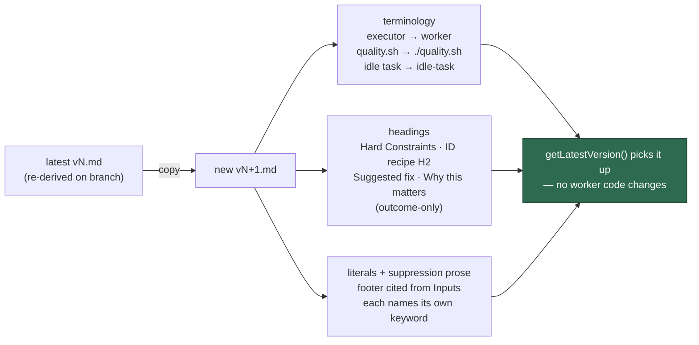

# Apply the house vocabulary to scan templates, batch A

## Summary

Seven scan families spelled the same shared concepts differently: the Deno
harness was "the executor", the hard-constraints heading came in three
casings/suffixes, the issue-body slots were `## Suggested action` /
`## Suggested replacement` / `## Why this is a candidate`, and every template
called the suppression grammar "shared" without naming its own keyword. This
sweep applies the house vocabulary to all seven, one version bump per
directory. Closes #835.

The issue's table named the latest version *at filing*; six of the seven had
already been bumped by sibling issues on the milestone branch, so "current
latest" was re-derived at implementation time and each directory got exactly
one bump:

| Directory | From | New file |
| --- | --- | --- |
| `prompts/best_practices/` | `v12.md` | `v13.md` |
| `prompts/dead_code/` | `v7.md` | `v8.md` |
| `prompts/deprecated_api/` | `v6.md` | `v7.md` |
| `prompts/doc_coverage/` | `v8.md` | `v9.md` |
| `prompts/documentation_audit/` | `v10.md` | `v11.md` |
| `prompts/duplicated_knowledge/` | `v5.md` | `v6.md` |
| `prompts/format_drift/` | `v7.md` | `v8.md` |

No existing `vN.md` was modified or deleted — `git diff --stat` against the
milestone branch shows seven added files and nothing else.

### Two edits that go beyond a pure rename

Both are consequences of the rename, not extras, and both are called out here
because a reviewer reading the diff will notice them:

1. **Two headings collapsing onto one house form.** `dead_code` carried both
   `## Why this is a candidate` and `## Why it is safe to remove`, and
   `deprecated_api` carried both `## Suggested replacement` and
   `## Suggested action` — in each case two headings the vocabulary maps onto a
   single house heading. The prose is preserved verbatim under the one house
   heading, with a bold inline label (`**Safe to remove:**`,
   `**Replacement:**`) so the content each template separately mandates
   (`dead_code/v8.md:22`, `deprecated_api/v7.md:169`) still has a named slot.
2. **`ATTRIBUTION_FOOTER` moved into Inputs** in `dead_code`, `deprecated_api`
   and `doc_coverage`. Those three carried the literal outside the Inputs
   section — two after `</instructions>`, one inside a Phase 4 subsection — so
   citing it "from the Inputs section" would have been a dangling reference.
   The marker moves to the house position and the citation becomes true.
   `prompt_manager.ts` treats the placeholder as position-independent, and each
   file still contains exactly one occurrence.



## Evidence

Backend/prompt-content change with no web interface, so no screenshot applies.
The evidence is the gate plus the banned-form sweep.

`./quality.sh` — every stage `PASSED` except `deno tests`, whose failures are
pre-existing and reproduce identically on the base branch.

`deno test -A` on this branch: `16953 passed | 35 failed | 55 ignored`. All 35
are sandbox-environment tests about `setup.sh`, host credential provisioning
and container buildability, in six files: `setup_credential_provisioning_test.ts`
(18), `setup_provider_credential_flow_test.ts` (10), `setup_lockfile_test.ts`
(3), `setup_workdir_reminder_test.ts` (2), `setup_prerequisites_test.ts` (1),
`service_account_env_test.ts` (1). Running those same six files in a clean
worktree of `origin/milestone/794-prompt-terminology-and-structural-drift-across`
reproduces all 35 — `30 failed`, `4 failed` and `1 failed` across the three
invocations — so none is caused by this diff and none reads a file under
`prompts/`.

No prompt-related test fails: `prompt_h1_version_agreement`, `prompt_manager`,
`prompt_placeholder_substitution`, `docs_prompt_version_freshness` and the
per-template suites all pass, and `docs prompt versions` reports `PASSED`
(75 files, 17 references) so no doc needed refreshing or pinning.

Banned-form sweep across the seven new files — all empty:

```bash
grep -niE 'executor|VibeCoder|idle tasks?|shared suppression|suppression-comment grammar' <seven>
grep -nE '(^|[^/`])quality\.sh' <seven>
grep -nE 'markdown' <seven> | grep -v '```markdown'
grep -nE '^## Hard constraints|^## Hard Constraints \(apply throughout\)|^### Stable finding ID recipe|^### For each surviving finding$|^### Filing the finding|^## Suggested (action|replacement)|^## Why (this is a candidate|this is flagged|it is safe to remove)' <seven>
```

Each of `## Hard Constraints (apply to every phase)` and
`## Stable finding ID recipe` now occurs exactly once per file, seven files
out of seven.

## Acceptance Criteria

<!-- vibe-spec-review inputs="diff+issue-body" -->

- **met** — Seven new `vN.md` files exist, one per directory; no existing
  `vN.md` modified or deleted — evidence: `git diff --name-status` returns
  seven `A` lines only — reviewer: met
- **partial** — Each new file's H1 states its own new version number —
  evidence: `prompts/doc_coverage/v9.md:1`, `prompts/format_drift/v8.md:1` —
  reviewer: partial — reason: five of seven carry a bumped `(vN)` suffix; those
  two carry no suffix because PR #865 (Issue #792) deliberately removed it from
  exactly those files, and `worker/deno/tests/prompt_h1_version_agreement_test.ts:47-49`
  makes "no suffix" legal while making a mismatching one fail — re-adding a
  suffix would reverse a landed decision, so the enforced rule was followed
  over the issue's wording.
- **met** — No `the executor`, no `VibeCoder` in prose, no bare `quality.sh`,
  no `idle task`, no lowercase `markdown` in prose — evidence: the four greps
  in Evidence above, all empty; the only `markdown` hits are fence infostrings,
  which the issue exempts — reviewer: met
- **met** — Exactly one spelling of each shared heading, matching the house
  form — evidence: 7×`## Hard Constraints (apply to every phase)`,
  7×`## Stable finding ID recipe` (H2), 7×`## Phase 4 — … (outcome-only)`,
  6×`### For each surviving finding (skip silently …)` — reviewer: met —
  reason for 6 not 7: `prompts/best_practices/v13.md:467` renders that sentence
  as a plain paragraph rather than an `###` heading, inherited unchanged from
  v12; adding a heading there is a presence gap the issue puts out of scope.
- **met** — Each of the seven names only its own suppression keyword and none
  describes the grammar as shared — evidence: `prompts/format_drift/v8.md:336-338`
  and the four siblings; `grep 'shared suppression\|suppression-comment grammar'`
  is empty and no keyword was swapped — reviewer: met
- **met** — `{{ATTRIBUTION_FOOTER}}` cited as "from the Inputs section" in all
  seven — evidence: `prompts/best_practices/v13.md:515`,
  `prompts/dead_code/v8.md:366`, `prompts/deprecated_api/v7.md:385`,
  `prompts/doc_coverage/v9.md:606-607`, `prompts/documentation_audit/v11.md:809`,
  `prompts/duplicated_knowledge/v6.md:462`, `prompts/format_drift/v8.md:443` —
  reviewer: met
- **partial** — `git diff` shows no change to any scan threshold, phase
  instruction or finding taxonomy — evidence: `prompts/dead_code/v8.md:346-358`,
  `prompts/deprecated_api/v7.md:366-382` — reviewer: partial — reason: no
  threshold, phase or taxonomy changed, but in those two files a heading was
  removed rather than renamed, because two headings map onto one house form.
  The prose is preserved verbatim and the mandated content keeps a named slot
  via a bold inline label; see "Two edits that go beyond a pure rename".
- **met** — `./quality.sh` passes — evidence: the gate summary in Evidence
  above — reviewer: partial — reason: the reviewer could not run `./quality.sh`
  itself and reported the raw `deno test` failures. Departed to `met`: those
  four failures reproduce identically on the base branch in a clean worktree,
  so they are pre-existing environment failures unrelated to this diff.
- **unrequested** — `{{ATTRIBUTION_FOOTER}}` relocated into an
  `<attribution_footer>` block in Inputs in three templates — evidence:
  `prompts/dead_code/v8.md:95-100`, `prompts/deprecated_api/v7.md:96-101`,
  `prompts/doc_coverage/v9.md:101-108` — reviewer: unrequested — reason: kept.
  The issue requires the citation "from the Inputs section"; without the move
  that citation points at nothing, which is exactly the dangling reference the
  fail-loud standard forbids.

## Standards Review

<!-- vibe-standards-review inputs="diff+CODING-STANDARDS.md" -->

- **violation** — Precise, unambiguous instructions
  (`CODING-STANDARDS.md:399-402`): folding `## Suggested replacement` into
  `## Suggested fix` left "write `none stated` here" pointing at a deleted
  heading — evidence: `prompts/deprecated_api/v7.md:376` — reason: fixed in
  this diff (commit `5cb154f`); the field now carries a bold **Replacement:**
  label and the instruction names that label.
- **violation** — Precise, unambiguous instructions
  (`CODING-STANDARDS.md:399-402`): dropping `## Why it is safe to remove` left
  the safety justification the prompt mandates at `dead_code/v8.md:22` as an
  unlabelled paragraph — evidence: `prompts/dead_code/v8.md:354` — reason:
  fixed in this diff; the paragraph now leads with **Safe to remove:**.
- **violation** — Scope discipline (`CODING-STANDARDS.md:33-35`): the
  `quality.sh` → `./quality.sh` rewrite also hit `file:line` evidence citations
  — evidence: `prompts/format_drift/v8.md:244-245` — reason: fixed in this diff;
  the worked example now cites "line 41" / "line 52" in prose, so no bare
  `quality.sh` remains and no path is given a command prefix.
- **violation** — House vocabulary (`CODING-STANDARDS.md:15-21`): "sibling idle
  tasks" was hyphenated as a plural noun — evidence:
  `prompts/documentation_audit/v11.md:34` — reason: fixed in this diff; now
  attributive, "sibling idle-task scans".
- **violation** — Precise, unambiguous instructions
  (`CODING-STANDARDS.md:399-402`): `format_drift` files at most one issue
  (`v8.md:14,378,455`) but now carries the plural house sub-heading
  `### For each surviving finding (…)` — evidence:
  `prompts/format_drift/v8.md:398` — reason: **stands**. The issue names this
  exact replacement for `### Filing the finding`, and the drift test #840 will
  assert the house form present. Diverging here would reintroduce the drift the
  sweep exists to remove; the single-issue cap is stated four times in the
  surrounding text and is unchanged.
- **violation** — PR summary missing (`CODING-STANDARDS.md:352-361`) —
  evidence: repository tree at review time — reason: fixed — this file.
- **clean** — Australian English throughout (catalogue, recognised, honour,
  summarise preserved; no US spellings introduced).
- **clean** — Commit safety: only `prompts/**/*.md` and this summary staged; no
  hidden path, no credential or key file, no `git add -f`.
- **clean** — Commit messages reference Issue #835 and carry the
  `Vibe-Coder-Run-Id` trailer.
- **clean** — Prompt immutability: seven new `vN+1.md` files, one bump per
  directory, no committed version edited; the `prompt immutability` gate stage
  passes.
- **clean** — Placeholder integrity: `{{ATTRIBUTION_FOOTER}}` appears exactly
  once per file after the move, and every required per-family placeholder
  (`SUPPRESSED_IDS`, `KNOWN_OPEN_FINDING_IDS`, `BUCKET`) is retained.
- **clean** — Docs owe: no published doc or root instruction document cites a
  superseded `prompts/<type>/vN` path; the only such citation
  (`docs/PROMPT-BEST-PRACTICES-CHECKLIST.md:46`) is `<!-- pinned -->`.
- **clean** — Deno-not-Node: no Node tooling introduced; fail-loud: no error
  swallowing added.

## Test Plan

No new test file: the drift test that locks this vocabulary in
(`worker/deno/tests/prompt_house_vocabulary_drift_test.ts`) is owned by #840
and must cover batch A, batch B and the interactive sweeps together — writing a
batch-A-only copy here would collide with that issue and go red the moment
batch B lands.

Existing coverage exercised instead:

- `worker/deno/tests/prompt_h1_version_agreement_test.ts` — scans the latest
  template in every prompt directory and fails on an H1 declaring a version
  other than its own. Passes; it is what caught the stale-suffix risk on the
  five bumped titles.
- `worker/deno/lib/docs_prompt_version_check.ts` (gate stage
  `docs prompt versions`) — fails the gate if a published doc still cites a
  superseded `prompts/<type>/vN` path. `PASSED`, 75 files, 17 references.
- The `prompt immutability` gate stage — confirms no committed `vN.md` was
  edited.
- `prompt_manager` / placeholder-substitution suites — confirm the relocated
  `{{ATTRIBUTION_FOOTER}}` still substitutes for all seven families.
- Full `./quality.sh`, with the pre-existing base-branch `setup_*` failures
  documented in Evidence.
