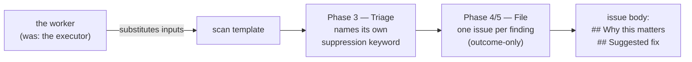

# Apply the house vocabulary to scan templates, batch B

## Summary

Seven scan templates in batch B named the same concepts differently from their
siblings. This bumps each directory once, applying the house vocabulary from
#794 — names and casing only, no scan logic, thresholds, phase content or
worked-example findings changed. Closes #836.

| Directory | Base | New |
| --- | --- | --- |
| `prompts/github_actions_audit/` | `v20.md` | `v21.md` |
| `prompts/orphan_deps/` | `v7.md` | `v8.md` |
| `prompts/private_repo_reference_audit/` | `v5.md` | `v6.md` |
| `prompts/retro/` | `v2.md` | `v3.md` |
| `prompts/supply_chain_detection/` | `v6.md` | `v7.md` |
| `prompts/supply_chain_readiness/` | `v9.md` | `v10.md` |
| `prompts/test_audit/` | `v13.md` | `v14.md` |

The bases are one version higher than the issue's table in four directories —
#790 and #792 bumped them after filing — so each directory takes exactly one
bump from this sweep, as the issue instructs.

What changed in the seven new files:

- `the executor` → `the worker` (17 occurrences).
- `## Hard Constraints (apply throughout)` → `(apply to every phase)`
  (`github_actions_audit`).
- `### Stable finding ID recipe` promoted to H2 (`private_repo_reference_audit`,
  `retro`, `test_audit`).
- `### For each surviving finding` → the full parenthetical house form
  (`github_actions_audit`).
- `## Suggested replacement` → `## Suggested fix` (`orphan_deps`, three sites);
  `## Suggested action` → `## Suggested fix` (`supply_chain_detection`).
- The filing phase keeps the `(outcome-only)` suffix on its heading in all
  seven. In `retro` that is **Phase 5**, its filing phase — its phase numbering
  is untouched, as the issue requires.
- `idle task` → `idle-task` (`github_actions_audit`).
- Generic `<!-- finding-id: <id> -->` → `<!-- finding-id: BP-… -->` (`retro`).
- Each template now names its own suppression keyword instead of calling the
  grammar "shared". No keyword changed: `orphan_deps` still owns
  `orphan-deps-ignore`, `supply_chain_detection` still uses
  `security-scan-ignore`, the rest still use `best-practice-ignore` — all
  matching `worker/deno/lib/suppression_comments.ts`.

## Evidence

Backend/prompt-content change with no web interface, so no screenshot applies.
Verification is the gate plus the greps the acceptance criteria name, run across
the seven new files:

```text
grep -in "executor"                        → 0 hits
grep -n  "VibeCoder"                       → 1 hit, the repo slug (exempt)
grep -n  "quality.sh" | grep -v "./"       → 0 hits
grep -nE "idle task"                       → 0 hits
grep -n  "shared suppression"              → 0 hits
grep -n  "finding-id: <id>"                → 0 hits
grep -n  "Hard [Cc]onstraints"             → 7 × "(apply to every phase)"
grep -n  "Stable finding ID recipe"        → 7 × H2
grep -n  "^## Phase [45] — File"           → 7 × "(outcome-only)"
```

Where the vocabulary lands in the scan flow:



### Quality gate

Every stage passes except `deno tests`, which reports **2 failures out of 17,001
tests**. Both are pre-existing container-environment failures, not this change:
they reproduce byte-identically on the milestone-branch head `37503a4` in a
scratch worktree with no working-tree changes at all.

```text
applyServiceAccountEnv - an unwritable gh config dir is restaged writable
  => ./tests/service_account_env_test.ts:385:6
setup.sh - a Codex-only host with no claude CLI reaches the configuration-writing stage
  => ./tests/setup_provider_credential_flow_test.ts:289:6

FAILED | 16999 passed (4 steps) | 2 failed | 55 ignored
```

The second dies on the container's own prerequisite probe — *"the running
container image did not install the `codex` coding-agent provider. Installed:
claude"* — so it is bound to the image build, not to the code under test. The
container also exports `CONFIG_PATH`, which trips a further 33 setup tests on
their `CONFIG_FILE`/`CONFIG_PATH` conflict guard; `env -u CONFIG_PATH
./quality.sh` clears those and leaves the two above. Filed as
stSoftwareAU/VibeCoder#891 with the reproduction. This PR's diff is seven
`prompts/**/*.md` additions and one PR summary, which cannot reach any of it.

All other stages — prompt immutability, markdownlint, `docs prompt versions`,
mermaid, semgrep, deno lint, deno type check, deno fmt — PASSED.

## Acceptance Criteria

<!-- vibe-spec-review inputs="diff+issue-body" -->

- **met** — Seven new `vN.md` files exist, one per directory; no existing
  `vN.md` is modified or deleted — evidence: `git diff --name-status` shows
  seven `A` entries and zero `M`/`D` — reviewer: met
- **partial** — Each new file's H1 states its own new version number —
  evidence: `prompts/orphan_deps/v8.md:1` — reviewer: partial — reason:
  `orphan_deps` has never carried a `(vN)` suffix, and #792's rule (and
  `worker/deno/tests/prompt_h1_version_agreement_test.ts`) makes no suffix
  legal while forbidding one on `supply_chain_detection` and
  `supply_chain_readiness`; the four templates that do carry a suffix were
  bumped, and adding one to `orphan_deps` alone would reintroduce the churn
  #792 removed
- **met** — No `the executor`, no `VibeCoder` in prose, no bare `quality.sh`,
  no `idle task`, no lowercase `markdown` in prose — evidence: the greps above;
  the six lowercase `markdown` hits are fence infostrings, the one `VibeCoder`
  is `stSoftwareAU/VibeCoder` at `prompts/supply_chain_detection/v7.md:30` —
  reviewer: met
- **met** — Exactly one spelling of each shared heading; the finding ID recipe
  is H2 everywhere — evidence: `## Hard Constraints (apply to every phase)` ×7,
  `## Stable finding ID recipe` (H2) ×7, `## Suggested fix` ×6,
  `### For each surviving finding (skip silently …)` ×6 — reviewer: met
- **met** — `orphan_deps` still uses `orphan-deps-ignore` and
  `supply_chain_detection` still uses its existing keyword, verified against
  `worker/deno/lib/suppression_comments.ts` — evidence:
  `prompts/orphan_deps/v8.md:363` and `prompts/supply_chain_detection/v7.md:411`
  against `worker/deno/lib/suppression_comments.ts:224-230` and `:200-206` —
  reviewer: met
- **met** — No template in this batch describes the suppression grammar as
  shared — evidence: zero hits for `shared suppression` across the seven —
  reviewer: met
- **met** — `retro`'s phase numbering is unchanged — evidence: diffing the
  `^## Phase` lines of `prompts/retro/v2.md` against `v3.md` shows only the
  `(outcome-only)` suffix on Phase 5; Phase 4 is still Triage — reviewer: met
- **partial** — `./quality.sh` passes — evidence: the gate run recorded above;
  every stage PASSED except `deno tests`, which carries 2 pre-existing
  container-environment failures out of 17,001 — reviewer: partial — reason:
  the two failures reproduce identically on the base commit `37503a4` with no
  changes applied and are filed as stSoftwareAU/VibeCoder#891, so nothing in
  this diff causes them, but the gate's overall verdict is still FAILED

No `unrequested` entries — the Spec reviewer traced every change to the issue's
tables and confirmed each per-file diff is a line-for-line swap with insertions
equal to deletions.

## Standards Review

<!-- vibe-standards-review inputs="diff+CODING-STANDARDS.md" -->

- **clean** — no violations found. Areas checked and found compliant:
  Australian English throughout the changed lines (no American variants added,
  existing `behaviour`/`colour`/`honouring` preserved); markdownlint scope
  (`.markdownlint-cli2.jsonc` does not glob `prompts/**`, and the gate's
  markdownlint stage passes); commit safety (seven additions under
  `prompts/`, no hidden or credential paths staged); prompt immutability (no
  existing `vN.md` modified or deleted, matching the versioning rule in
  `CODING-STANDARDS.md`); scope (changes confined to the issue's terminology
  and heading tables, no logic, thresholds or worked-example findings touched).
- **clean** — the suppression-prose rewrite was checked specifically and is
  correct: it changes only the wording, never which keyword a template
  recognises — evidence: `prompts/orphan_deps/v8.md:363` still names
  `orphan-deps-ignore`, `prompts/supply_chain_detection/v7.md:411` still names
  `security-scan-ignore`.

## Test Plan

- No new test in this PR by design: the vocabulary drift test
  (`worker/deno/tests/prompt_house_vocabulary_drift_test.ts`) is #840's
  deliverable and does not exist yet; creating it here would collide with that
  issue.
- Existing gates exercised against the seven new files:
  - `worker/deno/tests/prompt_h1_version_agreement_test.ts` — the H1 rule from
    #792, including the assertion that `supply_chain_detection` and
    `supply_chain_readiness` carry no suffix.
  - `worker/deno/tests/docs_prompt_version_freshness_test.ts` and the gate's
    `docs prompt versions` stage — no doc is left citing a superseded version.
  - `worker/deno/tests/severity_emoji_scale_test.ts`,
    `worker/deno/tests/suppression_governance_drift_test.ts`,
    `worker/deno/tests/phase_prompt_output_contract_test.ts`,
    `worker/deno/tests/marker_grammar_test.ts`,
    `worker/deno/tests/prompt_hash_test.ts` — all scan the latest version of
    every prompt directory, so they now read the seven new files. All pass.
- `./quality.sh` — full gate. Every stage PASSED except `deno tests`, whose 2
  failures are pre-existing and environmental, proven against base commit
  `37503a4` and filed as stSoftwareAU/VibeCoder#891.
