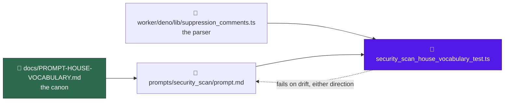

# prompt(security_scan): apply the house vocabulary

## Summary

`prompts/security_scan/` is the largest template in the scan family and the
only one still spelling the product name `VibeCoder` in prose. This sweep
applies [`docs/PROMPT-HOUSE-VOCABULARY.md`](../../PROMPT-HOUSE-VOCABULARY.md)
to `prompts/security_scan/prompt.md` — names and casing only, no scan logic.
Closes #837.

The eleven hunks against the base:

- `VibeCoder` → `Vibe Coder` in the two prose sentences that carried it
  (`prompt.md:222`, `:1155`) — the only one-word prose uses in the set, in a
  file that already said `Vibe Coder` at `:99`.
- `the executor` → `the worker` for the Deno harness (`prompt.md:16`, `:1626`).
- `idle task` → `idle-task` (`prompt.md:865`).
- `### Stable finding ID recipe` → H2 (`prompt.md:1609`), a peer of the phases
  as in its nine siblings.
- `## Phase 4 — File one issue per finding` regains the `(outcome-only)`
  suffix (`prompt.md:1622`).
- `For each surviving finding …` becomes the family's H3 with the suppression
  parenthetical (`prompt.md:1657`).
- `<!-- finding-id: <id> -->` → `<!-- finding-id: SEC-… -->` (`prompt.md:1694`);
  the rendered example keeps `SEC-0123456789ab` (`prompt.md:1719`).
- The attribution-footer placeholder is cited one way, "from the Inputs
  section" (`prompt.md:1709`, `:1781`), which is where it actually sits.
- The suppression step names `security-scan-ignore` and no longer calls the
  grammar shared (`prompt.md:1666-1671`).

The suppression rewrite needed care. Naming the keyword closes what had been
an open-ended list ("or any other form recognised by the shared
suppression-comment grammar"), so the enumeration that replaces it must match
`worker/deno/lib/suppression_comments.ts` exactly. An earlier draft dropped the
recognised `// eslint-disable-next-line SEC-…` form and kept `// noqa: SEC-…`,
which the parser never matches — either way round, the prompt and the
deterministic checker would disagree about which waivers count, silently, in a
security scan. The step now names its own keyword and the two extra forms the
parser really honours, and a test drives the real parser in both directions.

`worker/deno/lib/suppression_comments.ts` is unchanged; the three keywords stay
namespaced.

### Rebased onto the de-versioned layout

Issue #844 landed on the milestone base while this work was in flight,
collapsing every `prompts/<type>/vN.md` into a single editable
`prompts/<type>/prompt.md` and removing version resolution, the immutability
gate and the H1 version suffix. The sweep was re-applied to `prompt.md` and the
interim `v33.md` deleted, so the diff is the vocabulary change and nothing else.

That merge also left two failures on the milestone base which block this gate,
repaired here:

- `worker/deno/tests/prompt_house_vocabulary_doc_test.ts` imported
  `getLatestVersion`, which #844 deleted, and called `loadPrompt` with the
  removed version argument — the base does not type-check on this file.
- #844's docs sweep dropped the `PROMPT-HOUSE-VOCABULARY.md` link from
  `docs/PROMPT-BEST-PRACTICES-CHECKLIST.md`, which that same test asserts;
  restored verbatim from `1e3c6b1`.

## Evidence

Backend/prompt change — no web interface to screenshot. The evidence is the
test run and the diff:

- `deno test tests/security_scan_house_vocabulary_test.ts` — 9 tests, all pass.
- Each guard was observed failing before it passed: the narrowed marker list
  failed on `eslint-disable-next-line`, the over-claimed list failed on
  `// noqa: SEC-0123456789ab`, and the non-vacuity control failed under two
  injected faults (treating every line as fenced, and losing wrap-awareness).
- `git diff` of `prompts/security_scan/prompt.md` against the base is 11 hunks,
  none touching severity bands, the four priority surfaces, or the
  gate-verdict rules.
- `./quality.sh`: every stage passes except `deno tests`, which is red on the
  **base** for reasons this change does not touch — see below.

### Gate status

`./quality.sh` was run to completion. `semgrep`, `markdownlint`, `mermaid`,
`deno lint`, `deno type check`, `deno fmt` and every chokepoint check pass.
`deno tests` fails, and both causes were isolated against a clean worktree of
the milestone base:

- `prompt manager - no versioned prompt files remain in the tree` — **fails on
  the base**. The #844 merge left 14 `prompts/*/vN.md` files whose sibling
  `prompt.md` still holds pre-sweep text, silently reverting #835/#836. Filed
  as #900; it blocks every PR into this milestone branch.
- 18 `setup_credential_provisioning_test.ts` tests, plus `run_setup_cli` and
  `host_work_dir` — **environmental**, not code. The worker host exports
  `CONFIG_PATH`, which the setup script refuses alongside the test's own
  `CONFIG_FILE`. `env -u CONFIG_PATH -u CONFIG_FILE deno test
  tests/setup_credential_provisioning_test.ts` gives 18 passed / 0 failed, and
  they fail identically on the unmodified base.

The one test failure this change did cause — `cross-repo prompt bodies carry no
VibeCoder-internal source paths`, because the suppression rewrite named
`worker/deno/lib/suppression_comments.ts` in a body filed into other repos —
is fixed in `af11b8a`; that suite passes.

## Acceptance Criteria

<!-- vibe-spec-review inputs="diff+issue-body" -->

- **met** — #790 and #791 are merged before this lands — evidence: `cc375fe`
  and `9239fcd` are in the base; both effects survive, the defensive-label
  section at `prompt.md:1634` — reviewer: met
- **met** — exactly one new `prompts/security_scan/` template, based on the
  latest version at implementation time; no existing version modified —
  evidence: `git diff --name-status` shows `M prompts/security_scan/prompt.md`
  and nothing else under `prompts/` — reviewer: met — reason: the criterion was
  written against the `vN.md` regime #844 removed mid-flight; the reviewer was
  told of that change and judged the adapted form met
- **met** — the new file's H1 states its own version number — evidence:
  `prompts/security_scan/prompt.md:1` — reviewer: met — reason: #844 stripped
  H1 version suffixes repo-wide, so the house form is now the versionless H1
  every sibling carries; the reviewer's words were "met as adapted (n/a under
  #844)" and that leaving a `(v33)` suffix here would have been the defect
- **met** — zero `VibeCoder` in prose; `Vibe Coder` throughout — evidence:
  `security_scan_house_vocabulary_test.ts::spells the product name Vibe Coder
  in prose` — reviewer: met
- **met** — no `the executor`, no bare `quality.sh`, no `idle task`, no
  lowercase `markdown` in prose — evidence:
  `security_scan_house_vocabulary_test.ts::calls the Deno harness the worker`
  and `::uses ./quality.sh, hyphenated idle-task and capital Markdown` —
  reviewer: met — reason: the reviewer noted the `quality.sh` and `markdown`
  bans were already satisfied by the base and required no edit; they are kept
  as reintroduction guards, matching the criterion's wording
- **met** — `## Stable finding ID recipe` is H2, `<!-- finding-id: SEC-… -->`
  is the placeholder, the rendered example keeps `SEC-0123456789ab` — evidence:
  `security_scan_house_vocabulary_test.ts::carries the family's shared
  headings` and `::uses the SEC-prefixed finding-id placeholder` — reviewer: met
- **met** — the template names `security-scan-ignore`, does not call the
  grammar shared, and `suppression_comments.ts` is unchanged — evidence:
  `security_scan_house_vocabulary_test.ts::names its own suppression keyword`
  and `::the suppression markers it names match the parser` — reviewer: met —
  reason: the reviewer independently re-derived the enumeration at
  `prompt.md:1666-1671` against `SECURITY_SCAN_PATTERNS` and found it neither
  widens nor narrows the honoured set
- **met** — `git diff` against the base shows no change to severity bands,
  priority surfaces or gate-verdict rules — evidence: the only two touches
  inside those regions are the product-name renames at `prompt.md:222` and
  `:1155` — reviewer: met
- **partial** — `./quality.sh` passes — evidence: full gate run after the final
  edit; every stage green except `deno tests` — reviewer: met — reason: the
  reviewer was told not to run the gate and judged it met from `deno check`,
  `deno lint` and the changed suites. Departing from that verdict: the gate was
  run here and `deno tests` is red on the **base** (leftover versioned
  templates, filed as #900) plus a host `CONFIG_PATH` leak. Neither is caused
  by this change, and the one failure that was is fixed in `af11b8a` — but the
  criterion says passes, and it does not yet
- **partial** — the scan-family heading table's issue-body rationale slot —
  evidence: `prompt.md:1704`, `:1725` still read `## Why it is a bug` — reason:
  the issue and the canon both enumerate the banned variants
  (`## Why this is a candidate`, `## Why this is flagged`, `## Why it is safe
  to remove`) and `## Why it is a bug` is on neither list, so converting it
  would be a heading change the canon has not decided; the reviewer called it
  "defensible by the letter, still drift by the house form" and left it to this
  call — reviewer: partial
- **unrequested** — the new test file
  `worker/deno/tests/security_scan_house_vocabulary_test.ts` — reviewer:
  unrequested — reason: the issue's Failure Detection names #840's
  cross-directory drift test, which has not landed; this route requires a
  failing test first, so the defects are pinned per-directory until it does
- **unrequested** — the two base repairs in
  `worker/deno/tests/prompt_house_vocabulary_doc_test.ts` and
  `docs/PROMPT-BEST-PRACTICES-CHECKLIST.md` — reviewer: unrequested — reason:
  both are pre-existing #844 merge breakage on the milestone base, confirmed
  red on a clean worktree of the base, and both block this gate; the reviewer
  judged each "justified — base was broken"

## Standards Review

<!-- vibe-standards-review inputs="diff+CODING-STANDARDS.md" -->

- **violation** — the PR summary described the change as a `v33.md` bump and
  carried 21 version references after the #844 rebase, against the standard
  that documentation names prompts by path, never by version — evidence:
  `docs/archive/pr-summaries/pr-summary-837.md:7` — reason: fixed; this file is
  rewritten against `prompt.md` and the post-#844 reality
- **violation** — `new RegExp` built from a computed source, which
  `p/default`'s `detect-non-literal-regexp` blocks — evidence:
  `worker/deno/tests/security_scan_house_vocabulary_test.ts:81` — reason:
  fixed. Callers now pass wrap-aware global literals and `hitsIn` asserts both
  properties, so every regex in the file is a literal. Semgrep is clean on the
  changed files
- **violation** — the five prose bans all assert an empty hit list, so a
  `prose()` returning nothing would turn every one green while checking
  nothing, and the helper had no direct coverage — evidence:
  `worker/deno/tests/security_scan_house_vocabulary_test.ts:47` — reason:
  fixed; a positive control pins the projection size, wrap-crossing detection
  and code-span/fence exemption, and was observed red under two injected faults
- **violation** — fail-loud: the prose line map degraded an out-of-range index
  to "line 0" instead of surfacing that text and map had diverged — evidence:
  `worker/deno/tests/security_scan_house_vocabulary_test.ts:62` — reason: fixed;
  it now throws naming the offset
- **violation** — DRY: the prompts-directory path was re-derived here when
  `tests/support/repo_prompts.ts` already exports `REPO_ROOT` — evidence:
  `worker/deno/tests/security_scan_house_vocabulary_test.ts:30` — reason:
  fixed; importing that module also pins prompt resolution to this checkout,
  which is the convention #844 introduced
- **violation** — Boy Scout: the base repair left `latestTemplates()` named
  for a "latest" version #844 deleted — evidence:
  `worker/deno/tests/prompt_house_vocabulary_doc_test.ts:139` — reason: fixed;
  renamed `promptTemplates()` and the failure message reworded
- **violation** — two assertions (bare `quality.sh`, lowercase `markdown`)
  cannot fail against the unfixed template — evidence:
  `worker/deno/tests/security_scan_house_vocabulary_test.ts:191` — reason:
  stands. They are named verbatim in acceptance criterion 5 as bans this file
  must satisfy, and they guard reintroduction on the next edit
- **violation** — `docs/SECURITY-SCAN.md:38` and `:47` still say "the executor"
  in the operator manual for this very prompt — evidence:
  `docs/SECURITY-SCAN.md:47` — reason: stands, deliberately. The canon scopes
  itself to prompt templates (`docs/PROMPT-HOUSE-VOCABULARY.md:28-31`), the
  issue scopes itself to `prompts/security_scan/`, and
  `docs/MODEL-AND-CACHING.md` carries the same noun for an unrelated
  subsystem — sweeping the docs is a separate change, not a rename this diff
  introduced
- **clean** — Australian English on every added line; the only American
  spellings in the diff are the recorded deliberate exception being pointed at;
  tests call real code (`loadPrompt`, `findSuppressions`) rather than grepping
  source, and the marker test drives the parser in both directions; the prompt's
  enumeration matches `SECURITY_SCAN_PATTERNS` exactly and
  `suppression_comments.ts` is untouched; no hidden or credential paths staged,
  no `git add -f`, no `--no-verify`; every commit carries `(Issue #837)` and the
  `Vibe-Coder-Run-Id` trailer; `prompts/security_scan/` holds exactly one
  editable `prompt.md` with a versionless H1; `deno fmt`, `deno lint` and
  `deno check` clean on both test files

## Test Plan

`worker/deno/tests/security_scan_house_vocabulary_test.ts` — 9 tests against
whatever `loadPrompt("security_scan")` resolves, so a later edit that
reintroduces a banned variant fails here:

- the prose matcher is not vacuous — the positive control for the five bans
  below: the projection keeps the bulk of the template, a banned phrase is
  caught when the hard wrap splits it, code spans and fenced blocks stay
  exempt, and a pattern written with a literal space is rejected outright
- spells the product name `Vibe Coder` in prose (repo slugs and URLs exempt),
  and asserts the two renamed sentences survive rather than being deleted
- calls the Deno harness `the worker`, scoped to the harness noun so
  "executor" stays usable as a finding-class word
- uses `./quality.sh`, hyphenated `idle-task` and capital `Markdown`
- carries the family's four shared headings, and rejects the H3 recipe
- uses the `SEC-`-prefixed finding-id placeholder and keeps the rendered
  twelve-hex-digit example
- names `security-scan-ignore` and does not call the grammar shared
- the suppression markers it names match the parser — drives
  `findSuppressions` over candidate markers in every comment syntax and fails
  both when the template omits a keyword the parser honours and when it spells
  out a form the parser cannot see
- cites the attribution footer one way, "from the Inputs section"

Existing suites re-run unchanged: `suppression_comments_test.ts`,
`prompt_house_vocabulary_doc_test.ts` (16 tests, repaired for the #844 API),
`idle_task_count_docs_test.ts`.
