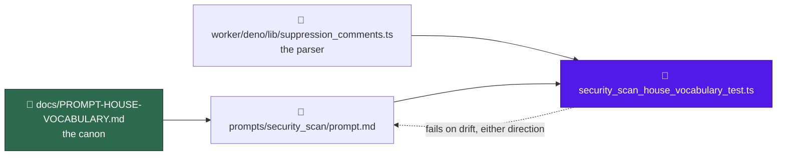

# prompt(security_scan): apply the house vocabulary

## Summary

`prompts/security_scan/` is the largest template in the scan family and the
only one still spelling the product name `VibeCoder` in prose. This sweep
applies [`docs/PROMPT-HOUSE-VOCABULARY.md`](../../PROMPT-HOUSE-VOCABULARY.md)
to `prompts/security_scan/prompt.md` — names and casing only, no scan logic.
Closes #837.

The fourteen hunks against the base:

- `VibeCoder` → `Vibe Coder` in the two prose sentences that carried it
  (`prompt.md:222`, `:1155`) — the only one-word prose uses in the set, in a
  file that already said `Vibe Coder` at `:99`.
- `the executor` → `the worker` for the Deno harness (`prompt.md:16`, `:1626`).
- `idle task` → `idle-task` (`prompt.md:865`).
- `### Stable finding ID recipe` → H2 (`prompt.md:1609`), a peer of the phases
  as in its nine siblings.
- `## Phase 4 — File one issue per finding` regains the `(outcome-only)`
  suffix (`prompt.md:1622`).
- `For each surviving finding …` becomes the family's H3 with the suppression
  parenthetical (`prompt.md:1657`).
- `<!-- finding-id: <id> -->` → `<!-- finding-id: SEC-… -->` (`prompt.md:1695`);
  the rendered example keeps `SEC-0123456789ab` (`prompt.md:1720`).
- The attribution-footer placeholder is cited one way, "from the Inputs
  section" (`prompt.md:1710`, `:1782`), which is where it actually sits.
- The suppression step names `security-scan-ignore` and no longer calls the
  grammar shared (`prompt.md:1666-1672`).
- The issue-body rationale slot `## Why it is a bug` → `## Why this matters`
  (`prompt.md:1705`, `:1726`) — see below.

The suppression rewrite needed care. Naming the keyword closes what had been
an open-ended list ("or any other form recognised by the shared
suppression-comment grammar"), so the enumeration that replaces it must match
`worker/deno/lib/suppression_comments.ts` exactly. An earlier draft dropped the
recognised `// eslint-disable-next-line SEC-…` form and kept `// noqa: SEC-…`,
which the parser never matches — either way round, the prompt and the
deterministic checker would disagree about which waivers count, silently, in a
security scan. The step now names its own keyword and the two extra forms the
parser really honours, and a test drives the real parser in both directions.
It also stops presenting `#`, `//` and `/* */` as unconditional: the parser
gates them by language (`HASH_LANGS` py/rb/sh, `SLASH_LANGS` and `BLOCK_LANGS`
ts/js/go/rs/java), so a `#` marker in a `.ts` file matched the prompt's rule
and not the checker.

`worker/deno/lib/suppression_comments.ts` is unchanged; the three keywords stay
namespaced.

### The rationale slot, and one canon row

The canon's scan-family table sets the issue-body rationale slot to
`## Why this matters` and enumerates three banned variants. `security_scan`
wrote `## Why it is a bug`, which is on neither the issue's list nor the
canon's — the earlier sweeps had already cleared the three that were listed,
leaving this the last holdout: eighteen occurrences of the house slot across
eleven sibling scans, against two here and nowhere else in `prompts/`. Both
independent reviews called it drift rather than an exemption, so it is swept,
and the variant is recorded in the canon with its count as
`docs/PROMPT-HOUSE-VOCABULARY.md`'s own "Changing the canon" rule requires.

The canon also said a banned variant "fails nothing" anywhere, which this
sweep's own test makes false for `prompts/security_scan/`; that sentence now
says so and still points at Issue #840 for the cross-directory gate.

### Rebased onto the de-versioned layout

Issue #844 landed on the milestone base while this work was in flight,
collapsing every `prompts/<type>/vN.md` into a single editable
`prompts/<type>/prompt.md` and removing version resolution, the immutability
gate and the H1 version suffix. The sweep was re-applied to `prompt.md`, so the
diff is the vocabulary change and nothing else. Two base failures this branch
had carried local repairs for — a `getLatestVersion` import in
`prompt_house_vocabulary_doc_test.ts`, and a dropped pointer link in
`docs/PROMPT-BEST-PRACTICES-CHECKLIST.md` — were fixed on the milestone base
itself in the meantime, so both repairs were dropped at the merge and neither
file appears in this diff.

## Evidence

Backend/prompt change — no web interface to screenshot. The evidence is the
test run and the diff:

- `deno test tests/security_scan_house_vocabulary_test.ts` — 10 tests, all pass.
- Each guard was observed failing before it passed: the narrowed marker list
  failed on `eslint-disable-next-line`, the over-claimed list failed on
  `// noqa: SEC-0123456789ab`, and the non-vacuity control failed under two
  injected faults (treating every line as fenced, and losing wrap-awareness).
- `git diff` of `prompts/security_scan/prompt.md` against the base is 14 hunks,
  21 lines changed, none touching severity bands, the four priority surfaces,
  or the gate-verdict rules.

### Gate status

`./quality.sh` was run to completion on the final tree. `semgrep`,
`markdownlint`, `mermaid`, `deno lint`, `deno type check`, `deno fmt` and every
chokepoint check pass. `deno tests` is red, and the failures are environmental,
not caused by this change: this worker host exports `CONFIG_PATH`, which the
setup script refuses alongside the tests' own `CONFIG_FILE`, taking out the
`setup_credential_provisioning_test.ts` suite plus `run_setup_cli` and
`host_work_dir`. `env -u CONFIG_PATH -u CONFIG_FILE` runs them green, and they
fail identically on an unmodified worktree of the milestone base.

The one failure this change did cause — `cross-repo prompt bodies carry no
VibeCoder-internal source paths`, because the suppression rewrite had named
`worker/deno/lib/suppression_comments.ts` in a body filed into other repos —
is fixed in `af11b8a`; that suite passes.

## Acceptance Criteria

<!-- vibe-spec-review inputs="diff+issue-body" -->

- **met** — #790 and #791 are merged before this lands — evidence: both are
  closed and their effects survive in the base, the defensive-label section at
  `prompt.md:1634` and the overflow tracker at `:1782` — reviewer: met
- **met** — exactly one new `prompts/security_scan/` template, based on the
  latest version at implementation time; no existing version modified —
  evidence: `git diff --name-status` shows `M prompts/security_scan/prompt.md`
  and nothing else under `prompts/` — reviewer: met — reason: the criterion was
  written against the `vN.md` regime #844 removed mid-flight; the reviewer was
  told of that change and judged the adapted form met
- **met** — the new file's H1 states its own version number — evidence:
  `prompts/security_scan/prompt.md:1` — reviewer: met — reason: #844 stripped
  H1 version suffixes repo-wide, so the house form is now the versionless H1
  every sibling carries; the reviewer's words were "met (moot under #844)" and
  that adding a `(v33)` suffix "would now be the defect"
- **met** — zero `VibeCoder` in prose; `Vibe Coder` throughout — evidence:
  `security_scan_house_vocabulary_test.ts::spells the product name Vibe Coder
  in prose` — reviewer: met
- **met** — no `the executor`, no bare `quality.sh`, no `idle task`, no
  lowercase `markdown` in prose — evidence:
  `security_scan_house_vocabulary_test.ts::calls the Deno harness the worker`
  and `::uses ./quality.sh, hyphenated idle-task and capital Markdown` —
  reviewer: met — reason: both reviewers noted the `quality.sh` and `markdown`
  bans were already satisfied by the base and could not fail against the
  unfixed template; they are kept as reintroduction guards, matching the
  criterion's wording
- **met** — `## Stable finding ID recipe` is H2, `<!-- finding-id: SEC-… -->`
  is the placeholder, the rendered example keeps `SEC-0123456789ab` — evidence:
  `security_scan_house_vocabulary_test.ts::carries the family's shared
  headings` and `::uses the SEC-prefixed finding-id placeholder` — reviewer: met
- **met** — the template names `security-scan-ignore`, does not call the
  grammar shared, and `suppression_comments.ts` is unchanged — evidence:
  `security_scan_house_vocabulary_test.ts::names its own suppression keyword`
  and `::the suppression markers it names match the parser` — reviewer: met —
  reason: the reviewer independently re-derived the enumeration against
  `SECURITY_SCAN_PATTERNS` and found it neither widens nor narrows the honoured
  set; its one caveat, that the comment syntaxes are language-gated, is fixed
  at `prompt.md:1668`
- **met** — `git diff` against the base shows no change to severity bands,
  priority surfaces or gate-verdict rules — evidence: the only touches inside
  those regions are the product-name renames at `prompt.md:222` and `:1155` —
  reviewer: met
- **partial** — `./quality.sh` passes — evidence: full gate run after the final
  edit; every stage green except `deno tests` — reviewer: partial — reason: the
  reviewer ran the gate independently and reached the same verdict. `deno
  tests` is red only from this host's `CONFIG_PATH` leak, which fails
  identically on an unmodified base worktree and passes under
  `env -u CONFIG_PATH -u CONFIG_FILE`; the criterion still says passes, and on
  this host it does not
- **met** — the scan-family heading table's issue-body rationale slot —
  evidence: `security_scan_house_vocabulary_test.ts::files its rationale under
  the family slot`, `prompt.md:1705` and `:1726` — reviewer: partial — reason:
  the reviewer saw `## Why it is a bug` still standing and called it "a stated
  requirement left undone"; departing upward from that verdict because it was
  swept after the review, and the canon row now records the variant
- **unrequested** — the new test file
  `worker/deno/tests/security_scan_house_vocabulary_test.ts` — reviewer:
  unrequested — reason: the issue's Failure Detection names #840's
  cross-directory drift test, which has not landed; this route requires a
  failing test first, so the defects are pinned per-directory until it does
- **unrequested** — the marker-enumeration rewrite at `prompt.md:1667-1672`
  goes past "names and casing only" — reviewer: unrequested — reason: the
  reviewer added "justified": the sentence being renamed named a form the
  parser never matches and omitted one it honours, so leaving the list intact
  would have shipped a prompt that disagrees with the checker
- **unrequested** — the canon row and the gate sentence in
  `docs/PROMPT-HOUSE-VOCABULARY.md` — reviewer: unrequested — reason: filed
  after the reviews; the standards reviewer required both (a code change owes a
  docs change, and the canon's own rule is that a form is recorded with its
  evidence before a sweep applies it)

## Standards Review

<!-- vibe-standards-review inputs="diff+CODING-STANDARDS.md" -->

- **violation** — the PR summary claimed two base repairs and a
  `latestTemplates()` → `promptTemplates()` rename that are not in the diff,
  and cited a stale #900 blocker — evidence:
  `docs/archive/pr-summaries/pr-summary-837.md:53` — reason: fixed; the
  milestone base fixed all three itself, this branch was merged onto it, and
  this file is rewritten against what the diff actually contains
- **violation** — the prompt presented `#`, `//` and `/* */` as unconditional
  marker syntaxes, but the parser gates them by language, so a `#` marker in a
  `.ts` file matched the prompt and not the checker — evidence:
  `prompts/security_scan/prompt.md:1668` — reason: fixed; the sentence now says
  "whichever comment syntax the file's language uses"
- **violation** — the sweep left `## Why it is a bug` where the canon sets
  `## Why this matters` — evidence: `prompts/security_scan/prompt.md:1705` —
  reason: fixed; both occurrences swept, pinned by a test, and the variant
  recorded in the canon row with its count
- **violation** — the canon asserted that a banned variant fails nothing
  anywhere, which this diff makes false — evidence:
  `docs/PROMPT-HOUSE-VOCABULARY.md:10` — reason: fixed; the sentence now names
  the one directory that is gated and still points at #840 for the rest
- **violation** — `new RegExp` built from a computed source, which
  `p/default`'s `detect-non-literal-regexp` blocks — evidence:
  `worker/deno/tests/security_scan_house_vocabulary_test.ts:84` — reason:
  fixed. Callers now pass wrap-aware global literals and `hitsIn` asserts both
  properties, so every regex in the file is a literal. Semgrep is clean on the
  changed files
- **violation** — the five prose bans all assert an empty hit list, so a
  `prose()` returning nothing would turn every one green while checking
  nothing — evidence:
  `worker/deno/tests/security_scan_house_vocabulary_test.ts:119` — reason:
  fixed; a positive control pins the projection size, wrap-crossing detection
  and code-span/fence exemption, and was observed red under two injected faults
- **violation** — fail-loud: the prose line map degraded an out-of-range index
  to "line 0" instead of surfacing that text and map had diverged — evidence:
  `worker/deno/tests/security_scan_house_vocabulary_test.ts:64` — reason: fixed;
  it now throws naming the offset
- **violation** — DRY: the test hard-copies the four house headings and the
  terminology forms that `docs/PROMPT-HOUSE-VOCABULARY.md` designates the
  source of truth — evidence:
  `worker/deno/tests/security_scan_house_vocabulary_test.ts:222` — reason:
  stands. Parsing the canon's tables to drive the assertions is exactly the
  cross-directory drift test Issue #840 owns; duplicating one directory's forms
  until it lands is the smaller debt, and `prompt_house_vocabulary_doc_test.ts`
  already pins the canon rows themselves
- **violation** — two assertions (bare `quality.sh`, lowercase `markdown`)
  cannot fail against the unfixed template — evidence:
  `worker/deno/tests/security_scan_house_vocabulary_test.ts:198` — reason:
  stands. They are named verbatim in acceptance criterion 5 as bans this file
  must satisfy, and they guard reintroduction on the next edit
- **violation** — the summary named prompts by version (`v33.md`) after #844
  removed versioning — evidence:
  `docs/archive/pr-summaries/pr-summary-837.md:50` — reason: fixed; the only
  remaining mentions are historical narrative about the rebase itself
- **violation** — `docs/SECURITY-SCAN.md:47` still says "the executor" in the
  operator manual for this very prompt — evidence: `docs/SECURITY-SCAN.md:47` —
  reason: stands, deliberately. The canon scopes itself to prompt templates,
  the issue scopes itself to `prompts/security_scan/`, and
  `docs/MODEL-AND-CACHING.md` carries the same noun for an unrelated
  subsystem — sweeping the docs is a separate change, not a rename this diff
  introduced
- **clean** — Australian English on every added line; the only American
  spellings in the diff are the recorded deliberate exception being pointed at;
  tests call real code (`loadPrompt`, `findSuppressions`) rather than grepping
  source, and the marker test drives the parser in both directions; the prompt's
  enumeration matches `SECURITY_SCAN_PATTERNS` exactly and
  `suppression_comments.ts` is untouched; no hidden or credential paths staged,
  no `git add -f`, no `--no-verify`; every commit carries `(Issue #837)` and the
  `Vibe-Coder-Run-Id` trailer; `prompts/security_scan/` holds exactly one
  editable `prompt.md` with a versionless H1; `deno fmt`, `deno lint` and
  `deno check` clean on the changed files

## Test Plan

`worker/deno/tests/security_scan_house_vocabulary_test.ts` — 10 tests against
whatever `loadPrompt("security_scan")` resolves, so a later edit that
reintroduces a banned variant fails here:

- the prose matcher is not vacuous — the positive control for the five bans
  below: the projection keeps the bulk of the template, a banned phrase is
  caught when the hard wrap splits it, code spans and fenced blocks stay
  exempt, and a pattern written with a literal space is rejected outright
- spells the product name `Vibe Coder` in prose (repo slugs and URLs exempt),
  and asserts the two renamed sentences survive rather than being deleted
- calls the Deno harness `the worker`, scoped to the harness noun so
  "executor" stays usable as a finding-class word
- uses `./quality.sh`, hyphenated `idle-task` and capital `Markdown`
- carries the family's four shared headings, and rejects the H3 recipe
- files its rationale under `## Why this matters`, in both the section list and
  the rendered example, and rejects `## Why it is a bug`
- uses the `SEC-`-prefixed finding-id placeholder and keeps the rendered
  twelve-hex-digit example
- names `security-scan-ignore` and does not call the grammar shared
- the suppression markers it names match the parser — drives
  `findSuppressions` over candidate markers in every comment syntax and fails
  both when the template omits a keyword the parser honours and when it spells
  out a form the parser cannot see
- cites the attribution footer one way, "from the Inputs section"

Existing suites re-run unchanged: `suppression_comments_test.ts`,
`prompt_house_vocabulary_doc_test.ts` (16 tests, including the canon-row
assertions the edited rationale row must still satisfy),
`idle_task_cross_repo_body_refs_test.ts`.
