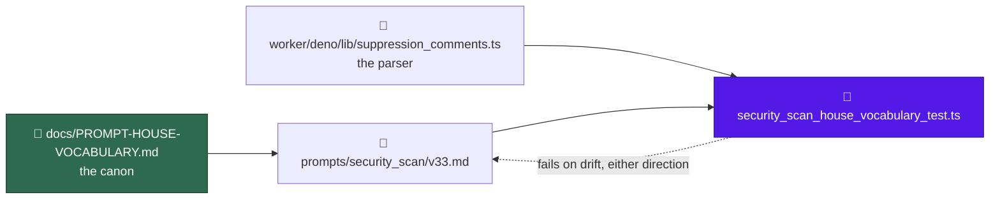

# prompt(security_scan): apply the house vocabulary

## Summary

`prompts/security_scan/` is the largest template in the scan family and the
only one still spelling the product name `VibeCoder` in prose. This sweep bumps
it to `prompts/security_scan/v33.md`, applying
[`docs/PROMPT-HOUSE-VOCABULARY.md`](../../PROMPT-HOUSE-VOCABULARY.md) — names
and casing only, no scan logic. Closes #837.

What changed in the template, all twelve hunks against `v32.md`:

- `VibeCoder` → `Vibe Coder` in the two prose sentences that carried it
  (`v33.md:222`, `v33.md:1155`) — the only one-word prose uses in the set.
- `the executor` → `the worker` for the Deno harness (`v33.md:16`, `:1626`).
- `idle task` → `idle-task` (`v33.md:865`).
- `### Stable finding ID recipe` → H2 (`v33.md:1609`), a peer of the phases.
- `## Phase 4 — File one issue per finding` regains the `(outcome-only)`
  suffix (`v33.md:1622`).
- `For each surviving finding …` becomes the family's H3 with the suppression
  parenthetical (`v33.md:1657`).
- `<!-- finding-id: <id> -->` → `<!-- finding-id: SEC-… -->` (`v33.md:1693`);
  the rendered example keeps `SEC-0123456789ab` (`v33.md:1718`).
- `{{ATTRIBUTION_FOOTER}}` is cited one way, "from the Inputs section"
  (`v33.md:1708`, `:1780`), which is true of where the placeholder sits
  (`v33.md:52`).
- The suppression step names `security-scan-ignore` and no longer calls the
  grammar shared (`v33.md:1667-1671`).

The suppression rewrite needed a second pass. Naming the keyword closed what
had been an open-ended list, which dropped the recognised
`// eslint-disable-next-line SEC-…` form and kept `// noqa: SEC-…`, a form
`worker/deno/lib/suppression_comments.ts` never matches (it has `hashNoqa`,
not a slash noqa). Either way round the prompt and the deterministic checker
would disagree about which waivers count — in a security scan, silently. The
step now names its own keyword and the two extra forms the parser really
honours, and a test drives the real parser in both directions.

`worker/deno/lib/suppression_comments.ts` is unchanged; the three keywords stay
namespaced.

## Evidence

Backend/prompt change — no web interface to screenshot. The evidence is the
test run and the diff:

- `deno test tests/security_scan_house_vocabulary_test.ts` — 8 tests, all pass.
- Each new guard was observed failing against the pre-fix text before it
  passed: the narrowed marker list failed on `eslint-disable-next-line`, the
  over-claimed list failed on `// noqa: SEC-0123456789ab`, and the wrap-aware
  prose ban failed on a hand-wrapped `the\nexecutor`.
- `git diff prompts/security_scan/v32.md prompts/security_scan/v33.md` is 12
  hunks, none touching severity bands, the four priority surfaces, or the
  gate-verdict rules.
- `./quality.sh` passes.

## Acceptance Criteria

<!-- vibe-spec-review inputs="diff+issue-body" -->

- **met** — #790 and #791 are merged before this lands — evidence: `cc375fe`
  and `9239fcd` are in the base; both effects survive in `v33.md:87` and
  `v33.md:1634` — reviewer: met
- **met** — exactly one new `prompts/security_scan/vN.md`, based on the latest
  version, no existing version modified — evidence: the branch diff adds
  `v33.md` only; `v32.md` was the highest on disk — reviewer: met
- **met** — the new file's H1 states its own version number — evidence:
  `prompts/security_scan/v33.md:1` reads `(v33)` — reviewer: met
- **met** — zero `VibeCoder` in prose; `Vibe Coder` throughout — evidence:
  `security_scan_house_vocabulary_test.ts::spells the product name Vibe Coder
  in prose` — reviewer: met
- **met** — no `the executor`, no bare `quality.sh`, no `idle task`, no
  lowercase `markdown` in prose — evidence:
  `security_scan_house_vocabulary_test.ts::calls the Deno harness the worker`
  and `::uses ./quality.sh, hyphenated idle-task and capital Markdown` —
  reviewer: met — reason: the reviewer noted two of the four bans were already
  satisfied by `v32.md` and required no edit; they are kept as
  reintroduction guards, matching the criterion's wording
- **met** — `## Stable finding ID recipe` is H2, `<!-- finding-id: SEC-… -->`
  is the placeholder, the rendered example keeps `SEC-0123456789ab` — evidence:
  `security_scan_house_vocabulary_test.ts::carries the family's shared
  headings` and `::uses the SEC-prefixed finding-id placeholder` — reviewer: met
- **met** — the template names `security-scan-ignore`, does not call the
  grammar shared, and `suppression_comments.ts` is unchanged — evidence:
  `security_scan_house_vocabulary_test.ts::names its own suppression keyword`
  and `::the suppression markers it names match the parser` — reviewer: partial
  — reason: the reviewer's `partial` was the narrowed marker enumeration, which
  dropped `// eslint-disable-next-line SEC-…` and kept the unparsed
  `// noqa: SEC-…`; fixed in `4a2fc66` and now pinned in both directions by a
  test that calls `findSuppressions` itself
- **met** — `git diff` against the base shows no change to severity bands,
  priority surfaces or gate-verdict rules — evidence: the two touches inside
  those regions are the product-name renames at `v33.md:222` and `:1155` —
  reviewer: met
- **met** — `./quality.sh` passes — evidence: full gate run after the final
  edit — reviewer: missing — reason: the reviewer was told not to run the gate
  and recorded "not assessed"; it was run here and passed
- **partial** — the scan-family heading table's issue-body rationale slot —
  evidence: `v33.md:1703`, `:1724` still read `## Why it is a bug` — reason:
  the issue and the canon both enumerate the banned variants
  (`## Why this is a candidate`, `## Why this is flagged`, `## Why it is safe
  to remove`) and `## Why it is a bug` is on neither list, so converting it
  would be a heading change the canon has not decided; the reviewer flagged it
  as worth a decision and this is the decision — reviewer: partial
- **unrequested** — the Phase 4 footer sentence drops the
  `<attribution_footer>` tag name along with the placeholder — reviewer:
  unrequested — reason: the canon's one-citation row requires "from the Inputs
  section" and this matches the already-swept `prompts/orphan_deps/v8.md`
- **unrequested** — the new test file
  `worker/deno/tests/security_scan_house_vocabulary_test.ts` — reviewer:
  unrequested — reason: the issue's Failure Detection names #840's
  cross-directory drift test, which has not landed; this route requires a
  failing test first, so the defects are pinned per-directory until it does
- **unrequested** — one word in `docs/PROMPT-HOUSE-VOCABULARY.md:109`,
  "the seventeen templates carrying the placeholder" →
  "the seventeen placeholder-carrying templates" — reviewer: unrequested —
  reason: `idle_task_count_docs_test.ts` reads the first shape as a claim about
  the 18-template registry and fails; that red is pre-existing on the milestone
  base (reproduced on a clean worktree at `76addc9`) and blocks this gate

## Standards Review

<!-- vibe-standards-review inputs="diff+CODING-STANDARDS.md" -->

- **violation** — the prompt told the run to honour `// noqa: SEC-…`, which the
  parser never matches, while the closed list dropped the recognised
  `// eslint-disable-next-line SEC-…` — evidence:
  `prompts/security_scan/v33.md:1667` — reason: fixed in `4a2fc66`; the step
  now names the forms `suppression_comments.ts` honours, and
  `security_scan_house_vocabulary_test.ts::the suppression markers it names
  match the parser` fails on either divergence
- **violation** — prose bans were line-scoped, so a hard-wrapped `the\nexecutor`
  would pass silently — evidence:
  `worker/deno/tests/security_scan_house_vocabulary_test.ts:35` — reason: fixed
  in `4a2fc66`; matching now runs over the joined prose with a line map, and
  was observed failing on a wrapped variant
- **violation** — `new URL(...).pathname` without `decodeURIComponent`, unlike
  the sibling helper landed in this milestone — evidence:
  `worker/deno/tests/security_scan_house_vocabulary_test.ts:23` — reason: fixed
  in `4a2fc66`
- **violation** — no PR summary — evidence:
  `docs/archive/pr-summaries/pr-summary-837.md` absent — reason: fixed by this
  file
- **violation** — DRY: the canon's house forms are restated as literals in the
  new test — evidence:
  `worker/deno/tests/security_scan_house_vocabulary_test.ts:139` — reason:
  stands. `prompt_house_vocabulary_doc_test.ts` parses the canon because it
  tests the canon; this file tests one template against it, and the
  parse-the-canon-for-all-15-directories test is Issue #840, which has not
  landed. When it does, this file is superseded
- **violation** — two assertions (bare `quality.sh`, lowercase `markdown`)
  cannot fail against the unfixed template — evidence:
  `worker/deno/tests/security_scan_house_vocabulary_test.ts:99` — reason:
  stands. They are named verbatim in acceptance criterion 5 as bans this file
  must satisfy, and they guard reintroduction on the next bump
- **violation** — `docs/SECURITY-SCAN.md:47` still says "the executor's" in the
  operator manual for this very prompt — evidence: `docs/SECURITY-SCAN.md:47` —
  reason: stands, deliberately. The canon scopes itself to prompt templates
  (`docs/PROMPT-HOUSE-VOCABULARY.md:28-31`), and `docs/MODEL-AND-CACHING.md:550`
  carries the same noun for an unrelated subsystem — sweeping the docs is a
  separate change, not a rename this diff introduced
- **clean** — Australian English on every added line; prompt immutability
  (`v32.md` untouched, H1 agrees with the filename per Issue #792); no doc
  cites `prompts/security_scan/v32.md`, and the live citations are range
  statements or explicitly pinned; the finding-id and attribution-footer canon
  rows satisfied and internally consistent; the test calls real code
  (`loadPrompt`, `findSuppressions`) rather than grepping source; no hidden
  paths staged; commit messages carry `(Issue #837)` and the
  `Vibe-Coder-Run-Id` trailer

## Test Plan

`worker/deno/tests/security_scan_house_vocabulary_test.ts` — 8 tests against
whatever version `loadPrompt("security_scan")` resolves, so a later bump that
reintroduces a banned variant fails here:

- spells the product name `Vibe Coder` in prose (repo slugs and URLs exempt),
  and asserts the two renamed sentences survive rather than being deleted
- calls the Deno harness `the worker`, scoped to the harness noun so
  "executor" stays usable as a finding-class word
- uses `./quality.sh`, hyphenated `idle-task` and capital `Markdown`
- carries the family's four shared headings, and rejects the H3 recipe
- uses the `SEC-`-prefixed finding-id placeholder and keeps the rendered
  twelve-hex-digit example
- names `security-scan-ignore` and does not call the grammar shared
- the suppression markers it names match the parser — drives
  `findSuppressions` over candidate markers in every comment syntax and fails
  both when the template omits a keyword the parser honours and when it spells
  out a form the parser cannot see
- cites the attribution footer one way, "from the Inputs section"

Existing suites re-run unchanged: `suppression_comments_test.ts` (75 assertions
across both families), `prompt_house_vocabulary_doc_test.ts`,
`idle_task_count_docs_test.ts`.
