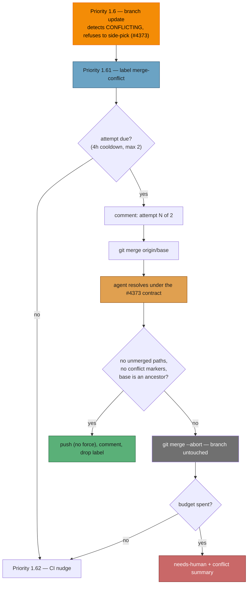

# PR Summary — Issue #84

## Summary

Nothing performed the "real merge" the branch updater defers to, so a PR born
`CONFLICTING` stayed that way indefinitely: GitHub runs no `pull_request`
workflows on a PR whose merge commit it cannot build (so the CI-fix queue never
fires), reviewers rarely comment on a PR that cannot merge (so the PR-feedback
queue never fires), and auto-merge only considers `MERGEABLE` PRs. The only
handler that touched such a PR was the CI nudge, uselessly.

This adds the missing receiver — an agent-backed **Priority 1.61
conflict-resolution pass** — and makes the stuck queue visible. Closes #84.

- **`worker/deno/lib/pr_merge_conflict_scan.ts`** — finds open worker PRs with
  `mergeable == CONFLICTING`, applies the `merge-conflict` label to every one it
  sees (so the queue is visible even for PRs it will not touch this pass), and
  returns one due candidate. Attempts are bounded: **one per PR per 4 hours,
  max 2**, tracked by marker comments on the PR itself so the bound holds across
  worker restarts and across fleet hosts. A PR already carrying `needs-human` is
  labelled but never claimed.
- **`worker/deno/lib/pr_merge_conflict_processor.ts`** — takes the cross-host PR
  lock, records the attempt **before** merging (so a worker that dies mid-merge
  still spends its attempt rather than looping), runs
  `git merge origin/<base>`, and hands the conflicted tree to an agent under the
  #4373 contract. It then enforces mechanically what it can: refuses to push a
  tree with unmerged paths or leftover conflict markers, aborts the merge on any
  failure (leaving the branch exactly as its author pushed it), verifies the base
  is genuinely an ancestor of the new tip, pushes **without force**, comments
  what was merged, and drops the label. The final failed attempt applies
  `needs-human` with a conflict summary instead of retrying forever.
- **`prompts/merge_conflict/v1.md`** + `buildMergeConflictPrompt` — the contract
  as a versioned prompt: both sides survive, the only exception is a genuine
  duplicate, contradictions abort and escalate, no rebase/force-push/branch
  recreation, and the repo's quality gate runs on the merged result (often the
  first time the PR's tests have run against current base code).
- **`worker/deno/lib/pr_branch_update.ts`** — the "needs a real merge" warning
  now fires **once per PR per process** rather than every ~2.5-minute pass; the
  `merge-conflict` label is the queue. The conflict is still recorded on every
  pass — only the log line is deduped.
- **`worker/deno/lib/worker_label_guard.ts`** — `merge-conflict` added to the
  Rule-of-Two allowlist, and the label add routed through the guarded
  `addLabelToIssue` chokepoint rather than a raw `gh pr edit --add-label`.

## Evidence

Backend/CLI change — no web interface to screenshot. Evidence is the test suite
plus the flow the change introduces.



`./quality.sh` output (all new tests pass; the 7 remaining failures are
pre-existing on a clean checkout of `main` in this container — verified by
re-running `fleet_health_test.ts`, `optional_feature_env_test.ts` and
`setup_workdir_reminder_test.ts` with the change stashed, which fails
identically):

```text
  deno tests                     FAILED   (14392 passed | 7 failed | 32 ignored)
  deno lint                      PASSED
  deno type check                PASSED
  deno fmt                       PASSED
  mermaid / markdownlint / prompt immutability / docs prompt versions  PASSED
```

## Test Plan

New — `worker/deno/tests/pr_merge_conflict_scan_test.ts` (16 tests):

- `parseConflictAttempts` counts attempt markers, tracks the latest timestamp,
  resets on a resolved marker, and ignores malformed comment entries.
- `isConflictAttemptDue` honours the cooldown, treats an unparseable timestamp as
  "not due", and `hasExhaustedConflictAttempts` binds at the budget.
- `findConflictingPr` returns and labels a conflicting PR; leaves a mergeable PR
  alone; does not re-add an existing label; labels but skips a PR carrying
  `needs-human`; holds a PR back inside its cooldown; returns one whose cooldown
  elapsed with the right `attemptCount`; refuses a PR at its cap; never lists a
  disallowed repo; and keeps scanning when one repo's listing fails.

New — `worker/deno/tests/pr_merge_conflict_processor_test.ts` (10 tests):

- Happy path: conflict resolved, pushed, resolved comment posted, label cleared.
- The attempt comment is posted **before** `git merge` runs (event ordering).
- A clean merge needs no agent.
- **Refuses to push** when the agent leaves conflict markers, and when it leaves
  unmerged paths — both abort the merge (the anti-side-pick guarantee).
- A base that is still not an ancestor of HEAD fails the attempt.
- The final failed attempt escalates: `needs-human` label plus a `**Why:**` /
  `**Next step:**` comment naming the conflicted files.
- A PR locked by another worker is left entirely alone (no git, no comments).

New — `worker/deno/tests/run_core_merge_conflict_dispatch_test.ts` (3 tests):
the slot exists between "Update PR Branches" and "Nudge Stalled CI", is
agent-backed, invokes `findAndProcessMergeConflict`, and is a no-op when a host
wires no handler.

Extended — `worker/deno/tests/pr_branch_update_test.ts`: the conflict warning
fires once across three consecutive passes over the same PR (while every pass
still records `status: "conflict"`), and each conflicting PR gets its own
warning.

Docs kept in step by the existing gates: `priority_ladder_docs_test.ts` (the
1.61 tier in `docs/workflows/README.md` and `docs/USAGE.md`) and
`page_titles_completeness_test.ts` (the new `docs/workflows/merge-conflicts.md`
page). `README.md` documents the `merge-conflict` label.
