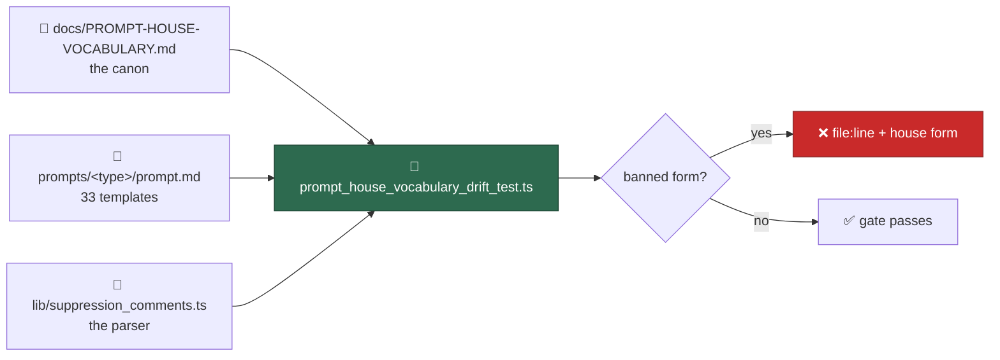

# Pin the prompt house vocabulary with a drift test over every template

## Summary

The sweeps of #835–#839 fixed the wording across all 33 prompt directories.
This is the half that keeps it fixed:
`worker/deno/tests/prompt_house_vocabulary_drift_test.ts` reads every
directory's template through the real `loadPrompt()` and fails — naming the
file, the line and the house form — when a banned term, heading variant,
suppression claim or footer citation from `docs/PROMPT-HOUSE-VOCABULARY.md`
reappears. There is no waiver list: a sweep that has not landed is a red test,
which is the signal. Closes #840.

Three things make it survive the next prompt bump:

- **Every directory, always.** The template set is discovered off disk, so a
  new prompt directory is governed the day it lands. Issue #844 removed the
  `vN.md` scheme, so "the latest template" is that directory's one
  `prompt.md` — there is no version to hard-code, and `getLatestVersion()` no
  longer exists to call.
- **Families computed, not listed.** The scan family is every template
  carrying a `Stable finding ID recipe` section; the interactive family is
  every non-scan template that renders placeholders of its own and opens at
  H2. Both are cross-checked against the canon's Families table, so a
  directory that escapes both families fails loudly instead of quietly losing
  its heading rules.
- **Rules that catch variants nobody has invented yet.** A heading rule says
  which headings *claim* a shared section (`^Why\b`, `^Suggested\b`, …) and
  then demands the house spelling, so `## Why it is a bug` is caught by the
  same rule that catches `## Why this is flagged`. The banned-variant list
  folds case with the house spellings exempted first, so every re-casing of a
  house heading is banned by construction rather than by being listed.



### Drift the gate exposed, swept here

Four templates still cited the attribution footer from a source other than the
Inputs section — `` from `<attribution_footer>` `` in `prompts/test_audit/`,
`prompts/github_actions_audit/` and `prompts/private_repo_reference_audit/`,
"from the input above" in `prompts/retro/`. The canon says the placeholder is
cited exactly one way, so they are swept to the house form in this PR and the
canon's Literals row now records that naming any other source is the same
drift.

### Fail-loud in the projection the gate reads

The prose projection segments on ` ``` ` lines, so one stray fence inverted the
parity for the rest of a template: up to 97% of its prose dropped out and all
six banned-literal rules passed over text they never read — a green gate over
an unread file. Both projections now raise on an unbalanced fence, naming the
line it opened on; the all-directory gate re-raises with the file name and
holds a per-template retention floor (half the bytes; the shipped set keeps 69%
at worst) as a second guard.

## Evidence

Backend/CLI change with no web interface, so the evidence is test output.

**Green against the swept templates**
(`deno test tests/prompt_house_vocabulary_drift_test.ts tests/prompt_prose_test.ts tests/security_scan_house_vocabulary_test.ts`):

```text
ok | 41 passed | 0 failed (243ms)
```

**Red when a banned variant is reintroduced.** Variants were reinstated in four
directories and the gate named each one, with its file, its line and the form
to use:

```text
house vocabulary - the Deno harness is the worker (Issue #840) => FAILED
  the house noun for the Deno harness is `the worker`:
  prompts/ci_fix/prompt.md line 6: the executor

house vocabulary - the scan family writes each shared heading one way (Issue #840) => FAILED
  prompts/dead_code/prompt.md:359 — Issue-body fix slot is written
    "## Suggested action"; the house form is "## Suggested fix"

house vocabulary - the scan family's banned heading variants are absent everywhere (Issue #840) => FAILED
  prompts/question/prompt.md:196 — "## Hard constraints (apply throughout)" is
    a banned variant; see docs/PROMPT-HOUSE-VOCABULARY.md

house vocabulary - the interactive family writes each shared heading one way (Issue #840) => FAILED
  prompts/issue/prompt.md:393 — Worked examples is written
    "### Worked examples"; the house form is "### Worked Examples"

house vocabulary - the attribution footer is cited from the Inputs section (Issue #840) => FAILED
  prompts/dead_code/prompt.md line 365: attribution footer line from the end of
    this — the house citation is "from the Inputs section"
```

**Red when the projection would read nothing.** One stray fence prepended to
`prompts/ci_fix/prompt.md`, with five banned literals planted after it:

```text
error: Error: prompts/ci_fix/prompt.md — Error: unbalanced fences: the ``` opened
on line 154 is never closed, so everything after it would silently drop out of
the projection this gate reads
```

Every one of those edits was reverted before committing; `git status` is clean
of them.

## Acceptance Criteria

<!-- vibe-spec-review inputs="diff+issue-body" -->

- **met** — the test file exists and passes against the swept templates —
  evidence: `worker/deno/tests/prompt_house_vocabulary_drift_test.ts`, 19 tests
  green — reviewer: met
- **partial** — every banned literal and heading variant asserted absent across
  all 33 directories — evidence: `prompt_house_vocabulary_drift_test.ts:381-526`
  (literals) and `:543-594` (variants) — reviewer: partial — reason: the
  reviewer found the variant list matched case-sensitively, so a re-cased
  variant outside the scan family slipped through; fixed in `7c3ae7a` by
  folding case with the house spellings exempted first, and the reviewer's own
  repro (`## Hard constraints (apply throughout)` in `prompts/question/`) now
  fails with file and line
- **partial** — each house heading asserted present in the family that owns it —
  evidence: `:614-621` (`## Hard Constraints …`, `## Stable finding ID recipe`
  per template), `:654` (`## Suggested fix` where the template shows the body
  it files), `:629` (the filing sub-heading where the template declares a
  filing phase), `:664-679` and `:743-751` (`## Why this matters`,
  `## Project Guidelines`, `### Worked Examples` live in their family) —
  reviewer: partial — reason: presence is per template only where the
  template's own content says it owns the section; which scans carry a
  rationale slot at all is a presence gap the canon puts in #841, so those
  three are asserted live-in-the-family rather than per template
- **met** — family membership computed from template content; no hard-coded
  `vN`, no hard-coded directory list — evidence: `isScan`/`isFragment`/
  `isInteractive` at `:120-148`, `PROMPT_FILENAME` throughout — reviewer: met
- **met** — each exemption has a case proving it does not fire — evidence: repo
  slug/URL/path `:388-399`, `./quality.sh` `:435-440`, `### Planning
  Guidelines` `:760-780`, `## Why this scan exists` `:580-590`, code spans and
  fences `tests/prompt_prose_test.ts:44-58` — reviewer: met
- **met** — the test fails with a file-and-line message when a banned variant is
  reintroduced, demonstrated in the PR description — evidence: the Evidence
  section above — reviewer: met
- **met** — no waiver or allowlist of unswept files — evidence: none in the
  file; four templates were swept instead — reviewer: met
- **met** — cross-checks named suppression keywords against
  `worker/deno/lib/suppression_comments.ts` — evidence: `markerLiterals()` and
  `findSuppressions()` at `:826-884` — reviewer: met
- **partial** — `./quality.sh` passes — evidence: full gate run after the final
  edit — every check passes but `deno tests`, which reports
  `16875 passed | 2 failed`; both failures
  (`service_account_env_test.ts::applyServiceAccountEnv - an unwritable gh
  config dir is restaged writable` and
  `setup_prerequisites_test.ts::checkContainerPrerequisites - fails when the
  image is not buildable`) reproduce identically on the milestone base branch
  in a clean worktree, are in files this diff does not touch, and read host
  state (`GH_CONFIG_DIR`, the container image) — reviewer: missing — reason:
  the reviewer's run hit a 590s sandbox timeout before the test stage
  finished; it verified `deno fmt`, `deno lint` and `deno check` clean on
  every changed file
- **unrequested** — `worker/deno/tests/support/prompt_prose.ts` and
  `worker/deno/tests/prompt_prose_test.ts` — reviewer: unrequested — reason:
  the projections were already in the #837 gate; a second copy here would drift
  from it exactly as the templates drifted from each other, so they are shared
  and unit-tested rather than duplicated
- **unrequested** — four prompt templates swept to the house footer citation —
  reviewer: unrequested — reason: the issue forbids a waiver list, so drift the
  gate exposes is swept, not deferred
- **unrequested** — `docs/PROMPT-HOUSE-VOCABULARY.md` gains a Literals sentence
  that naming any other source is the same drift — reviewer: unrequested —
  reason: the canon changes first and the test enforces it; without that
  sentence the sweep above would read as a template edited ahead of the canon
- **unrequested** — the `(outcome-only)` filing-phase suffix, four extra banned
  variants, the `Injected fragment` / `Lightweight audit` families and the
  `from the end of this prompt` literal — reviewer: unrequested — reason: each
  is a row of `docs/PROMPT-HOUSE-VOCABULARY.md` the issue's tables summarise
  rather than replace; the canon is named as the source of truth, so the test
  enforces its rows

## Standards Review

<!-- vibe-standards-review inputs="diff+CODING-STANDARDS.md" -->

- **violation** — the shared prose projection lost the non-vacuity guard the
  #837 gate had, so one unbalanced fence silently removed 92–97% of a
  template's prose and the gate still reported green — evidence:
  `worker/deno/tests/support/prompt_prose.ts:48` — reason: fixed in `b425599`;
  both projections now raise on an unbalanced fence and the all-directory gate
  adds a per-template retention floor
- **violation** — `flattenProse` had no test for an unterminated fence, its
  most damaging edge case — evidence:
  `worker/deno/tests/prompt_prose_test.ts:111` — reason: fixed; the case now
  drives both projections and asserts the balanced-fence control does not fire
- **violation** — the summary said three templates were swept while the diff
  swept four (`prompts/private_repo_reference_audit/`) — evidence:
  `docs/archive/pr-summaries/pr-summary-840.md:57` — reason: corrected above
- **violation** — the Test Plan omitted `worker/deno/tests/prompt_prose_test.ts`
  — evidence: `docs/archive/pr-summaries/pr-summary-840.md:103` — reason: added
  below
- **clean** — Australian English throughout; Deno-native tooling only (`deno
  fmt`/`lint`/`check` clean, `@std/assert`, no Node regression); fail-loud
  (`promptDirectories` re-raises anything but `NotFound`, `lineAt` throws
  rather than mislabelling, `hitsIn` rejects a non-global or literal-space
  pattern, no empty catch); tests drive real code (`loadPrompt`,
  `findSuppressions`, the real projections) rather than grepping source; no
  wall-clock assertions; no hidden or credential paths staged; doc comments on
  every exported symbol; commit messages carry `(Issue #840)` and the
  `Vibe-Coder-Run-Id` trailer; markdownlint and Mermaid clean

## Test Plan

- Added `worker/deno/tests/prompt_house_vocabulary_drift_test.ts` — 19 tests:
  - discovery and family classification cross-checked against the canon;
  - six banned literals over every template (`VibeCoder` in prose, `the
    executor`, bare `quality.sh`, `idle task`, lowercase `markdown`, the
    generic `<!-- finding-id: <id> -->` placeholder), each with a synthetic
    case proving its exemptions do not fire and one proving the banned form is
    still caught;
  - scan-family headings: one spelling per shared section, the canon's banned
    variants asserted zero across *all* directories and case-folded so a
    re-casing cannot escape, each scan asserted to carry the sections its own
    content says it owns, and the filing phase's `(outcome-only)` suffix;
  - interactive-family headings: the opening `## <X> Mode`, `## Project
    Guidelines`, `### Worked Examples`, with the `### Planning Guidelines`
    carve-out proved not to widen (a bare `### Guidelines` is still caught);
  - suppression prose plus a cross-check that parses every marker literal the
    templates spell out through the real `findSuppressions()`, so a template
    advertising a keyword `worker/deno/lib/suppression_comments.ts` does not
    implement fails here;
  - the attribution-footer citation, read with the fenced issue bodies included
    so the thirteen scans that state it inside the body they file are covered.
- Added `worker/deno/tests/prompt_prose_test.ts` — 11 tests over the shared
  projections: the prose/heading happy paths, the fence and code-span
  exemptions, the keep-the-code projection, a phrase split by the hard wrap,
  and each of the four faults the module raises rather than swallows.
- Added `worker/deno/tests/support/prompt_prose.ts` — the prose projection, its
  matcher and an ATX heading scanner, extracted so this gate and the
  `security_scan` gate share one copy rather than two that can drift.
- `worker/deno/tests/security_scan_house_vocabulary_test.ts` now imports those
  helpers instead of holding its own copy; its ten tests are unchanged and
  still pass, including its "the prose matcher is not vacuous" control.
- Merged the milestone branch (28 commits, including the #841 prompt sweeps)
  into this branch; the gate still passes over the updated templates, which is
  the point of computing families and versions dynamically.
- `./quality.sh` run in full: every check passes except two pre-existing
  host-environment test failures documented above, which reproduce unchanged
  on the milestone base branch.
</content>
