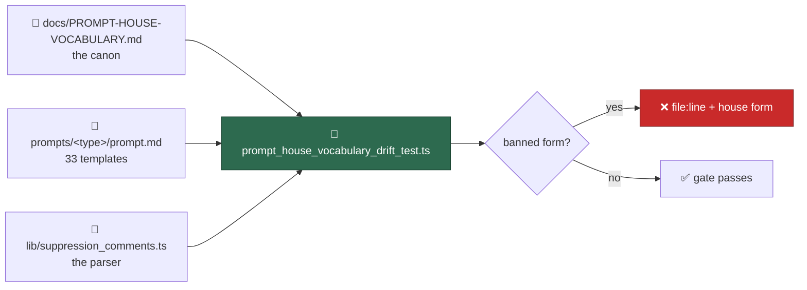

# Pin the prompt house vocabulary with a drift test over every template

## Summary

The sweeps of #835–#839 fixed the wording across all 33 prompt directories.
This is the half that keeps it fixed: `worker/deno/tests/prompt_house_vocabulary_drift_test.ts`
reads every directory's template through the real `loadPrompt()` and fails —
naming the file, the line and the house form — when a banned term, heading
variant, suppression claim or footer citation from
`docs/PROMPT-HOUSE-VOCABULARY.md` reappears. There is no waiver list: a sweep
that has not landed is a red test, which is the signal. Closes #840.

Three things make it survive the next prompt bump:

- **Every directory, always.** The template set is discovered off disk, so a
  new prompt directory is governed the day it lands. Issue #844 removed the
  `vN.md` scheme, so "the latest template" is that directory's one
  `prompt.md` — there is no version to hard-code, and `getLatestVersion()` no
  longer exists to call.
- **Families computed, not listed.** The scan family is every template
  carrying a `Stable finding ID recipe` section; the interactive family is
  every non-scan template that renders placeholders of its own and opens at
  H2. Both are cross-checked against the canon's Families table, so a
  directory that escapes both families fails loudly instead of quietly losing
  its heading rules.
- **Rules that catch variants nobody has invented yet.** A heading rule says
  which headings *claim* a shared section (`^Why\b`, `^Suggested\b`, …) and
  then demands the house spelling, so `## Why it is a bug` is caught by the
  same rule that catches `## Why this is flagged`.



### Drift the gate exposed, swept here

Three templates still cited the attribution footer from a source other than
the Inputs section — `` from `<attribution_footer>` `` in
`prompts/test_audit/` and `prompts/github_actions_audit/`, "from the input
above" in `prompts/retro/`. The canon says the placeholder is cited exactly one
way, so they are swept to the house form in this PR and the canon's Literals
row now records that naming any other source is the same drift.

## Evidence

Backend/CLI change with no web interface, so the evidence is test output.

**Green against the swept templates** (`deno test tests/prompt_house_vocabulary_drift_test.ts`):

```text
ok | 19 passed | 0 failed (240ms)
```

**Red when a banned variant is reintroduced.** Four variants were reinstated in
four directories and the gate named each one, with its file, its line and the
form to use:

```text
house vocabulary - the Deno harness is the worker (Issue #840) => FAILED
  the house noun for the Deno harness is `the worker`:
  prompts/ci_fix/prompt.md line 110: The executor

house vocabulary - the scan family writes each shared heading one way (Issue #840) => FAILED
  prompts/dead_code/prompt.md:359 — Issue-body fix slot is written
    "## Suggested action"; the house form is "## Suggested fix"
  prompts/format_drift/prompt.md:85 — Hard constraints is written
    "## Hard constraints (apply to every phase)"; the house form is
    "## Hard Constraints (apply to every phase)"

house vocabulary - the interactive family writes each shared heading one way (Issue #840) => FAILED
  prompts/issue/prompt.md:393 — Worked examples is written
    "### Worked examples"; the house form is "### Worked Examples"

house vocabulary - the product is Vibe Coder in prose (Issue #840) => FAILED
  the house form is `Vibe Coder` with a space in prose (the repo slug, URLs
  and paths keep the one word):
  prompts/grill-me/prompt.md line 13: VibeCoder
```

Every one of those edits was reverted before committing; `git status` is clean
of them.

## Acceptance Criteria

<!-- vibe-spec-review inputs="diff+issue-body" -->

PLACEHOLDER_SPEC

## Standards Review

<!-- vibe-standards-review inputs="diff+CODING-STANDARDS.md" -->

PLACEHOLDER_STANDARDS

## Test Plan

- Added `worker/deno/tests/prompt_house_vocabulary_drift_test.ts` — 19 tests:
  - discovery and family classification cross-checked against the canon;
  - six banned literals over every template (`VibeCoder` in prose, `the
    executor`, bare `quality.sh`, `idle task`, lowercase `markdown`, the
    generic `<!-- finding-id: <id> -->` placeholder), each with a synthetic
    case proving its exemptions do not fire and a synthetic case proving the
    banned form still is caught;
  - scan-family headings: one spelling per shared section, the canon's banned
    variants asserted zero across *all* directories, each scan asserted to
    carry the sections its own content says it owns, and the filing phase's
    `(outcome-only)` suffix;
  - interactive-family headings: the opening `## <X> Mode`, `## Project
    Guidelines`, `### Worked Examples`, with the `### Planning Guidelines`
    carve-out proved not to widen (a bare `### Guidelines` is still caught);
  - suppression prose plus a cross-check that parses every marker literal the
    templates spell out through the real `findSuppressions()`, so a template
    advertising a keyword `worker/deno/lib/suppression_comments.ts` does not
    implement fails here;
  - the attribution-footer citation.
- Added `worker/deno/tests/support/prompt_prose.ts` — the prose projection,
  its matcher and an ATX heading scanner, extracted so this gate and the
  `security_scan` gate share one copy rather than two that can drift.
- `worker/deno/tests/security_scan_house_vocabulary_test.ts` now imports those
  helpers instead of holding its own copy; its ten tests are unchanged and
  still pass, including its "the prose matcher is not vacuous" control.
- `./quality.sh` run in full.
