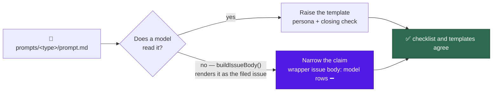

# prompt: close the persona and verification-section presence gaps

## Summary

`docs/PROMPT-BEST-PRACTICES-CHECKLIST.md` claimed two standards a subset of the
prompt set did not meet. Row 5 ("Give Claude a role") scored a persona line four
templates did not carry, and the scan family shared a `### Verification before
exit` closing check that only seven of fifteen templates carried under that
heading. Closes #841.

The issue asked for a decision per gap — raise the templates, or narrow the
claim. Both were taken, split by surface kind:

- **Raised the closing check.** All fifteen scan-family templates now carry
  `### Verification before exit`. The eight that lacked it already carried the
  same check as an unheaded tail paragraph — under `### Required label set` in
  seven, under the issue-body section in `prompts/retro/` — so the section was
  promoted out of the label list and now opens by naming what it re-reads: the
  issues the run itself filed.
- **Raised the shared persona.** `duplicated_knowledge` and
  `private_repo_reference_audit` both opened as "a repository reviewer". They
  are now a **duplication auditor** and a **repository-boundary auditor**; all
  fifteen scans open as something distinct.
- **Narrowed the claim for the four.** `alert_feed`, `bash_script_refs`,
  `bash_syntax_audit` and `workflow_annotation_scan` are native scans: their
  `prompt.md` is rendered as the *filed idle-task issue body* by
  `buildIssueBody()`, and the scan runs in Deno with no model turn. Giving them
  a persona would be a role line addressed to nobody — context paid for no
  behaviour, which house row H2 bans. The checklist instead records a third
  surface kind, the **wrapper issue body**, whose model-behaviour rows are ➖.

**Version files.** The issue's constraint to land the change as a new `vN.md`
is stale: Issue #844 removed the `vN.md` scheme, and
`docs/PROMPT-HOUSE-VOCABULARY.md` already records that a fix is an edit to
`prompt.md` with git history as the record. Every template is edited in place.

## Evidence

Backend/prompt-text change with no web interface, so no screenshot applies.
The evidence is the test run and the gate.

`worker/deno/tests/prompt_presence_gaps_test.ts` was written first and observed
red against the unfixed tree — 5 failed / 3 passed, failing on the shared
persona, the eight missing headings, and both document claims. After the change
the same file is 8/8 green.

The exemption is not asserted, it is verified: `the exempt prompts really are
rendered as the filed issue body` calls each registered idle-task template's
`buildIssueBody()` and compares the result to `prompt.md` split on
`{{ATTRIBUTION_FOOTER}}`. If one of the four ever became a real model prompt,
that test goes red and the ➖ rows lose their basis.

**Quality gate.** `./quality.sh` passes every stage except `deno tests`, which
reports exactly two failures:

- `tests/service_account_env_test.ts::applyServiceAccountEnv - an unwritable gh
  config dir is restaged writable`
- `tests/setup_provider_credential_flow_test.ts::setup.sh - a Codex-only host
  with no claude CLI reaches the configuration-writing stage`

Both are pre-existing container-environment failures, not regressions: the same
two fail at the merge base `f71e983` in a clean worktree with the identical
command, and neither file is touched by this diff. (The run also needs
`CONFIG_FILE` and `CONFIG_PATH` unset — this container exports both pointing at
different files, which the setup suite fails loudly on by design.) The whole
rest of the suite, including all 38 tests across the three prompt/doc files this
change touches, is green.

## Acceptance Criteria

<!-- vibe-spec-review inputs="diff+issue-body" -->

- **met** — a decision is recorded for each of the two gaps — evidence:
  `docs/PROMPT-BEST-PRACTICES-CHECKLIST.md:48` (wrapper-issue-body kind) and
  `docs/PROMPT-HOUSE-VOCABULARY.md` "Out of scope" — reviewer: met
- **met** — the templates and the checklist agree afterwards — evidence:
  `docs/PROMPT-BEST-PRACTICES-CHECKLIST.md:73` now names the surface-kind
  exemption as the one ➖ a row's own cell does not restate — reviewer: partial
  — reason: the reviewer saw the first pass, where the prose exempted rows 3, 6,
  9 and 10–22 while only row 5's cell was updated; that contradiction is fixed
  in the follow-up commit it did not see
- **met** — `duplicated_knowledge` and `private_repo_reference_audit` no longer
  share a line — evidence: `prompts/duplicated_knowledge/prompt.md:3`,
  `prompts/private_repo_reference_audit/prompt.md:3`, pinned by
  `worker/deno/tests/prompt_presence_gaps_test.ts::no two scans share a persona`
  — reviewer: met. The other half of this criterion is conditional on adding
  personas to the four, which the recorded decision declines
- **met** — `### Verification before exit` uses that exact heading and says what
  to re-read — evidence: all fifteen scans, pinned by
  `prompt_presence_gaps_test.ts::every scan carries the verification-before-exit
  section` and `::each verification section names the filed issues it re-reads`
  — reviewer: met
- **missing** — any changed template lands as a new `vN.md` with a correct H1 —
  reviewer: missing — reason: the constraint is obsolete; Issue #844 removed the
  `vN.md` scheme and no `v*.md` exists in the tree, so the house form is an
  in-place edit to `prompt.md`. The reviewer independently reached the same
  conclusion and called the issue body stale here
- **partial** — `./quality.sh` passes, including the #840 vocabulary test —
  evidence: full gate run after the final edit; every stage green except two
  pre-existing environment failures reproduced at the merge base — reviewer:
  missing — reason: the reviewer saw only the diff and could not run the gate.
  The #840 half is vacuous: `prompt_house_vocabulary_drift_test.ts` has not
  landed
- **unrequested** — the checklist exempts the four from rows 3, 6, 9 and 10–22,
  not row 5 alone — evidence:
  `docs/PROMPT-BEST-PRACTICES-CHECKLIST.md:60` — reason: the criterion is "no
  row scores a standard a template is exempt from without saying so"; stopping
  at row 5 would leave the same silent failure on every other model-behaviour
  row
- **unrequested** — `worker/deno/tests/prompt_presence_gaps_test.ts` is new —
  reason: the issue's Failure Detection section says the decision has no runtime
  detector and must be caught at PR review; this test is that detector, and TDD
  requires it regardless
- **unrequested** — `docs/PROMPT-HOUSE-VOCABULARY.md` settles the
  attribution-footer / `## Inputs` question for the four — reason: the page's
  own text deferred that question to this issue by name, so leaving it open
  would strand a dangling delegation

## Standards Review

<!-- vibe-standards-review inputs="diff+CODING-STANDARDS.md" -->

- **violation** — the checklist's per-row `n/a` rule contradicted the new
  surface-kind prose — evidence:
  `docs/PROMPT-BEST-PRACTICES-CHECKLIST.md:73` — reason: fixed here; the rule
  now names the surface-kind exemption as its one exception
- **violation** — the vocabulary's Scope bullet said a presence gap is "not a
  variant of anything recorded here" while the page recorded the heading —
  evidence: `docs/PROMPT-HOUSE-VOCABULARY.md:35` — reason: fixed here; Scope now
  states when a settled presence question earns a row
- **violation** — the distinctness test dropped any scan with no role noun
  (`retro`) silently, against the fail-loud rule — evidence:
  `worker/deno/tests/prompt_presence_gaps_test.ts:195` — reason: fixed here; the
  identity falls back to the persona's first sentence, so every scan is scored
  and a template with no opening persona now asserts rather than skips
- **violation** — the test re-implemented `tests/support/repo_prompts.ts`
  (DRY) — evidence: `worker/deno/tests/prompt_presence_gaps_test.ts:45` —
  reason: fixed here; it imports `REPO_ROOT` from the side-effect-free
  `tests/support/repo_root.ts` and pins `prompts/` by naming the directory in
  each load, rather than by clearing `PROMPTS_DIR`/`VIBE_BASE_DIR` as an import
  side effect — mutating the process would push the suite into the gate's
  serial pass (Issues #880, #940)
- **violation** — the canon row claimed all eight unheaded checks sat under
  `### Required label set`, which is false for `prompts/retro/` — evidence:
  `docs/PROMPT-HOUSE-VOCABULARY.md:86` — reason: fixed here; the rationale
  states what is on disk
- **violation** — the eight edited sections left ragged two-word wraps —
  evidence: `prompts/best_practices/prompt.md:550` — reason: fixed here; all
  eight reflowed to the file's own wrap width
- **clean** — Australian English throughout (behaviour, artefact, organisation);
  no hidden path staged, no `git add -f`, no `--no-verify`; both commits carry
  the `Vibe-Coder-Run-Id` trailer; every template edited in place at
  `prompts/<type>/prompt.md` with no new versioning surface; the wrapper-body
  test calls real registered templates with real data rather than grepping
  source; family membership derived from template text, never hard-coded

## Test Plan

- **Added** `worker/deno/tests/prompt_presence_gaps_test.ts` — eight tests:
  every scan opens with a persona; no two scans share a persona; every scan
  carries exactly one `### Verification before exit`; each such section names
  the filed issues it re-reads and how to fix a deviation; the checklist records
  the wrapper-issue-body kind and cites all four directories; row 5's `n/a` cell
  names it; each of the four is genuinely rendered as the filed issue body by
  its registered template's `buildIssueBody()`; and the vocabulary points at
  where the decision landed.
- **Updated** `worker/deno/tests/prompt_house_vocabulary_doc_test.ts` — the
  scan-family heading table gained a row, so `SCAN_HEADINGS` gains
  `### Verification before exit` and its banned variants. No test removed or
  weakened.
- **Updated** `worker/deno/tests/prompt_best_practices_checklist_test.ts` — the
  applicability test now covers all three surface kinds and requires the
  wrapper-issue-body row to cite `buildIssueBody` as its evidence.
- **Regression cover**: the new file was observed red (5 failed / 3 passed)
  against the unfixed tree and green (8 passed) after the change.
