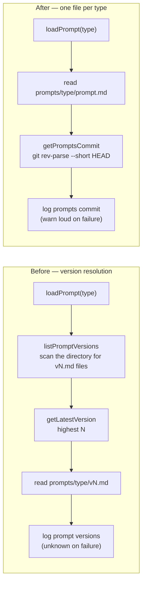

# Remove prompt template versioning (`vN.md`)

## Summary

Prompt templates were stored as immutable `vN.md` files — 357 of them across 33
types — and the worker resolved the highest-numbered file at runtime. That
convention only made sense while the repo was private and history travelled in a
zip. The repo is public, so git history is the record.

Each type now holds exactly one editable template at `prompts/<type>/prompt.md`,
and every mechanism that existed to support versioning is gone with it:

- **Prompts** — the latest `vN.md` of each type was renamed to `prompt.md` and
  the 324 older versions deleted (history stays in git). H1 `(vN)` suffixes were
  dropped from the templates, superseding #792.
  `prompts/best_practices/buckets/` is untouched.
- **`worker/deno/lib/prompt_manager.ts`** — `listPromptVersions`,
  `getLatestVersion` and `validatePromptImmutability` are removed. `loadPrompt`
  takes `(promptName, promptsDir?)` and reads `prompts/<type>/prompt.md`
  directly, still returning an error — now naming the missing file — when it is
  absent.
- **Traceability** — the per-run "Using prompt versions" log entry is replaced by
  the checkout's git short commit hash. New `getPromptsCommit()` resolves it and
  **fails loud**: the execute phase logs a warning naming the git error rather
  than the old `"unknown"` placeholder that masked a broken checkout.
  `recordPromptVersion` became `recordPromptCommit`.
- **Gates** — the prompt-immutability check is removed from
  `quality_gate.ts` / `baseline_gate.ts`, and the docs prompt-version freshness
  check (`docs_prompt_version_check.ts`) is deleted with its test.
- **CLI** — `prompt-manager` drops `get-latest-version`, `list-versions` and
  `validate-immutability`; `record-version` becomes `record-commit`. No doc,
  script or workflow referenced the removed operations.
- **Tests** — the migration exposed a latent fault: any test reaching the real
  `loadPrompt` without naming a directory resolved it through `PROMPTS_DIR` /
  `VIBE_BASE_DIR`, which a worker host exports at the *worker's own* checkout.
  Those tests were reading another clone's `prompts/` and passed only while its
  layout matched. New `worker/deno/tests/support/repo_prompts.ts` drops both
  overrides so resolution falls through to the module-relative path; the 26
  affected files call `pinPromptsToThisCheckout()` at module scope, and the
  eight duplicated `withRepoRootCwd` helpers collapse into it.
- **Docs** — `CODING-STANDARDS.md` § Prompt Templates, `docs/EXTENDING.md`,
  `docs/PROMPTS.md`, `AGENTS.md`, `DESIGN-PRINCIPLES.md`, `README.md` and every
  other doc naming a versioned path now refer to `prompts/<type>/prompt.md` or
  the directory alone. `docs/archive/pr-summaries/` and the archival
  `docs/security/cloudflare-security-audit-gap-analysis.md` keep their historical
  version citations — they are records of what was true at the time.

Closes #844.

## Evidence

This is a backend/CLI change with no web interface to screenshot, so the
evidence is the test suite and the full quality gate.

How a run resolves its template, before and after:

- `deno test` — **16,797 passed**. The only failures left are 35 in six
  `setup_*` / `service_account_env` files that spawn a bash harness; the same
  six files fail with the identical 35 count on a `main` worktree in this
  container (`FAILED | 76 passed | 35 failed`), so they are pre-existing and
  environmental, not caused by this change.
- `./quality.sh < /dev/null` — every check passes except `deno tests`, which
  carries only those 35 pre-existing failures: benchmark audit, hardcoded
  branch names, needs-human chokepoint, gh spawn chokepoint, host work-dir
  guard, git ref chokepoint, workflow hygiene, source targets, mermaid,
  markdownlint, semgrep, deno lint, deno type check and deno fmt are all
  `PASSED`.
- The six pre-existing failures come from a bash harness that `source`s
  `setup.sh` with a stripped environment (`worker/deno/tests/setup_lockfile_test.ts:45`);
  it exits 1 in this container on `main` as well, so it is unrelated to
  prompt versioning and out of scope here.
- 324 `vN.md` files deleted, 33 renamed to `prompt.md`; `find prompts -name
  'v[0-9]*.md'` returns nothing.

## Test Plan

Added or rewritten in `worker/deno/tests/prompt_manager_test.ts`:

- `loads the type's prompt.md, not a versioned file`
- `returns an error naming the missing file`
- `errors when the directory exists but prompt.md does not`
- `no versioned prompt files remain in the tree`
- `records the prompts commit to a log file` / `appends multiple commit entries`
- `recordPromptCommit fails loud on an unwritable path`
- `getPromptsCommit - resolves the short HEAD hash of the checkout`
- `getPromptsCommit - fails loud outside a git checkout`

Modified elsewhere:

- `worker/deno/tests/prompt_hash_test.ts` — the static hash no longer carries a
  version identifier; the template content itself is the key.
- `worker/deno/tests/quality_gate_test.ts`, `baseline_gate_test.ts` — the
  prompt-immutability check is no longer expected in the check list.
- ~50 prompt-content tests now load `prompts/<type>/prompt.md` instead of
  iterating versioned files.
- 26 processor/idle-task test files (`grill_me_processor_test.ts`,
  `pr_ci_processor_test.ts`, `raise_all_idle_tasks_test.ts`, …) call
  `pinPromptsToThisCheckout()` so they read this checkout's templates rather
  than whatever `PROMPTS_DIR` points at on the host.

Removed (documented business-logic change — the feature under test is gone):

- `worker/deno/tests/docs_prompt_version_freshness_test.ts` — covered
  `docs_prompt_version_check.ts`, the docs prompt-version freshness gate deleted
  by this change.
- The prompt-immutability assertions in the quality-gate tests — there is no
  immutability rule to enforce once templates are editable in place.
