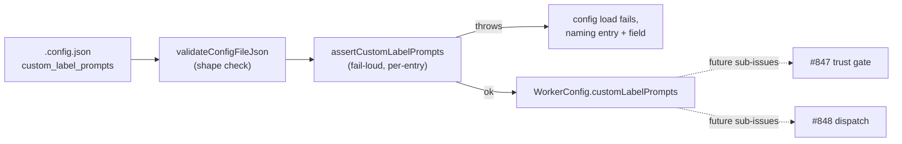

## Summary

Adds a `custom_label_prompts` `.config.json` key: an array of GitHub label →
absolute host prompt-file mappings, parsed and validated **fail-loud** at
config load. This is the config-validation half of #843 (custom label-to-
prompt extension points) — the trust gate (#847) and dispatch (#848) are
separate, dependent sub-issues and are not touched here. Closes #846.

The referenced precedent `worker/deno/lib/run_callbacks_config.ts` does not
exist on this branch (it lives on an unrelated, unmerged milestone), so the
new module instead follows `lib/container_tools_config.ts`'s fail-loud
posture — the closest real precedent in this codebase (`parse*`/`assert*`
split, `Result<T, string>`, first-fault-wins).

Every fault throws from `loadConfig`, naming the entry index and field: a
non-array value, a non-object entry, a missing/empty/non-string `label` or
`prompt_path`, control characters, a relative path, a missing/unreadable
prompt file, a duplicate label, or a label colliding with `RESERVED_LABELS`
(which already contains the three hardwired discovery labels). An absent key
resolves to `[]` — no existing config changes behaviour.

One WorkerConfig field with no real consumer fails this repo's own dead-field
gate (`tests/unused_config_fields_test.ts`, Issue #1180). Since dispatch/trust
logic belongs to #847/#848, a small pure lookup —
`customLabelPromptPath(config, label)` — was added to the new module so the
field isn't dead code, without pre-building dispatch or trust-gating.

## Evidence

Backend/config-only change — no UI surface. Verified via:

- `deno test` on the new suite (20 tests, all pass).
- `deno check`/`deno lint`/`deno fmt` clean on all touched files.
- Full `./quality.sh` run: the only failures are 67 pre-existing tests
  (credential provisioning, setup lockfile, service-account env, `run_core`)
  confirmed present on the base branch via `git stash` before this change —
  none touch config plumbing and none are newly introduced.

## Acceptance Criteria

<!-- vibe-spec-review inputs="diff+issue-body" -->

- **met** — a valid block loads and is exposed on `WorkerConfig` in camelCase — evidence: `worker/deno/lib/config.ts:764` (`assertCustomLabelPrompts`) → `customLabelPrompts` on `WorkerConfig`; test `custom_label_prompts_config_test.ts::loadConfig - a valid custom_label_prompts block loads and exposes camelCase` — reviewer: met
- **met** — every malformed case throws from `loadConfig`, naming field + index — evidence: `worker/deno/lib/custom_label_prompts_config.ts` `parseEntry`/`reject`; 10+ rejection tests — reviewer: met
- **met** — a missing/unreadable prompt file fails config load — evidence: `custom_label_prompts_config.ts` (`Deno.readTextFileSync` + `reject`); test `loadConfig - an unreadable prompt file fails config load` — reviewer: met
- **met** — absent key loads unchanged, yields `[]` — evidence: `parseCustomLabelPrompts` returns `{ok:true, value:[]}` for `undefined`/`null`; `buildDefaultWorkerConfig` sets `customLabelPrompts: []` — reviewer: met
- **met** — key in `KNOWN_CONFIG_KEYS`, no unknown-key warning — evidence: `worker/deno/lib/config_unknown_keys.ts`; test `custom_label_prompts is a known config key` — reviewer: met
- **met** — new test file covers valid shape and every rejected shape — evidence: `worker/deno/tests/custom_label_prompts_config_test.ts` (20 cases) — reviewer: met
- **met** — `deno task test` and `./quality.sh` pass, including `config_docs_consistency_test.ts` — evidence: local runs above; reviewer ran the same suites independently and confirmed pass — reviewer: met

## Standards Review

<!-- vibe-standards-review inputs="diff+CODING-STANDARDS.md" -->

- **violation** — `custom_label_prompts_config.ts` rebuilt a reserved/discovery-label set from scratch instead of reusing the existing `isReservedLabel()` helper (`config_defaults.ts`), duplicating logic the repo built specifically to avoid a second hand-maintained list — evidence: `worker/deno/lib/custom_label_prompts_config.ts` (original lines 26–42) — reason: fixed in this diff; `DISCOVERY_LABELS` is already a subset of `RESERVED_LABELS`, so the collision check now calls `isReservedLabel(label)` directly, dropping the redundant import/union
- **clean** — Australian English spelling throughout (no American spellings found in the diff)
- **clean** — fail-loud/no-silent-failure posture: first-fault-wins, no catch-and-ignore
- **clean** — TDD test shape: every test calls real functions with real temp files and asserts on results/errors, no source-grepping
- **clean** — commit safety: no hidden paths staged
- **clean** — docs-owed-by-code-change: `docs/CONFIGURATION.md` updated in the same diff

## Test Plan

- `worker/deno/tests/custom_label_prompts_config_test.ts` — 20 new tests: valid mapping, absent/empty array, non-array, non-object entry, missing/empty/non-string `label`/`prompt_path`, control characters, relative path, missing/unreadable file, duplicate label, reserved/discovery collision, unknown entry key, `assertCustomLabelPrompts` throw behaviour, `KNOWN_CONFIG_KEYS` membership, `customLabelPromptPath` lookup, and four `loadConfig` end-to-end cases.
- Existing suites re-verified: `tests/config_test.ts`, `tests/config_docs_consistency_test.ts`, `tests/config_defaults_test.ts`, `tests/config_unknown_keys_test.ts`, `tests/validation_test.ts`, `tests/unused_config_fields_test.ts` — all pass.
