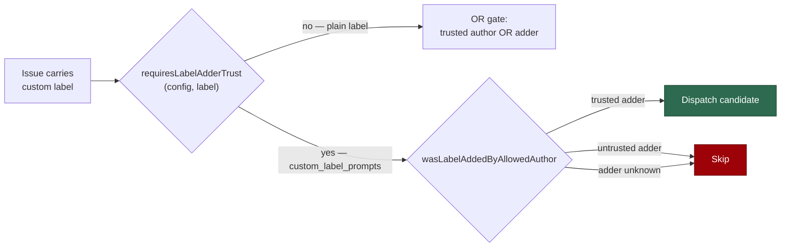

## Summary

Extends the operational-dispatch trust gate to operator-configured
`custom_label_prompts` labels. A custom label dispatches a privileged automation
phase with an operator-supplied prompt, so it now sits in the same AND-gated set
as `planning` and `grill-me`: the label **adder** must be on the trusted-author
allowlist, a trusted issue *author* is not sufficient, and an add that cannot be
attributed fails closed. Landing this ahead of dispatch (#848) means no release
ever ships custom-label dispatch ungated. Closes #847.

What changed:

- `operationalDispatchLabels(config)` appends every configured custom label, so
  `requiresLabelAdderTrust()` returns true for them (case-insensitively) and
  `findIssuesByLabel`'s `strictLabelAdderCheck` demands
  `wasLabelAddedByAllowedAuthor` — which returns false when no `labeled` event
  attributes the add.
- `isOperationalLabel` / `verifyOperationalLabels` take the config-driven labels,
  and all four discovery collectors pass them, so an untrusted actor's custom
  label is stripped rather than surviving as a plain descriptive label. Custom
  labels are never blocking-only, so an unverifiable adder fails closed.
- The creation-time reserved-label filters (`filterReservedLabels`,
  `filterReservedLabelsWithWarning`, `createGitHubIssuesWithPartialFailures`)
  treat configured custom labels as reserved, so the worker's own creation paths
  never apply one.
- The config validator refuses a mapping whose label is one the worker applies
  itself (`idle-task`, `security`, `severity:…`). Those labels are deliberately
  absent from `RESERVED_LABELS`; without this, making custom labels reserved
  would strip a label the worker legitimately raises and silently starve the
  flow that files it.

With no `custom_label_prompts` configured every new parameter is `[]` and every
call site behaves exactly as before.

## Evidence

Backend/CLI change — no web interface to screenshot. The evidence is the test
suite: 297 tests across the affected suites pass
(`operational_dispatch_labels_test.ts`, `label_security_test.ts`,
`issue_finder_test.ts`, `collect_label_candidates_test.ts`,
`custom_label_prompts_config_test.ts`, `github_test.ts`, the three sibling
collector suites and `config_test.ts`).

`./quality.sh` passes every stage except `deno tests`, which reports 35 failures
confined to the setup / credential-provisioning suites
(`service_account_env_test.ts`, `setup_credential_provisioning_test.ts`,
`setup_lockfile_test.ts`, `setup_prerequisites_test.ts`,
`setup_provider_credential_flow_test.ts`, `setup_workdir_reminder_test.ts`).
Those suites need host credential and CLI state this container does not have:
run over the same six files, the milestone base branch and this branch report an
identical `76 passed | 35 failed`, and none of the six is touched by this diff.

**Regression test, red before / green after.** With the `lib/` and `commands/`
changes stashed and the new tests in place, `deno test --no-check` over the five
touched suites reported `FAILED | 134 passed | 12 failed`; with the fix applied
the same suites report `0 failed`. The named regression test is
`worker/deno/tests/issue_finder_test.ts::issue_finder - findIssuesByLabel skips
a custom-label issue when the label adder is untrusted (Issue #847)` — it
reproduces the flaw (a custom label applied by a non-allowlisted account on a
trusted-authored issue was dispatched), fails against the unfixed code, and
passes after the fix.

**Original trigger is closed, with no trivial bypass.** The attack input — an
untrusted triage account applying a configured custom label to an issue authored
by an allowlisted maintainer — now takes the `strictLabelAdderCheck` branch in
`find_issues_by_label.ts`, which requires `wasLabelAddedByAllowedAuthor` to pass
and `continue`s otherwise. The three near-miss bypasses are closed with it:
label case (`requiresLabelAdderTrust` lower-cases both sides), a missing or
actor-less `labeled` event (`labelMatchesAllowedAuthor` returns false — fail
closed, the issue is skipped rather than handed on), and a worker-applied label
(fleet worker logins are excluded from the trust set in both
`wasLabelAddedByAllowedAuthor` and `verifyOperationalLabels`). The label cannot
fall back to descriptive handling either: `verifyOperationalLabels` now reports
it untrusted and `filterTrustedLabels` removes it from `issue.labels`.

## Acceptance Criteria

<!-- vibe-spec-review inputs="diff+issue-body" -->

- **met** — `requiresLabelAdderTrust(config, "<custom label>")` returns true for
  a configured label, case-insensitively — evidence:
  `worker/deno/lib/operational_dispatch_labels.ts:51`; test
  `worker/deno/tests/operational_dispatch_labels_test.ts::requiresLabelAdderTrust - true for a custom_label_prompts label, case-insensitively (Issue #847)`
  — reviewer: met
- **met** — an issue carrying a custom label added by a non-allowlisted account
  is skipped even when the issue author is allowlisted — evidence:
  `worker/deno/tests/issue_finder_test.ts::issue_finder - findIssuesByLabel skips a custom-label issue when the label adder is untrusted (Issue #847)`
  (author `alice` allowlisted, adder `mallory` not) — reviewer: met
- **met** — an issue carrying a custom label added by an allowlisted account is
  selected for dispatch — evidence:
  `worker/deno/tests/issue_finder_test.ts::issue_finder - findIssuesByLabel surfaces a custom-label issue when a trusted author added the label (Issue #847)`
  — reviewer: met — reason: the reviewer noted the pre-existing case-*sensitive*
  timeline match in `issue_query.ts` (`e.label?.name === labelName`) means a
  mapping whose case differs from the repo's label is skipped rather than
  dispatched; that mechanism is shared with `planning` and is fail-closed, so it
  is left unchanged here.
- **met** — an issue whose label-add event cannot be attributed is skipped (fail
  closed) — evidence:
  `worker/deno/tests/issue_finder_test.ts::issue_finder - findIssuesByLabel fails closed when a custom label's adder cannot be attributed (Issue #847)`
  and
  `worker/deno/tests/label_security_test.ts::label_security - a custom label with no attributable adder fails closed (Issue #847)`
  — reviewer: met
- **met** — with no `custom_label_prompts` configured `operationalDispatchLabels`
  returns exactly the six labels it returns today — evidence:
  `worker/deno/tests/operational_dispatch_labels_test.ts::operationalDispatchLabels - unchanged when no custom labels are configured (Issue #847)`
  — reviewer: met
- **partial** — tests added to `operational_dispatch_labels_test.ts` and the
  label-security / `find_issues_by_label` suites; `deno task test` and
  `./quality.sh` pass — evidence: the five suites above plus
  `collect_label_candidates_test.ts` and `custom_label_prompts_config_test.ts`;
  full gate run after the final edit — reviewer: met — reason: the gate's
  `deno tests` stage reports 35 failures in the setup / credential suites; they
  reproduce identically on the milestone base branch in a clean worktree
  (`76 passed | 35 failed` both sides), so they are environmental and unrelated
  to this diff. Every other gate stage passes.
- **unrequested** — `filterReservedLabels` gained the same optional
  `extraReserved` parameter as `filterReservedLabelsWithWarning`, though only the
  warning variant is used in production — reviewer: unrequested — reason: the two
  are documented siblings that must return the same filtered list; letting them
  diverge would make the documented contract false.
- **unrequested** — `suggest_improvements.ts` renames `_config` to `config` and
  passes two positional `undefined` placeholders to reach the new argument —
  reviewer: unrequested — reason: it is the only way to reach the reserved-label
  filter on that creation path, which the issue's last bullet requires.
- **unrequested** — the config validator now refuses a label the worker applies
  itself — reviewer: unrequested — reason: without it, making custom labels
  reserved would strip the idle-task filer's own `idle-task` label and silently
  starve that flow; the reviewer raised exactly this as a defect.

## Standards Review

<!-- vibe-standards-review inputs="diff+CODING-STANDARDS.md" -->

- **violation** — only one of the four `verifyOperationalLabels()` call sites was
  updated, leaving a half-applied gate across otherwise identical collectors —
  evidence: `worker/deno/lib/collect_work_on_candidates.ts:283`,
  `collect_low_priority_candidates.ts:171`, `collect_idle_task_candidates.ts:173`
  — reason: fixed in this diff; all four now pass
  `customLabelPromptLabels(config)`.
- **violation** — `docs/INTERNALS.md` claimed the strip covered "the discovery
  path" when it covered one collector — evidence: `docs/INTERNALS.md:1239` —
  reason: fixed in this diff, and the claim is now true of all four.
- **violation** — `docs/CONFIGURATION.md` claimed the worker "never self-applies
  a custom label", which overstated the change: the model-driven `gh issue
  create` paths (`reserved_label_strip.ts`, `escape_hatch_label_strip.ts`) still
  read the static `isReservedLabel` — evidence: `docs/CONFIGURATION.md:521` —
  reason: the prose is corrected to say what actually holds. Those post-creation
  strips are left alone deliberately: a label a fleet worker applied is never a
  trusted adder, so such an issue cannot dispatch, and threading a config-driven
  set through the planning / PR-feedback / CI-fix call chains is beyond this
  issue.
- **violation** — the new exported `customLabelPromptLabels` had no test in its
  own module's suite — evidence:
  `worker/deno/lib/custom_label_prompts_config.ts:200` — reason: fixed in this
  diff; two tests added to `tests/custom_label_prompts_config_test.ts`.
- **violation** — no `docs/archive/pr-summaries/pr-summary-847.md` — evidence:
  repository tree at review time — reason: fixed in this diff (this file).
- **violation** — a label literal was re-typed inline one line after being bound
  to a `const` — evidence: `worker/deno/tests/github_test.ts:634` — reason: fixed
  in this diff.
- **clean** — Australian English throughout; tests call real functions and assert
  on decisions and side effects (no source grepping, no wall-clock thresholds);
  fail-loud posture preserved (unattributable adder skips rather than degrades);
  backwards compatibility asserted explicitly; comments explain *why* and are
  anchored to issue numbers; no hidden paths staged; commit carries the
  `Vibe-Coder-Run-Id` trailer.

## Test Plan

- `worker/deno/tests/operational_dispatch_labels_test.ts` — custom labels appear
  in `operationalDispatchLabels`, the six-label set is unchanged without them,
  and `requiresLabelAdderTrust` is true for a custom label case-insensitively.
- `worker/deno/tests/issue_finder_test.ts` — `findIssuesByLabel` skips a custom
  label added by an untrusted account (trusted author notwithstanding), surfaces
  one added by a trusted account, and fails closed when the add is
  unattributable.
- `worker/deno/tests/label_security_test.ts` — `isOperationalLabel` honours the
  supplied custom set case-insensitively; a custom label added by an untrusted
  actor, by nobody attributable, or by the worker itself is reported untrusted
  and removed by `filterTrustedLabels`; a trusted add is kept.
- `worker/deno/tests/collect_label_candidates_test.ts` — an untrusted custom
  label is stripped and audited while the issue still qualifies on its trusted
  `top-priority` label.
- `worker/deno/tests/github_test.ts` — `filterReservedLabels` and
  `createGitHubIssuesWithPartialFailures` strip a configured custom label
  case-insensitively, with a warning, and leave it alone when unconfigured.
- `worker/deno/tests/custom_label_prompts_config_test.ts` — a label the worker
  applies itself is refused at config load; `customLabelPromptLabels` returns the
  configured labels in order, and `[]` when nothing is configured.
