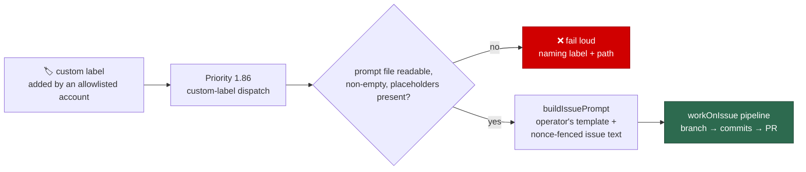

# Dispatch a custom label to the generic implementation phase

## Summary

An issue carrying a configured `custom_label_prompts` label now runs the **same
implementation pipeline `work-on` runs** — real branch, commits and PR — with
the operator's private prompt file substituted for the built-in
`prompts/issue/prompt.md`. With this landed an operator can add a private prompt
file plus a label to `.config.json` and have the Vibe Coder work an issue with
it end to end. Closes #848.

What changed:

- **`worker/deno/lib/custom_prompt_loader.ts`** (new) reads the operator's plain
  absolute path — no `prompts/<name>/` directory, no version resolution — and
  validates it through the existing `validatePromptTemplate` machinery against
  the `issue` required placeholders. Missing, unreadable, empty or invalid all
  return an error naming the label and the path. `validatePromptImmutability` is
  deliberately **not** applied: the operator's file is theirs to edit.
- **`buildIssuePrompt`** takes `customPromptPath` and loads that file in place of
  `loadPrompt("issue", …)`. Nothing else in the builder changed, so the custom
  prompt gets the same treatment as the built-in one: the fail-loud
  unsubstituted-placeholder check, the per-run nonce delimiters, and the
  boundary-integrity instruction around the untrusted issue text.
- **Prompt-cache key** — `computeStaticPromptHash` takes the custom prompt path
  and folds the file's **content** into the digest, so editing the operator's
  file invalidates the cached system prompt.
- **Priority 1.86** dispatches each configured label via `findAndProcessByLabel`
  into `workOnIssue`. The row is added to the dispatch table **only** when a
  mapping is configured, so an unconfigured fleet keeps a byte-identical ladder.
- **Fail loud at dispatch** — `processCustomLabelIssue` re-reads the file before
  the run and throws a typed `CustomPromptDispatchError` naming repo, issue,
  label and path. It never falls back to the built-in template and never skips
  the issue quietly. A broken mapping does not starve the labels behind it: the
  fault is logged as it happens, the remaining labels are still scanned, and the
  fault is raised when nothing else was worked.

## Evidence

Backend/CLI change with no web interface to screenshot — the evidence is the
test suite, which asserts on rendered prompts and dispatch behaviour rather than
on source text.

- 31 new tests across three files, all passing:
  `deno test tests/custom_prompt_loader_test.ts tests/custom_prompt_builder_test.ts tests/custom_label_dispatch_test.ts`
  → `31 passed | 0 failed`.
- Full gate: `env -u CONFIG_PATH ./quality.sh` → every check PASSED except
  `deno tests`, which reports **2 failures out of 16 880**:
  `service_account_env_test.ts::applyServiceAccountEnv - an unwritable gh config
  dir is restaged writable` (running as root defeats the `chmod 000` the test
  relies on) and `setup_provider_credential_flow_test.ts::setup.sh - a
  Codex-only host …` (this container image installs `claude` only). Both were
  confirmed failing on the base commit in a clean worktree
  (`git worktree add /tmp/base-check HEAD~1` → same two failures), so neither is
  introduced here.
- Note on the gate environment: this run exports `CONFIG_PATH`, which makes 33
  further `setup_*` script-harness tests fail with "CONFIG_FILE and CONFIG_PATH
  are both set and name different files". Unsetting it for the gate run
  (`env -u CONFIG_PATH`) removes all 33; they are environmental, not code.

## Acceptance Criteria

<!-- vibe-spec-review inputs="diff+issue-body" -->

- **met** — an issue with a configured custom label, added by an allowlisted
  account, runs the generic implementation phase with the operator's prompt —
  evidence: `worker/deno/lib/run_core_production_deps.ts` (1.86 wiring),
  `worker/deno/tests/custom_label_dispatch_test.ts::custom label dispatch - runs
  the implementation pipeline with the operator's prompt` — reviewer: met —
  reason: reviewer flagged that the route inherits `findIssuesByLabel`, which
  lacks the open-PR/cooldown gating `work-on` gets, so a labelled issue can be
  re-dispatched while its PR is open; that is the prescribed wiring for this
  sub-issue, and the gap is filed as stSoftwareAU/VibeCoder#937.
- **met** — the rendered prompt fences the issue text with the same nonce
  markers and boundary-integrity instruction as the built-in prompt — evidence:
  `worker/deno/tests/custom_prompt_builder_test.ts::custom prompt - untrusted
  issue text keeps the nonce fences and boundary instruction` (extracts the real
  nonce, asserts the body sits inside the fence) and `…- a fresh nonce per
  invocation` — reviewer: met — reason: reviewer noted the criterion names
  "comments", which no implementation prompt carries on either path
  (`issueComments` is not an `IssuePromptOptions` field); parity holds and the
  docs were corrected to stop claiming otherwise.
- **met** — a template missing a required `issue` placeholder is rejected naming
  the file and the placeholder — evidence:
  `worker/deno/tests/custom_prompt_loader_test.ts::a missing required
  placeholder is rejected by name` — reviewer: met.
- **met** — a missing, unreadable or empty prompt file fails the run loudly, no
  fallback and no silent skip — evidence:
  `worker/deno/tests/custom_label_dispatch_test.ts::a missing prompt file fails
  loud and never runs the pipeline` (asserts the orchestrator never ran) —
  reviewer: met — reason: reviewer's two caveats were the root-defeated `chmod`
  test (rewritten against a directory, so it now always asserts) and the absence
  of a cooldown after the failure, which is the same gating gap tracked in #937.
- **partial** — the custom prompt's content contributes to the prompt-cache key
  — evidence: `worker/deno/lib/prompt_hash.ts`,
  `worker/deno/tests/custom_prompt_builder_test.ts::its content contributes to
  the prompt-cache key` — reviewer: partial — reason: the hashing is implemented
  and tested, but the issue-worker pipeline wires `buildPrompt:
  buildIssuePrompt` (uncached) for **every** run, custom or not, so today no
  production issue run reaches `buildCachedIssuePrompt`; that pre-existing wiring
  is outside this sub-issue.
- **met** — with no `custom_label_prompts` configured the priority table and
  `work-on` behaviour are unchanged — evidence:
  `worker/deno/tests/custom_label_dispatch_test.ts::priority table - no custom
  label mappings leaves the ladder unchanged`, `…::production wiring - the
  handler is wired only when a mapping is configured`, `…::execute phase - a
  normal run is unchanged by the custom-prompt option` — reviewer: met.
- **partial** — tests added for the loader, the builder path and the dispatch
  wiring; `deno task test` and `./quality.sh` pass — evidence: three new test
  files under `worker/deno/tests/`; gate output above — reviewer: partial —
  reason: the gate is green except for two failures that reproduce unchanged on
  the base commit (root user, and a container image without the `codex`
  provider); no failure is attributable to this diff.
- **unrequested** — `docs/CONFIGURATION.md` gained a "How a custom label
  dispatches" section with a mermaid diagram — reviewer: unrequested — reason:
  the repo standard is that a code change owes a docs change, and the key
  reference previously deferred dispatch semantics to a guide that does not yet
  exist; the ladder rows in `docs/USAGE.md` and `docs/workflows/README.md` were
  forced by `tests/priority_ladder_docs_test.ts`.
- **unrequested** — `runOrchestrator` injection seam on
  `CustomLabelDispatchDeps` — reviewer: unrequested — reason: without it the
  dispatch processor cannot be tested at all, since `workOnIssue` clones repos
  and runs an agent.
- **unrequested** — multi-mapping scan semantics (`dispatchCustomLabelPrompts`:
  try each label in configuration order, stop at the first that produced work,
  never let a broken mapping starve the rest) — reviewer: unrequested — reason:
  `custom_label_prompts` is a list, so one handler must cover N labels; the
  behaviour mirrors the other label priorities.
- **unrequested** — `computeStaticPromptHash` fails the whole hash when the
  custom prompt cannot be loaded — reviewer: unrequested — reason: it is the
  fail-loud half of the cache-key requirement; hashing the built-in templates
  alone would silently key a run to a prompt it is not using.

## Standards Review

<!-- vibe-standards-review inputs="diff+CODING-STANDARDS.md" -->

- **violation** — no PR summary file — evidence: `docs/archive/pr-summaries/`
  (absent at review time) — reason: fixed here; this file is it.
- **violation** — the new production wiring branch was untested — evidence:
  `worker/deno/lib/run_core_production_deps.ts:2424` — reason: fixed —
  `custom_label_dispatch_test.ts::production wiring - the handler is wired only
  when a mapping is configured` now drives `createProductionRunCoreDeps` with and
  without a mapping.
- **violation** — a test that can pass while asserting nothing under root —
  evidence: `worker/deno/tests/custom_prompt_loader_test.ts:54` — reason: fixed —
  the case now points the loader at a directory, which fails for every uid, so
  the assertions always run.
- **violation** — KISS: a nested conditional spread where two plain fields work —
  evidence: `worker/deno/lib/phases/execute_phase.ts:331` — reason: fixed —
  `exactOptionalPropertyTypes` is off, so the two fields are passed directly.
- **violation** — prompt-cache plumbing is unreachable from the feature's live
  path — evidence: `worker/deno/lib/prompt_hash.ts:71`,
  `worker/deno/lib/issue_worker_wiring.ts:515` — reason: stands. The issue
  explicitly requires the custom prompt's content in the cache key, and the
  implementation is correct where the cache is used; the pipeline's use of the
  uncached builder for all runs predates this change. The doc claim was softened
  to "where a run builds through the prompt cache".
- **clean** — Australian English throughout; fail-loud error handling with no
  catch-and-ignore; no hidden or credential paths staged; tests call real
  functions (`buildIssuePrompt`, `workOnIssueExecuteClaude`,
  `computeStaticPromptHash`, `buildPriorityDispatchTable`,
  `createProductionRunCoreDeps`) and assert on behaviour rather than source text;
  module doc comments on both new files; both new modules small and
  single-purpose; docs updated alongside the code; commit messages carry the
  `Vibe-Coder-Run-Id` trailer; `deno fmt` and `deno lint` clean with no new
  `deno-lint-ignore`.

## Follow-up filed

- stSoftwareAU/VibeCoder#937 — the custom-label route inherits
  `findIssuesByLabel`, which applies none of the open-PR blocking, closed-PR
  cooldown or failure tracking `work-on` gets, so a custom-labelled issue can be
  re-dispatched while its PR is open. Out of scope here (this sub-issue was
  scoped to the dispatch and told to follow the `planningLabel` wiring).
- stSoftwareAU/VibeCoder#850 already covers mounting operator prompt files into
  the container; `docs/CONFIGURATION.md` now states the current constraint.

## Test Plan

New — `worker/deno/tests/custom_prompt_loader_test.ts` (6):

- returns the operator's template verbatim
- a missing file fails loud naming path and label
- a path that is not a readable file fails loud
- an empty file fails loud
- a missing required placeholder is rejected by name
- both missing placeholders are named

New — `worker/deno/tests/custom_prompt_builder_test.ts` (10):

- the operator's template replaces the built-in issue template
- untrusted issue text keeps the nonce fences and boundary instruction
- a fresh nonce per invocation, as for the built-in template
- a deleted file fails the build, with no fallback to the built-in template
- an empty file fails the build
- a template missing a required placeholder fails the build
- an unknown placeholder fails loud rather than shipping half-rendered
- with no custom path the built-in issue template is used
- its content contributes to the prompt-cache key
- an unloadable custom prompt fails the cache-key computation

New — `worker/deno/tests/custom_label_dispatch_test.ts` (16):

- runs the implementation pipeline with the operator's prompt
- a failed pipeline reports declined, not handled
- a missing / empty / placeholder-short prompt file fails loud, and the
  orchestrator never runs
- labels are tried in configuration order, stopping at the first worked
- no configured mappings scans nothing
- each label is wired to its own mapping's prompt
- a broken prompt does not starve the labels behind it
- work done elsewhere still reports processed, with the fault surfaced
- a non-prompt failure propagates immediately
- the execute phase sends the operator's prompt, still fenced
- a normal run is unchanged by the custom-prompt option
- production wiring: the handler is wired only when a mapping is configured
- the priority row is absent with no mappings, and sits at 1.86 between
  Question Answering and the generic scan when wired

Existing suites re-run unchanged: `prompt_builder_test.ts`,
`prompt_builder_cache_test.ts`, `custom_label_prompts_config_test.ts`,
`priority_ladder_docs_test.ts`.
