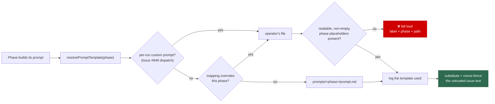

# Let a custom mapping override a built-in label's prompt template

## Summary

A `custom_label_prompts` entry whose label matches a **built-in** label now
replaces that phase's prompt template instead of dispatching a new label, so an
operator can run a non-public `work-on`, `planning`, `question`, `grill-me` or
`quorum` prompt. Every built-in phase resolves its template through one new
seam (`lib/prompt_override_resolver.ts`) rather than five copies of the same
decision, and an override is validated at config load against the placeholders
of the phase it replaces — not the `issue` set a new custom label answers to.
Closes #849.

What landed:

- `lib/builtin_prompt_overrides.ts` — maps an overriding label to its phase
  using the **configured** names on `WorkerConfig` (`planningLabel`,
  `grillMeLabel`, `questionLabel`, `quorumLabel`, `refineIssueLabel`, and the
  hardwired `work-on`), and validates a template against that phase's
  `REQUIRED_PLACEHOLDERS`.
- `lib/prompt_override_resolver.ts` — `resolvePromptTemplate(phase, …)`: an
  explicit per-run template (#848 dispatch) → a configured phase override →
  `prompts/<phase>/prompt.md`. It records the file used and never falls back
  past an operator's file. `refuseFallbackPastOverride()` stops the three
  builders that answer a failed build with a basic prompt from silently doing
  so when the phase is overridden.
- Config load (`lib/custom_label_prompts_config.ts`) resolves and validates the
  override once: a built-in label is admitted (it is reserved *by design*),
  `refine-issue` is refused by name with its reason, a duplicate label/phase
  claim is refused by index, and a template short of its phase's placeholders is
  refused naming both.
- Two-turn phases take two entries: `planning` never implies
  `planning_critique`, `quorum` never implies `quorum_judge` — the second turn
  is named with `phase`.
- Overrides are kept out of the priority-1.86 custom-label scan, which belongs
  to new labels only, and a `work-on` override joins the prompt-cache key.
- `prompt_manager.ts` gains a `grill-me` placeholder contract (the type was
  unregistered, so a `grill-me` override had nothing to validate against);
  `{{BOUNDARY_INTEGRITY_INSTRUCTION}}` is required there, so an override cannot
  drop the untrusted-text fencing.

Also restores `custom_label_prompts` on `WorkerConfig` / `ConfigFile`,
`config.ts`, `config_defaults.ts` and `KNOWN_CONFIG_KEYS`: the milestone
branch's merge of `main` (ac1e7a6) dropped them, leaving `deno check` failing on
the branch before this change.

## Evidence

Backend/CLI change — no web interface to screenshot. Verified by tests and the
full quality gate.

- `./quality.sh` → **PASSED** (semgrep, markdownlint, mermaid, deno tests, lint,
  type check, fmt). Three unrelated suites are sensitive to the worker's own
  environment (`CONFIG_PATH`, `VIBE_STATE_DIR`, `WORK_DIR` are set for the run
  and those tests assert on their absence), so the gate was run as
  `env -u CONFIG_PATH -u VIBE_STATE_DIR -u WORK_DIR ./quality.sh` — confirmed
  pre-existing and unrelated to this diff
  (`tests/setup_credential_provisioning_test.ts`,
  `tests/service_account_env_test.ts`, `tests/baseline_quality_cache_test.ts`).
- `deno task test` → 1905+ passed, 0 failed.

## Acceptance Criteria

<!-- vibe-spec-review inputs="diff+issue-body" -->

- **met** — a mapping naming a built-in label loads the operator's template for
  that phase — evidence: `worker/deno/tests/prompt_override_resolver_test.ts::buildIssuePrompt - a work-on override replaces the issue template`,
  `::buildPlanningPrompt - a planning override replaces the template, the critique keeps its own`,
  `::buildGrillMePrompt - a grill-me override replaces the template` — reviewer:
  partial — reason: the reviewer found a second issue-prompt entry point
  (`lib/execute_claude_phase.ts:894`) that did not receive the overrides; it now
  does, with its CLI command passing them (`worker/deno/commands/execute_claude_phase.ts`).
- **met** — an override is validated against the placeholders of the phase it
  replaces and rejected at config load — evidence:
  `worker/deno/tests/builtin_prompt_overrides_test.ts::parseCustomLabelPrompts - validates an override against its own phase`,
  `::loadConfig - an override short of its phase's placeholders fails loud`,
  `::validateOverrideTemplate - a quorum override must keep the fencing instruction`
  — reviewer: met
- **met** — overriding `planning` does not implicitly override
  `planning_critique` — evidence:
  `worker/deno/tests/builtin_prompt_overrides_test.ts::parseCustomLabelPrompts - overriding planning leaves planning_critique alone`,
  `worker/deno/tests/prompt_override_resolver_test.ts::resolvePromptTemplate - an override replaces only its own phase`
  — reviewer: met
- **met** — a `refine-issue` mapping is rejected at config load with the reason
  — evidence: `worker/deno/tests/builtin_prompt_overrides_test.ts::loadConfig - a refine-issue mapping fails loud with the reason`
  — reviewer: met
- **met** — two entries claiming the same built-in label fail config load —
  evidence: `worker/deno/tests/builtin_prompt_overrides_test.ts::parseCustomLabelPrompts - rejects two entries claiming one phase`
  — reviewer: met — reason: the reviewer noted the *second*, phase-keyed guard
  could never fire because the label key always collided first; that dead branch
  was removed and the live check now names the phase and the earlier entry.
- **met** — phases with no override load the built-in template exactly as today
  — evidence: `worker/deno/tests/prompt_override_resolver_test.ts::resolvePromptTemplate - no override loads the built-in template`,
  `::buildIssuePrompt - no override renders the built-in template`,
  `::buildGrillMePrompt - no override renders the built-in template`, plus the
  unchanged pre-existing prompt/config suites — reviewer: met
- **partial** — the run record names the template file each phase used —
  evidence: `worker/deno/lib/prompt_override_resolver.ts` logs
  `Prompt template for phase '<phase>': <file>` with structured `phase` /
  `template` / `overrideLabel` fields, asserted in
  `worker/deno/tests/prompt_override_resolver_test.ts::resolvePromptTemplate - no override loads the built-in template`
  — reviewer: partial — reason: the record is the worker log line, matching how
  the existing prompt-commit traceability is emitted (`phases/execute_phase.ts`);
  it is not folded into a structured run artefact. The reviewer's related
  finding — a `work-on` override missing from the prompt SHA — is fixed
  (`lib/prompt_builder_cache.ts`).
- **met** — tests cover overrides for `issue`, `planning` and `grill-me` plus
  each rejection; `deno task test` and `./quality.sh` pass — evidence:
  `worker/deno/tests/builtin_prompt_overrides_test.ts` (23 tests),
  `worker/deno/tests/prompt_override_resolver_test.ts` (12 tests), full gate run
  after the final edit — reviewer: met — reason: the reviewer could not confirm
  the full suite (still running when it reported); it was run here and passed.
- **unrequested** — `worker/deno/lib/planning_processor.ts` `extractSubIssueNumbers`
  and `worker/deno/tests/slot_idle_accounting_925_test.ts` `field()` rewritten
  off dynamic `RegExp` — reviewer: unrequested — reason: both files are in the
  milestone branch's semgrep changed-file set and their pre-existing ReDoS
  findings blocked the gate; both rewrites are behaviour-equivalent and keep
  their existing coverage.
- **unrequested** — restoring `custom_label_prompts` on `WorkerConfig` /
  `ConfigFile`, `config.ts`, `config_defaults.ts`, `KNOWN_CONFIG_KEYS` —
  reviewer: unrequested — reason: Issue #846 wiring the milestone merge dropped;
  without it `deno check` fails on the branch and this change cannot compile.
- **unrequested** — `quorum_judge` override support and the `grill-me`
  placeholder registration — reviewer: unrequested — reason: the issue names
  `quorumLabel` and the quorum placeholder rule, so the judge turn follows the
  same "one entry per turn" rule rather than being silently unoverridable; the
  `grill-me` contract is what makes a `grill-me` override validatable at all
  (the criterion requires it) and it is satisfied by the shipped template.

## Standards Review

<!-- vibe-standards-review inputs="diff+CODING-STANDARDS.md" -->

- **violation** — silent fallback past an operator's override: the planning,
  planning-critique and question processors answered a failed prompt build with
  a hard-coded basic prompt — evidence:
  `worker/deno/lib/question_processor.ts:326`,
  `worker/deno/lib/planning_processor.ts:1173` and `:1316` — reason: fixed here
  — `refuseFallbackPastOverride()` throws when the phase is overridden, and the
  basic-prompt rescue survives only for a broken repository template
  (`worker/deno/tests/prompt_override_resolver_test.ts::refuseFallbackPastOverride - throws for an overridden phase`).
- **violation** — dead exported function `builtInLabelNames()` with no caller
  and no test — evidence: `worker/deno/lib/builtin_prompt_overrides.ts:81` —
  reason: fixed here — removed.
- **violation** — `overridablePhases()` was exported for a documentation-facing
  message that did not exist — evidence:
  `worker/deno/lib/builtin_prompt_overrides.ts:105` — reason: fixed here — it
  now renders the overridable phases in the rejection an operator sees when
  `phase` is set on a label that overrides nothing.
- **violation** — docs contradicted the code: the `label` bullet claimed
  list-wide label uniqueness while the example showed two `planning` entries —
  evidence: `docs/CONFIGURATION.md:500` — reason: fixed here — the bullet now
  states the label/phase pair rule.
- **violation** — the new `names` parameter on `parseCustomLabelPrompts` /
  `assertCustomLabelPrompts` had no `@param` and a default that silently
  resolves stock names — evidence:
  `worker/deno/lib/custom_label_prompts_config.ts:220`, `:254` — reason: fixed
  here — both are documented, naming the consequence for a caller holding a
  `WorkerConfig`.
- **violation** — the documented `customPromptPath` > `work-on` override
  precedence had no test — evidence: `worker/deno/lib/prompt_builder.ts:481` —
  reason: fixed here —
  `worker/deno/tests/prompt_override_resolver_test.ts::buildIssuePrompt - a dispatched custom prompt wins over a work-on override`.
- **clean** — Australian English throughout the new libs, tests and docs; commit
  safety (no hidden or credential path staged, both trailers present); test
  quality (no source-grepping, no wall-clock budgets — every test drives real
  `loadConfig` / parser / builder code and asserts on rendered output); small,
  single-purpose modules with matching `tests/*_test.ts` partners; `Result<T,E>`
  rather than throwing for control flow, with the one deliberate fail-loud
  throw at the config-load boundary; security posture — `phase` is allowlisted
  and never reaches a filesystem path, `prompt_path` keeps its absolute-path,
  control-character and readability checks, the reserved-label bypass is scoped
  to override entries only so `top-priority` / `low-priority` stay unremappable,
  and requiring `{{BOUNDARY_INTEGRITY_INSTRUCTION}}` in the `grill-me` and
  `quorum` contracts means an override cannot drop the untrusted-text fencing.

## Test Plan

- Added `worker/deno/tests/builtin_prompt_overrides_test.ts` — label→phase
  resolution (including a renamed `planning_label`), per-phase placeholder
  validation, `refine-issue` rejection, duplicate-claim rejection, `phase` on a
  non-built-in label, the dispatch/override partition, and four end-to-end
  `loadConfig` cases.
- Added `worker/deno/tests/prompt_override_resolver_test.ts` — built-in
  fallback and its traceability record, override applied to its own phase only,
  fail-loud on a deleted or contract-breaking override, the
  `refuseFallbackPastOverride` guard, dispatched-prompt precedence, and
  overrides through `buildIssuePrompt`, `buildPlanningPrompt`,
  `buildPlanningCritiquePrompt` and `buildGrillMePrompt`.
- Existing suites unchanged and green:
  `tests/custom_label_prompts_config_test.ts`,
  `tests/custom_label_dispatch_test.ts`, `tests/config_test.ts`,
  `tests/planning_processor_test.ts`, `tests/question_processor_test.ts`, the
  grill-me, quorum and prompt-builder suites, and the full `deno task test`.
