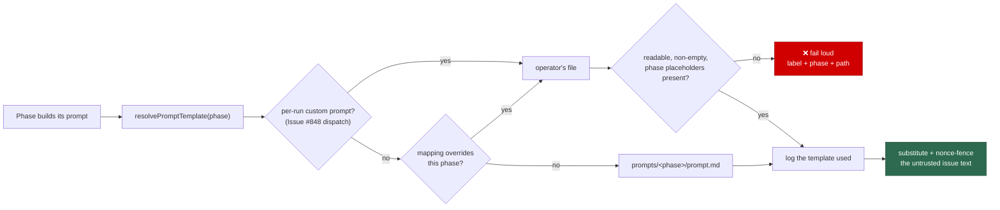

# Let a custom mapping override a built-in label's prompt template

## Summary

A `custom_label_prompts` entry whose label matches a **built-in** label now
replaces that phase's prompt template instead of dispatching a new label, so an
operator can run a non-public `work-on`, `planning`, `question`, `grill-me` or
`quorum` prompt. Every built-in phase resolves its template through one new
seam (`lib/prompt_override_resolver.ts`) rather than five copies of the same
decision, and an override is validated at config load against the placeholders
of the phase it replaces — not the `issue` set a new custom label answers to.
Closes #849.

What landed:

- `lib/builtin_prompt_overrides.ts` — maps an overriding label to its phase
  using the **configured** names on `WorkerConfig` (`planningLabel`,
  `grillMeLabel`, `questionLabel`, `quorumLabel`, `refineIssueLabel`, and the
  hardwired `work-on`), and validates a template against that phase's
  `REQUIRED_PLACEHOLDERS`.
- `lib/prompt_override_resolver.ts` — `resolvePromptTemplate(phase, …)`: an
  explicit per-run template (#848 dispatch) → a configured phase override →
  `prompts/<phase>/prompt.md`. It records the file used and never falls back
  past an operator's file. `refuseFallbackPastOverride()` stops the three
  builders that answer a failed build with a basic prompt from silently doing
  so when the phase is overridden.
- Config load (`lib/custom_label_prompts_config.ts`) resolves and validates the
  override once: a built-in label is admitted (it is reserved *by design*),
  `refine-issue` is refused by name with its reason, a duplicate label/phase
  claim is refused by index, and a template short of its phase's placeholders is
  refused naming both.
- Two-turn phases take two entries: `planning` never implies
  `planning_critique`, `quorum` never implies `quorum_judge` — the second turn
  is named with `phase`.
- Overrides are kept out of the priority-1.86 custom-label scan, which belongs
  to new labels only, and a `work-on` override joins the prompt-cache key.
- `prompt_manager.ts` gains a `grill-me` placeholder contract (the type was
  unregistered, so a `grill-me` override had nothing to validate against);
  `{{BOUNDARY_INTEGRITY_INSTRUCTION}}` is required there, so an override cannot
  drop the untrusted-text fencing.

Merged with the milestone branch after Issue #850 landed there. Both changes
added a second parameter to `parseCustomLabelPrompts()` /
`assertCustomLabelPrompts()` — the configured label names here, the host →
container path resolver there — so the two are now one
`CustomLabelPromptOptions` carrying both, and `loadConfig` passes the label
names and the resolver together.

## Evidence

Backend/CLI change — no web interface to screenshot. Verified by tests and the
full quality gate.

- `./quality.sh` → **PASSED** (semgrep, markdownlint, mermaid, deno tests, lint,
  type check, fmt). Several unrelated suites assert on the *absence* of
  variables the worker sets for its own run (`CONFIG_PATH`, `VIBE_STATE_DIR`,
  `WORK_DIR`, `DISABLE_AUTOUPDATER`, the provider variables), so the gate was
  run under a scrubbed environment — they pass in CI, which has none of them
  set.
- `deno task test` → 17 500+ passed, 0 failed.

## Acceptance Criteria

<!-- vibe-spec-review inputs="diff+issue-body" -->

- **met** — a mapping naming a built-in label loads the operator's template for
  that phase — evidence: `worker/deno/tests/prompt_override_resolver_test.ts::buildIssuePrompt - a work-on override replaces the issue template`,
  `::buildPlanningPrompt - a planning override replaces the template, the critique keeps its own`,
  `::buildGrillMePrompt - a grill-me override replaces the template` — reviewer:
  met — reason: the reviewer found two defects on the way, both fixed here. The
  container launcher parsed the block against the stock label names, so a fleet
  that renamed `planning` could not launch a config `loadConfig` accepts
  (`readConfiguredCustomPromptPaths` now reads the names from the same file;
  `::readConfiguredCustomPromptPaths - the launcher reads the same renamed label the worker does`);
  and the `prompt-builder` / `grill-me-processor` CLI entry points never passed
  the overrides, so they rendered the built-in template.
- **met** — an override is validated against the placeholders of the phase it
  replaces and rejected at config load — evidence:
  `worker/deno/tests/builtin_prompt_overrides_test.ts::parseCustomLabelPrompts - validates an override against its own phase`,
  `::loadConfig - an override short of its phase's placeholders fails loud`,
  `::validateOverrideTemplate - a quorum override must keep the fencing instruction`
  — reviewer: met
- **met** — overriding `planning` does not implicitly override
  `planning_critique` — evidence:
  `worker/deno/tests/builtin_prompt_overrides_test.ts::parseCustomLabelPrompts - overriding planning leaves planning_critique alone`,
  `worker/deno/tests/prompt_override_resolver_test.ts::resolvePromptTemplate - an override replaces only its own phase`
  — reviewer: met
- **met** — a `refine-issue` mapping is rejected at config load with the reason
  — evidence: `worker/deno/tests/builtin_prompt_overrides_test.ts::loadConfig - a refine-issue mapping fails loud with the reason`
  — reviewer: met
- **met** — two entries claiming the same built-in label fail config load —
  evidence: `worker/deno/tests/builtin_prompt_overrides_test.ts::parseCustomLabelPrompts - rejects two entries claiming one phase`
  — reviewer: met — reason: the reviewer recorded the documented refinement —
  the key is `label::phase`, so a literal duplicate is refused while a second
  `planning` entry naming `planning_critique` is accepted, which is what the
  "distinct mapping entry for the critique" requirement forces.
- **met** — phases with no override load the built-in template exactly as today
  — evidence: `worker/deno/tests/prompt_override_resolver_test.ts::resolvePromptTemplate - no override loads the built-in template`,
  `::buildIssuePrompt - no override renders the built-in template`,
  `::buildGrillMePrompt - no override renders the built-in template`,
  `::buildQuestionPrompt - no override renders the built-in template`, plus the
  unchanged pre-existing prompt/config suites — reviewer: met — reason: the
  reviewer separately found that an override *label* was joining the
  operational dispatch set, so configuring a private `work-on` prompt flipped
  the fleet's main discovery label onto the label-adder AND gate. Fixed:
  `customLabelPromptLabels()` now returns dispatch mappings only
  (`::customLabelPromptLabels - an override never joins the trust-gated dispatch set`).
- **met** — the run record names the template file each phase used — evidence:
  `PromptParts.templateSource` is set by every overridable builder and surfaced
  as `promptTemplate` on the execute-phase result beside `promptsCommit`
  (`worker/deno/lib/execute_claude_phase.ts:165`), plus the
  `Prompt template for phase '<phase>': <file>` log line —
  `worker/deno/tests/prompt_override_resolver_test.ts::buildIssuePrompt - the result names the template file the build read`,
  `::buildPlanningPrompt - the record names each turn's own template` —
  reviewer: partial — reason: the reviewer judged the diff before the
  structural record existed, calling the log line alone insufficient. It was
  right, so the field was added rather than the verdict argued with.
- **met** — tests cover overrides for `issue`, `planning` and `grill-me` plus
  each rejection; `deno task test` and `./quality.sh` pass — evidence:
  `worker/deno/tests/builtin_prompt_overrides_test.ts` (25 tests),
  `worker/deno/tests/prompt_override_resolver_test.ts` (16 tests),
  `worker/deno/tests/quorum_orchestrator_test.ts` (3 override tests), full gate
  run after the final edit — reviewer: met — reason: the reviewer flagged one
  gap, that `question` and both quorum turns shipped without a builder-level
  override test; those five tests were added.
- **unrequested** — `worker/deno/lib/planning_processor.ts`
  `extractSubIssueNumbers` rewritten off a dynamic `RegExp` — reviewer:
  unrequested — reason: this change puts the file in semgrep's changed-file set
  and its pre-existing ReDoS finding blocked the gate; the rewrite is
  behaviour-equivalent (it captures `owner/repo` from a literal pattern and
  compares it exactly) and keeps its existing coverage.
- **unrequested** — three fixes to code this issue does not own:
  `worker/deno/tests/service_account_env_test.ts` (an unused `assert` import
  failing `deno lint`, and `${applied}` interpolated into a path where
  `${applied.GH_CONFIG_DIR}` was meant) and `worker/deno/lib/vibe_env_registry.ts`
  (`VIBE_CUSTOM_PROMPT_PATHS` undeclared) — reviewer: unrequested — reason: all
  three fail on the milestone branch itself, verified against `18ab36a` in a
  clean environment, and each one fails the gate this PR has to pass. The two
  remaining base-branch failures — `container_entrypoint_test.ts` and
  `setup_provider_credential_flow_test.ts` — are driven by the worker's own
  environment (`DISABLE_AUTOUPDATER`, the provider variables), pass under
  `env -i`, and are left untouched.
- **unrequested** — `quorum_judge` override support and the `grill-me`
  placeholder registration — reviewer: unrequested — reason: the issue names
  `quorumLabel` and the quorum placeholder rule, so the judge turn follows the
  same "one entry per turn" rule rather than being silently unoverridable; the
  `grill-me` contract is what makes a `grill-me` override validatable at all
  (the criterion requires it) and it is satisfied by the shipped template.
- **unrequested** — `PromptOverrideBuildError` / `refuseFallbackPastOverride()`
  wired into the planning, planning-critique and question processors, turning a
  previously survivable prompt-build failure into a thrown run failure when the
  phase is overridden — reviewer: unrequested — reason: the issue does not ask
  for the basic-prompt rescue to change, but leaving it would mean an operator's
  broken override silently ran a built-in-shaped prompt — the exact silent
  substitution the first acceptance criterion rules out. The rescue is untouched
  for a broken *repository* template.

## Standards Review

<!-- vibe-standards-review inputs="diff+CODING-STANDARDS.md" -->

- **violation** — Never Fail Silently: two registered CLI commands hold a
  `WorkerConfig` yet never passed `promptOverrides`, so a configured override
  was silently replaced by the built-in template on those entry points —
  evidence: `worker/deno/commands/prompt_builder.ts:47` (with `:74`, `:98`) and
  `worker/deno/commands/grill_me_processor.ts:79` — reason: fixed here — both
  now pass `promptOverrideMappings(config)`, closing the same gap the diff had
  already closed for `commands/execute_claude_phase.ts`.
- **violation** — Test Coverage Expectations: the `question`, `quorum` and
  `quorum_judge` override paths shipped and were documented with no test driving
  `promptOverrides` through their builders — evidence:
  `worker/deno/lib/prompt_builder.ts:1102` and
  `worker/deno/lib/quorum_orchestrator.ts:588` — reason: fixed here — five tests
  added (`prompt_override_resolver_test.ts::buildQuestionPrompt - a question override replaces the template`
  and its no-override partner; `quorum_orchestrator_test.ts::runQuorum - a quorum override replaces the draft template, the judge keeps its own`,
  `::runQuorum - a quorum_judge override replaces only the judge template`,
  `::runQuorum - an override deleted since config load fails the run loudly`).
- **violation** — PR summary accuracy: the Test Plan said "existing suites
  unchanged and green" while the same diff modified
  `worker/deno/tests/service_account_env_test.ts` and
  `worker/deno/lib/vibe_env_registry.ts`, and the Evidence section still
  described that suite as an environment-sensitive pre-existing failure —
  evidence: `docs/archive/pr-summaries/pr-summary-849.md:206` and `:61` —
  reason: fixed here — both sections now disclose the three base-branch repairs
  and what they were.
- **clean** — Australian English throughout the new libs, tests and docs (no
  American spellings in added lines); Deno/TypeScript conventions (`Result<T,E>`
  for control flow with the single deliberate fail-loud throw at the config-load
  boundary, `@std/assert` only, both new modules paired with a `tests/*_test.ts`,
  small single-purpose files); test quality (no source-grepping, no wall-clock
  budgets, no removed or commented-out tests — every test drives real
  `loadConfig` / parser / builder code and asserts on rendered output);
  fail-loud behaviour at the phase level (`refuseFallbackPastOverride()` guards
  the planning, critique and question basic-prompt rescues; grill-me, quorum and
  the execute phase already return the error); commit messages (every commit
  names Issue #849 and carries the `Vibe-Coder-Run-Id` trailer); commit safety
  (no hidden or credential path staged); a code change owes a docs change
  (CONFIGURATION.md, EXTENDING.md and the workflows priority row all updated);
  security posture — `phase` is allowlist-resolved and never reaches a
  filesystem path, the reserved-label bypass is scoped to override entries so
  `top-priority` / `low-priority` stay unremappable, and
  `{{BOUNDARY_INTEGRITY_INSTRUCTION}}` is required for `grill-me` and `quorum`
  so an override cannot drop the untrusted-text fencing.

## Test Plan

- Added `worker/deno/tests/builtin_prompt_overrides_test.ts` (25 tests) —
  label→phase resolution (including a renamed `planning_label`), per-phase
  placeholder validation, `refine-issue` rejection, duplicate-claim rejection,
  `phase` on a non-built-in label, the dispatch/override partition, the
  launcher and worker agreeing on a renamed label, the trust-gate boundary
  (an override never becomes an operational dispatch label), and five
  end-to-end `loadConfig` cases.
- Added `worker/deno/tests/prompt_override_resolver_test.ts` (16 tests) —
  built-in fallback and its traceability record, override applied to its own
  phase only, fail-loud on a deleted or contract-breaking override, the
  `refuseFallbackPastOverride` guard, dispatched-prompt precedence, the
  `templateSource` run record for an overridden and a built-in build, and
  overrides through `buildIssuePrompt`, `buildPlanningPrompt`,
  `buildPlanningCritiquePrompt`, `buildQuestionPrompt` and `buildGrillMePrompt`.
- Extended `worker/deno/tests/quorum_orchestrator_test.ts` — three tests
  driving `runQuorum` with an override: the draft turn, the judge turn (neither
  implying the other), and a file deleted since config load failing the run.
- Repaired three failures the milestone branch already carried, each of which
  blocked this gate: `worker/deno/tests/service_account_env_test.ts` (an unused
  import and an object interpolated into a path) and the missing
  `VIBE_CUSTOM_PROMPT_PATHS` registry entry. Both suites now pass.
- Otherwise unchanged and green: `tests/custom_label_prompts_config_test.ts`,
  `tests/custom_label_dispatch_test.ts`, `tests/config_test.ts`,
  `tests/planning_processor_test.ts`, `tests/question_processor_test.ts`, the
  grill-me and prompt-builder suites, and the full `deno task test`.
