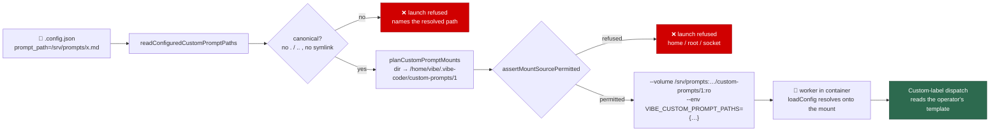

# Mount the operator's custom prompt files read-only into the container

## Summary

`custom_label_prompts` (Issue #846) names prompt templates that live on the
**host**, and the container sees the workspace rather than the host
(Issue #4060) — so in the default containerised deployment every custom prompt
failed at dispatch. The launch plan now derives the narrowest mount set that
fixes it, and the worker inside the container resolves each configured path onto
that mount. Closes #850.

- **The mount.** One **read-only** bind mount per distinct containing directory
  of the configured prompt paths, at `/home/vibe/.vibe-coder/custom-prompts/<n>`
  — the directory rather than the file, because Apple `container` cannot bind a
  single file. Nothing configured means no mount, no variable, and a plan
  byte-identical to today's.
- **The translation.** The staged `.config.json` still names the operator's host
  paths, so one file serves the host-side launcher and the container alike. The
  plan carries `VIBE_CUSTOM_PROMPT_PATHS`, a JSON map from each configured path
  to where the mount makes it readable, which the config loader applies while it
  validates the mappings.
- **The containment.** Every derived source goes through the existing
  `assertMountSourcePermitted`, so the host home directory, the filesystem root,
  a runtime control socket or a relative path fails the launch with the existing
  error. Because a configured prompt path is the first mount source an operator
  writes **by hand**, and that allowlist compares strings, a `.`/`..` segment is
  refused at the config trust boundary and a path that resolves elsewhere (a
  symlink) is refused by the launcher, naming where it resolves.

## Evidence

Backend/launcher change with no web interface, so no screenshot applies. The
evidence is the test suites below plus a green gate:

- `./quality.sh` — **PASSED** (semgrep, deno tests, lint, type check, fmt,
  markdownlint, mermaid).
- `deno test tests/custom_prompt_mounts_test.ts tests/container_launch_test.ts
  tests/custom_label_prompts_config_test.ts tests/container_containment_test.ts`
  — all green.
- The live containment run (`container containment - the launcher-produced
  container is contained`) is `ignored` on this host because no container
  runtime is present; its probe **table** is asserted by a unit test that runs
  everywhere, and the live probes execute in CI.

## Acceptance Criteria

<!-- vibe-spec-review inputs="diff+issue-body" -->

- **met** — with `custom_label_prompts` configured, the launch plan contains a
  read-only bind mount covering every configured prompt path — evidence:
  `worker/deno/tests/container_launch_test.ts::buildContainerLaunchPlan - mounts the operator's custom prompt directories read-only (Issue #850)`
  — reviewer: met
- **met** — the worker inside the container resolves each configured prompt to
  the mounted in-container path and loads it — evidence:
  `worker/deno/tests/custom_label_prompts_config_test.ts::loadConfig - inside the container the configured path resolves onto the mount (Issue #850)`
  — reviewer: met — reason: the reviewer noted the coverage is unit-level, which
  is what a launcher-side change can assert without a runtime
- **met** — a path `assertMountSourcePermitted` rejects fails the launch with the
  existing containment error — evidence:
  `worker/deno/tests/container_launch_test.ts::buildContainerLaunchPlan - a custom prompt the allowlist refuses fails the launch (Issue #850)`
  — reviewer: met
- **met** — the mount is read-only: a write from inside the container to a
  mounted prompt file fails — evidence:
  `worker/deno/tests/container_containment_test.ts::containment harness - the operator's custom prompt mount is probed read-only (Issue #850)`
  and the `ro-file`/`ro-dir` probes the live containment run executes —
  reviewer: partial — reason: the reviewer saw only the `:ro` suffix asserted and
  no live probe; the probe was added in response, so the write is now executed
  rather than inferred
- **met** — with no `custom_label_prompts` configured, the launch plan is
  byte-identical to today's — evidence:
  `worker/deno/tests/container_launch_test.ts::buildContainerLaunchPlan - no custom prompts leaves the plan exactly as it was (Issue #850)`
  — reviewer: met
- **met** — `--read-only` root, cap-drop, `no-new-privileges` and the tmpfs
  scratch set are unchanged; the launch-argument safety assertion still passes —
  evidence:
  `worker/deno/tests/container_launch_test.ts::buildContainerLaunchPlan - custom prompt mounts keep the containment guarantees (Issue #850)`
  (docker, podman, apple-container) — reviewer: met — reason: the reviewer noted
  the issue's `assertLaunchArgumentsSafe` is spelled `assertRunArgumentsContained`
  in this repo; that is the guard the diff keeps
- **met** — tests added covering the mount, the read-only flag, the rejection
  path and the no-config no-op; `deno task test` and `./quality.sh` pass —
  evidence: the four tests above plus `worker/deno/tests/custom_prompt_mounts_test.ts`;
  full gate run after the final edit — reviewer: partial — reason: the reviewer
  could not run the full gate and flagged one vacuous assertion
  (`"…//three.md".replace("//","/")`), which was rewritten to exercise the real
  doubled-separator spelling
- **unrequested** — restores `WorkerConfig.customLabelPrompts`,
  `ConfigFile.custom_label_prompts`, the `buildDefaultWorkerConfig` default and
  the `KNOWN_CONFIG_KEYS` entry — reviewer: unrequested — reason: the
  main→milestone merge (08b4293) resolved away Issue #846's declarations, so the
  branch did not type-check at all; restored verbatim from 845fc69 (commit
  b1e29af) because nothing could be built on it otherwise
- **unrequested** — four unrelated test repairs (`baseline_quality_cache`,
  `service_account_env`, `setup_prerequisites`, `slot_idle_accounting`) —
  reviewer: unrequested — reason: each failed the gate on this host before any
  change of mine (verified against a stashed tree); the first two read the
  process `WORK_DIR` the worker's own container exports, the third asserted a
  message that moved, the fourth tripped semgrep's `detect-non-literal-regexp`.
  A green gate is a precondition of raising this PR, so they are fixed here and
  disclosed rather than worked around
- **unrequested** — `docs/CONFIGURATION.md` custom-prompt paragraph rewritten —
  reviewer: unrequested — reason: the issue names only CONTAINER.md and
  CONTAINMENT.md, but the existing text ("the mount set is fixed … an arbitrary
  host path is not visible to the worker") is made false by this change

## Standards Review

<!-- vibe-standards-review inputs="diff+CODING-STANDARDS.md" -->

- **violation** — security / input validation: the mount source was not
  canonicalised before the containment allowlist, so a `..` segment or a
  symlinked directory defeated the home-directory and filesystem-root guards —
  evidence: `worker/deno/lib/custom_prompt_mounts.ts:139` (`splitPath`, consumed
  at `worker/deno/lib/container_launch.ts:993`) — reason: fixed in this diff
  (commit 628fda4) — `hasTraversalSegment` refuses the spelling at the config
  trust boundary and `assertCustomPromptSourceResolvable` refuses a path that
  resolves elsewhere, both covered by tests
- **violation** — docs accuracy: comments and docs said "native mode", a run
  mode Issue #4 removed — evidence:
  `worker/deno/lib/custom_prompt_mounts.ts:34`, `docs/CONFIGURATION.md:573` —
  reason: fixed in this diff; the wording now names *where the config is read*
  (host-side launcher versus inside the container), not a run mode
- **violation** — PR summary and evidence: `docs/archive/pr-summaries/pr-summary-850.md`
  was absent — evidence: this file — reason: fixed; it is the deliverable this
  block lives in
- **violation** — test quality: the `service_account_env` repair relaxed an
  exact-path assertion instead of stubbing the lookup — evidence:
  `worker/deno/tests/service_account_env_test.ts:425` — reason: stands. The
  production `applyServiceAccountEnv` reads `WORK_DIR` from the process with no
  injection seam, and the file's own comments record that deleting a shared
  variable races every other test in the run; the assertion still pins the
  outcome that matters (a writable copy, carrying the credential, that is not
  the read-only mount) and adds a live write probe
- **violation** — DRY: `readConfiguredCustomPromptPaths` repeats the
  read/parse/object-check prologue of `readContainerToolsSelection` and
  `readAgentProviderSelection` — evidence:
  `worker/deno/lib/custom_label_prompts_config.ts:246` — reason: stands.
  Extracting the shared helper means editing two modules this issue does not
  touch, which the Change Scope rule rules out; noted here so the follow-up is
  visible rather than silent
- **violation** — scope: four unrelated test files ride on this branch —
  evidence: commit 79861fb — reason: stands, and is disclosed in the
  `unrequested` entry above; without them `./quality.sh` cannot pass and no PR
  could be raised
- **clean** — Australian English throughout (`normalise`, `behaviour`,
  `organisation`) in code, comments and docs
- **clean** — fail-loud: the launcher read throws on an unreadable, non-JSON or
  malformed config; `parseCustomPromptPathMap` throws on a mangled map rather
  than partially applying it; an unmapped path falls through to the loader's own
  loud readability failure naming both paths
- **clean** — commit safety: no hidden or credential-shaped path staged;
  `.gitignore` allowlist untouched; every commit carries the issue reference and
  a `Vibe-Coder-Run-Id` trailer
- **clean** — least privilege: mounts are read-only, one per distinct directory,
  derived only from operator-named paths; unconfigured means no mount and no env
- **clean** — injection surface: `runArgs` are NUL-framed into a bash array in
  `run.sh` (no `eval`), and the JSON env value can carry neither NUL nor newline
- **clean** — test quality of the new tests: they call the real builders, the
  real loader and the real validator with real paths and assert on returned
  values and thrown messages; no source grepping, no wall-clock thresholds
- **clean** — a code change owes a docs change: CONFIGURATION.md, CONTAINER.md
  and CONTAINMENT.md all updated, and `containment_docs_test.ts` extended so the
  documented `custom-prompts/<n>` row is checked against a plan that carries it
- **clean** — JSDoc on every new exported symbol, with `@param`, `@returns` and
  `@throws`; new logic in its own 250-line module rather than growing
  `container_launch.ts`

## Test Plan

Added:

- `worker/deno/tests/custom_prompt_mounts_test.ts` — 14 tests over the new
  module: no-config no-op, directory derivation, shared-directory and
  doubled-separator dedup, ordering, filesystem root, Windows separators,
  translation-map round trip and its fail-loud rejections, the host-side
  identity resolver, and the traversal / symlink / unresolvable refusals.
- `worker/deno/tests/container_launch_test.ts` — five tests: the read-only
  mounts and their arguments, the translation env, the per-dialect containment
  guarantees (docker, podman, apple-container), the four allowlist refusals, the
  byte-identical unconfigured plan, and the in-container target path.
- `worker/deno/tests/custom_label_prompts_config_test.ts` — six tests: container
  resolution onto the mount, the fail-loud message naming both paths, the
  host-side identity, the traversal rejection, and the launcher's own reader
  (paths in order, nothing configured, malformed file).
- `worker/deno/tests/container_containment_test.ts` — the live harness plants an
  operator prompt file, mounts it, and probes the directory and file read-only;
  a runtime-free unit test asserts those probes exist.

Modified (documented, no coverage removed):

- `containment_docs_test.ts` — the fixture now configures one custom prompt, so
  the documented `custom-prompts/<n>` row is checked against a plan that really
  carries the mount.
- The four pre-existing gate failures listed under `unrequested` above.
