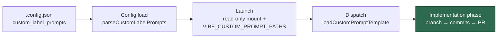

# PR Summary — Issue #851

## Summary

Adds `docs/CUSTOM-PROMPTS.md`, the operator-facing guide to the
`custom_label_prompts` extension point: what it is and when to reach for it, a
copyable config block, a six-step worked example an operator can follow
verbatim, the per-phase placeholder contract, what a prompt author must never
do with the nonce-fenced untrusted issue text, the trust gate on the label
adder, container operation (the read-only mount, the path translation, the
refused host paths), the deliberate absence of a `vN.md` convention, every
failure mode with its exact symptom, and that syncing a private prompt
repository is the operator's own job.

The page is cross-linked from `docs/EXTENDING.md` (intro, TOC, the CI-provider
extension-point note and the prompt-templates section), `docs/PROMPTS.md`
(above the label→prompt table, noting that mappings add or override rows) and
the `custom_label_prompts` entry in `docs/CONFIGURATION.md`, plus the README
documentation index and `_data/page_titles.yml` so the Pages build gives it a
title and favicon. No production code changed. Closes #851.

## Evidence

Documentation-only change with no web interface to screenshot. The evidence is
the gate and a new drift-guard test suite that pins the page to the code it
describes.

`./quality.sh` (full gate, foreground):

```text
Result: PASSED (with skipped checks)
  markdownlint PASSED · mermaid PASSED · semgrep PASSED
  deno tests PASSED · deno lint PASSED · deno type check PASSED · deno fmt PASSED
  pages-liquid SKIPPED (Ruby+Liquid toolchain absent on this host)
```

`worker/deno/tests/custom_prompts_docs_test.ts` was verified to go **red** on
drift: temporarily deleting `PLANNING_LABEL` from the documented placeholder
table and renaming `VIBE_CUSTOM_PROMPT_PATHS` in the page failed
`the documented placeholder contract matches the code` and
`the documented container mount is the real one`; both pass again on the
restored page.

Where the documented mapping lands:



## Acceptance Criteria

<!-- vibe-spec-review inputs="diff+issue-body" -->

- **met** — `docs/CUSTOM-PROMPTS.md` exists and covers every bullet, including
  a complete worked example — evidence: `docs/CUSTOM-PROMPTS.md` (all ten
  bullets; worked example at
  `docs/CUSTOM-PROMPTS.md#-worked-example--end-to-end`) — reviewer: partial —
  reason: the reviewer found two factual defects, both fixed after its verdict
  — the step-6 log lines now show the in-container mount path the worker
  actually logs (`config.ts:820` translates the path before dispatch), and the
  reserved-label failure row no longer implies `work-on` is refused; `work-on`
  is now documented as the built-in label that owns the implementation phase.
- **met** — the example's JSON matches the implemented key shape and
  `tests/config_docs_consistency_test.ts` passes — evidence:
  `worker/deno/tests/custom_prompts_docs_test.ts::custom prompts docs - the
  documented mapping block is accepted by the real parser` drives the
  documented block through the real `parseCustomLabelPrompts`; both suites
  green — reviewer: met
- **met** — `docs/EXTENDING.md`, `docs/PROMPTS.md` and `docs/CONFIGURATION.md`
  link to the new page — evidence: `docs/EXTENDING.md:5`, `docs/EXTENDING.md`
  TOC and CI-provider note, `docs/PROMPTS.md:21-25`,
  `docs/CONFIGURATION.md:485-490`, pinned by
  `custom_prompts_docs_test.ts::the page is reachable from the docs that lead
  to it` — reviewer: met
- **met** — terminology matches the callback extension docs, no new synonyms —
  evidence: "extension point", "operator-side", "hook" (callbacks), "provider"
  (`CiLogProvider`) used as `docs/CALLBACKS.md:1` and `docs/EXTENDING.md` use
  them — reviewer: met
- **met** — `deno task test` and `./quality.sh` pass, including the
  documentation and spelling gates — evidence: full `./quality.sh` run after
  the final edit, `Result: PASSED` — reviewer: partial — reason: the reviewer
  ran the docs-touching suites (all green) but could not finish the full test
  run inside its budget; the complete gate was run here and passed.
- **unrequested** — `worker/deno/tests/custom_prompts_docs_test.ts` — reason:
  the issue's Failure Detection section asks CI to catch drift between the page
  and the implementation, and no existing test covers this page; four tests,
  two of which call real code (`parseCustomLabelPrompts`,
  `getRequiredPlaceholders`).
- **unrequested** — README documentation-table row and `_data/page_titles.yml`
  entry — reason: forced by existing gates — `page_titles_completeness_test.ts`
  fails any published page without a title and icon, and the README index is
  the repository's documentation table of contents.

## Standards Review

<!-- vibe-standards-review inputs="diff+CODING-STANDARDS.md" -->

- **violation** — missing PR summary — evidence:
  `docs/archive/pr-summaries/pr-summary-851.md` absent at the time of review —
  reason: fixed here; this file is the summary, written after the
  implementation commits as the standard prescribes.
- **violation** — two of the four new tests assert on documentation text rather
  than executing worker code — evidence:
  `worker/deno/tests/custom_prompts_docs_test.ts:152` and `:164` — reason:
  stands, deliberately. Both compare the page against **exported constants**
  (`CUSTOM_PROMPTS_TARGET_SUBDIR`, `CUSTOM_PROMPT_PATH_MAP_ENV`) or pin a link
  the issue's acceptance criteria require, which is the house `*_docs_test.ts`
  drift-guard pattern CODING-STANDARDS.md blesses for `bucket_docs_test.ts`.
  The other two tests in the file drive real code.
- **violation** — the page repeated material it claimed not to repeat —
  evidence: `docs/CUSTOM-PROMPTS.md:14-19` — reason: fixed here; the intro now
  says the page states only as much of the key as the worked example needs and
  points at `CONFIGURATION.md` for the field-by-field reference. The remaining
  overlap (the config shape, the trust gate, the failure table) is what the
  issue explicitly asked this page to carry.
- **violation** — a cross-file link inside `docs/EXTENDING.md`'s in-page TOC —
  evidence: `docs/EXTENDING.md:12` — reason: fixed here; the entry now reads
  "the operator-side extension point, on its own page" so it is not mistaken
  for an anchor, and a pointer was added inside the CI-provider extension-point
  note as the issue asked ("alongside the existing extension points").
- **clean** — Australian English throughout (the only `color` occurrences are
  Mermaid `style` directives and the `gh label create --color` flag);
  commit carries the issue reference and the `Vibe-Coder-Run-Id` trailer; no
  hidden path staged; new test is Deno + `@std/assert`, formatted, linted,
  type-checked and finishing in milliseconds; every documented failure string,
  constant and priority spot-verified against the code.

## Test Plan

- Added `worker/deno/tests/custom_prompts_docs_test.ts` — four tests:
  - `the documented mapping block is accepted by the real parser` — feeds the
    page's JSON block through `parseCustomLabelPrompts`, asserting the
    documented shape validates and covers both a new label and a
    `planning_critique` override.
  - `the documented placeholder contract matches the code` — compares the
    page's per-phase table with `getRequiredPlaceholders` for `issue`,
    `planning`, `planning_critique`, `question`, `grill-me`, `quorum`, and
    checks `quorum_judge` is still the `quorum` set plus `PLAN_A`/`PLAN_B`.
  - `the documented container mount is the real one` — the documented mount
    target and translation variable are the exported constants.
  - `the page is reachable from the docs that lead to it` — the four required
    inbound links.
- Re-ran `tests/config_docs_consistency_test.ts`,
  `tests/page_titles_completeness_test.ts`,
  `tests/page_heading_emoji_matches_favicon_test.ts` and
  `tests/private_extension_docs_test.ts` — all green.
- Full `./quality.sh` in the foreground — `Result: PASSED`.
