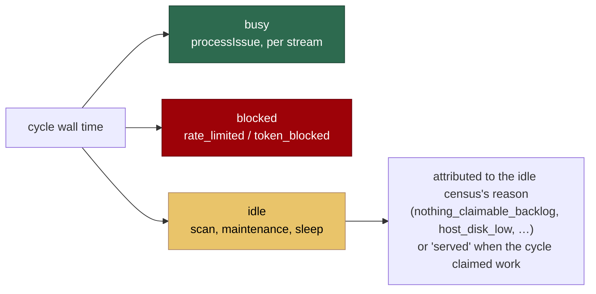

# Fleet telemetry — idle, blocked and success rate

## Summary

Fleet health could not be answered from the logs: how long the fleet was idle,
how long it was blocked on model tokens or GitHub rate limits, and what its
success rate was had no recorded answer anywhere. Each needed ad-hoc
`grep`/`awk` over rotated logs — and that approximation is error-prone (a naive
`grep -iE 'overage'` matches `doc-c` + `overage`).

This change adds `worker/deno/lib/fleet_telemetry.ts`, which accumulates those
numbers across cycles, and `fleet_telemetry_sidecar.ts`, which persists them per
host so they survive a run. The main loop emits one machine-readable line per
cycle and at exit:

```text
fleet-summary: wall=92520s idle=39600s idle_pct=42.8 busy=52920s
  token_blocked=0s token_blocked_waits=0 rate_limited=0s rate_limit_waits=0
  claims=32 successes=17 failures=13 skips=2 success_rate=0.57
  idle_by_reason=nothing_claimable_backlog=32000s,host_disk_low=7600s
  failures_by_class=execute=9,timeout=3,setup=1 utilisation=serial=0.57
```

(One line in the log; wrapped here for readability.)

Closes #855.

## Evidence

This is a backend/CLI change with no web interface to screenshot, so the
evidence is the test suite. `deno test tests/fleet_telemetry_test.ts
tests/fleet_telemetry_sidecar_test.ts tests/rate_limit_signal_kind_test.ts
tests/run_core_fleet_telemetry_test.ts` — 40 tests, all passing.

Every wall second of a run is booked exactly once, which is what makes
`idle_by_reason` sum to `idle_seconds`:



Where each number comes from:

| Metric                            | Recorded at                                                             |
| --------------------------------- | ----------------------------------------------------------------------- |
| `idle_seconds` + `idle_by_reason` | End of cycle, from the idle census's own skip reasons                   |
| `rate_limited` / `token_blocked`  | `pauseUntilRateLimitReset`, split by the `.rate_limit_signal` file's kind |
| `claims`                          | Beside `tracker.recordClaim`, before the run                            |
| `successes` / `failures` / `skips`| `noteIssueProcessed` — the one seam both the serial loop and the pool use |
| `failures_by_class`               | `failureKind` (`timeout`) else the phase the run died at                |
| `utilisation`                     | Wall time around `processIssue`, per stream (`serial`, `slot-N`)        |

The shared `.rate_limit_signal` file now records whether a GitHub API limit or a
model usage limit wrote it — without that, "no GitHub calls left" and "no model
tokens left" are the same pause. The field is optional, so a signal written by
an older worker still parses and reads as `github`, its long-standing meaning.

Documentation: `docs/INTERNALS.md` (new "Fleet telemetry" section, with the
accounting model and the sidecar layout) and `docs/IDLE-TASK-FRAMEWORK.md`
(the census now also yields the fleet idle reason).

## Reproduction

- **symptom** — the fleet's idle time, token-blocked time, rate-limited time and
  success rate were recorded nowhere; answering "has the fleet done any useful
  work since 04:48?" needed a manual log investigation
- **status** — `verified` — the eight loop-integration tests in
  `worker/deno/tests/run_core_fleet_telemetry_test.ts` were run against the
  unfixed loop at base `91c01bc` (with the new modules copied in, so the only
  thing missing was the wiring) and all eight failed —
  `AssertionError: expected at least one fleet-summary line` — then all eight
  pass after the fix
- **regression test** —
  `worker/deno/tests/run_core_fleet_telemetry_test.ts::run_core - an idle cycle books its idle seconds against the census reason`

## Test Plan

Added:

- `worker/deno/tests/fleet_telemetry_test.ts` (20 tests) — idle accumulation by
  reason across cycles; busy time excluded from idle; concurrent streams never
  driving idle negative; blocked time as its own reason without double
  counting; time from a cycle that returns early not being lost; retry counts
  and total backoff; success rate excluding skips and `null` before any run
  completes; failure classes; utilisation; the summary line's shape; reset.
- `worker/deno/tests/fleet_telemetry_sidecar_test.ts` (7 tests) — hostname
  sanitisation (a hostname carrying a separator cannot escape `WORK_DIR`);
  round-tripping a run's totals; cumulative totals growing across runs;
  re-writing within one run not double counting; a corrupt sidecar being
  replaced rather than fatal; an unwritable directory failing loudly;
  `mergeCumulative`.
- `worker/deno/tests/rate_limit_signal_kind_test.ts` (5 tests) — the block kind
  round-trips; the default is `github`; a signal predating the field, a missing
  signal, and an unrecognised value all read as `github`.
- `worker/deno/tests/run_core_fleet_telemetry_test.ts` (8 tests) — the loop
  books idle against the census reason; a served cycle records claim, success
  and stream; a failure is counted against the phase it died at; a timeout
  outranks its phase; a GitHub pause and a usage pause land in different
  counters; the sidecar is written each cycle and at exit; a sidecar write
  failure is logged and never fatal.

No existing tests were modified or removed.
