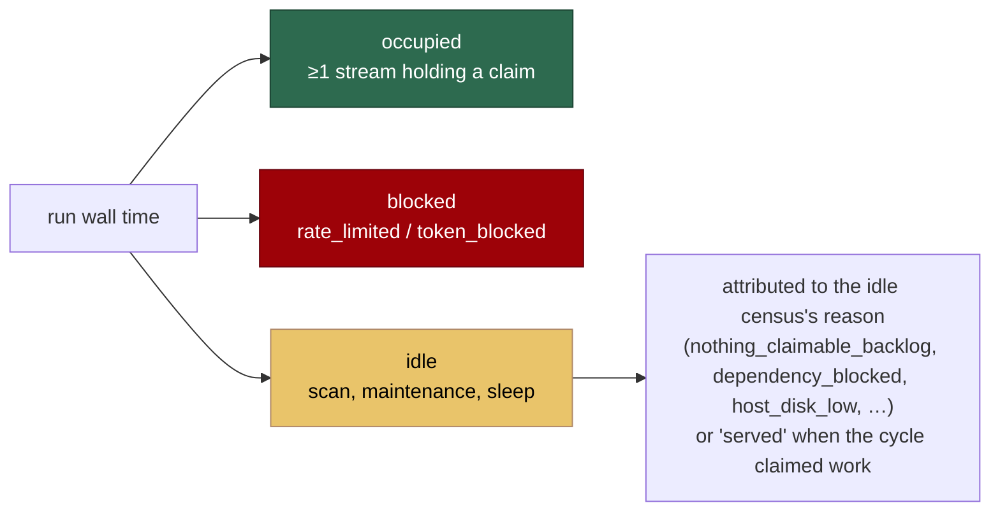

# Fleet telemetry — idle, blocked and success rate

## Summary

Fleet health could not be answered from the logs: how long the fleet was idle,
how long it was blocked on model tokens or GitHub rate limits, and what its
success rate was had no recorded answer anywhere. Each needed ad-hoc
`grep`/`awk` over rotated logs — and that approximation is error-prone (a naive
`grep -iE 'overage'` matches `doc-c` + `overage`).

This change adds `worker/deno/lib/fleet_telemetry.ts`, which accumulates those
numbers across cycles, and `fleet_telemetry_sidecar.ts`, which persists them per
host so they survive a run. The main loop emits one machine-readable line per
cycle and at exit:

```text
fleet-summary: wall=92520s idle=39600s idle_pct=42.8 occupied=52920s
  busy=52920s token_blocked=0s token_blocked_waits=0 rate_limited=0s
  rate_limit_waits=0 claims=32 successes=17 failures=13 skips=2
  success_rate=0.57
  idle_by_reason=nothing_claimable_backlog=32000s,host_disk_low=7600s
  failures_by_class=execute=9,timeout=3,setup=1 utilisation=serial=0.57
```

(One line in the log; wrapped here for readability.)

Closes #855.

## Evidence

This is a backend/CLI change with no web interface to screenshot, so the
evidence is the test suite. `deno test tests/fleet_telemetry_test.ts
tests/fleet_telemetry_sidecar_test.ts tests/rate_limit_signal_kind_test.ts
tests/run_core_fleet_telemetry_test.ts` — 52 tests, all passing.

The run's wall time is partitioned into three non-overlapping spans, so
`wall ≈ occupied + blocked + idle` and `idle_by_reason` sums to `idle_seconds`:



`occupied` is deliberately **not** the sum of per-stream busy time: with an
N-slot pool, summing concurrent slots overshoots the wall clock, and
subtracting that sum reports a half-idle pool as fully busy. `busy` and
`utilisation` stay per-stream and do overlap each other, which is the point of
a per-stream number.

Where each number comes from:

| Metric                            | Recorded at                                                                     |
| --------------------------------- | ------------------------------------------------------------------------------- |
| `idle_seconds` + `idle_by_reason` | End of cycle, from the idle census's skip reasons and per-repo deferral counts   |
| `occupied`                        | `beginBusy`/`endBusy` around `processIssue` — "any stream busy", never the sum   |
| `rate_limited` / `token_blocked`  | `pauseUntilRateLimitReset`, split by the `.rate_limit_signal` file's kind, plus the agent's in-process retry ladder |
| `claims`                          | Beside `tracker.recordClaim`, before the run                                    |
| `successes` / `failures` / `skips`| `noteIssueProcessed` — the one seam both the serial loop and the pool use        |
| `failures_by_class`               | `failureKind` (`timeout`) else the phase the run died at                        |
| `utilisation`                     | Per-stream busy over run wall time (`serial`, `slot-N`)                         |

The shared `.rate_limit_signal` file now records whether a GitHub API limit or a
model usage limit wrote it — without that, "no GitHub calls left" and "no model
tokens left" are the same pause. The field is optional, so a signal written by
an older worker still parses and reads as `github`, its long-standing meaning.

Documentation: `docs/INTERNALS.md` (new "Fleet telemetry" section, with the
accounting model and the sidecar layout) and `docs/IDLE-TASK-FRAMEWORK.md`
(the census now also yields the fleet idle reason).

## Reproduction

- **symptom** — the fleet's idle time, token-blocked time, rate-limited time and
  success rate were recorded nowhere; answering "has the fleet done any useful
  work since 04:48?" needed a manual log investigation
- **status** — `verified` — the nine loop-integration tests in
  `worker/deno/tests/run_core_fleet_telemetry_test.ts` were run against the
  unfixed loop at base `91c01bc` (with the new modules copied in, so the only
  thing missing was the wiring) and all nine failed —
  `AssertionError: expected at least one fleet-summary line` — then all nine
  pass after the fix. Re-verified after the review fixes in `fd62556`.
- **regression test** —
  `worker/deno/tests/run_core_fleet_telemetry_test.ts::run_core - an idle cycle books its idle seconds against the census reason`

## Acceptance Criteria

<!-- vibe-spec-review inputs="diff+issue-body" -->

The issue states its criteria under **Expected behaviour**. Both reviewers were
given only the diff; their findings drove the follow-up commit `fd62556`, and
the verdicts below are recorded as they wrote them, with a `reason:` wherever
the fix changed the picture.

- **met** — `idle_seconds`, wall time with no issue claimed — evidence:
  `worker/deno/tests/fleet_telemetry_test.ts::a half-idle pool still reports its idle half`
  — reviewer: partial — reason: the reviewer was right that idle was measured
  against the **sum** of per-stream busy time, so an N-slot pool subtracted
  more than the clock held and a half-idle pool reported zero idle. Fixed in
  `fd62556`: occupancy is now "at least one stream holding a claim"
  (`beginBusy`/`endBusy`), and three new tests cover the pool cases.
- **met** — split by reason using the existing census categories — evidence:
  `worker/deno/tests/fleet_telemetry_test.ts::the dominant deferral names a scanned fleet's reason`
  — reviewer: partial — reason: the reviewer was right that the census only
  sets a skip reason for the claim gates, so `dependency_blocked`,
  `stream_occupied` and PR-blocked — all named by the issue — were declared in
  the type but unreachable in production. Fixed in `fd62556`: a scanned fleet
  is split by the census's own per-repo deferral counts, and `pr_blocked` /
  `low_priority_suppressed` were added.
- **met** — idle with a non-empty backlog distinguishable from an empty one —
  evidence:
  `worker/deno/tests/fleet_telemetry_test.ts::unblocked priority work reports a non-empty backlog`
  — reviewer: partial — reason: the reviewer was right that the original signal
  (`availability !== "empty"`) meant "the repo has any open issue at all",
  which is true almost always, making one branch effectively dead. Fixed in
  `fd62556` to key off the census's `inversionSignal`.
- **met** — `token_blocked_seconds` — evidence:
  `worker/deno/tests/run_core_fleet_telemetry_test.ts::a model usage-limit pause is recorded as token-blocked time`
  and `fleet_telemetry_test.ts::a block inside a run counts as blocked, not idle`
  — reviewer: partial — reason: the reviewer's specific line references were
  wrong (the subscription usage-limit path at `claude_runner.ts:2620` returns
  without sleeping; I checked), but the underlying point held for the agent's
  rate-limit retry ladder at `claude_runner.ts:2744`, which does sleep
  in-process inside a claimed run. That wait is now recorded.
- **met** — `rate_limited_seconds` plus retry count and total backoff —
  evidence:
  `worker/deno/tests/fleet_telemetry_test.ts::repeated rate-limit waits count retries and total backoff`
  — reviewer: met
- **met** — `claims`, `successes`, `failures`, `success_rate` — evidence:
  `worker/deno/tests/fleet_telemetry_test.ts::success rate counts completed runs, not skips`
  — reviewer: met
- **met** — broken down by failure class — evidence:
  `worker/deno/tests/run_core_fleet_telemetry_test.ts::a failed run is counted against the phase it died at`
  — reviewer: met — reason: the class is the phase the run actually died at
  (`setup`, `execute`, `quality_gate`, …) with `timeout` taking precedence,
  rather than a new invented vocabulary; the issue's "gate-escalation" maps to
  the existing `quality_gate` phase.
- **partial** — `utilisation` — busy seconds / wall seconds per work stream —
  evidence: `worker/deno/tests/fleet_telemetry_test.ts::utilisation is busy over wall time per stream`
  — reviewer: partial — reason: the reviewer objects that a slot which existed
  for only part of the run is divided by the whole run's wall clock. Kept as
  written: the issue specifies "busy seconds / wall seconds per work stream",
  and a common denominator is what lets the per-stream figures be summed into
  a fleet-wide number. Per-slot lifetime tracking is not in this issue.
- **met** — periodic per-cycle and per-run summary line — evidence:
  `worker/deno/tests/run_core_fleet_telemetry_test.ts::a fatal error still emits the run's fleet summary and sidecar`
  — reviewer: met (with two gaps) — reason: the reviewer found the run summary
  sat on the normal-completion path, so a quota pause or fatal error emitted
  nothing. Fixed in `fd62556` — it now runs from a `finally`. The second gap
  (no line on a cycle that returns early) stands by design: that cycle's wall
  time is not lost, it folds into the next attributed segment, which
  `fleet_telemetry_test.ts::an early-returning cycle's wall time is not lost`
  covers.
- **met** — machine-readable, trendable — evidence:
  `worker/deno/tests/fleet_telemetry_sidecar_test.ts::cumulative totals grow across runs`
  — reviewer: met

Changes in the diff not traceable to the issue:

- **unrequested** — the `skips` counter and `skips=` field — reviewer:
  unrequested — reason: kept, because `success_rate` excludes skips from its
  denominator and an operator cannot check that claim without seeing the
  number. The issue's worked example does the same arithmetic by hand (17/30
  from 32 claims).
- **unrequested** — the `served` idle reason — reviewer: unrequested — reason:
  kept. Without it the scan/maintenance/sleep time of a *productive* cycle
  would be unattributed and `idle_by_reason` would not sum to `idle_seconds`.
  It is a separate key, so an operator who wants "idle that was a fault" can
  subtract it. The reviewer is right that it inflates the headline `idle=`
  figure, which is why `occupied=` is now on the same line.
- **unrequested** — `runToken` on the public snapshot and in the sidecar —
  reviewer: unrequested — reason: kept; it is how the sidecar tells "another
  write in this run" from "a new run" without double counting, and it is
  harmless diagnostic data on disk.
- **unrequested** — `kind` on `.rate_limit_signal` and its four writer call
  sites — reviewer: explicitly judged not creep — reason: it is the only way
  to separate GitHub rate-limit from token-block time, which the issue
  requires. Optional field, defaults to `github`, three tests cover the
  legacy/missing/unrecognised cases.

## Standards Review

<!-- vibe-standards-review inputs="diff+CODING-STANDARDS.md" -->

- **violation** — DRY: the emit-and-persist block was duplicated verbatim,
  including the error string — evidence: `worker/deno/lib/run_core.ts:4392` and
  `:4492` — reason: fixed in `fd62556`; both sites now call one
  `emitFleetSummary` helper.
- **violation** — fail-loud: a bare `catch { return null }` made an unreadable
  sidecar indistinguishable from an absent one, silently resetting the host's
  cumulative history — evidence:
  `worker/deno/lib/fleet_telemetry_sidecar.ts:144` — reason: fixed in
  `fd62556`; the reader now returns a typed fault (`absent` / `unreadable` /
  `unparseable` / `future-schema`) and the writer reports anything but
  `absent` through a `warn` callback wired to the logger.
- **violation** — on-disk format: the schema version was written but never
  compared, so a future-schema file would be merged as v1 — evidence:
  `worker/deno/lib/fleet_telemetry_sidecar.ts:138` — reason: fixed in
  `fd62556`, with `a newer schema is refused, not merged as v1` covering it.
- **violation** — documented behaviour overstated the code: no summary or
  sidecar write on an abnormal exit, while the docs said "at exit" — evidence:
  `worker/deno/lib/run_core.ts:4492` — reason: fixed in `fd62556`; emission
  moved into a `finally`, with a test for the fatal-error path.
- **violation** — a documentation claim contradicted by its own code ("every
  wall second booked exactly once" versus the summed-busy zero-floor) —
  evidence: `docs/INTERNALS.md:767` — reason: fixed in `fd62556`; the
  arithmetic is now genuinely non-overlapping (`wall ≈ occupied + blocked +
  idle`), and the one deliberate overlap (a block inside a run) is documented
  as such in both the module header and INTERNALS.
- **violation** — KISS: a single-entry cache implemented as a `Map` that was
  `clear()`ed on every miss — evidence:
  `worker/deno/lib/fleet_telemetry_sidecar.ts:154` — reason: fixed in
  `fd62556`; replaced with two plain variables.
- **violation** — DRY: `startFleetTelemetry` re-implemented
  `resetFleetTelemetry` — evidence: `worker/deno/lib/fleet_telemetry.ts:177` —
  reason: fixed in `fd62556`; it now calls it.
- **violation** — a zero-length wait was counted as a wait — evidence:
  `worker/deno/lib/fleet_telemetry.ts:220` — reason: fixed in `fd62556`, with
  `a zero-length wait is not reported as a wait` covering it.
- **violation** — the PR summary was not committed — evidence:
  `docs/archive/pr-summaries/pr-summary-855.md` — reason: fixed; this file is
  committed as part of the change.
- **clean** — Australian English throughout (`utilisation`, `sanitiseHostname`,
  `summarise`, `unrecognised`, `behaviour`); tests call real functions with no
  source-grepping; happy/error/edge coverage including concurrent-stream
  over-subscription, hostname traversal (`../../etc/passwd`), corrupt sidecar,
  unwritable directory and legacy/missing/unrecognised signal kinds; no
  wall-clock threshold assertions; `.rate_limit_signal` backwards compatible in
  both directions; no hidden or credential paths staged; no Node/npm
  regression (`@std/assert` only, `deno check`/`fmt`/`lint` clean,
  markdownlint clean on both docs); every commit references Issue #855 and
  carries a `Vibe-Coder-Run-Id` trailer; every post-claim path in both the
  serial loop and the slot pool routes through the single `noteIssueProcessed`
  seam.
- **clean, noted** — `worker/deno/lib/run_core.ts` is already 4,600 lines and
  gains loop wiring. The new logic itself went into two small focused modules
  (402 and 200 lines); only the wiring lands in the large file, and splitting
  `run_core.ts` is out of scope here.

## Test Plan

Added:

- `worker/deno/tests/fleet_telemetry_test.ts` (27 tests) — idle accumulation by
  reason across cycles; busy time excluded from idle; concurrent streams never
  driving idle negative; blocked time as its own reason without double
  counting; time from a cycle that returns early not being lost; retry counts
  and total backoff; success rate excluding skips and `null` before any run
  completes; failure classes; utilisation; the summary line's shape; reset.
- `worker/deno/tests/fleet_telemetry_sidecar_test.ts` (11 tests) — hostname
  sanitisation (a hostname carrying a separator cannot escape `WORK_DIR`);
  round-tripping a run's totals; cumulative totals growing across runs;
  re-writing within one run not double counting; a corrupt sidecar being
  replaced rather than fatal; an unwritable directory failing loudly;
  `mergeCumulative`.
- `worker/deno/tests/rate_limit_signal_kind_test.ts` (5 tests) — the block kind
  round-trips; the default is `github`; a signal predating the field, a missing
  signal, and an unrecognised value all read as `github`.
- `worker/deno/tests/run_core_fleet_telemetry_test.ts` (9 tests) — the loop
  books idle against the census reason; a served cycle records claim, success
  and stream; a failure is counted against the phase it died at; a timeout
  outranks its phase; a GitHub pause and a usage pause land in different
  counters; the sidecar is written each cycle and at exit; a sidecar write
  failure is logged and never fatal.

No existing tests were modified or removed.
