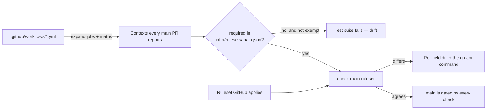

# `validate` is a required check — committed, derived and reconciled

## Summary

`validate` was never a required status check on `main`, so auto-merge fired on a
PR whose `deno lint` was red and put `main` red twice (PRs #825 and #832).
Nothing reported the gap: the only evidence was `main` going red and a human
noticing. The required set had drifted a second time as CI grew jobs —
`validate (no-runtime)` reports on every PR and was never required either.

This change makes the required set a committed artefact that is checked against
both CI and GitHub, rather than a list someone remembers to update:

- **[`infra/rulesets/main.json`](../../../infra/rulesets/main.json)** is the
  source of truth for the ruleset applied to `main` — the live ruleset
  (`21019403`) plus the two missing contexts — mirroring
  `infra/rulesets/release-tags.json` for tags (Issue #869).
- **`worker/deno/lib/pr_check_contexts.ts`** derives the contexts a PR into
  `main` always reports by reading the workflows and expanding each job over its
  matrix. Every derived context is either required by the payload or carries a
  recorded reason in `EXEMPT_CONTEXTS`, so a new CI job fails the test suite
  until someone decides. That closes the class the issue thread asked for,
  rather than the two names that happened to be missing.
- **`check-main-ruleset`** compares the applied ruleset against the file field
  by field, fails loud when no ruleset of that name exists, and skips — saying
  `SKIPPED` in as many words — with no credential.
- **`worker/deno/lib/ruleset_payload.ts`** holds the payload parsing the tag and
  branch rulesets share; `release_tag_ruleset.ts` now delegates to it.

Applying the payload needs **admin** on the repository, which the fleet's
service account does not hold (`gh api repos/stSoftwareAU/VibeCoder` reports
`"admin": false`). Branch protection stays a deliberate human action, and the
command prints the exact call. Closes #858.

## Evidence

Backend/CLI only — no web interface to screenshot.

The live gap this issue describes, reported by the new command against the real
ruleset:

```console
$ deno run --allow-all worker/deno/mod.ts check-main-ruleset
Workflow jobs and required contexts agree.

Ruleset "main" (21019403) on stSoftwareAU/VibeCoder differs from infra/rulesets/main.json:
  - required_status_checks: "validate" is not required — a PR can merge with it red
  - required_status_checks: "validate (no-runtime)" is not required — a PR can merge with it red

Apply the committed payload with:
  gh api --method PUT repos/stSoftwareAU/VibeCoder/rulesets/21019403 --input infra/rulesets/main.json
$ echo $?
1
```



**Quality gate.** `./quality.sh` passes every check except `deno tests`, which
fails on two tests this change does not touch — `run_core_slot_pool_test.ts`
("Issue #178") and `run_core_production_deps_test.ts`. Both fail identically on
`origin/main` with nothing applied (verified by running them in a worktree of
`origin/main`), and both are already tracked: **#1118** and **#1098**. Every
other check — lint, type check, fmt, semgrep, markdownlint, mermaid, the
chokepoint scanners — passes, as does the whole test suite bar those two.

That red default branch is the same failure mode this issue is about: nothing
required the check that would have caught it.

## Reproduction

- **symptom** — a PR with `validate` red auto-merged into `main`, because
  `validate` was not in the ruleset's required contexts (PRs #825, #832)
- **status** — `partial`
- **reason** — the merge gate itself is unchanged by this diff: writing a
  repository ruleset needs admin, which this account does not hold, so an
  operator must run the printed `gh api --method PUT` call to close the gap. The
  detection half was observed red then green — deleting `validate` from
  `infra/rulesets/main.json` fails the regression test below, restoring it
  passes — and `check-main-ruleset` reports the applied ruleset as drifted today
  (output above, exit 1).
- **regression test** —
  `worker/deno/tests/pr_check_contexts_test.ts::this
  repository - every PR check on main is required or exempt`;
  the captured live payload is pinned by
  `worker/deno/tests/main_branch_ruleset_test.ts::diffLiveRuleset - the applied
  ruleset is missing validate (the bug)`

## Test Plan

Added (`deno test` — 42 tests across the three files, all passing):

- `worker/deno/tests/main_branch_ruleset_test.ts` — the committed payload's
  target, enforcement, absence of bypass actors, strict policy and required
  contexts; malformed-payload rejection; `requiredContexts` failing loud when no
  status-check rule exists; and `diffLiveRuleset` across every drift direction —
  missing context (the captured live ruleset), extra context, weakened
  enforcement, an added bypass actor, a dropped rule, a loosened strict policy,
  a changed ref condition, and the negative case where an identical ruleset
  reports nothing.
- `worker/deno/tests/pr_check_contexts_test.ts` — matrix expansion into one
  context per shard and per mode; the workflow/job provenance of each context;
  workflows that never run on a `main` PR and path-filtered workflows excluded;
  loud failure on an unresolvable job name, a matrix `include`/`exclude` and a
  reusable-workflow job; `missing` / `phantom` / `staleExemptions`
  reconciliation; every exemption carrying a reason; and the repository's own
  workflows reconciling against the committed payload.
- `worker/deno/tests/main_branch_ruleset_check_test.ts` — a matching ruleset is
  `ok`, a missing required check is `drift`, an absent ruleset fails loud rather
  than skipping, no credential and an unreachable GitHub skip with `SKIPPED` in
  the message, an unexpected `gh` failure propagates rather than being
  swallowed, an unsafe repo slug is rejected, and unreadable output throws.

Modified:

- `worker/deno/tests/mod_test.ts` — registry count 145 → 146 for the new
  `check-main-ruleset` command.

Unchanged and still passing: `worker/deno/tests/release_tag_ruleset_test.ts`,
which now exercises the shared `ruleset_payload.ts` parser through
`parseTagRuleset` (identical error messages, so its assertions stand).
