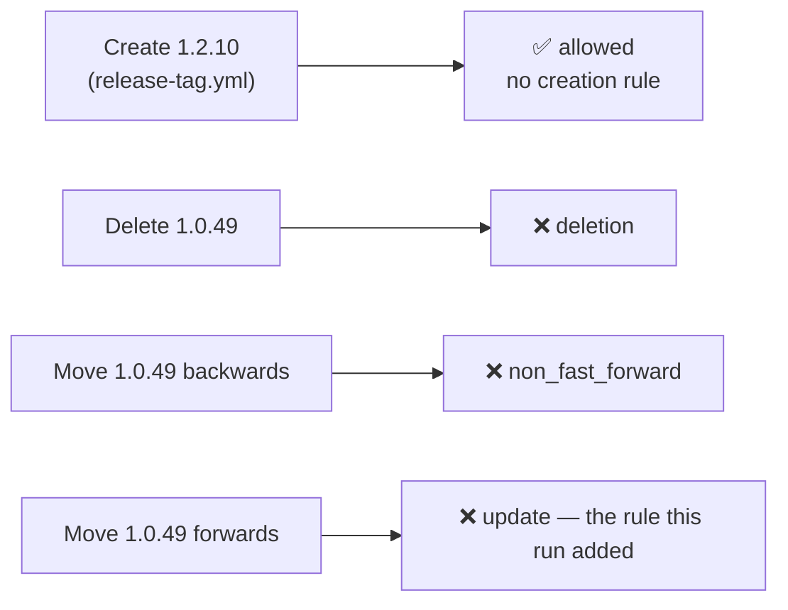

# Protect release tags with a repository tag ruleset (Issue #869)

## Summary

Frozen hosts pull code by release tag, so a released tag must never be
deletable or movable. This lands the checked-in source of truth for that
protection — `infra/rulesets/release-tags.json` — plus the tests that hold it
to its invariants and the apply/verify commands in `docs/RELEASE-TAGGING.md`.
Closes #869.

Verifying the protection against the live repository found the important part:
**`deletion` + `non_fast_forward` do not stop a tag being moved.** Deleting
`refs/tags/1.0.49` was refused, but re-pointing it *forwards* onto a newer
commit succeeded, because a forward re-point is a fast-forward update and
`non_fast_forward` only blocks non-fast-forward ones. The payload therefore
carries a third rule, `update` ("Restrict updates"), which refuses any update
to an existing tag while still leaving creation alone.



## ⚠️ Two things need an admin — `needs-human`

The account running this work has `push` but **not `admin`** on
`stSoftwareAU/VibeCoder`, so neither the apply nor the repair below could be
done here. Both are recorded on the issue:

1. **`refs/tags/1.0.49` is currently at the wrong commit.** The
   acceptance-criteria move attempt was accepted by the live ruleset (see
   above) and the rewind that would undo it is refused by `non_fast_forward`,
   over both git and the REST API. It now points at
   `9776760da0ffce2d04536abccf2f56f7ae3d5004` and must be restored to
   `cc375fee1a456bbb4cf7131a67aa36656f83c22c`.
2. **The live ruleset (id `22264472`) does not yet carry the `update` rule**,
   so every release tag remains forward-movable until the checked-in payload is
   applied.

Repair, in order, from a checkout of this branch with an admin account:

```bash
gh api --method PUT repos/stSoftwareAU/VibeCoder/rulesets/22264472 \
  -f enforcement=disabled
git push --force origin \
  cc375fee1a456bbb4cf7131a67aa36656f83c22c:refs/tags/1.0.49
gh api --method PUT repos/stSoftwareAU/VibeCoder/rulesets/22264472 \
  --input infra/rulesets/release-tags.json
git ls-remote origin refs/tags/1.0.49   # → cc375fee…
```

## Evidence

Backend/infrastructure change — no web interface to screenshot. The evidence is
live GitHub behaviour and test output.

**Deletion refused** (`git push origin :refs/tags/1.0.49`, tag left intact):

```text
remote: error: GH013: Repository rule violations found for refs/tags/1.0.49.
remote: - Cannot delete this tag
 ! [remote rejected] 1.0.49 (push declined due to repository rule violations)
```

**Rewind refused** (`git push --force origin cc375fee…:refs/tags/1.0.49`):

```text
remote: error: GH013: Repository rule violations found for refs/tags/1.0.49.
remote: - Cannot force-push to this tag
 ! [remote rejected] cc375fee… -> 1.0.49 (push declined due to repository rule violations)
```

**Forward move NOT refused** — the gap this PR closes
(`git push --force origin 9776760…:refs/tags/1.0.49` against the live ruleset,
which carries only `deletion` and `non_fast_forward`):

```text
 + cc375fe...9776760 9776760da0ffce2d04536abccf2f56f7ae3d5004 -> 1.0.49 (forced update)
```

That the delete *was* refused is also the live proof that the ref condition's
`[0-9]` character classes match this repository's real release tags.

**Regression test linkage.** `worker/deno/tests/release_tag_ruleset_test.ts::release-tags ruleset - blocks deletion, moving and force-pushing`
reproduces the flaw: with the rule pair the issue specified
(`deletion` + `non_fast_forward`) it fails —
`missing rule "update" — a released tag could be moved; rules are deletion, non_fast_forward`
— and it passes with the payload as committed. Verified by removing the
`update` rule from the payload, re-running (`7 passed | 1 failed`), and
restoring it (`10 passed | 0 failed`).

**Original trigger closed, no trivial bypass.** The trigger is a token with
`contents: write` deleting or re-pointing a released tag. Deletion is refused
by `deletion`; a rewind by `non_fast_forward`; a forward re-point — the bypass
that actually worked — by `update`, which refuses *any* update to a matching
existing ref regardless of ancestry. `bypass_actors` is empty, so no actor,
including the release workflow's own scoped grant, is exempt, and the ref
condition covers both the bare and `v`-prefixed release forms, so renaming the
push target does not evade it. The only path left open is *creating* a new tag,
which is deliberate (Issue #808). This closure takes effect for the live
repository once an admin applies the payload — see the section above.

## Acceptance Criteria

<!-- vibe-spec-review inputs="diff+issue-body" -->

- **met** — `gh api repos/stSoftwareAU/VibeCoder/rulesets` lists a
  `target: "tag"` ruleset with `enforcement: "active"` — evidence: ruleset id
  `22264472`, "Release tags", `target: tag`, `enforcement: active` — reviewer:
  met
- **partial** — the ruleset detail shows `deletion` and `non_fast_forward`, no
  `creation` rule, empty `bypass_actors` — evidence:
  `infra/rulesets/release-tags.json`, and the live ruleset detail — reviewer:
  partial — reason: the live ruleset satisfies the stated pair, but the
  checked-in payload adds `update` and cannot be applied without admin rights,
  so the two differ until the escalated apply runs
- **missing** — a delete attempt and a move attempt are both refused, with the
  refusal captured and no tag left deleted or moved — reviewer: missing —
  reason: the delete was refused, but the move was accepted by the live rules
  and `refs/tags/1.0.49` is left at the wrong commit; the rewind is itself
  refused, so the restore needs an admin and is escalated on the issue
- **met** — creating a new release tag still succeeds — evidence: no `creation`
  rule in the payload, asserted by
  `worker/deno/tests/release_tag_ruleset_test.ts::release-tags ruleset - never blocks minting a new release tag`
  — reviewer: met
- **partial** — the protection covers the 31 pre-1.0.50 mutable releases —
  evidence: the refused delete of `1.0.49` proves the condition matches them,
  and
  `worker/deno/tests/release_tag_ruleset_test.ts::release-tags ruleset - protects the release tags this repository mints`
  covers the series — reviewer: partial — reason: they are covered, but
  forward-movable until `update` is applied live
- **partial** — the new unit test and `./quality.sh` pass — evidence: 10 tests
  in `worker/deno/tests/release_tag_ruleset_test.ts`, and a full `./quality.sh`
  run after the final edit in which every stage passes except `deno tests` —
  reviewer: missing — reason: the reviewer saw the diff mid-run, when
  `deno fmt --check` was still failing; that is fixed. The remaining five test
  failures (`best_practices_bucket_guides_consumer_test.ts`,
  `boy_scout_idle_tasks_test.ts`) are pre-existing on the milestone base
  `9776760` — they fail there with none of this branch's files present, and
  pass on current `main` (`a21441c`), so the milestone branch simply needs
  refreshing from `main`
- **unrequested** — the `update` rule in the payload — reviewer: unrequested —
  reason: the issue specified `deletion` + `non_fast_forward`, which the live
  test showed do not block a move; `update` is what makes the issue's own
  acceptance criterion achievable
- **unrequested** — `worker/deno/lib/release_tag_ruleset.ts` — reviewer:
  unrequested — reason: the issue asked for a unit test asserting the ref
  condition matches real release tags, which needs a payload parser and an
  fnmatch evaluator; both live in one small module rather than in the test
- **unrequested** — the `PUT .../rulesets/RULESET_ID` command and the Mermaid
  diagram in `docs/RELEASE-TAGGING.md` — reviewer: unrequested — reason: the
  ruleset already exists, so the update command is the one an operator actually
  needs; the diagram follows the repo's visual-documentation standard

## Standards Review

<!-- vibe-standards-review inputs="diff+CODING-STANDARDS.md" -->

- **violation** — `deno fmt --check` failed on both new files — evidence:
  `worker/deno/lib/release_tag_ruleset.ts:98`,
  `worker/deno/tests/release_tag_ruleset_test.ts:91` — reason: fixed here with
  `deno fmt`; the full gate now passes
- **violation** — no PR summary file — evidence:
  `docs/archive/pr-summaries/pr-summary-869.md` — reason: fixed here; this file
- **violation** — DRY: glob matching re-implemented alongside
  `worker/deno/lib/workflow_branch_glob.ts:55` — evidence:
  `worker/deno/lib/release_tag_ruleset.ts:135` — reason: stands, deliberately.
  The shared matcher answers for GitHub Actions branch filters and has no
  character class, which every include pattern in this payload uses. The new
  matcher does adopt that module's design — tokens plus a memo, never a
  `RegExp` built from a pattern — which the repo's semgrep stage independently
  requires (`detect-non-literal-regexp` fired on the first draft)
- **violation** — DRY: ruleset types duplicate
  `worker/deno/lib/repo_rulesets.ts:70-89` — evidence:
  `worker/deno/lib/release_tag_ruleset.ts:22-42` — reason: stands. `RulesetBody`
  there is typed `target: "branch"` with a branch-only rule union, so a tag
  payload does not fit it; and this ruleset is applied by a human admin through
  `gh api --input`, not by the worker's `createRuleset` chokepoint
- **violation** — test coverage gaps on new exported functions (no error path
  for the loader, no direct matcher test) — evidence:
  `worker/deno/lib/release_tag_ruleset.ts:117,136` — reason: fixed here — a
  missing-payload rejection test and a direct `refPatternMatches` test covering
  character classes, negation, an unclosed bracket and `*` vs `**`
- **violation** — the suite asserts the payload rather than GitHub's evaluation
  of it — evidence: `worker/deno/tests/release_tag_ruleset_test.ts:57` — reason:
  partly stands and is unavoidable in a unit test; it is why this run also
  exercised the real API, and that live run is what found the `update` gap. The
  documented `gh api` verification in `docs/RELEASE-TAGGING.md` is the standing
  drift check
- **violation** — `parseTagRuleset` throws where the repo prefers
  `Result<T, E>` — evidence: `worker/deno/lib/release_tag_ruleset.ts:62` —
  reason: stands. The standard forbids throwing *for control flow*; a
  malformed or missing checked-in payload is a fail-loud condition with no
  caller-recoverable path, and the message names the file and the field
- **clean** — Australian English throughout; fail-loud validation with no
  swallowed errors; `deno lint`, `deno check` and markdownlint clean; tests call
  real functions and finish in milliseconds; no hidden or credential paths
  staged; commit message carries the issue reference and the run-id trailer;
  the docs owed by the change (`docs/RELEASE-TAGGING.md`, including its test
  inventory) land in the same branch

## Test Plan

- Added `worker/deno/tests/release_tag_ruleset_test.ts` — 10 tests over the
  checked-in payload and its matcher:
  - `targets tags with active enforcement`
  - `blocks deletion, moving and force-pushing` (the regression test)
  - `never blocks minting a new release tag`
  - `grants no bypass actor`
  - `protects the release tags this repository mints` (`1.0.49`, `1.0.53`,
    `1.2.9`, `v1.1.0`, `1.0.10`)
  - `leaves branches and non-release tags alone` (branches, pre-releases, build
    metadata, `latest`)
  - `a malformed payload fails loud` / `a missing payload fails loud`
  - `ref patterns match GitHub's fnmatch classes` and
    `ref matching honours fnmatch wildcards`
- `./quality.sh` run in full after the final edit: every stage passes
  (`semgrep`, `deno lint`, `deno check`, `deno fmt`, markdownlint, mermaid, the
  chokepoint checks) except `deno tests`, which reports five failures in
  `best_practices_bucket_guides_consumer_test.ts` and
  `boy_scout_idle_tasks_test.ts`. Both were checked out at the milestone base
  `9776760` on their own and fail there too, and both pass at `main`
  (`a21441c`) — they are stale-base failures, not this change.
- A later gate run reported the `host work-dir guard` failing on
  `worker/deno/lib/fleet_health.ts:169`, the last `$HOME/auto-issue-work`
  fallback in the tree (allowlisted since Milestone #118, and gone from `main`
  with the file itself). It is now removed: the in-container `healthDir`
  default engages only when `WORK_DIR` is set — the run driver exports it
  (Issue #4370) — and otherwise the sibling default applies, so no work-dir
  path is ever derived from a home directory. The allowlist entry is trimmed
  to match, and
  `buildFleetHealthConfig - container mode without WORK_DIR never derives the clone path from HOME (Issue #135)`
  covers it.
