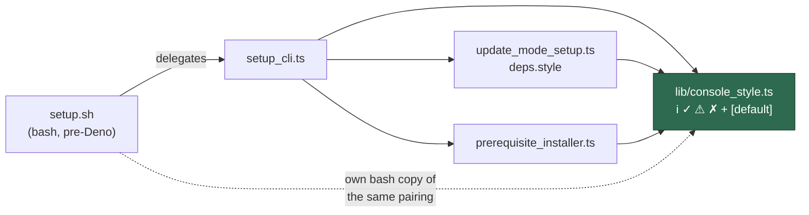

# Style the setup conversation with Deno-style glyphs and bracketed defaults

## Summary

The update-mode conversation printed plain unstyled text beside `setup.sh`
output that has printed `ℹ`/`✓`/`⚠`/`✗` in blue/green/yellow/red since it was
written, and `setup_cli.ts` carried its own copy of the ANSI constants — the
duplication that let the two drift. Closes #870.

- **New `worker/deno/lib/console_style.ts`** holds the glyph-and-colour pairing
  once for the Deno side. `createConsoleStyler` returns formatters that produce
  strings and print nothing, so printing stays at the call site and styling is
  testable without capturing stdout. Colour is emitted only to a terminal and
  never when `NO_COLOR` is set — the worker exports `NO_COLOR=true` into every
  child process, and a stray escape would corrupt the many tests that assert on
  captured child-process stdout.
- **`bracketedDefault`** is the one place a `[default]` suffix is built, so a
  question with no default renders bare instead of trailing a stray `[]`.
- **`setup_cli.ts`** drops its local `RED`/`GREEN`/`YELLOW`/`BLUE`/`NC` and
  routes `printInfo`/`printSuccess`/`printWarning`/`printError` and the
  milestone-ruleset question through the shared module.
- **`update_mode_setup.ts`** styles all ~25 `say()` calls: `ℹ` explains, `⚠`
  reports a rejected answer / a failed `fetchOrigin` / a release-manifest
  fallback, `✓` confirms the mode chosen, the ref resolved and the versions
  pinned. The styler is a `deps` seam alongside `say`/`ask`, so tests name it
  rather than setting `NO_COLOR` on the shared process.
- **`prerequisite_installer.ts`** had a third, colourless copy of the glyphs;
  it now uses the shared styler too.

`setup.sh` necessarily keeps its own bash copy — it prints before Deno is
installed, so it cannot import a Deno module. The colours and glyphs in
`console_style.ts` are exactly the ones it defines at `setup.sh:200-228`, and
both the module header and `docs/SETUP.md` record that split so the constraint
is not mistaken for drift.

## Evidence

Captured from a real pty run of the exact command `setup.sh` invokes
(`deno run --frozen --lock=… setup_cli.ts update-mode --script-dir … --config-path …`)
against a scratch checkout, with `NO_COLOR` unset so colour is emitted. It
shows `ℹ` explaining, `⚠` on a rejected mode, a failed `fetchOrigin`, an
unresolvable ref and the manifest fallback, `✓` on the mode, the resolved ref
and the pinned versions, and defaults in brackets where one exists — the
Claude CLI question has no default (its candidate is inside the release-age
quarantine) and renders bare, not `[]`.

The Playwright MCP browser tools were not present in this session — `ToolSearch`
for `browser_navigate` / `browser_take_screenshot` returned "No matching
deferred tools found", so there was no call to quote an error from. The
container's own Playwright Chromium
(`/opt/playwright-browsers/chromium_headless_shell-1224/chrome-linux/headless_shell`)
rendered the capture instead; the image is a real terminal capture either way.

`./quality.sh` passes end to end (`Result: PASSED (with skipped checks)`).

## Acceptance Criteria

<!-- vibe-spec-review inputs="diff+issue-body" -->

- **met** — `setup_cli.ts` and the update-mode conversation both take their
  glyphs and colours from the one shared module; no file defines its own ANSI
  escape constants — evidence: `worker/deno/lib/console_style.ts:36-45` is the
  only Deno source with escape constants (`grep -rn "x1b\[" worker/deno
  --include=*.ts` outside tests returns nothing else) — reviewer: partial —
  reason: the reviewer flagged that `setup.sh:200-228` still defines its own
  bash constants; that copy cannot be removed because `setup.sh` prints before
  Deno is installed, so the Deno-side duplication the issue names is fully
  removed and the bash constraint is now documented in the module header,
  `docs/SETUP.md` and the INTERNALS index. The reviewer also had not seen
  `prerequisite_installer.ts`'s third glyph copy, which this diff converts.
- **met** — unit tests for the shared module cover TTY on → escapes present,
  TTY off → none, `NO_COLOR` with a TTY → none, and each glyph maps to its
  documented severity — evidence:
  `worker/deno/tests/console_style_test.ts::createConsoleStyler - a TTY emits colour escapes`,
  `::without a TTY the output is byte-clean`,
  `::NO_COLOR on a TTY is byte-clean too`,
  `::each glyph maps to its documented severity` — reviewer: met
- **met** — unit tests over the update-mode conversation assert the glyph on an
  explanatory line, a rejected answer and a confirmed answer, and that every
  question renders its default in brackets with no empty `[]` — evidence:
  `worker/deno/tests/setup_update_mode_test.ts::runUpdateModeSetup - explanatory lines carry the info glyph`,
  `::a rejected answer carries the warning glyph`,
  `::a confirmed answer carries the success glyph`,
  `::every question shows its default in brackets`,
  `::a question with no default never renders a stray []` — reviewer: met
- **met** — running `./setup.sh` interactively shows the conversation in the
  same visual style as the surrounding output; screenshot attached — evidence:
  `docs/evidence/issue-870-update-mode-conversation.png` — reviewer: partial —
  reason: the reviewer judged the earlier screenshot synthetic; it was
  re-captured for this diff from a real pty run of the exact `deno run …
  setup_cli.ts update-mode` line `setup.sh:874-876` executes, and the caption
  now names that command rather than implying a full `./setup.sh` run.
- **met** — existing setup tests and `./quality.sh` pass — evidence: full gate
  run after the final edit, `Result: PASSED (with skipped checks)` — reviewer:
  partial — reason: the reviewer read the `setup_prerequisites_test.ts`
  assertion change as an existing setup test not passing "unchanged". That test
  was already red on `origin/main` before this branch (verified by running it in
  a clean `origin/main` worktree); it is repaired here, not weakened — see the
  `unrequested` entry below.
- **met** — `run.sh` launch output is untouched — evidence: `run.sh` and every
  launch-path module are absent from the diff — reviewer: met

- **unrequested** — `worker/deno/tests/setup_prerequisites_test.ts` assertion
  rewrite — reason: red on `origin/main` before this branch (the image-reference
  resolver now reads `container/tools.json` before the Containerfile, so the
  error message names a different file); the gate cannot pass without it, so the
  assertion now checks the message names the missing path and the hint names the
  Containerfile, rather than pinning which file is read first.
- **unrequested** — `worker/deno/tests/baseline_quality_cache_test.ts` env
  stubbing — reason: also red on `origin/main` in any container that exports
  `WORK_DIR`; the two tests meant "WORK_DIR is unset" but fell through to the
  real environment, so they now stub the lookup. Same root cause as the
  `#966` seam migration, one line each.
- **unrequested** — `question` severity (`?` in yellow) on the shared styler —
  reason: `setup_cli.ts` had a hand-rolled `${YELLOW}?${NC}` prompt; without
  this severity that file would have had to keep an ANSI constant, which the
  first criterion forbids.
- **unrequested** — `printError` now keys colour off `Deno.stderr` rather than
  `Deno.stdout` — reason: `printError` writes to stderr, so the old code asked
  the wrong stream whether it was a terminal; visible only when exactly one of
  the two streams is a TTY.
- **unrequested** — `prerequisite_installer.ts` reporter converted — reason: a
  third copy of the glyph pairing in the same directory, which the "one shared
  module" criterion is about; four lines.
- **unrequested** — `docs/archive/handover/issue-870.md` — reason: the
  worker's own interruption handover note, committed by the interrupted run
  before this one resumed; it is the repo's existing convention
  (`docs/archive/handover/issue-*.md`), not a change this diff authored.
- **unrequested** — `docs/INTERNALS.md` lib-index row for `console_style.ts` —
  reason: the repo's "a code change owes a docs change" rule; a new `lib/`
  module belongs in that index.

## Standards Review

<!-- vibe-standards-review inputs="diff+CODING-STANDARDS.md" -->

- **violation** — no `docs/archive/pr-summaries/pr-summary-870.md` existed when
  the reviewer read the diff — evidence: `docs/evidence/issue-870-update-mode-conversation.png:1`
  — reason: fixed here; this file is that summary, and it is committed with the
  change.
- **violation** — the module header and the INTERNALS row claimed
  `console_style.ts` is "the one … pairing the setup surfaces print through"
  while `prerequisite_installer.ts:206-208` still hand-rolled its own —
  evidence: `worker/deno/setup/prerequisite_installer.ts:206` — reason: fixed
  here; that reporter now uses the shared styler, and both claims are narrowed
  to the Deno surfaces with `setup.sh`'s bash copy called out explicitly.
- **violation** — injected-seam convention: `const style = terminalStyler()` at
  module scope bound `Deno.stdout.isTerminal()` and `NO_COLOR` at import time in
  a module whose every other dependency is injected — evidence:
  `worker/deno/setup/update_mode_setup.ts:82` (as reviewed) — reason: fixed
  here; `style` is now a field of `UpdateModeSetupDeps`, and two new
  conversation-level tests name a coloured and a `NO_COLOR` styler.
- **violation** — `docs/SETUP.md` said "every question shows its default in
  brackets", contradicted by the deliberate defaultless path — evidence:
  `docs/SETUP.md:263` — reason: fixed here; the sentence now says a question
  that *has* a default shows it, and one without renders bare.
- **violation** — unrelated test changes bundled into this issue —
  evidence: `worker/deno/tests/setup_prerequisites_test.ts:340`,
  `worker/deno/tests/baseline_quality_cache_test.ts:439` — reason: stands, and
  is declared as `unrequested` above. Both were red on `origin/main` before this
  branch; the gate must pass before a PR exists, so repairing them was the only
  path that did not abandon the issue's own work.

- **clean** — Australian English (`colour`, `behaviour`) throughout the new
  module, tests and docs; only `NO_COLOR` and `no-color.org` keep the American
  spelling, being an external variable name and a URL.
- **clean** — no hidden paths staged: the diff touches only `docs/` and
  `worker/deno/{lib,setup,tests}`; no `.*` path, no key or credential file.
- **clean** — tests exercise real code: every case calls the real function or
  drives the real conversation and asserts on returned strings, printed lines
  and the written `.config.json`; no source-text greps, no timing assertions.
- **clean** — coverage of new public functions: `colourEnabled`,
  `createConsoleStyler`, `terminalStyler` and `bracketedDefault` each have a
  happy path plus edge cases (no TTY, `NO_COLOR` set, empty and whitespace
  defaults, every severity).
- **clean** — fail-loud error handling: no catch-and-ignore added; the
  `Result`/`inputEnded`/`tooManyAttempts` control flow is untouched, and the
  styling only wraps message text.
- **clean** — Deno-native: new logic is a Deno module under `worker/deno/lib/`,
  tested with `deno test`; no Node tooling introduced.
- **clean** — docs updated alongside code: `docs/SETUP.md` transcript and the
  `docs/INTERNALS.md` lib index in the same change.
- **clean** — commit trailers: every commit references Issue #870 and carries a
  `Vibe-Coder-Run-Id`.
- **clean** — secure coding: no new sink, no credential handling; the only
  environment read is `NO_COLOR`, through the shared `EnvLookup` seam.

## Test Plan

New — `worker/deno/tests/console_style_test.ts` (11 cases):

- `colourEnabled` — a TTY with no `NO_COLOR` is coloured; no TTY means no
  colour; `NO_COLOR` beats a TTY; an empty `NO_COLOR` is an unset one.
- `createConsoleStyler` — a TTY emits the exact escape strings; without a TTY
  the output is byte-clean; `NO_COLOR` on a TTY is byte-clean too; each glyph
  maps to its documented severity; a continuation line aligns under the message.
- `bracketedDefault` — a value renders in brackets; `undefined`, `""` and
  whitespace never render a stray `[]`.
- `terminalStyler` — reads `NO_COLOR` through the injected lookup, with no
  process-environment mutation (so the file stays in the gate's fast parallel
  pass).

New — `worker/deno/tests/setup_update_mode_test.ts` (8 cases), all driving the
real `runUpdateModeSetup` through the existing fakes:

- explanatory lines carry `ℹ`; a rejected answer carries `⚠`; a failed
  `fetchOrigin` and a missing manifest carry `⚠`; a confirmed answer carries `✓`.
- every question shows its default in brackets; a question with no default never
  renders a stray `[]`.
- a coloured styler reaches every line of the conversation (blue `ℹ`, yellow
  `⚠`, green `✓` escapes asserted byte for byte).
- `NO_COLOR` keeps every line — said and asked — byte-clean, while the glyphs
  still arrive.

Repaired (red on `origin/main` before this branch, see `unrequested` above):

- `worker/deno/tests/setup_prerequisites_test.ts::checkContainerPrerequisites - fails when the image is not buildable`
- `worker/deno/tests/baseline_quality_cache_test.ts::full no-op with no work directory…`
  and `::with no work directory even a warm legacy $HOME cache is a miss`

Full gate: `./quality.sh < /dev/null` → `Result: PASSED (with skipped checks)`.
