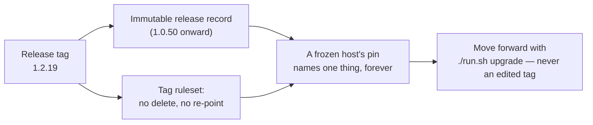

# Document release immutability, tag protection and the pinned frozen default (Issue #871)

## Summary

Documents the release-integrity story end to end so an operator can see what a
released version guarantees and how to move between versions. Closes #871.

- `docs/RELEASE-TAGGING.md` gains a **Release integrity** section: the
  immutable-releases boundary (`1.0.50` onward reports `immutable: true`, the 31
  earlier releases report `immutable: false` and are not made immutable
  retroactively), what the checked-in tag ruleset blocks and deliberately does
  not, the two verification commands, and `./run.sh upgrade` as the only
  supported way to move a frozen host forward.
- `docs/SETUP.md` says who `dynamic` is for and that it is **not** the default —
  a host taking the defaults ends up frozen on the latest release tag.
- `docs/CONFIGURATION.md` relates a release-tag pin to those guarantees.
- `docs/TROUBLESHOOTING.md` no longer tells a host dropping
  `VIBE_SKIP_CHECKOUT_UPDATE` that it "tracks the default branch again" — with
  the frozen default that is wrong; the host returns to its pin.

The tag-protection prose #869 wrote was lost by the main→milestone sync
(`7535b81` removed 86 lines from `docs/RELEASE-TAGGING.md`), leaving the shipped
ruleset undocumented. It is restored here under the new heading rather than
written twice, and corrected where independent review found it overclaiming.

## Evidence

Documentation-only change; there is no web interface to screenshot. The
guarantees documented were verified against the live repository, and the prose is
pinned to real code by tests.

**Immutability boundary** — `gh api repos/stSoftwareAU/VibeCoder/releases
--paginate --jq '.[] | [.tag_name, (.immutable|tostring)] | @tsv'`: `1.0.50`
onward is `true`, and exactly 31 earlier releases are `false`.

**Live ruleset** — `gh api repos/stSoftwareAU/VibeCoder/rulesets/22264472`
returns `rules: ["deletion","non_fast_forward"]`. The checked-in payload also
carries `update`, which still needs an admin `PUT` (escalated on #869). The
section says so explicitly rather than describing the payload as if it were
live: *"A rule the payload carries and command 2 does not print is not
enforced."*

**Tests** — `deno test tests/release_integrity_docs_test.ts
tests/update_mode_docs_test.ts tests/release_tag_ruleset_test.ts` → 38 passed,
0 failed.

**Quality gate** — `./quality.sh` passes every stage except `deno tests`, which
is red on the **base branch** for an unrelated reason: the milestone branch
resurrects `worker/deno/tests/fleet_health_test.ts`, a file `main` deleted in
1.2.0, and it mutates `Deno.env` without a manifest entry. Reproduced on the
untouched milestone tip `d5e0389`, and #1039 (Issue #870) was merged into this
branch with the same shard red. Raised as **#1042** with the root cause and the
fix; nothing in this diff touches it.

## Acceptance Criteria

<!-- vibe-spec-review inputs="diff+issue-body" -->

- **met** — `docs/RELEASE-TAGGING.md` has a release-integrity section covering
  immutable releases, the ruleset's blocked and allowed operations, and the two
  verification commands — evidence: `docs/RELEASE-TAGGING.md` §Release integrity
  — reviewer: met
- **met** — `docs/SETUP.md` states the pinned `frozen` default and the
  latest-release-tag pin — evidence: `docs/SETUP.md` §Update mode: dynamic or
  frozen, asserted by
  `worker/deno/tests/release_integrity_docs_test.ts::SETUP.md - the latest-release pin is stated, and dynamic is not the default`
  — reviewer: met
- **met** — `docs/CONFIGURATION.md` documents the update-mode keys and the
  no-fetch-at-pin and update-notice behaviours — evidence:
  `docs/CONFIGURATION.md` §Update Mode (field table, worked examples),
  §Host-Side Checkout Update (no fetch at the pin), §New-Release Notice —
  reviewer: met
- **met** — the update notice is quoted verbatim as shipped — evidence:
  `worker/deno/tests/release_integrity_docs_test.ts::CONFIGURATION.md - the notice section quotes the line the code emits`
  compares the doc against `formatReleaseNotice()` itself — reviewer: met
- **met** — no documentation claims a release tag can be deleted or moved, and
  none claims `dynamic` is the default — evidence: repo-wide grep found no such
  claim; the reviewer confirmed the only "mutable tag" prose concerns
  third-party container images in `docs/GITHUB-ACTIONS-AUDIT-SCAN.md` —
  reviewer: met
- **partial** — `./quality.sh` passes, including markdownlint and the
  documentation checks; Australian English throughout — evidence: full gate run
  after the final edit; every stage PASSED except `deno tests` — reviewer:
  partial — reason: the one failing test is pre-existing on the base branch
  (`tests/fleet_health_test.ts`, raised as #1042) and independent of this diff,
  which no documentation change can turn green
- **met** — the existing `./run.sh upgrade` prose in `DEPLOYMENT.md`,
  `TROUBLESHOOTING.md`, `INTERNALS.md` and `README.md` is checked and anything
  contradicted by the pinned default is fixed — evidence:
  `docs/TROUBLESHOOTING.md` (the `VIBE_SKIP_CHECKOUT_UPDATE` paragraph); the
  other three were read and are consistent — reviewer: partial — reason: the
  reviewer found that exact contradiction still standing and it was fixed after
  the review
- **unrequested** — an "Applying it" subsection with the admin `POST`/`PUT`
  commands — reason: the verification section tells the reader a drifted ruleset
  is repaired by that `PUT`, so the repair has to be somewhere; it is #869's
  prose restored, not new
- **unrequested** — the ⚠️ warning that both destructive proofs are real pushes
  — reason: the section recommends running them, and against a drifted ruleset
  the delete really deletes; documenting a checklist step without its failure
  mode would be the silent-failure this repo forbids
- **unrequested** — the Mermaid diagram, and a Tests-list entry for
  `release_tag_ruleset_test.ts` — reason: house style for this repo's docs, and
  #869's test was missing from the index it belongs in
- **unrequested** — `worker/deno/tests/release_integrity_docs_test.ts` — reason:
  the run is test-first, and this repo binds documentation to code the same way
  (`update_mode_docs_test.ts`, `threat_model_docs_test.ts`)
- **unrequested** — `worker/deno/tests/support/markdown_docs.ts` and the
  `update_mode_docs_test.ts` refactor onto it — reason: the standards reviewer
  found the section helper forked into two drifting copies; one shared,
  fence-aware version is the DRY fix
- **unrequested** — the immutability cross-link in `docs/CONFIGURATION.md`
  §Choosing a pin — reason: the issue asked for the link out of the integrity
  section; the return link is one sentence and is where a reader choosing a pin
  actually is

## Standards Review

<!-- vibe-standards-review inputs="diff+CODING-STANDARDS.md" -->

- **violation** — the section helper was copied from `update_mode_docs_test.ts`
  and the copy silently gained a fix the original did not get — evidence:
  `worker/deno/tests/release_integrity_docs_test.ts:32` — reason: fixed here —
  extracted to `worker/deno/tests/support/markdown_docs.ts` and both suites now
  import it
- **violation** — `docs/CONFIGURATION.md` restated the no-fetch-at-pin behaviour
  a second time in the same document — evidence: `docs/CONFIGURATION.md:627` —
  reason: fixed here — the bullet was removed; §Host-Side Checkout Update owns
  that fact and states it once
- **violation** — the new `docs/SETUP.md` paragraph restated the frozen default
  and the latest-release pin already stated twice in the same section —
  evidence: `docs/SETUP.md:307` — reason: fixed here — trimmed to the only new
  fact, who `dynamic` is for
- **violation** — "the release record is immutable … so what `1.0.7` names today
  is what it names next year" is false for a pre-1.0.50 release — evidence:
  `docs/CONFIGURATION.md:690` — reason: fixed here — the guarantee now rests on
  the tag ruleset, with immutability scoped to `1.0.50` onward
- **violation** — a destructive `git push origin :refs/tags/…` was recommended
  as a checklist step with its failure mode described only for the *move* case —
  evidence: `docs/RELEASE-TAGGING.md:305` — reason: fixed here — read the rule
  list first, and both destructive proofs now carry the warning
- **violation** — a duplicated assertion of the setup default already covered by
  `update_mode_docs_test.ts` — evidence:
  `worker/deno/tests/release_integrity_docs_test.ts:248` — reason: fixed here —
  removed; this suite asserts only what #871 added
- **violation** — `docs/archive/pr-summaries/pr-summary-871.md` was missing —
  evidence: commit `32450d0` — reason: fixed here — this file
- **violation** — the immutability assertions match prose keywords (`1.0.50`,
  `31`) rather than exercising code — evidence:
  `worker/deno/tests/release_integrity_docs_test.ts:88` — reason: stands. Those
  two facts live in GitHub's API, not in the repo, and a unit test may not reach
  the network; every other assertion in the suite is bound to real code — the
  ruleset payload through `loadReleaseTagRuleset`/`ruleTypes`, the worked tags
  through `refIsProtected`, the notice through `formatReleaseNotice`, the
  command through `UPGRADE_INVOCATION`
- **violation** — the no-fetch-at-pin claim is checked as prose although
  `holdAtPinnedRef` has an injectable `fetchOrigin` seam — evidence:
  `worker/deno/tests/release_integrity_docs_test.ts:166` — reason: stands. The
  behaviour is already covered by the checkout-update suite; this assertion
  exists to stop the *documentation* losing it, which is what #871 asked for
- **clean** — Australian English throughout; no hidden or credential-shaped
  paths staged; fail-loud helpers (a missing heading throws rather than
  asserting against an empty string); cross-links and anchors resolve; the
  factual claims verified against the live repository; `deno fmt`, `deno lint`,
  `deno check`, markdownlint and the mermaid check all clean

## Test Plan

- Added `worker/deno/tests/release_integrity_docs_test.ts` — 9 tests, written
  before the prose and observed failing against it (8 red, 1 green). They tie
  the documentation to real code: every rule the checked-in ruleset payload
  carries must be named, an allowance the payload does not carry (`creation`)
  and an empty `bypass_actors` must be stated, every `refs/tags/…` example must
  be a ref `refIsProtected()` really matches, the notice must match
  `formatReleaseNotice()`, and the upgrade cross-link must resolve to a real
  heading via `anchorSet()`.
- Added `worker/deno/tests/support/markdown_docs.ts` and moved
  `update_mode_docs_test.ts` onto it — 19 tests still pass, now against the
  fence-aware section reader.
- `deno test tests/release_integrity_docs_test.ts tests/update_mode_docs_test.ts
  tests/release_tag_ruleset_test.ts` → 38 passed, 0 failed.
- `./quality.sh` → every stage PASSED except the pre-existing `deno tests`
  failure described under Evidence and raised as #1042.
