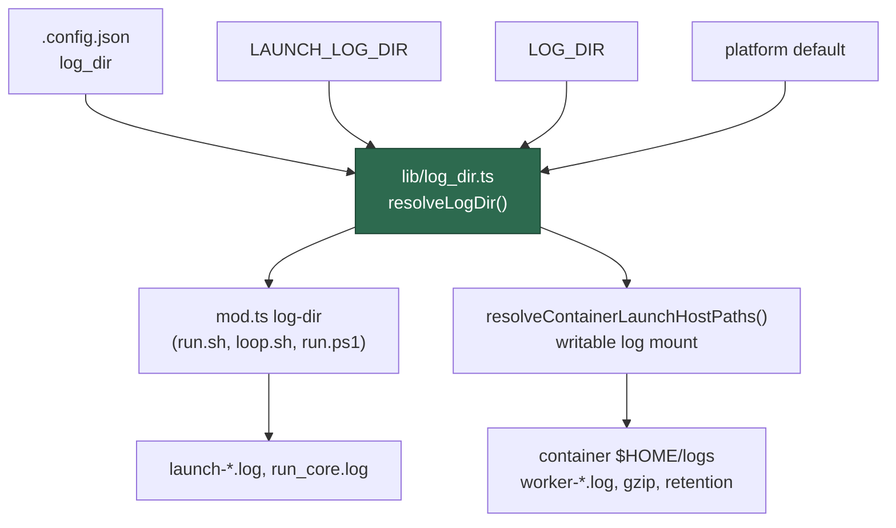

# A `.config.json` key for the log directory

## Summary

Host-side operator configuration lives in `.config.json`. The log directory did
not: after Issue #873 moved the default onto each platform's own location, the
only way to pin it was `LAUNCH_LOG_DIR` or `LOG_DIR` — host environment
variables. A deployment that keeps its logs in `~/logs` and wants to keep them
there had nowhere in its configuration file to say so, and nothing is migrated,
so every host silently starts writing somewhere else.

This adds the key: **`log_dir`**. Part of Issue #873.

```json
{
  "log_dir": "~/logs"
}
```

| Accepted value | Example |
| -------------- | ------- |
| An absolute host path | `"/var/log/vibe-coder"` |
| A path anchored at `~`, expanded against the host's home | `"~/logs"`, `"~"` |
| Absent, or blank | The variables, then the platform default |

A **relative** path is refused at config load, naming the key and the offending
value: it would resolve against whichever directory each launcher happened to
be started in, so `launch-*.log` and `worker-*.log` could land in different
places. `~` is expanded exactly as it is for the other path-valued keys
(`ssh_key_path`, `gh_config_dir`).

Precedence — **`log_dir`, then `LAUNCH_LOG_DIR`, then `LOG_DIR`, then the
platform default** — is the rule `lib/config_precedence.ts` states for every
other setting. Neither variable is removed or deprecated: a launchd or systemd
unit naming `/var/log/vibe-coder` sets an environment, not a config file, and
that remains the one place a directory genuinely has to come from the
environment.

The key name was not invented here. `lib/vibe_env_registry.ts` already declared
`VIBE_LOGS_DIR` as `operator_config` with `configKey: "log_dir"` — the key that
would replace it. Creating it drops `OPERATOR_CONFIG_BYPASS_CAP` from 16 to 15,
which is the cap's whole purpose: it may shrink, never grow.

## How the launcher and the worker cannot disagree

`launch-*.log` is written by `loop.sh` before Deno starts; `worker-*.log` is
written inside the container, into the one writable host mount. A key read by
only one of them would split the logs across two directories — the failure this
change exists to prevent. Both reach the same resolution:



The shell launchers needed no change: `run.sh`, `loop.sh` and `run.ps1` already
capture `mod.ts log-dir` rather than spelling the resolution themselves (that
is what Issue #873's own PR added the command for). The command now reads
`log_dir` out of the configuration file — from the file, not from the loaded
`WorkerConfig`, because `mod.ts` falls back to the default configuration for a
config-optional command and would otherwise turn a broken config file into a
silent platform default. This is the same reasoning `commands/run_mode.ts`
records for `run_mode` (Issue #3234).

Every other host-side resolver was wired to the same key, so none of them can
answer differently: the container launch plan's log mount, the supervisor's
quota-pause marker (`container-restart-backoff`), `green-gate-report`,
`worker-checkout-update`, the macOS LaunchAgent plist and update-mode setup.

## Log compression is unaffected — verified

Compression (`lib/worker_log_gzip.ts`, Issue #4027) and retention
(`lib/worker_log_cleanup.ts`, Issue #1902) both run **inside the container**, on
`${HOME}/logs` — the fixed mount *target*, not a re-spelled host default. That
target is bind-mounted from `resolveContainerLaunchHostPaths().logDir`, which
now honours `log_dir`. So pinning the directory moves the mount and compression
follows it; nothing re-derives a default of its own along the way.
`log_dir_config_key_test.ts` pins this end to end: gzip a prior run's log in the
pinned directory, then run retention over it and assert the `.gz` survives.

## Test Plan

New suite `worker/deno/tests/log_dir_config_key_test.ts` (16 tests) — red
before green; the first run failed to compile with
`Module '.../lib/log_dir.ts' has no exported member 'LOG_DIR_CONFIG_KEY'` and
`TS2554 Expected 3-4 arguments, but got 5`.

- the key pins the directory; `~` and `~/…` expand against the host's home
- the key outranks `LAUNCH_LOG_DIR` and `LOG_DIR`
- absent the key, both variables still work, in their existing order
- absent both, the platform default applies; a blank key means unset
- a relative value throws, naming the key and quoting the value
- a pinned directory silences the legacy-location notice
- `readConfiguredLogDir` / `readConfiguredLogDirSync`: reads the key, treats a
  missing file as "nothing stated", and fails loud on unreadable JSON, a
  non-object, or a non-string value
- **parity**: `resolveLogDirForCommand` (what the launchers capture) and
  `resolveContainerLaunchHostPaths().logDir` (the writable mount) resolve to
  the same directory from the same key
- **compression**: gzip and retention run on the pinned directory and the
  `.gz` survives
- registration: `log_dir` is in `KNOWN_CONFIG_KEYS`, raises no unknown-key
  warning, and `validateConfigFileJson` refuses a non-string and a relative
  path while accepting `~/…` and an absolute path
- the `log-dir` command itself reports the configured directory

Existing suites updated rather than replaced: `log_dir_default_test.ts`'s
`log-dir` cases now `await` the resolution and name a configuration file that
does not exist, so they stay on the default-and-variables path they are about
and never read the host's own configuration.

### A pre-existing failure fixed on the way past

`log-dir command - stdout is the path alone, even under OUTPUT_JSON` asserted
the Linux default (`/tmp/vibe-log-dir-probe/.local/state/vibe-coder`) while the
subprocess follows `Deno.build.os`, so it failed on **every macOS host** — this
was verified against the unmodified branch before any change here. It now asks
`defaultLogDir()` for the host's own answer, which keeps the one-line contract
it exists to pin and is green on Linux and macOS alike.

## Evidence

No UI change, so no screenshots. The behaviour is directory resolution; the
evidence is the parity and compression tests above, which assert on resolved
paths and on real files gzipped and retained in a temporary directory.
