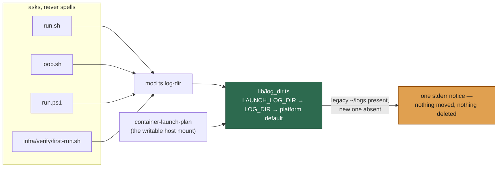

# Default to the platform-standard log directory

## Summary

`$HOME/logs` follows no platform convention: it is not a location XDG, macOS or
any system-service layout nominates, and it drops fleet state — rotated
`worker-*.log(.gz)`, `launch-*.log`, PID and failure-streak files — straight
into the operator's home directory beside their own files. The default now
follows the platform. Closes #873.

| Platform | Default                                                                 |
| -------- | ----------------------------------------------------------------------- |
| Linux    | `$XDG_STATE_HOME/vibe-coder`, falling back to `~/.local/state/vibe-coder` |
| macOS    | `~/Library/Logs/vibe-coder` — the directory Console.app reads             |
| Windows  | `%LOCALAPPDATA%\vibe-coder\logs`                                         |

`LAUNCH_LOG_DIR` then `LOG_DIR` still outrank it, so a system service keeps
naming `/var/log/vibe-coder`. **Nothing is migrated**: a host that still has
`~/logs` and does not yet have the new directory is told once, at launch, with
both paths and the exact move — and its old directory is left untouched.

Issue #872 unified the *overrides* and left the *default* spelled in three
places. This change puts the whole resolution in one module,
`worker/deno/lib/log_dir.ts`, and gives the shell launchers a way to ask for it
rather than re-spell it — a new `log-dir` command. Without that, moving the
default would have moved some logs and not others, which is the failure #872
exists to end.



## Evidence

Backend/CLI change with no web interface, so no screenshot: the evidence is
tests and command output.

The command, run against a synthetic home that still carries the old directory
(the notice goes to stderr, the path to stdout):

```text
$ HOME=/tmp/loghome deno run --allow-env --allow-read worker/deno/mod.ts log-dir
[log-dir] Logs now default to /tmp/loghome/.local/state/vibe-coder (Issue #873).
The previous default /tmp/loghome/logs was left untouched — nothing has been
moved or deleted. To bring its history across: mkdir -p
/tmp/loghome/.local/state/vibe-coder && mv /tmp/loghome/logs/*
/tmp/loghome/.local/state/vibe-coder/. To keep the old location, set
LOG_DIR=/tmp/loghome/logs.
/tmp/loghome/.local/state/vibe-coder
```

Overrides still win, checked against the real command:

```text
LAUNCH_LOG_DIR=/tmp/op-choice → /tmp/op-choice
LOG_DIR=/tmp/op-log           → /tmp/op-log
(neither set)                 → $XDG_STATE_HOME/vibe-coder
```

Gate status: `./quality.sh` passes every check except `deno tests`, which fails
on **one pre-existing test**,
`run_core_production_deps_test.ts::static trust refresh succeeds and does not
throw`. That failure is **not from this change**: the same gate run on the
target branch's tip (`HEAD~1`, no changes of mine) fails on that test too. The
integration suites the gate excludes were run by hand and are green:
`run_sh_launcher_test.ts` (69 passed), `first_run_script_test.ts` (12),
`log_dir_launcher_test.ts` (2), plus `launcher_parity`, `loop_supervisor`,
`container_restart_backoff`, `run_ps1_launcher`, `host_config_path`,
`setup_launchagent_prompt` and `run_sh_upgrade` (83 passed, 33 ignored).

## Acceptance Criteria

<!-- vibe-spec-review inputs="diff+issue-body" -->

- **met** — Default to `$XDG_STATE_HOME/vibe-coder`, falling back to
  `~/.local/state/vibe-coder`, on Linux — evidence:
  `worker/deno/lib/log_dir.ts::defaultLogDir` and
  `worker/deno/tests/log_dir_default_test.ts::log dir - Linux defaults to ~/.local/state/vibe-coder (Issue #873)`
  — reviewer: met
- **met** — `~/Library/Logs/vibe-coder` on macOS — evidence:
  `worker/deno/tests/log_dir_default_test.ts::log dir - macOS defaults to ~/Library/Logs/vibe-coder (Issue #873)`
  — reviewer: met
- **met** — A system service keeps `/var/log/vibe-coder`, by naming it —
  evidence:
  `worker/deno/tests/log_dir_default_test.ts::log dir - the overrides still outrank the platform default (Issue #873)`,
  documented at `docs/CONFIGURATION.md` "Where the logs go" — reviewer: met
- **met** — Keep the location overridable, from a single resolution point —
  evidence: `worker/deno/lib/log_dir.ts` is the only resolution; `run.sh:338`,
  `loop.sh:105`, `run.ps1:295`, `infra/verify/first-run.sh:128` and
  `container_launch.ts::resolveContainerLaunchHostPaths` all reach it, and
  `worker/deno/tests/log_dir_launcher_test.ts::loop.sh - an operator's LAUNCH_LOG_DIR reaches the resolver and is used`
  drives the shell end of it — reviewer: partial — reason: the reviewer read
  the first commit, where `loop.sh` blanked `LAUNCH_LOG_DIR` before resolving
  and silently dropped the override; that defect is fixed in `2cd81aa` and the
  regression test above fails against the blanking version
- **met** — On startup, a host with the legacy `~/logs` and no new directory is
  told once, with the exact path, and the old directory is left alone — nothing
  migrated, nothing deleted — evidence:
  `worker/deno/lib/log_dir.ts::legacyLogDirNotice` (the notice is text only —
  no filesystem write anywhere in the module) and the four
  `log dir - … notice …` cases in
  `worker/deno/tests/log_dir_default_test.ts` — reviewer: partial — reason: the
  reviewer found the printed `mv` could not run as printed because the
  destination does not exist; the notice now prints `mkdir -p … && mv …`, pinned
  by
  `log dir - the legacy location is named, never migrated (Issue #873)`
- **met** — Documented in the release notes as breaking, with the one-line move
  — evidence: `docs/RELEASE-NOTES.md` "1.4.0 — the log directory follows the
  platform", and `.release-floor` raised to `1.4.0` — reviewer: partial —
  reason: the issue says the change lands in **2.0.0**, written when the repo
  was at 1.0.0. The repo has since released 1.3.11, and both prior contract
  changes (1.2.0 removing `fleet_health_*`, 1.3.0 removing `author_source`)
  moved the **minor** through `.release-floor`. This follows that precedent;
  choosing 2.0.0 instead is a one-line floor edit if a human prefers it
- **met** — Sequencing: the `LOG_DIR` consistency fix lands first — evidence:
  #872 is closed and on the target branch; this change additionally folds the
  five remaining host-side resolutions
  (`container_restart_backoff.ts`, `worker_checkout_update.ts`,
  `green_gate_report.ts`, `setup/update_mode_setup.ts`,
  `setup/launchagent.ts`) onto the shared resolver — reviewer: met
- **unrequested** — Windows default `%LOCALAPPDATA%\vibe-coder\logs` — reason:
  the issue names Linux, macOS and a system service. `run.ps1` is a supported
  launcher that resolved `$HOME/logs` too; leaving Windows behind would have
  meant one platform still spelling its own default, which is the split the
  single resolution point exists to remove
- **unrequested** — the `log-dir` command and the rewiring of `run.sh`,
  `loop.sh`, `run.ps1` and `infra/verify/first-run.sh` — reason: the issue's own
  sequencing note requires "a single resolution point exists to change". Shell
  cannot import TypeScript, so asking the worker is the only way the default
  moves in one place rather than four
- **unrequested** — host-side `~/logs` references updated across
  `README.md`, `SECURITY.md` and seven `docs/` pages — reason: those pages tell
  operators where to read the logs; leaving them naming `~/logs` would document
  a directory the worker no longer writes to. The in-container `/home/vibe/logs`
  references are deliberately untouched — that mount target has not moved

## Standards Review

<!-- vibe-standards-review inputs="diff+CODING-STANDARDS.md" -->

- **violation** — Quality gates: 22 launcher and first-run tests still asserted
  the literal `$HOME/logs` — evidence:
  `worker/deno/tests/run_sh_launcher_test.ts:103`,
  `worker/deno/tests/run_ps1_launcher_test.ts:96`,
  `worker/deno/tests/first_run_script_test.ts:91` — reason: fixed here. The
  harness now exposes `harness.logDir` from the resolver
  (`tests/fixtures/launcher_harness.ts`) and the first-run sandbox computes the
  same value, so the expectations follow the resolution instead of a literal.
  All three suites are green
- **violation** — Never fail silently: under `OUTPUT_JSON=true`, `mod.ts`
  appends a result's `data` to stdout as JSON, so every launcher capturing
  `log-dir` would have resolved the log directory to `}` — evidence:
  `worker/deno/commands/log_dir.ts:105` (as first written) — reason: fixed here.
  The command returns the path alone, pinned by
  `log-dir command - stdout is the path alone, even under OUTPUT_JSON (Issue #873)`
- **violation** — Never fail silently: `infra/verify/first-run.sh` discarded the
  command's stderr, so its own error named no cause and the legacy notice was
  swallowed — evidence: `infra/verify/first-run.sh:119` — reason: fixed here;
  stderr is passed through and the message points at it
- **violation** — Docs accuracy: the cron examples were rewritten to a
  hard-coded `/home/USER/.local/state/…` inside blocks labelled *macOS /
  Linux* — evidence: `README.md:293`, `docs/DEPLOYMENT.md:601`,
  `docs/TROUBLESHOOTING.md:429` — reason: fixed here; each names
  `~/.local/state/vibe-coder/cron.log` with the macOS path called out beside it
- **violation** — Docs accuracy: `docs/TROUBLESHOOTING.md` used `${LOG_DIR}`
  before the block that defines it — evidence:
  `docs/TROUBLESHOOTING.md:96` — reason: fixed here; that snippet now resolves
  the variable itself
- **violation** — Docs accuracy: `log-rotation` and `worker-log-cleanup` still
  documented `default: ~/logs` — evidence:
  `worker/deno/commands/log_rotation.ts:24`,
  `worker/deno/commands/worker_log_cleanup.ts:26` — reason: their code is
  correct and deliberately unchanged — those commands run **inside** the
  container, where `/home/vibe/logs` is the fixed mount target — so the usage
  text now says exactly that
- **violation** — Test coverage: five host-side call sites that switched to the
  shared resolver gained no test of their own — evidence:
  `worker/deno/setup/launchagent.ts:48`,
  `worker/deno/setup/update_mode_setup.ts:160`,
  `worker/deno/commands/worker_checkout_update.ts:209`,
  `worker/deno/commands/container_restart_backoff.ts:96`,
  `worker/deno/commands/green_gate_report.ts:171` — reason: stands. Each is a
  one-line delegation to `resolveLogDir`, which is directly tested across
  platforms and overrides; giving all five an injectable environment is the
  env-injection work of #944, not this issue
- **violation** — DRY: `loop.sh`'s degraded fallback still spells
  `${LAUNCH_LOG_DIR:-${LOG_DIR:-${HOME}/logs}}` — evidence: `loop.sh:123` —
  reason: stands, deliberately. The supervisor must never exit, so it needs an
  answer when Deno cannot give one; the overrides are the operator's own words
  and are still honoured, only the last resort is the old path, it is announced
  loudly on stderr, and reaching it means `run.sh` will refuse the launch
  anyway
- **clean** — Australian English throughout; no hidden or secret path staged
  (the one hidden file, `.release-floor`, is tracked and is the documented
  release mechanism); tests call real functions and real scripts rather than
  grepping source; `deno lint`, `deno check` and `deno fmt` all clean; the
  in-container `/home/vibe/logs` mount target correctly left alone

## Test Plan

Added:

- `worker/deno/tests/log_dir_default_test.ts` — 18 cases: the three platform
  defaults, `XDG_STATE_HOME` honoured and its blank/relative values ignored per
  the specification, override precedence, platform-name normalisation, the five
  conditions the legacy notice speaks (and stays silent) under, the Windows
  spelling of the move, the command's own resolution, its fail-loud with no
  home, and stdout under `OUTPUT_JSON=true`.
- `worker/deno/tests/log_dir_launcher_test.ts` — drives `loop.sh` in a sandbox:
  an operator's `LAUNCH_LOG_DIR` reaches the resolver and the launch log is
  written there; `LOG_DIR` alone behaves the same. Verified red against the
  version that blanked the variable.
- `worker/deno/tests/run_sh_launcher_test.ts::run.sh - LOG_DIR moves the
  writable host mount with it` — the override reaches the container mount and
  the run-core log.

Modified (business-logic change, stated explicitly):

- `worker/deno/tests/log_dir_resolution_test.ts` (#872's suite) — the
  "defaults to `$HOME/logs`" case now asserts the precedence *chain* ends at
  `defaultLogDir`, and the platform is stated so the expectation is
  host-independent. No case was removed.
- `worker/deno/tests/container_launch_test.ts`,
  `worker/deno/tests/container_containment_test.ts`,
  `worker/deno/tests/run_sh_launcher_test.ts`,
  `worker/deno/tests/run_ps1_launcher_test.ts`,
  `worker/deno/tests/first_run_script_test.ts`,
  `worker/deno/tests/fixtures/launcher_harness.ts` — expectations follow the
  resolver rather than a literal `$HOME/logs`.
- `worker/deno/tests/mod_test.ts` — command count 145 → 146 for `log-dir`.
- `worker/deno/lib/integration_test_manifest.ts` — the new script-driving suite
  is declared, so the gate excludes it from the parallel pass by name.
