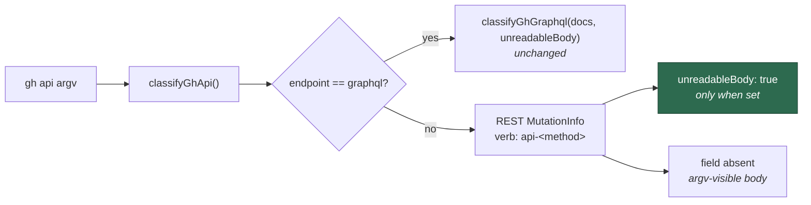

# Plumb `unreadableBody` through `classifyGhApi` to `MutationInfo`

## Summary

`classifyGhApi()` (`worker/deno/lib/audit_mutation_classifier.ts`) already
computed a local `unreadableBody` — set by `gh api --input` / `--input=<file>`
and by an `@file`-sourced `query=` field value — but only *consulted* it on the
`graphql` branch. On the REST return path the flag was computed and then
discarded, so no downstream caller could tell an argv-visible request body from
one the argv cannot show.

This change surfaces the fact and nothing else:

1. `MutationInfo` gains an optional `unreadableBody?: boolean`, documented with
   the Issue #11 reference.
2. `classifyGhApi` sets it on the REST `verb: "api-<method>"` return object from
   the existing local, spreading it in **only when true** so an argv-visible
   body leaves the field absent rather than `false` — existing deep-equality
   assertions on `MutationInfo` keep passing.
3. The `graphql` branch is untouched; Issue #3937's fail-closed
   `scope: "unknown"` behaviour is unchanged.

Plumbing only — no policy change and no refusals added. The three consumers
named in the issue (fail-closed guard, `--input` body scan, body redactor) land
as separate follow-ups against the parent milestone.

Closes #89.

## Evidence

Backend/CLI change with no web interface — nothing to screenshot. Verified by
unit tests and the repository quality gate.

Where the flag now flows:



### Security-fix evidence

- **Regression test:** added
  `worker/deno/tests/gh_api_body_classification_test.ts::classifyGhMutation - REST --input surfaces unreadableBody`,
  which reproduces the gap. It **fails against the unfixed code** — before the
  change `MutationInfo` has no `unreadableBody` property, so the assertion is a
  `TS2339` compile error and the deep-equality assertion does not match the
  returned object — and **passes after the fix**.
- **Both failure directions covered:**
  `…::classifyGhMutation - an argv-visible REST body leaves unreadableBody absent`
  fails if the field is ever set unconditionally or written as an explicit
  `false`, and `…::classifyGhMutation - a GET with --input stays a read, flag or not`
  fails if the plumbing turns `--input` into a forced mutation.
- **Original trigger closed, no trivial bypass:** every argv spelling that makes
  a REST body unreadable — `--input <file>`, `--input=<file>`, and an
  `@file`/`@-` sourced `query=` value via `-f`/`-F`/`--field=`/`--raw-field=` —
  writes the same single local `unreadableBody`, and the REST return path now
  reads that one local unconditionally. There is no second code path that
  builds a REST `MutationInfo`, so no argv variant can produce an unreadable
  body while the field stays absent. The complementary direction is closed too:
  the field is spread in only when the local is `true`, so it cannot be forged
  onto a fully argv-visible call.

### Test run

```
deno test --allow-all tests/gh_api_body_classification_test.ts
ok | 21 passed | 0 failed (4ms)
```

`./quality.sh` reports `deno lint`, `deno type check` and `deno fmt` PASSED.
The `deno tests` stage reports 7 pre-existing environment failures unrelated to
this change — `fleet_health_test.ts` (container-mode work-dir mount),
`optional_feature_env_test.ts` (unreadable-file permission case) and five
`setup_workdir_reminder_test.ts` host work-dir cases. All 7 were confirmed to
fail identically on a clean tree at the same base commit (`git stash`, re-run,
`git stash pop`), so none are caused by this change.

## Test Plan

Added to `worker/deno/tests/gh_api_body_classification_test.ts`:

- `classifyGhMutation - REST --input surfaces unreadableBody` — full
  deep-equality assertion on the returned `MutationInfo`, including
  `unreadableBody: true`.
- `classifyGhMutation - REST --input=<file> surfaces unreadableBody` — the
  attached-value spelling.
- `classifyGhMutation - a REST @file query= field surfaces unreadableBody` — an
  `@file`-sourced value on a REST endpoint, not just on `graphql`.
- `classifyGhMutation - an argv-visible REST body leaves unreadableBody absent`
  — asserts `undefined` **and** deep-equals an object with no such key.
- `classifyGhMutation - a GET with --input stays a read, flag or not` — the
  read-path regression guard.
- `classifyGhMutation - an explicit PATCH with --input surfaces unreadableBody`
  — the flag rides an explicit method too, not just the implied POST.

Existing tests kept unchanged, including the `graphql` fail-closed cases and
the original `evaluateGhCommand - a GET with --input stays a read`.
