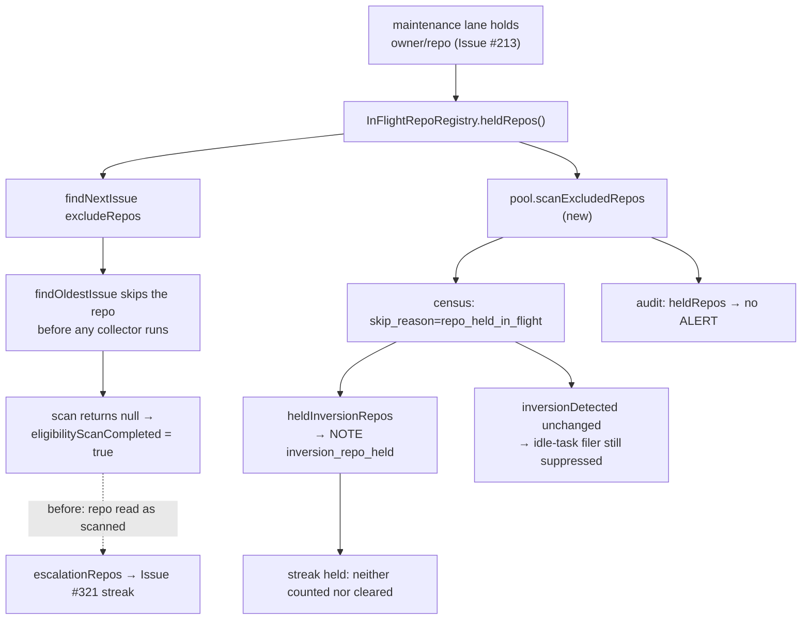

# A repo the claim scan was never shown is not a repo it refused (Issue #898)

## Summary

The idle-inversion escalation was told one **cycle-wide** boolean —
`claimScanCompleted` — and applied it to every monitored repo. The claim scan
does not work that way: `findOldestIssue` drops every repository in its
`excludeRepos` set (`find_oldest_issue.ts:115`) before any collector runs, and
that set is `InFlightRepoRegistry.heldRepos()` — every repo an issue slot
(Issue #4176) **or** the maintenance lane (Issue #213) holds. No gate refuses
those issues; none is ever consulted.

That is why `stSoftwareAU/VibeCoder` escalated on three consecutive cycles with
nine claimable `work-on` issues and an **empty** "What the claim scan did with
them" section in the filed issue: the lane was servicing one of the repo's own
PRs, so the pool's scan could not see the repository, found nothing anywhere
else, set `eligibilityScanCompleted`, and the census read that as "the scan
looked at VibeCoder and refused it". The repo whose PRs the fleet is busiest
maintaining is the repo most likely to be held — which is why the fleet's own
repo hit it repeatedly.

The fix is Issue #437's rule ("only a scan that actually refused the work may be
escalated") applied **per repo** instead of per cycle:

- the slot pool keeps the exclusion set of the pass that came up empty and hands
  it to the loop as `scanExcludedRepos`;
- the census records such a repo as
  `scanned=false skip_reason=repo_held_in_flight`, reports it under
  `heldInversionRepos`, and emits a `NOTE inversion_repo_held` line that names
  the hold — rather than the deferral note's "nothing refused this work", which
  is true here and still sends a reader to look at cycle duration (the Issue
  #479 lesson);
- the idle-detect audit takes the same set as `heldRepos` and drops those repos
  from its `mis_classification` ALERT, exactly as a claim gate silences it. Both
  alerts named the subject repo on every affected cycle, so fixing one and not
  the other would leave the fleet's own diagnosis contradicting itself.

Claimable counts are untouched on both readers, so the idle-task filer stays
suppressed while the work waits (Issue #2813) — the work is real, it is simply
not reachable this cycle, and it returns when the hold clears.

Closes #898.

## Evidence

Backend/CLI change with no web interface to screenshot. The evidence is the test
suite below plus the census output the formatter now produces:

```text
[idle-census] host=… decision_point=filing repo=stSoftwareAU/VibeCoder
  monitored=true scanned=false skip_reason=repo_held_in_flight work_on=9
  inversion_signal=true
[idle-census] host=… decision_point=filing ALERT inversion repos=stSoftwareAU/VibeCoder
[idle-census] host=… decision_point=filing NOTE inversion_repo_held
  repos=stSoftwareAU/VibeCoder — a slot on this host held these repositories, so
  the claim scan skipped them before any eligibility check ran; this work was
  never evaluated, and returns when the hold clears
```

Where the fact now flows, and where it used to stop:



## Reproduction

- **symptom** — `stSoftwareAU/VibeCoder` filed an idle-inversion escalation
  naming nine claimable `work-on` issues (#870, #869, #847, #841, #839, #838,
  #837, #835, #796) on three consecutive cycles, under an empty "What the claim
  scan did with them" section — the scan had recorded no reason for a single one
  of them, because it was never shown the repository.
- **status** — `verified` — the new tests were observed failing against the
  unfixed code (`git stash push -- worker/deno/lib`; the suite went red, e.g.
  `TS2339: Property 'scanExcludedRepos' does not exist`, and
  `audit - a held repo raises no mis_classification ALERT` failed on behaviour)
  and passing after the fix.
- **regression test** —
  `worker/deno/tests/idle_census_repo_held_898_test.ts::regression - the held repo the loop escalated no longer does (Issue #898)`
  composes the loop's scan-state resolution with the census and pins both halves:
  the pre-fix input escalates, the post-fix input does not.

## Test Plan

Added:

- `worker/deno/tests/idle_census_repo_held_898_test.ts` (11 tests) — a held repo
  is never escalated, is kept out of the plain-deferral bucket, is decided per
  repo beside scanned and deadline repos, raises nothing when it holds no
  claimable work; the formatter names the hold and omits the misleading note;
  `isRepoHeldSkipReason` and `resolveRepoScanState` (hold outranks a completed
  pass, unheld repos keep today's behaviour); and the regression test above.
- `worker/deno/tests/idle_detect_repo_held_898_test.ts` (4 tests) — a held repo
  raises no `mis_classification` ALERT, keeps its claimable evidence and its
  per-repo line, does not silence an unheld repo beside it, and omitting the
  option preserves the historical behaviour.
- `worker/deno/tests/run_core_idle_census_test.ts` (3 tests) — the loop hands the
  census the repos the completed pass was never shown (a maintenance-lane hold),
  reports none when the pool held nothing, and reports none for the serial loop.

Re-run green: `idle_decision_census_test.ts`, `idle_census_claim_gate_479_test.ts`,
`idle_detect_diagnostics_test.ts`, `idle_detect_gate_suppression_479_test.ts`,
`idle_inversion_streak_test.ts`, `fleet_telemetry_test.ts`,
`claim_path_differential_test.ts`, `claim_path_incident_test.ts`, and all
`run_core*_test.ts` (250 tests). Full `./quality.sh` run before the PR.

Docs: `docs/IDLE-TASK-FRAMEWORK.md` gains the held-repo case in
"Only a refusal escalates", a branch in its decision diagram, and the new note's
log shape.
