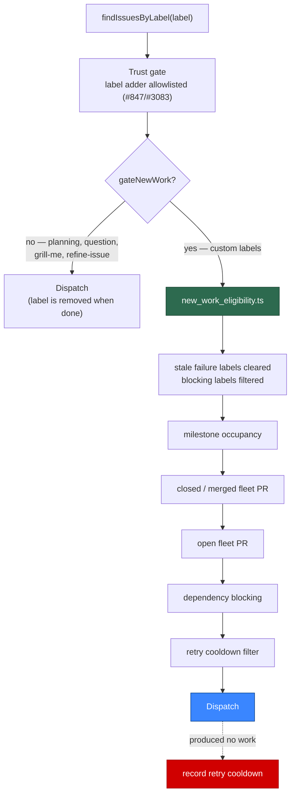

# Gate custom-label dispatch on open PRs and cooldowns, as `work-on` is

## Summary

The custom-label dispatch (#848, part of #843) reaches the **same**
`workOnIssue` pipeline `work-on` reaches — real branch, real commits, a real PR
— but it got there through `findIssuesByLabel`, which applied none of the
new-work eligibility gates the claim scan applies. A custom label is never
removed when the run finishes, and `unassign_on_pr_created` defaults to `true`,
so cycle N raised a PR and handed the issue back unassigned with the label still
on it, and cycle N+1 re-ran the whole implementation pipeline against the still
open PR. Each repeat cost a full agent run. Closes #937.

`planning`, `question`, `grill-me` and `refine-issue` are unaffected because
they *answer* an issue and remove their own label — re-dispatch stops itself.

### The shape chosen, and why

The issue offered two shapes: teach `findIssuesByLabel` an opt-in gating mode,
or route custom labels through the candidate collectors. This takes the **first**
— an opt-in `gateNewWork` on `findIssuesByLabel` — because the second does not
fit the collectors as they are:

- `collectWorkOnCandidates` is not label-parameterised. It reads
  `config.workOnLabel` in five places and carries behaviour that is specific to
  that label: it *strips* an untrusted `work-on` label
  (`stripUntrustedWorkOnLabel`), escalates milestone-tracking issues carrying
  `work-on` as dead labels, and computes the `hasSuppressingWorkOn` signal that
  suppresses the low-priority and idle-task tiers. Running a custom label
  through it would strip labels it does not own and would let a custom label
  park a repo's whole backlog.
- The collectors run inside `findOldestIssue`, which is the **claim scan** — one
  issue per cycle, selected across every tier. The custom-label row is a
  priority handler at 1.86, above the claim scan and with its own dispatch
  order. Moving it into the collectors would change which issue the fleet works,
  which is a bigger change than #937 asks for.

So the gates are **factored out rather than reimplemented**. The new
`worker/deno/lib/new_work_eligibility.ts` holds the sequence
`collectWorkOnCandidates` runs and calls the *same helpers* it calls —
`cleanStaleLabels`, `filterAndSort`, `isMilestoneOccupied`,
`isBlockedByRecentlyClosedPR` with its `wasLabelReappliedAfterClosedPR` escape
hatch, `getBlockingPRForIssue` with `hasIgnoreOpenPRsLabel`, and
`isDependencyBlocked`. No gate logic is restated.



### The pr-phase question (#1009/#1011, #1008)

The issue asked that the change not conflict with a label whose target phase is
the PR phase — such a label is *supposed* to run against an open PR — and to
respect a `custom_label_prompts` target-phase distinction if #1008 had already
added one.

**It has not.** `CustomLabelPromptMapping` carries `label`, `promptPath` and
`overridesPhase` only, and `overridesPhase` is #849's built-in-template
override, not a target phase. Every mapping `customDispatchMappings()` returns
— the ones this change gates — has no `overridesPhase` and runs the generic
implementation phase, which raises a PR. So **only the implementation-phase
custom labels are gated**, which today is all of them, and the gating is
switched at one call site:

```ts
dispatchCustomLabelPrompts(
  customDispatchMappings(config),
  (label, processFn, deadline) =>
    findAndProcessByLabel(label, processFn, deadline, /* gateNewWork */ true),
  …,
);
```

When a target phase does arrive, a pr-phase mapping opts out by passing
`gateNewWork: false` for that row — the flag is per scan, not per module — and
the open-PR gate that would otherwise refuse it never runs. Overrides
(`overridesPhase !== undefined`) are already outside this row entirely: they
replace a built-in phase's template and are worked by that phase's own handler.

### What is deliberately *not* gated

The `work-on` content-integrity check (`verifyWorkOnContentIntegrityDetailed`,
#1341) stays with `work-on`. It verifies an issue's body against an approval
snapshot that only the `work-on` approval flow captures; a label that never took
one would fail closed (`no-approval-snapshot`) on every issue — a different
defect from the one #937 reports.

## What changed

- **`worker/deno/lib/new_work_eligibility.ts`** (new) —
  `buildNewWorkGateContext()` gathers the per-repo facts (fleet open PRs, fleet
  closed/merged PRs, all open issues, a memoised issue fetcher, the fleet author
  sets), and `filterNewWorkEligible()` runs the gate sequence, returning the
  eligible issues plus one `BlockedCandidateInfo` per refusal. Every fetch is one
  the claim scan already makes in the same iteration under the same
  `IssueCache` key, so on a warm cache the gating costs no additional `gh` calls.
- **`worker/deno/lib/find_issues_by_label.ts`** — new
  `FindIssuesByLabelOptions.gateNewWork`. When set, the timeline batch covers
  every candidate (the closed-PR and `ignore-open-prs` checks read it), the
  trust-checked issues go through the gate sequence before becoming candidates,
  and the refusals ride out on `result.blockedDetails`. The `filterFailed`
  pre-filter is skipped under gating so `cleanStaleLabels` runs *first* — a
  reopened issue sheds its stale `failed` label rather than being stranded by
  the failure gate this route now honours.
- **`worker/deno/lib/run_core_production_deps.ts`** — `findAndProcessByLabel`
  takes a `gateNewWork` flag. For a gated scan it loads the run-local holds
  (persisted retry cooldown ∪ this run's processed-issue registry — the same set
  the claim scan filters on) and passes them as `isIssueInCooldown`, and it
  records a retry cooldown when the dispatch produced no work, so a persistently
  failing custom-labelled issue backs off instead of burning an agent run every
  cycle. Only the custom-label row passes the flag.
- **Docs** — `docs/CUSTOM-PROMPTS.md` gains a "When a labelled issue is
  dispatched" section with the gate table; `docs/CONFIGURATION.md` and
  `docs/INTERNALS.md` state the same rule against the code.

## Evidence

No UI and no performance change, so there is no screenshot or benchmark. The
evidence is the red-to-green test linkage below: with the gate call disabled
(`if (false && options.gateNewWork …)`) and the `filterFailed` ordering
restored, 6 of the 13 new gating tests fail; with the change in place all 13
pass, and the 7 guard tests pass in both states — the fix is not "never
dispatch anything".

```text
# Gate disabled (the pre-change behaviour)
find_issues_by_label - a gated scan does not dispatch an issue whose fleet PR is open ... FAILED
find_issues_by_label - a gated scan holds an issue whose PR closed inside the cooldown ... FAILED
find_issues_by_label - a gated scan holds an issue whose fleet PR merged, whatever the window ... FAILED
find_issues_by_label - a gated scan does not dispatch an issue carrying the failed label ... FAILED
find_issues_by_label - a gated scan holds an issue whose milestone is occupied ... FAILED
find_issues_by_label - a gated scan holds an issue whose dependency is still open ... FAILED
ok | 7 passed | 6 failed

# With the change
ok | 13 passed | 0 failed
```

## Test Plan

`worker/deno/tests/find_issues_by_label_gating_test.ts` (new, 13 tests) drives
the real finder against a fake that models GitHub's own answers — issue list, PR
list, REST timeline, issue labels — and asserts on the decision the worker
reaches, never on the request text:

- an issue whose fleet PR is **open** is not dispatched (`pr-blocked`);
- an **ungated** scan with the same fixture still dispatches it — the gating is
  opt-in and the label-removing routes are untouched;
- `ignore-open-prs` from an allowlisted account lifts the open-PR block;
- an issue whose PR **closed inside the cooldown** is held (`closed-pr-cooldown`)
  and is released once the window expires;
- an issue whose fleet PR **merged** is held permanently
  (`merged-pr-permanent`), and a trusted re-label dated after the merge reopens
  it;
- an issue carrying **`failed`** is not dispatched;
- an issue held by the **retry cooldown** is not dispatched;
- an issue whose **milestone is occupied** is held;
- an issue whose **dependency is open** is held;
- a normal **eligible** issue IS still dispatched, with no blocked details;
- the #847/#3083 **trust gate** still refuses an untrusted label adder — gating
  adds refusals, it never grants a dispatch.

`worker/deno/tests/new_work_eligibility_test.ts` (new, 6 tests) covers the
module directly: the context build's happy path (fleet open and closed PRs, the
merged classification, the push-capable set), its error path (a `gh` failure is
surfaced, not swallowed into "nothing blocking"), the empty-input edge case, the
milestone-aware open-PR block deferring only the issue it blocks, and the
ordering edge case that the sequence exists for — a reopened issue sheds its
stale `failed` label and stays eligible, while one still carrying `failed` is
refused.

Existing suites over the changed modules, all green: `issue_finder_test.ts`,
`custom_label_dispatch_test.ts`, `find_issues_by_label_command_test.ts`,
`best_practices_test_classification_test.ts`, `derived_trust_source_test.ts`,
`bash_dispatch_layer_removal_test.ts`, `issue_worker_wiring_test.ts`,
`pr_branch_update_integration_test.ts`, the four `run_core_production_deps*` /
`run_core_work_volume_usage` suites, `run_outcome_classifier_test.ts`,
`spend_ceiling_3684_test.ts`, `circular_deps_test.ts`, and every
`tests/*docs*test.ts`.
