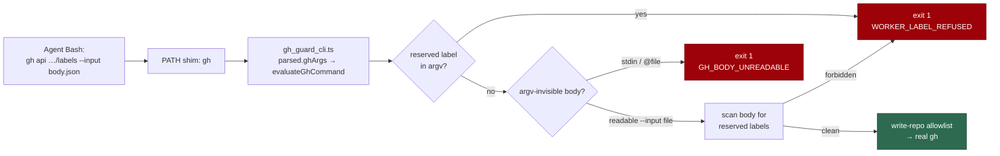

# PR Summary — Issue #94

## Summary

End-to-end regression tests for the #11 reserved-label bypass
(SEC-b17ab4cc0e2a, CWE-863): a reserved workflow label present **only** in a
`gh api --input <file>` body, never in the argv. The sibling sub-issues (#90,
#91, #92, #93) each unit-test their own module; none of them proves the exploit
is refused *the way an injected agent would run it*. The argv the PATH shim
hands `evaluateGhCommand` is `parsed.ghArgs`, and that wiring is its own seam —
a regression there leaves every unit test green and the guard open.

Tests only; no production code changed. Closes #94.

## Evidence

Backend/CLI change with no web interface, so there is no screenshot to capture.
The evidence is the test runs below.

**The tests fail against the unfixed tree.** Copied into a worktree of
`origin/main` (which predates #90–#93) and filtered to the new cases:

```text
gh-guard-shim #11 - refuses the exploit when the reserved label is present ONLY in the --input file ... FAILED
gh-guard-shim #11 - refuses every WORKER_FORBIDDEN_LABEL_LITERALS entry carried only by the --input file ... FAILED
gh-guard-shim #11 - allows a scan-finding label set supplied by --input ... ok
gh-guard-shim #11 - refuses a label set hidden behind -F 'labels[]=@file' ... FAILED
gh-guard-shim #11 - allows an -X GET read that supplies --input ... ok
gh-guard-shim #11 - an -X GET --input - read is refused by the secret-redaction control, not the label guard ... FAILED
gh-guard-cli  #11 - refuses a label set hidden behind -F 'labels[]=@file' ... FAILED
gh-guard-cli  #11 - allows an -X GET read that supplies --input ... ok
gh-guard-cli  #11 - an -X GET --input - read is refused by the secret-redaction control, not the label guard ... FAILED
FAILED | 3 passed | 6 failed
```

On `main` the exploit case exits **0** with an empty stderr — the injected
`gh api repos/stSoftwareAU/VibeCoder/issues/123/labels --input body.json`
carrying `{"labels":["top-priority"]}` reaches the real `gh` binary. The three
that pass on `main` are the over-blocking counterparts, which must stay green in
both directions.

**They pass on this milestone branch:**

```text
gh-guard-shim #11 - refuses the exploit when the reserved label is present ONLY in the --input file ... ok (7ms)
gh-guard-shim #11 - refuses every WORKER_FORBIDDEN_LABEL_LITERALS entry carried only by the --input file ... ok (74ms)
gh-guard-shim #11 - allows a scan-finding label set supplied by --input ... ok (8ms)
gh-guard-shim #11 - refuses a label set hidden behind -F 'labels[]=@file' ... ok (7ms)
gh-guard-shim #11 - allows an -X GET read that supplies --input ... ok (8ms)
gh-guard-shim #11 - an -X GET --input - read is refused by the secret-redaction control, not the label guard ... ok (7ms)
ok | 76 passed | 0 failed (315ms)
```

**The original trigger is closed with no trivial bypass.** The exploit's argv
carries no label, so `extractLabelValues` sees nothing; the refusal comes from
the unconditional `info.unreadableBody` block in
`worker/deno/lib/gh_guard_decision.ts`, which sits *with* the reserved-label
check and *before* the `ctx.active` early return. Every way of supplying the
body is therefore covered: a readable `--input` path is read and scanned against
the same `FORBIDDEN_LABELS` denylist (all three REST label shapes, and any shape
it cannot parse is `unreadable` → refused); `--input -` (stdin) and an
`@file`-sourced `-F`/`--field` value carry no `bodyFilePath` and fail closed;
case is normalised on both the argv and the body path, so `Top-Priority` is
refused identically. Reads are untouched, and the write-repo allowlist still
runs afterwards. The residual TOCTOU window (the agent rewriting the file
between the guard's read and `gh`'s) is documented in that module and is not
closable from a PATH shim.



## Test Plan

Added (all fail against the unfixed `main` tree except the three
over-blocking counterparts, which must pass in both directions):

- `worker/deno/tests/gh_guard_shim_test.ts::gh-guard-shim #11 - refuses the
  exploit when the reserved label is present ONLY in the --input file` — the
  #11 exploit verbatim, against an allowlist naming the run's own repo so only
  this control can refuse it. Reproduces the flaw: it fails against the unfixed
  code (exit 0, stub `gh` invoked) and passes after the fix. Asserts exit
  status `1`, the `[SECURITY] [WORKER_LABEL_REFUSED]` marker with
  `reason=reserved_workflow_label_in_input_body`, that the stub `gh` never ran,
  and that the agent's own file is not rewritten.
- `worker/deno/tests/gh_guard_shim_test.ts::gh-guard-shim #11 - refuses every
  WORKER_FORBIDDEN_LABEL_LITERALS entry carried only by the --input file` —
  driven from the exported constant, so a label added to the denylist is covered
  automatically and a renamed/emptied constant fails at import or on the
  length assertion. Alternates the `{"labels":["x"]}` and
  `{"labels":[{"name":"x"}]}` body shapes.
- `worker/deno/tests/gh_guard_shim_test.ts::gh-guard-shim #11 - allows a
  scan-finding label set supplied by --input` — `security`,
  `severity:critical`, `confidence:high` reach the real binary with the argv
  unchanged. This is the outage detector if the fix is ever tightened into a
  blanket refusal of `--input`.
- `worker/deno/tests/gh_guard_shim_test.ts::gh-guard-shim #11 - refuses a label
  set hidden behind -F 'labels[]=@file'` — the field-path twin of `--input`.
- `worker/deno/tests/gh_guard_shim_test.ts::gh-guard-shim #11 - allows an -X GET
  read that supplies --input` — a read is not refused.
- `worker/deno/tests/gh_guard_shim_test.ts::gh-guard-shim #11 - an -X GET
  --input - read is refused by the secret-redaction control, not the label
  guard` — boundary case pinned as it actually behaves: the label guard allows
  the read, and the refusal comes from the older stdin-body rule (#3938,
  `GH_BODY_UNREDACTABLE`). The case asserts the stderr does **not** carry
  `WORKER_LABEL_REFUSED`, so a future change that refuses reads as labelled
  writes fails here.
- `worker/deno/tests/gh_guard_cli_test.ts::gh-guard-cli #11 - refuses a label
  set hidden behind -F 'labels[]=@file'`,
  `::gh-guard-cli #11 - allows an -X GET read that supplies --input`, and
  `::gh-guard-cli #11 - an -X GET --input - read is refused by the
  secret-redaction control, not the label guard` — the same two shapes at the
  CLI seam the wrapper invokes, asserting the exit code / verdict-marker pair.

Modified:

- `worker/deno/tests/gh_api_body_classification_test.ts` — the existing
  `evaluateGhCommand - refuses a reserved label added via --input POST argv`
  case is **retained unchanged** and now carries a comment stating its coverage
  boundary: the label is duplicated in argv (`-f labels[]=work-on`), so
  `extractLabelValues` alone refuses it and the body is never consulted. The
  comment names the e2e sibling so a future reader does not delete it as
  redundant.

No live `gh` invocation and no network: the shim delegates to a stub `gh` on a
temporary PATH, exactly as the existing shim tests do.

### Quality gate

`./quality.sh` passes every check except `deno tests`, which reports 7 failures
in `tests/setup_workdir_reminder_test.ts`, `tests/optional_feature_env_test.ts`
and `tests/fleet_health_test.ts`. Those are pre-existing and unrelated: they
fail identically on a clean `origin/main` worktree in this container (they
assert on host work-dir layout), and none of them touches the `gh` guard. The
three guard suites are green: `76 passed | 0 failed`.
