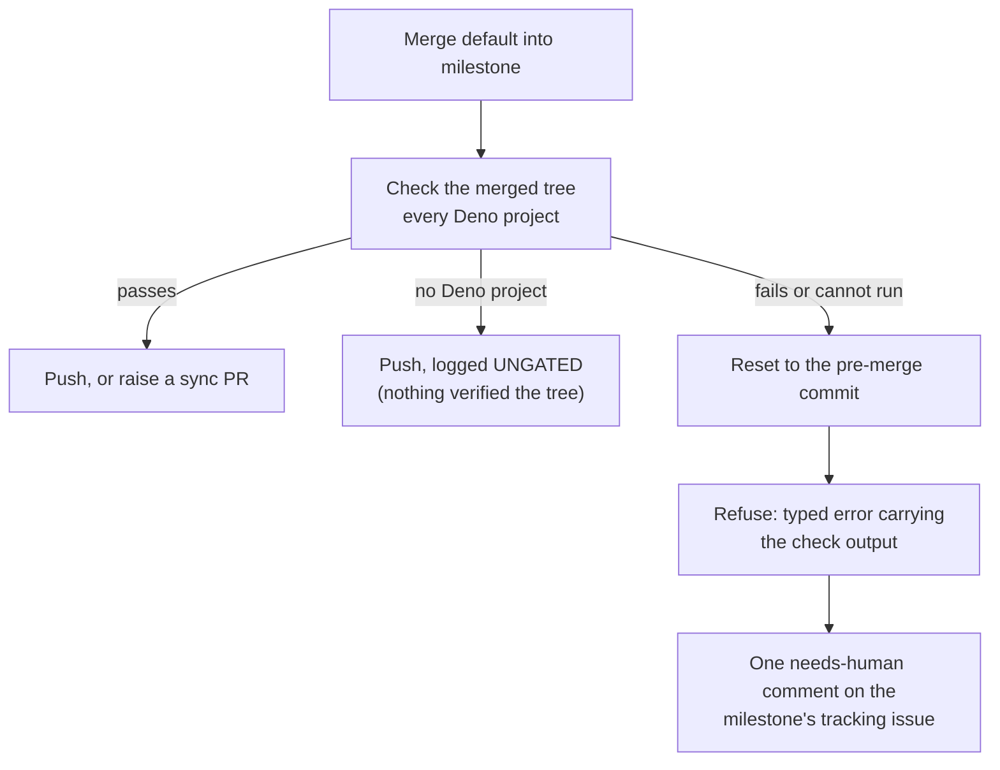

# Gate the milestone sync merge on the repo's own check

## Summary

The automated `main` → `milestone/<name>` sync pushed whatever the merge
produced. Git reported no conflict because each side was internally consistent —
only their combination was not — so a resolution that deleted the Issue #806
callback wiring in `run_core.ts` reached the milestone branch three times, and
`milestone/*` has no required checks to catch the result downstream.

The merged tree is now checked before it is published. After the merge commit is
created locally and **before** the push, `checkMergedTree` runs the repository's
own gate — its `deno task check` where the manifest defines one, otherwise a
whole-tree `deno check` — against every Deno project in the tree. On failure the
push is refused, the local branch is reset to the pre-merge commit, the failure
is logged loudly with the check output, and the milestone's tracking issue gets
one needs-human comment naming the merge and that output. On success the push
proceeds exactly as before, including the Issue #589 sync-PR fallback.

Closes #974.

## Evidence

Backend/CLI change — no web interface to screenshot. Evidence is the test suite
plus a run of the new discovery against this repository's real tree.



Discovery run against the real checkout — the defect the spec reviewer found and
this diff fixes (previously only the first manifest was checked, and on this
filesystem that was the one-file seed project):

```text
$ deno eval --allow-read "…findTypeCheckProjects(Deno.cwd())…"
[{"dir":".../container/deno-seed","args":["check","**/*.ts"]},
 {"dir":".../worker/deno","args":["task","check"]}]
```

Targeted suites, all green:

```text
tests/milestone_merge_gate_test.ts            15 passed
tests/milestone_sync_merge_gate_test.ts        4 passed
tests/milestone_sync_gate_escalation_test.ts   5 passed
tests/milestone_branch_sync_test.ts + milestone_sync_streak_test.ts
  + milestone_branch_selfheal_test.ts + milestone_sync_dirty_clone_test.ts
  + orphan_deps_scanner_test.ts                all passed
```

**Full gate:** every check passes except `deno tests`, which fails on
`run_core_production_deps_test.ts:185` (`static trust refresh succeeds and does
not throw`). That failure is **pre-existing on the base branch**, not caused by
this change: I ran `./quality.sh` in a clean detached worktree at the base commit
`b7b88c3` with no change applied and it failed on the same single test. It passes
in isolation (22 passed) and fails only under the full suite — exactly the
symptom recorded in open issue #1098.

## Acceptance Criteria

<!-- vibe-spec-review inputs="diff+issue-body" -->

- **met** — refuse to push a merge whose resulting tree fails the repo's own gate
  — evidence: `worker/deno/lib/git_pull.ts` `gateThenPushMilestoneBranch`, all
  three push sites routed through it; `worker/deno/tests/milestone_sync_merge_gate_test.ts::syncMilestoneBranchWithDefault - a merged tree that fails the type check is not pushed (Issue #974)`
  — reviewer: partial — reason: the reviewer found the gate resolved to
  `container/deno-seed` on this filesystem, making it a no-op for `worker/deno`;
  fixed in the second commit (every project is checked, deterministically
  ordered) and verified against the real tree, covered by
  `milestone_merge_gate_test.ts::findTypeCheckProjects - finds EVERY project, not just the first`.
- **partial** — run the repo's type check (and ideally its test suite) against
  the merged tree, after the merge commit and before the push — evidence:
  `worker/deno/lib/milestone_merge_gate.ts::checkMergedTree`, called from
  `git_pull.ts` between the merge and the push — reviewer: partial — reason: the
  type check is run, the test suite is not. The issue marks the suite "ideally";
  running it would add minutes per repo to every maintenance cycle, and the
  issue itself notes two of the three losses were type-invisible, so neither
  check would have caught them.
- **met** — on failure: do not push, reset the local branch, log loudly, and
  escalate a needs-human comment on the milestone's tracking issue naming the
  merge and the check output — evidence: `git_pull.ts` (reset to `preMergeSha`),
  `milestone_branch_sync.ts::escalateMergeGateFailure`,
  `milestone_merge_gate.ts::buildMergeGateEscalationComment`; tests
  `milestone_sync_merge_gate_test.ts` (remote SHA and local HEAD unchanged) and
  `milestone_sync_gate_escalation_test.ts` (first-cycle comment, posted once)
  — reviewer: met — reason: the reviewer's two dedup edge cases (a prior
  ordinary escalation suppressing this one; re-posting every cycle without a
  streak file) are fixed by the separate `gateEscalated` flag and by requiring a
  streak entry, both covered by new tests. The comment is headed "needs a human"
  rather than applying the `needs-human` label — the same shape as the existing
  sibling escalation, and the label chokepoint takes a `GitHubClient` this code
  path does not hold.
- **met** — on success: push as today — evidence: unchanged
  `pushSyncedMilestoneBranch` call, Issue #589 sync-PR fallback intact;
  `milestone_sync_merge_gate_test.ts::a merged tree that passes is pushed as before`
  — reviewer: met.
- **unrequested** — a repo with no Deno project is still pushed, with an
  `UNGATED:` note — reviewer: unrequested — reason: the issue only governs repos
  that have a gate; blocking every non-Deno repo's sync would be a regression, so
  the outcome says plainly that nothing verified the tree. An unreadable tree is
  *not* in this branch — it reports `failed` and refuses.
- **unrequested** — escalation on the first cycle instead of at
  `MILESTONE_SYNC_ESCALATION_THRESHOLD` — reviewer: unrequested — reason: the
  issue asks for escalation "instead of pushing"; a tree the check rejects does
  not clear on a retry, so waiting three cycles would only delay the human.
- **unrequested** — `MERGE_GATE_TIMEOUT_MS` (5 min), with a timeout counting as
  a failure — reviewer: unrequested — reason: an unbounded check could wedge the
  maintenance cycle, and a tree nobody verified must not be pushed.
- **unrequested** — `stripJsonc` moved to `lib/jsonc.ts` and re-exported from
  `orphan_deps_scanner.ts` — reviewer: unrequested — reason: the gate needs it to
  read a commented `deno.jsonc`; importing it from the scanner dragged that
  module's `@std/yaml` graph into the gate, so the pure function moved to its own
  file with callers unchanged.
- **unrequested** — `docs/INTERNALS.md` section, Mermaid diagram and module-table
  row — reviewer: unrequested — reason: repo convention for a behaviour change in
  the maintenance cycle.

## Standards Review

<!-- vibe-standards-review inputs="diff+CODING-STANDARDS.md" -->

- **violation** — escalation comment re-posted every cycle when `streakPath` is
  unset, contradicting the documented "posted once" — evidence:
  `worker/deno/lib/milestone_branch_sync.ts:470` — reason: fixed here; escalation
  now requires a streak entry to record it, and the loud WARNING log stands alone
  otherwise. Covered by
  `milestone_sync_gate_escalation_test.ts::without a streak file the refusal is logged, not re-commented every cycle`.
- **violation** — a test asserted `skipped` (the push-anyway branch) for a tree
  the gate cannot read, contradicting the module's own fail-loud rule — evidence:
  `worker/deno/tests/milestone_merge_gate_test.ts:173` (pre-fix) — reason: fixed
  here; `checkMergedTree` stats the tree first and reports `failed`, and the test
  now asserts that.
- **violation** — a failed `rev-parse HEAD` was swallowed and the merge proceeded
  with no rollback point — evidence: `worker/deno/lib/git_pull.ts:560` (pre-fix)
  — reason: fixed here; the sync refuses to merge at all without a pre-merge SHA.
- **violation** — DRY: `escalateMergeGateFailure` duplicated ~30 lines of
  `escalateSyncFailure` — evidence:
  `worker/deno/lib/milestone_branch_sync.ts:566` — reason: fixed here; both post
  through the shared `postEscalationComment`.
- **violation** — `deno.jsonc` parsed with `JSON.parse`, silently losing a
  commented repo's own `check` task — evidence:
  `worker/deno/lib/milestone_merge_gate.ts:100` (pre-fix) — reason: fixed here
  via `stripJsonc`; covered by the "reads a check task out of a commented
  deno.jsonc" test in `worker/deno/tests/milestone_merge_gate_test.ts`.
- **violation** — first-manifest-wins discovery reported a whole tree `passed`
  after checking one arbitrary, filesystem-ordered project — evidence:
  `worker/deno/lib/milestone_merge_gate.ts:120` (pre-fix) — reason: fixed here;
  every project is checked in sorted order and the `detail` names each one.
- **violation** — no `docs/archive/pr-summaries/pr-summary-974.md` — evidence:
  the branch at commit `1c8b067` — reason: fixed here; this file.
- **clean** — Australian English throughout the added code, comments and docs; no
  grep-of-source tests (real git fixtures with real remotes, real `deno check`
  runs, injected gate seam); no wall-clock threshold assertions and every suite
  well inside the 120 s budget; `Result<T>` and typed `err.name` conventions
  preserved; `runWithTimeout` reused rather than a hand-rolled `Deno.Command`;
  escalation body reaches GitHub through the existing `ghCommandFn` redaction
  chokepoint; no hidden paths staged; Deno-native tooling only.

## Test Plan

New:

- `worker/deno/tests/milestone_merge_gate_test.ts` — project discovery (root,
  nested, commented `deno.jsonc`, every project not just the first, none),
  verdicts (`passed` / `failed` / `skipped`), an unreadable tree failing rather
  than skipping, a check that cannot be run failing, two real `deno check` runs
  against a broken and a sound tree, the typed refusal, and the escalation body.
- `worker/deno/tests/milestone_sync_merge_gate_test.ts` — real git repos: a
  refused merge is not pushed, the local merge is reset and the tree left clean,
  a passing tree is pushed and reaches the remote, a repo with no check reports
  `UNGATED`, and the `-X theirs` conflict-resolved merge is gated too.
- `worker/deno/tests/milestone_sync_gate_escalation_test.ts` — first-cycle
  escalation, posted once across four cycles, still posted when the branch had
  already escalated for an ordinary failure, silent-but-logged with no streak
  file, and an ordinary failure still waiting for the streak threshold.

Modified: none — no existing test was changed or removed.
